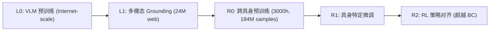

# Green-VLA: Staged Vision-Language-Action Model for Generalist Robots

- 本地 PDF：`papers/vla-architecture/Green-VLA_2602.00919.pdf`
- arXiv：https://arxiv.org/abs/2602.00919
- 代码：https://github.com/greenvla/GreenVLA
- 年份：2026（2 月）
- 团队：Sber Robotics Center
- 阶段：五阶段训练 VLA —— 从 web VQA 到 RL 对齐

## 一句话总结

Green-VLA 提出五阶段训练范式（L0 VLM 预训练→L1 多模态 grounding→R0 跨具身预训练→R1 微调→R2 RL 对齐），64 维统一动作空间 + 具身特定 mask。CALVIN 4.62, ALOHA 清洗 69.5%, Green 人形 90%。24M web samples + 3000h 机器人数据。

## 核心技术

1. 五阶段渐进训练，每阶段有明确目标和数据配比
2. 64D 统一动作空间 + 具身 mask，单模型控制异构机器人
3. DataQA 过滤流水线，清洗 3000h 数据
4. R2 RL 对齐超越行为克隆上限

## 底层原理与数学推导

基于 Qwen3-VL-4B 或 PaliGemma 3B backbone + Flow Matching action expert + FAST tokenizer。五阶段训练每阶段有明确目标和数据配比，64D 统一动作空间覆盖人形/移动操作/固定臂。

## 物理直觉解释

五阶段就像一个渐进式学习过程：先学说话看图（L0-L1），再学做简单动作（R0），然后针对特定机器人精调（R1），最后在实际练习中超越老师的水平（R2 RL 对齐）。

## 工程细节与实操指南

- 64D 动作空间: 语义 slot 布局，每 slot 对应特定身体部位
- R0 数据: 184M samples, 3000h+ demos across humanoids/manipulators/arms
- 推理增强: Episode-progress prediction + OOD detection (GMM) + JPM (flow-matching guidance for precise targeting)

## 消融实验与分析

| 消融因子 | 结论 |
|---------|------|
| R2 RL 对齐 vs 仅 R1 BC | RL 对长程任务和错误恢复有关键提升 |
| 有/无 DataQA 过滤 | 数据质量对最终性能影响显著 |
| 统一动作空间 vs 本体特定 | 跨本体正迁移 |

## 技术权衡

| 优势 | 劣势 |
|------|------|
| 五阶段系统性训练，可复现 | 训练流程复杂，资源需求高 |
| 跨本体统一动作空间 | 64D 可能对某些本体冗余 |
| R2 RL 超越 BC 上限 | RL 在真实机器人上的安全性 |

## 技术价值与演进定位

Green-VLA 是工业界训练通用 VLA 的系统性方案——五阶段提供了可复现的训练配方，DataQA 解决了数据治理痛点，RL 对齐填补了 BC→deployment 的最后一步。

## 与其他论文的关系

- **XR-1 (ICML 2026)** — 同为开源 VLA 标杆, XR-1 用 UVMC, Green-VLA 用五阶段
- **π0 / π0.5** — Green-VLA 在 CALVIN 和 ALOHA 上系统性超越

## 精读问题

1. R2 RL 对齐在人形灵巧手上的 sim-to-real gap？
2. 64D 统一动作空间中跨本体正迁移发生在哪些维度？
