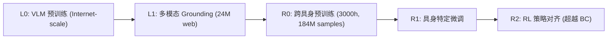

# Green-VLA: Staged Vision-Language-Action Model for Generalist Robots

- 本地 PDF：`papers/vla-architecture/Green-VLA_2602.00919.pdf`
- arXiv：https://arxiv.org/abs/2602.00919
- 代码：https://github.com/greenvla/GreenVLA
- 年份：2026（2 月）
- 团队：Sber Robotics Center
- 阶段：五阶段训练 VLA —— 从 web VQA 到 RL 对齐

## 一句话总结

Green-VLA 提出五阶段训练范式（L0 VLM 预训练→L1 多模态 grounding→R0 跨具身预训练→R1 微调→R2 RL 对齐），64 维统一动作空间 + 具身特定 mask。CALVIN 4.62, ALOHA 清洗 69.5%, Green 人形 90%。24M web samples + 3000h 机器人数据。

## 核心技术

1. 五阶段渐进训练，每阶段有明确目标和数据配比
2. 64D 统一动作空间 + 具身 mask，单模型控制异构机器人
3. DataQA 过滤流水线，清洗 3000h 数据
4. R2 RL 对齐超越行为克隆上限

## 底层原理与数学推导

```mermaid
graph LR
    L0["L0: VLM 预训练 (Internet-scale)"] --> L1["L1: 多模态 Grounding (24M web)"]
    L1 --> R0["R0: 跨具身预训练 (3000h, 184M samples)"]
    R0 --> R1["R1: 具身特定微调"]
    R1 --> R2["R2: RL 策略对齐 (超越 BC)"]
```

基于 Qwen3-VL-4B 或 PaliGemma 3B backbone + Flow Matching action expert + FAST tokenizer。五阶段训练每阶段有明确目标和数据配比，64D 统一动作空间覆盖人形/移动操作/固定臂。数学上各阶段的目标函数如下：

**1. BC 目标（R0/R1 基础）**：行为克隆最小化示范动作的回归误差

$$
\mathcal{L}_{BC} = \mathbb{E}_{(s,a)\sim\mathcal{D}} \left\| \pi_\theta(s) - a \right\|_2^2
$$

BC 会随数据规模增大而饱和（论文 4.1 节实测 R1 阶段即出现收益递减），这是引入 R2 RL 对齐的直接动机。

**2. Flow Matching 动作生成**：动作由速度场 $u_\theta$ 定义的常微分方程生成

$$
\frac{d}{dt}\psi_t(x) = u_\theta(\psi_t(x), t), \quad \psi_0(x) = x, \quad X_1 = \psi_1(X_0), \quad X_0 \sim p_0
$$

R2 阶段用一个小的 actor 网络学习新的噪声源分布 $p'_0$，使生成轨迹的期望回报最大化——即通过"引导噪声分布"而非直接修改策略权重来对齐奖励，动作仍贴近数据集分布，因此探索是保守的。

**3. DataQA 质量分数**：过滤低质量轨迹，其中抖动分数为

$$
S_{tremble} = \frac{|\dot{s}_{smooth} - \dot{s}|}{|\dot{s}_{smooth}| + |\dot{s}|}
$$

结合图像锐度（Laplacian 分块得分）、视觉多样性 $D$ 与状态方差 $\sigma^2$ 四维打分；多具身采样则采用时间退火混合权重 $W_i^{(t)} = w_i^{\alpha_t} / \sum_j w_j^{\alpha_t}$（$\alpha_0=0$ 均匀采样 → $\alpha_T=1$ 目标分布），避免早期被少数大本体数据主导。

## 物理直觉解释

**五阶段训练像一个人学一门手艺的完整路径**：L0-L1 阶段像"识字看图"——先在互联网规模的图文数据上学会理解世界（语言指令、物体外观、场景语义），与人类先掌握语言再学动手完全同构；R0 阶段像"打基础"——不挑具体工具，在 3000 小时、184M 样本的异构机器人数据上练通用动作先验，相当于学徒先练力量、平衡、协调这些与工具无关的基本功；R1 才真正"上手某台机器"——针对特定本体微调，学习该机器人的运动学习惯与限位特性；R2 则进入"实战比赛"——用奖励信号在真实环境中试错迭代，最终水平可以**超越示范数据的上限**，这正是行为克隆做不到的（BC 只是"抄老师作业"）。

**64D 统一动作空间像"国际单位制"**：不同机器人的动作维度、限位、控制频率各异，就像各国度量衡不同。Green-VLA 把所有人形/移动操作/固定臂的动作统一投影到 64 维语义 slot 布局（每个 slot 对应特定身体部位，如左手腕、右手掌），再用 embodiment mask 屏蔽不存在的关节。类比于米制单位统一后各国工程图纸可以互相复用，统一动作空间让 3000 小时异构数据**共享同一套物理语义**，跨本体正迁移因此发生——这也解释了为何 R0 阶段零微调即可在 ALOHA 上达到 69.5% 的清理成功率，而 π0 只有 35.6%。

**R2 的保守 RL 与 JPM 引导各有分工**：R2 用一个小的 actor 网络改变 flow matching 的噪声采样分布而非直接改策略权重，相当于"在老师划定的安全路线附近探索"，避免真实机器人上的危险动作；JPM 引导则像"给射手报靶"——先语言条件化预测抓取点，再用伪逆引导（ΠGDM）在每一步去噪时把速度场向目标点推（ID-Coarse 62.3→95.4），解决视觉密集场景下的精确定位。两者一个解决"做得稳"，一个解决"做得准"。

## 工程细节与实操指南

- 64D 动作空间: 语义 slot 布局，每 slot 对应特定身体部位
- R0 数据: 184M samples, 3000h+ demos across humanoids/manipulators/arms
- 推理增强: Episode-progress prediction + OOD detection (GMM) + JPM (flow-matching guidance for precise targeting)

## 消融实验与分析

| 消融因子 | 设置对比 | 指标 | 数值 |
|---------|---------|------|------|
| R2 RL 对齐 vs 仅 R1 BC | Simpler WidowX 平均成功率 | R1 55.2/72.9 → R2 79.1/80.5（PaliGemma/Qwen3） | +24% 绝对成功率 |
| R2 RL 对齐 vs 仅 R1 BC | CALVIN ABC→D 平均链长 ACL | R1 4.18/4.27 → R2 4.57/4.63 | 超越 π0 微调基线 |
| JPM 引导 on/off | e-commerce 货架 top-1 成功率 | ID-Coarse 62.3→95.4；ID-SKU 36.7→93.1；OOD 10.2→72.8 | 全部 regime 显著提升 |
| R0 跨具身预训练（zero-shot） | ALOHA 桌面清理首件成功率 | Green-VLA 69.5% vs π0 35.6%、GR00T N1 33.2% | 平均耗时 1m35s vs π0 2m59s |
| DataQA 过滤 | 过滤抖动/模糊/低多样性轨迹 | 四维打分（抖动/锐度/多样性/方差）后训练 | 提升样本效率与最终成功率 |

**核心结论**：各阶段增益正交——R0 跨具身预训练带来零微调跨本体迁移（ALOHA 69.5% vs π0 35.6%），R2 RL 对齐在 BC 饱和后继续拉升 +24% 绝对成功率并改善长程链长（ACL 4.18→4.57），JPM 引导在越困难的识别 regime 下增益越大（OOD 场景 10.2→72.8），说明数据质量（DataQA）、统一动作空间与 RL 对齐分别解决数据、架构与策略层面的失败模式，缺一不可。

## 技术权衡

| 优势 | 劣势 |
|------|------|
| 五阶段系统性训练，可复现 | 训练流程复杂，资源需求高 |
| 跨本体统一动作空间 | 64D 可能对某些本体冗余 |
| R2 RL 超越 BC 上限 | RL 在真实机器人上的安全性 |

## 技术价值与演进定位

Green-VLA 的定位不是又一个更大规模的 VLA，而是把"训练配方"本身变成可复现的工程学：五阶段课程（web VQA → grounding → 跨具身 → 具身微调 → RL 对齐）为工业界提供了一条从零构建通用机器人策略的流水线，其中 DataQA 四维质量打分 + 光流时间对齐 + 时间退火数据混合，把"数据治理"从论文脚注提升为独立组件；64D 统一动作空间 + embodiment mask 则验证了单模型跨人形/移动操作/固定臂控制的可行性。相比同行用更多数据堆规模（π0 用 >10,000h），Green-VLA 以 ~3000h 数据在 ALOHA（69.5% vs 35.6%）与 Simpler（R2 79.1/80.5）上反超，证明质量对齐 + 统一动作 + RL 对齐的组合可以在数据约束下达到 SOTA，这为数据稀缺的具身智能团队提供了可迁移的路线图。

## 与其他论文的关系

- **π0 / π0.5** — 直接对标基线：π0 用 >10,000h 数据训练，Green-VLA 仅 ~3000h 即在 CALVIN（ACL 4.57 vs π0 4.18）与 ALOHA 清洗（69.5% vs 35.6%）上反超，核心差异是数据质量治理与统一动作空间
- **XR-1 (ICML 2026)** — 同为开源 VLA 标杆：XR-1 走 UVMC（统一多模态控制）路线，Green-VLA 走五阶段课程路线，两者在 CalBench 与 ALOHA 上直接对比
- **GR00T N1 / AgiBot GO-1** — 同样强调大规模数据聚合 + 统一架构，但 Green-VLA 将数据过滤（DataQA）与 RL 对齐显式拆成可消融的阶段，而 N1/GO-1 主要靠数据规模
- **Flow Matching 方法族（Lipman 等）** — Green-VLA 的动作专家沿用 flow matching 公式（$\frac{d}{dt}\psi_t = u_\theta$），并叠加 ΠGDM 伪逆引导与 JPM 语言条件化目标点，属于"生成式动作"路线在 VLA 上的工业级落地

## 精读问题

1. R2 RL 对齐在人形灵巧手上的 sim-to-real gap 有多大？保守探索（actor 引导噪声分布）如何限制策略超越数据分布的能力？
2. 64D 统一动作空间中跨本体正迁移具体发生在哪些维度（位置/姿态/手指）？哪些维度需要 mask 隔离避免负迁移？
3. DataQA 四维分数（抖动/锐度/多样性/方差）的权重如何标定？过滤率与性能之间是否存在最优折中，可否用自动阈值搜索替代手工设定？
4. JPM 的伪逆引导（ΠGDM）与训练时速度场之间的耦合——引导强度过大会否破坏 flow matching 的分布保真？如何选择引导系数？
5. 五阶段中 R0 的 184M samples 是否可缩减？时间退火混合权重 $\alpha_t$ 的调度曲线（线性 vs 指数）对多具身收敛的影响？
6. R2 的奖励函数在 CALVIN（模拟）与真实 ALOHA 上如何设计，才能避免 reward hacking 并保持"保守探索"的安全边界？
