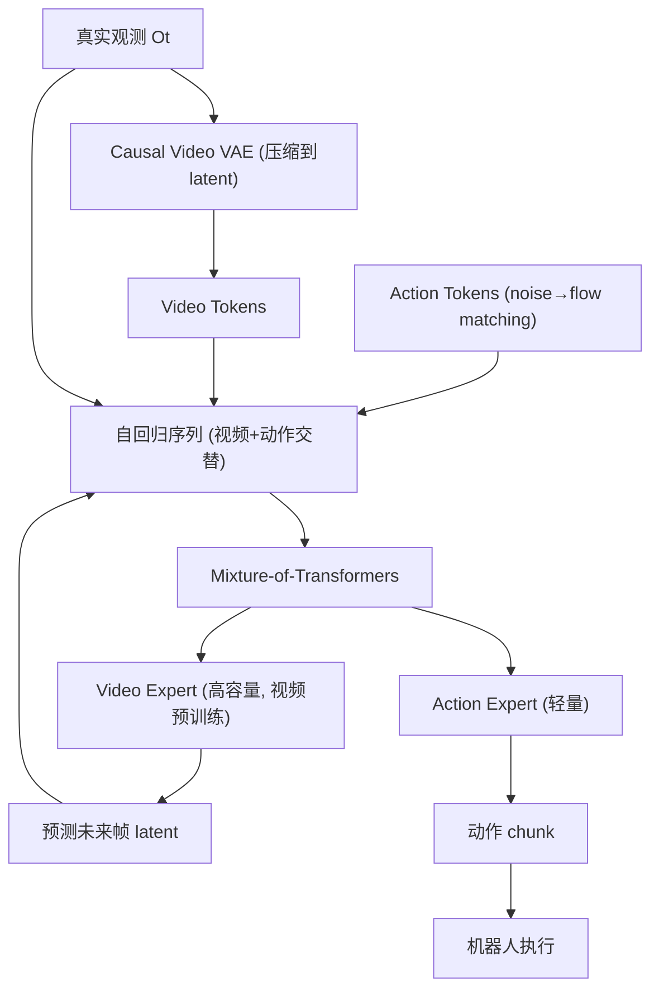

# LingBot-VA: Causal World Modeling for Robot Control

- 本地 PDF：`papers/vla-architecture/LingBot-VA_2601.21998.pdf`
- arXiv：https://arxiv.org/abs/2601.21998
- 代码：https://github.com/robbyant/lingbot-va
- 项目页：https://technology.robbyant.com/lingbot-va
- 年份：2026 (RSS 2026)
- 团队：蚂蚁灵波科技 (Ant Lingbot) + HKUST + 多所高校
- 阶段：自回归视频-动作因果世界模型 —— 统一视频预测和动作生成

## 一句话总结

LingBot-VA 提出首个开源自回归视频-动作世界模型：用 Mixture-of-Transformers (MoT) 架构将视频帧预测和动作推理统一到一个因果序列中，先预测"世界会怎么变"再解码"应该做什么"。50 条示教超越 π0.5 超过 20 个百分点，消融去掉视频预测模块成功率从 93% 降至 48%。RSS 2026。

## 核心技术

1. **因果视频-动作序列建模** — 视频 token 和动作 token 交替排列在单个自回归序列中，因果 attention mask 确保动作仅能 attend 到过去的视频观测（不能"偷看未来"）
2. **Mixture-of-Transformers (MoT)** — 双流非对称架构：高容量视频 expert（视频生成预训练初始化）预测未来视觉状态 + 轻量动作 expert 解码动作
3. **闭环 rollout + KV cache** — 推理时持续注入真实观测（通过 KV cache 累积），将策略锚定在真实交互历史中，减少长程累积误差
4. **部分去噪 + 异步推理** — 从部分去噪的视频 latent 直接解码动作（无需等视频完全生成完毕），异步并行化动作预测和电机执行

## 底层原理与数学推导

### 架构

### Flow Matching 在连续 latent 空间

与自回归语言模型预测离散 token 不同，LingBot-VA 在连续 latent space 上通过 flow matching 自回归生成视频和动作 chunks：

$$x_{\tau} = \tau x_1 + (1-\tau) \epsilon, \quad \frac{dx_\tau}{d\tau} = v_\theta(x_\tau, \tau, c)$$

其中 $c$ 是过去的视频-动作上下文（因果 attention 限制），$v_\theta$ 是 MoT 参数化的速度场。

### 因果 Attention Mask

关键设计：动作 token 只能 attend 到过去（包括过去的真实观测），不能 attend 到未来的视频预测。这保证了模型学的是物理因果关系——"先看到发生了什么，再决定做什么"，而不是相关关系。

### 闭环推理

1. 编码当前真实观测到 video latent
2. Video expert 生成未来 K 帧的预测
3. Action expert 从部分去噪的 video latent 解码动作
4. 执行动作的同时，继续预测更远的未来
5. 下一次观测到来时，编码并通过 KV cache 注入历史上下文

## 物理直觉解释

LingBot-VA 在做一个很朴素的事：**先想象，再行动**。就像你接飞来的球，脑子里先闪现球的轨迹（视频预测），然后身体自动算出该伸手到什么位置（逆动力学）。传统 VLA 跳过了"想象"这一步，直接从像素映射到动作——这在简单场景下可以，但在长程操作中会迷失方向。

消融实验最说明问题：去掉视频预测模块 → 成功率从 93% 暴跌到 48%。这不是锦上添花的 feature，这是因果理解的核心。

## 工程细节与实操指南

- **Video VAE**：因果卷积 VAE，将原始 RGB 帧压缩到 compact latent token（约 256 个 token/帧）
- **MoT 双流**：Video expert 约 7B（视频生成预训练），Action expert 约 300M
- **自回归序列**：每步生成 16 帧视频 latent + 50 步动作 chunk
- **部分去噪**：视频 expert 做 N 步 flow matching 后，action expert 从中间状态（如 50% 去噪步骤）开始解码，不等视频完全生成
- **异步执行**：动作预测和电机执行并行化，在动作执行的同时生成下一步的视频预测
- **推理延迟**：单 RTX 5880 Ada，每一步约 0.5 秒（约 2Hz 有效控制频率）
- **训练**：Teacher Forcing + Flow Matching，大规模互联网视频 + 机器人操作数据联合预训练
- **后训练**：目标任务仅需 50 条示教（最低 10 条可行）

## 消融实验与分析

| 消融因子 | 成功率 | 结论 |
|---------|--------|------|
| Full LingBot-VA | **92.9%** (RoboTwin Easy) | — |
| 去掉视频预测模块 | **48.3%** | 视频预测是核心——不只是辅助任务 |
| 双向 attention 替代因果 attention | **81.5%** | 因果性很重要——不能"偷看"未来 |
| 仅 10 demos | **61.1%** (LIBERO) | 极端低频数据仍可工作 |
| 仅 25 demos | **81.7%** | 25 demos 接近全量性能 |

**核心结论**：视频预测模块（world model）是因果理解的支柱，不是可选的辅助任务。因果 attention 也有关键贡献——去掉后降 11pp。

## 技术权衡（Trade-off）

| 优势 | 劣势与工程代价 |
|------|----------------|
| 因果世界模型提供持久的时序记忆 | Video VAE + MoT 架构复杂，训练需要大规模 GPU |
| 50 demos 超越 π0.5，数据效率极高 | 2Hz 推理频率低于纯策略方案 |
| 视频预测提供可解释的"中间产物" | 视频 VAE 的 latent 压缩质量影响下游精度 |
| 消融视频预测后暴跌 48%→证明因果性的必要性 | 异步推理增加了系统工程复杂度 |

## 技术价值与演进定位

LingBot-VA 代表 VLA 技术路线上最重要的分支之一：**world model first, action second**。它直接挑战了当前主流的"VLM→action expert"范式，证明因果世界建模是一个独立的、与 VLM 预训练同等重要的 foundation。

在 VLA 谱系中，LingBot-VA 代表了从 UniPi (NeurIPS 2023) → DreamVLA (2025) → LingBot-VA (RSS 2026) 的演进——从"用视频扩散做规划"到"用因果世界模型同时预测和行动"。这可能是 2026 年最重要的一条技术分支。

## 与其他论文的关系

- **π0 / π0.5** — VLM→Flow Matching Action Expert，LingBot-VA 的直接对标和超越对象
- **UniPi (NeurIPS 2023)** — 最早的 video-as-policy，LingBot-VA 将视频预测和动作生成统一到一个因果框架
- **Dreamer v3** — 在 latent space 做想象，LingBot-VA 在像素/latent 混合空间做
- **DreamVLA (2025)** — 紧凑世界知识预测，LingBot-VA 用更完整的视频预测替代
- **DiT / Flow Matching** — LingBot-VA 将 flow matching 用于视频-动作联合建模

## 精读问题

1. 2Hz 的有效控制频率能否满足高频接触操作（如拧螺丝、穿线）的需求？部分去噪策略的最优去噪比例如何确定？
2. Video expert 的 7B 参数量在实践中是部署瓶颈——能否蒸馏到更小的尺寸？
3. 因果 attention mask 是否过度约束了模型？在某些场景下，"预测自己动作的效果"本身需要双向 attention
4. KV cache 的累积在长程任务（10+分钟）中是否会导致内存膨胀和 stale context 问题？
