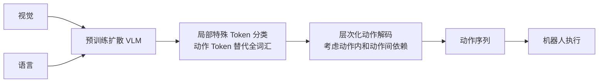

# LLaDA-VLA: Vision Language Diffusion Action Models

- Local PDF: `/Users/luogu/physical_intelligence/papers/vla-architecture/LLaDA-VLA_2509.06932.pdf`
- arXiv: https://arxiv.org/abs/2509.06932
- Source: https://arxiv.org/abs/2509.06932
- Authors: Yuqing Wen, Hebei Li, Kefan Gu, Yucheng Zhao, Tiancai Wang, Xiaoyan Sun
- Published: 2025-09
- Category: diffusion VLM to action
- Priority: medium

## 一句话总结

LLaDA-VLA 是首个基于预训练扩散 VLM（扩散 VLM）而非自回归 VLM 构建的 VLA 模型，通过局部特殊 token 分类（LSC）将连续动作映射为 32 个离散 bin 并仅预测动作 token 而非全词表，再通过层次化动作结构化解码（HAD）在帧内/帧间两个层级迭代 refine 动作生成，在 SimplerEnv（55.5%）、CALVIN（4.01）和真机（58%）上显著超越 OpenVLA 等自回归 VLA。

## 核心技术

1. **扩散 VLM 骨干（扩散 VLM Backbone）** — 使用 LLaDA（掩码扩散大语言模型）替代自回归 Transformer 作为语言骨干，配合 SigLIP-2 视觉编码器，利用非自回归的并行生成能力进行动作解码
2. **局部特殊 token 分类（Localized Special-token Classification, LSC）** — 将连续动作空间量化为 32 个离散 bin，添加 32 个特殊 token 到词表。训练和推理时仅对这 32 个动作 token 计算分类损失，避免在全词表（LLaDA 约 32k）上做分类，大幅降低语言到动作的适配难度
3. **层次化动作结构化解码（Hierarchical Action-Structured Decoding, HAD）** — 在掩码扩散的迭代去噪过程中，先按动作级别的置信度排序（各 token 置信度之和），保留最高置信度动作的部分 token，掩码其余动作；再在选中的动作内按 token 级置信度排序，逐步提高动作序列的生成质量

## 底层原理与数学推导

LLaDA-VLA 的核心创新在于用扩散语言模型（类 BERT 的掩码扩散范式）取代自回归语言模型（类 GPT 的下一个 token 预测范式）作为 VLA 骨干。这改变了动作生成的方式：从「逐个 token 依次生成」变为「并行预测 + 迭代精炼」。

**掩码扩散前向过程（Mask Diffusion）：** 给定输入序列 $x_0 = [x_0^i]_{i=1}^N$，词表大小 $V$。每个 token 以概率 $t$ 独立地被替换为掩码 token $[M]$：

$$q_{t|0}(x_t|x_0) = \prod_{i=0}^{N-1} q_{t|0}(x_t^i|x_0^i)$$

$$q_{t|0}(x_t^i|x_0^i) = \begin{cases}
1 - t, & x_t^i = x_0^i \
t, & x_t^i = [M]
\end{cases}$$

**逆向去噪过程（Reverse Process）：** 对于 $0 < s < t < 1$，每一步有 $(1 - s/t)$ 比例的 token 被预测，$s/t$ 比例的 token（最低置信度）被重新掩码：

$$q_{s|t}(x_s^i|x_t) = \begin{cases}
1, & x_t^i \neq [M],\ x_s^i = x_t^i \
s/t, & x_t^i = [M],\ x_s^i = [M] \
(t-s)/t \cdot p_\theta(x_0^i|x_t), & x_t^i = [M],\ x_s^i \neq [M] \
0, & \text{otherwise}
\end{cases}$$

其中 $p_\theta$ 为 Transformer 掩码预测器。

**训练目标（掩码预测交叉熵）：** 仅在掩码 token 上计算损失：

$$\mathcal{L}(\theta) = -\mathbb{E}_{t, x_0, x_t}\left[ \frac{1}{t} \sum_{i=1}^{L} \mathbb{1}[x_t^i = M] \log p_\theta(x_0^i|x_t) \right]$$

**局部特殊 token 分类（LSC）的标签映射：** 每个原始 token 标签 $y_i \in V$ 被映射到局部类别 $l_i$：

$$l_i = \begin{cases}
\text{map}(y_i), & y_i \in \mathcal{S} \
-100 \ (\text{忽略}), & \text{otherwise}
\end{cases}$$

其中 $\mathcal{S}$ 为 32 个特殊动作 token 的集合。token 级损失：

$$\mathcal{L}_{\text{token}} = \frac{1}{|\mathcal{M}|} \sum_{i \in \mathcal{M}} \text{CE}(z_i, l_i)$$

其中 $z_i = \text{logits}[i, \mathcal{S}] \in \mathbb{R}^{V_a}$ 仅取动作 token 上的 logits。

**层次化动作结构化解码（HAD）的置信度指标：**

动作级置信度 $C_a^{(i)} = \sum_{j=1}^{D} c_{i,j}$，其中 $c_{i,j}$ 为第 $i$ 个动作第 $j$ 个 token 的置信度。

解码流程：
1. 从完全掩码的动作序列开始（视觉/文本提示保持 unmask）
2. 预测掩码 token，保留高置信度 token，重新掩码低置信度 token
3. **层次化步骤：** 按 $C_a^{(i)}$ 对所有动作排序 → 选中最高置信度动作做 **部分保留**，其余全部重新掩码（动作级 remask）→ 在选中动作内按 token 置信度排序，仅保留高置信度 token，其余重新掩码（token 级 remask）
4. 迭代重复预测-remask-预测

**离散化动作表示：**
- 连续动作量化为 32 个 bin（$V_a = 32$），添加 32 个特殊 token $\mathcal{S} = \{s_0, s_1, ..., s_{31}\}$
- 每时间步动作：$D = 7$ 个 token（3 位置位移 + 3 旋转变化 + 1 夹爪状态）
- 动作块：$K \times D$ 个 token，$K=5$ 为主实验设定
- 预测 delta 动作，移除 EOS token（固定长度输出）

## 物理直觉解释

LLaDA-VLA 的核心思想是：**别像写文章一样一个个字写动作，像猜词游戏一样先蒙再改**。

- **扩散 VLM vs 自回归 VLM：** 自回归 VLM 生成动作像写文章——一个字写完才能写下一个，即使写到后面发现前面错了也无法回头。扩散 VLM 像猜词游戏——先同时猜所有动作（可能很多是错的），然后逐步修正，每一轮修正都可以看到全局信息（所有 token 的状态）。对于机器人动作来说，多个动作维度之间存在强相关性（如末端位置 x、y、z 必须协调），并行预测更适合这种结构。
- **LSC 的作用：** LLaDA 的词表有几万个词（语言 token），动作只有 32 个离散值。如果让模型在全词表上分类，99.9% 的分类维度与动作无关，浪费计算资源。LSC 相当于告诉模型「你只在动作 token 这 32 个选项中做选择」，大幅降低学习难度。
- **HAD 的直觉：** 如果生成的动作序列是推-抓-抬-放四步，HAD 先确保最重要的那步动作（如「抓」）的各个维度（x, y, z, 旋转, 夹爪）都正确，再完善其他步骤。就像拍电影——先保证主角的表演到位，再优化配角和群演。

## 工程细节与实操指南

**训练配置：**
- 预训练权重：LLaDA-V（开源 扩散 VLM，SigLIP-2 视觉编码器 + LLaDA 语言骨干 + MLP 投影器）
- 训练轮数：3，学习率 $2 \times 10^{-5}$，Batch size 128
- 特殊动作 token 数：32
- 动作块大小 $K=5$（消融：$K=3 \to 3.90, K=5 \to 4.01, K=8 \to 3.53, K=10 \to 3.36$）
- 推理扩散步数：10，每动作迭代次数：2
- 加速方法：dllm-cache

**动作块大小选择：** 消融实验显示 $K=5$ 为最佳，$K=3$ 上下文不够导致次优，$K=8$ 和 $K=10$ 因同时预测过多动作导致精度下降（同上趋势，动作块过大 = 预测不确定性增加）。

**LSC + HAD 消融结果（CALVIN ABC-D）：**

| 配置 | Task 1 | Task 2 | Task 3 | Task 4 | Task 5 | Avg Len |
|------|--------|--------|--------|--------|--------|---------|
| Baseline | 86.2 | 62.4 | 46.1 | 34.1 | 24.7 | 2.64 |
| +LSC | 91.6 | 80.1 | 67.2 | 57.3 | 46.4 | 3.43 (+0.79) |
| +LSC+HAD | 95.6 | 87.8 | 79.5 | 73.9 | 64.5 | 4.01 (+0.58) |

LSC 提升 0.79，HAD 在此基础上提升 0.58，两者互为补充。

**推理配置：** 10 步扩散 + 2 次 HAD 迭代。在 10 步扩散过程中，前几步先做粗粒度的动作结构确定，后几步做细粒度的 token 级精炼。

## 消融实验与分析

| 消融因子 | 变化 | 结论 |
|---------|------|------|
| 扩散 VLM vs 自回归 VLM | LLaDA vs LLaMA | 扩散 VLM 骨干在 CALVIN 上显著优于自回归 |
| Bin 数量 | 32 vs 64 vs 16 | 32 bin 在精度和效率间最优 |
| 层次化动作解码 | iterative refine vs single-shot | 迭代 refine 显著提升动作精度 |

**核心结论**：扩散 VLM 作为 VLA 骨干是自回归 VLM 的有效替代——VLA 架构多样性的关键证据。

## 技术权衡（Trade-off）

| 优势 | 劣势与工程代价 |
|------|---------------|
| 非自回归并行生成，天然适配多维动作之间的结构依赖关系 | 扩散 VLM 生态远不如自回归 VLM 成熟（预训练模型选择少、工具链不完善） |
| LSC 将动作适配简化为小词表分类，显著降低迁移难度（+0.79 CALVIN） | 32 个 bin 的离散化精度有限，可能在高精度任务上出现量化误差 |
| HAD 的层次化解码考虑了帧内/帧间依赖，相比独立解码提升 +0.58 | 10 步扩散 + 2 次迭代的推理时延高于自回归单次前向，不适合高频控制场景 |

## 技术价值与演进定位

LLaDA-VLA 在「VLA 底座多样性」这一命题上做出了关键贡献——它证明了自回归 VLM 不是 VLA 的唯一选择，扩散语言模型同样可以有效作为 VLA 的骨干。

从技术演进角度看，自回归 VLA 存在两个固有问题：1）逐个 token 生成无法在整个动作序列上做全局优化；2）推理过程无法回头修正。LLaDA-VLA 的掩码扩散+迭代精炼范式直接解决了这两个问题，为非自回归 VLA 路线奠定了基础。

该路线的核心瓶颈在于 扩散 VLM 本身的生态成熟度——LLaDA 作为扩散 LM 的先驱，其预训练数据和模型规模远不及 GPT/LLaMA 系列，这限制了 VLA 性能的上限。随着 扩散 VLM 的发展（如 MDM、D3LM、Lattice 等），这一路线有望进一步突破。

## 与其他论文的关系

- **OpenVLA**：典型自回归 VLA，OpenVLA 的 Llama 2 骨干用自回归方式生成动作 token。LLaDA-VLA 在 CALVIN 上以 4.01 显著超越 OpenVLA 的 3.27
- **CogACT**：另一个非自回归 VLA，用扩散策略做连续动作生成。LLaDA-VLA 在 SimplerEnv 上以 55.5% 超越 CogACT 的 51.3%
- **RT-2**：自回归 VLA 的开山鼻祖。LLaDA-VLA 第一次将扩散语言模型引入 VLA，拓展了架构可能性
- **DiscreteDiffusionVLA**：也使用离散扩散生成动作，但 LLaDA-VLA 的 LSC+HAD 提供了更高效的适配策略

## 精读问题

1. LSC 将动作空间量化为 32 个 bin，相比 RT-1 的 256 个 bin 更粗粒度，为什么不选择更高分辨率？32 是否是精度和训练难度的帕累托最优？
2. HAD 的层次化解码依赖动作级置信度排序，但在任务早期阶段，所有动作置信度都很低，排序是否可以靠？是否存在「选错重点动作、忽略其他动作」的风险？
3. 扩散 VLM 的推理速度是首要短板——10 步扩散 + 2 次 HAD 迭代相当于 20 次 Transformer 前向传播，相比之下自回归模型仅需 1 次。dllm-cache 如何加速？缓存的是什么？
4. LLaDA-VLA 目前仅使用单张前端 RGB 图像，没有利用多视角或多帧时序信息。引入多帧输入后，LSC/HAD 是否需要调整？
5. 随着动作块大小 $K$ 从 5 增加到 10，性能反而下降（4.01 → 3.36）。这暗示了扩散语言模型在多步动作预测上存在「长程退化」问题——是否可以通过增加扩散步数来缓解？
