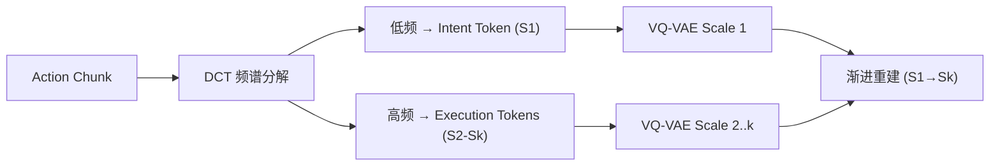

# MINT: Mimic Intent, Not Just Trajectories

- 本地 PDF：`papers/vla-architecture/MINT_2602.08602.pdf`
- arXiv：https://arxiv.org/abs/2602.08602
- 代码：https://github.com/RenMing-Huang/MINT
- 年份：2026 (RSS 2026)
- 团队：上海交大 + 上海创新研究院
- 阶段：频域意图-执行解耦 —— DCT 分解动作频谱

## 一句话总结

MINT 提出模仿学习应模仿"行为意图"而非"轨迹细节"。用 DCT 将 action chunk 分解为低频 Intent Token 和高频 Execution Tokens，多尺度 VQ-VAE 强制频谱分离。one-shot 迁移比 baseline 高 60%。RSS 2026。

## 核心技术

1. DCT 频域分解：低频系数 → Intent Token, 高频系数 → Execution Tokens
2. 多尺度 VQ-VAE + 渐进重建，强制频谱分离
3. Intent-to-Execution 自回归推理
4. One-Shot 迁移：提取单次演示的 Intent token 驱动新任务执行

## 底层原理与数学推导

DCT 将 action chunk $a_{1:T}$ 变换为频谱系数 $c_{1:K}$，其中 $c_{1:k_1}$ → Intent (S1), $c_{k_1+1:k_2}$ → S2... 多尺度 VQ-VAE 用渐进重建 loss 确保不同尺度的 codebook 专门化于不同频率分量。

## 物理直觉解释

人类看别人操作一遍就能模仿，因为你学会了"用手拿杯子放到嘴边"这个意图，而不是记住"肘关节转 37.5 度、手腕转 12.3 度"这些执行细节。MINT 的 Intent Token = 意图，Execution Token = 细节。

## 工程细节与实操指南

- **Tokenizer**: 多尺度 VQ-VAE, 3-4 个 scale levels
- **Policy**: Next-scale autoregression, LeRobot 兼容
- **训练**: LIBERO, Calvin, MetaWorld, Raven, BridgeData v2
- **真机**: Franka, ~20 demos/task

## 消融实验与分析

| 消融因子 | 结论 |
|---------|------|
| DCT vs 时域 tokenization | DCT 是泛化提升的核心 |
| Multi-scale vs single-scale VQ | 多尺度对频谱分离至关重要 |
| Intent-only vs Intent+Execution | Intent token 驱动 one-shot 迁移 |

## 技术权衡

| 优势 | 劣势 |
|------|------|
| +8.2% over VLA baselines, 43% lower latency | DCT 最优频谱切分点需手动设定 |
| 扰动下仅降 5.1%（baseline 降 22.7%） | 多尺度 VQ-VAE 训练复杂度高 |
| One-shot 迁移 +60% over baselines | 跨任务 Intent 泛化有待验证 |

## 技术价值与演进定位

MINT 和 FAST Tokenizer 是 2025-2026 年动作 tokenization 的两条互补路线——FAST 用 DCT 做频域压缩（效率），MINT 用 DCT 做频谱解耦（泛化）。代表了"频域思考动作"的新范式。

## 与其他论文的关系

- **FAST Tokenizer** — DCT 频域压缩，MINT 用 DCT 做语义解耦
- **XR-1** — UVMC 统一 vision-motion coding, MINT 在动作侧做频谱分解
- **π0.5** — 真机基准超越 29%

## 精读问题

1. DCT 分解的意图/执行边界在哪？最优频谱切分点如何确定？
2. Intent token 的跨任务泛化——不同类任务的 Intent 是否共享相似 codebook 分布？
