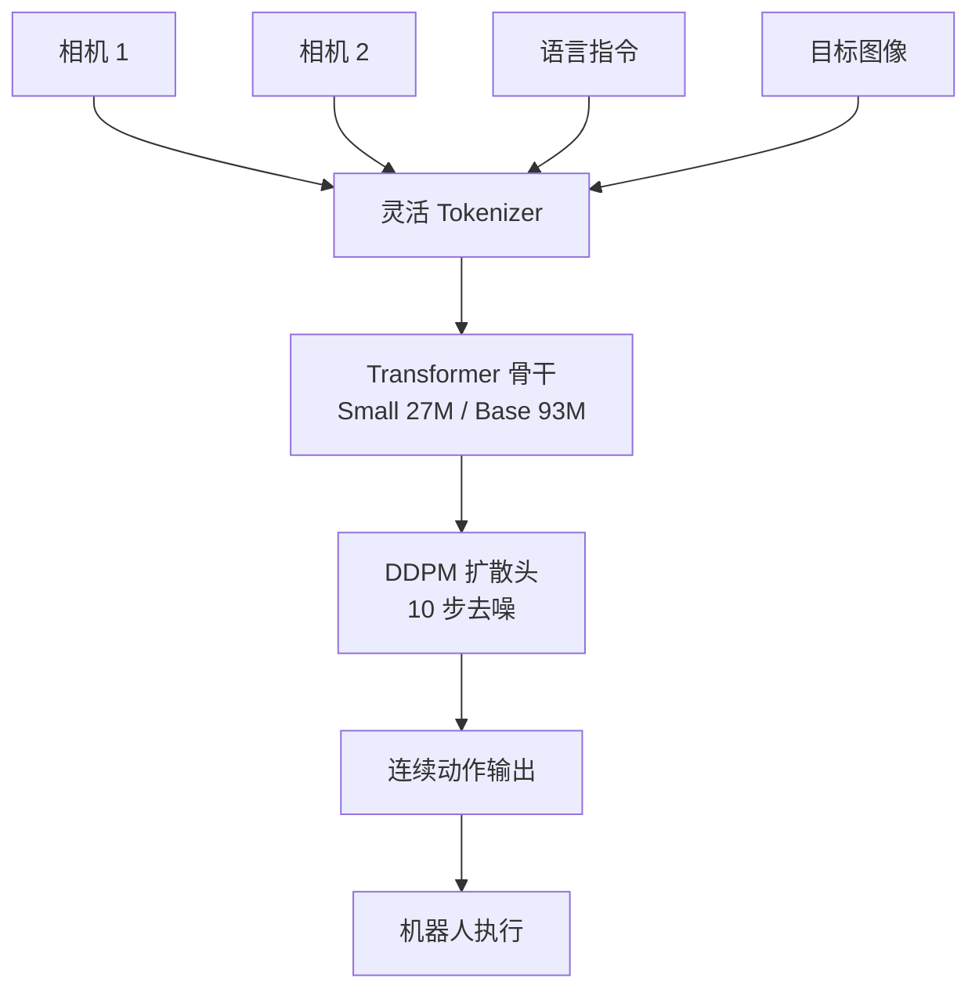

# Octo: An Open-Source Generalist Robot Policy

- 本地 PDF：`papers/vla-architecture/Octo_Open_Source_Generalist_Robot_Policy_2405.12213.pdf`
- arXiv：https://arxiv.org/abs/2405.12213
- 年份：2024
- 阶段：开源通用机器人策略

## 一句话总结

Octo 是开源社区最成熟的扩散策略 VLA 模型，在 Open X-Embodiment 数据上预训练，采用 Transformer 骨干加扩散输出头实现连续动作生成，以极小参数量（27M/93M）达到消费级 GPU 可部署的高频连续控制性能。

## 核心技术

1. **扩散输出头（Diffusion Head）** — 采用降噪扩散概率模型（DDPM）生成连续动作，仅需 10 步去噪即可输出高质量动作序列，彻底摆脱离散分箱的范式限制
2. **高度灵活的 Transformer 骨干网络** — 处理多模态输入（图像、语言指令、机器人状态），支持灵活的观测与动作空间定义
3. **多视角相机输入自适应处理** — 通过特殊 Tokenizer 设计，将不同视角的相机图像编码为独立 Token 序列，推理时可随意增删相机视角无需重新微调

## 底层原理与数学推导

Octo 是 2024 年开源社区最成熟的扩散策略 VLA 模型，它在 Open X-Embodiment 数据集上进行预训练，采用高度灵活的 Transformer 骨干处理多模态输入，在输出端采用扩散模型生成连续动作，彻底摆脱了离散分箱的范式限制，在高频连续控制场景表现极为出色。

**1. 扩散输出头核心原理**

扩散模型通过逐步向数据中添加高斯噪声，再学习从噪声中还原数据的过程，对连续动作的多峰分布有着极强的拟合能力，完美解决了传统回归方法的平均动作问题，同时无需离散化，无阶梯效应的精度损失。

Octo 采用降噪扩散概率模型（DDPM）作为动作输出头，前向扩散过程为

$$
x_t = \sqrt{\bar{\alpha}_t}\, x_0 + \sqrt{1-\bar{\alpha}_t}\, \epsilon, \quad \epsilon \sim \mathcal{N}(0, I)
$$

逆向去噪网络 $\epsilon_\theta(x_k, e, k)$ 以当前噪声动作 $x_k$、Transformer 动作读出嵌入 $e$ 与步数 $k$ 为条件：

$$
x_{k-1} = \alpha\left(x_k - \gamma \epsilon_\theta(x_k, e, k)\right)
$$

从 $x_K \sim \mathcal{N}(0, I)$ 出发去噪 K 步（推理仅 10 步），生成连续动作分布——对多峰动作分布拟合能力强于 MSE 回归头与离散分箱（消融实测 83% vs 35% vs 18%）。

**2. 多视角相机自适应处理**

Octo 通过特殊的 Tokenizer 设计，将不同视角的相机图像编码为独立的 Token 序列，在推理时可以随意增删相机视角，无需重新微调模型，完美适配不同机器人的多相机配置，是开源模型中首个实现该能力的架构。

## 物理直觉解释

**Octo 的扩散输出头就像一位雕塑家**——先从一块完整的"噪声石块"（$x_K \sim \mathcal{N}(0,I)$）开始，逐步雕琢出精细的动作轮廓。每一次去噪步骤都在剔除不可能的动作，让剩余的有效动作空间越来越精确，最终收敛到一条高概率的操作轨迹。相比离散分箱（像用乐高积木搭雕塑，受限于积木的形状和大小），扩散模型生成的连续动作就像用黏土雕塑，没有任何精度损失——消融表中 Discretized 18% vs MSE 35% vs 扩散头 83% 的差距正是这三种"雕塑材料"的表现差异。

**为什么扩散头能同时处理"多峰"动作？** 同一个任务有多种正确做法（从左边抓还是从右边抓），回归头只能输出它们的平均——相当于把"向左"和"向右"平均成"向前"，往往哪个方向都够不着；扩散模型则从噪声中随机采样，天然支持多峰分布，每次生成都是完整可行的动作。这正是它在高频连续控制上优于回归头（MSE 35%）的本质原因。

**多视角自适应处理则像人类操作时灵活切换视线**——主摄像头看全局、手腕摄像头看细节，Octo 把每个视角编码成独立的 Token 序列，推理时可以随意增删相机视角而无需重新微调，相当于"想用几只眼睛就用几只眼睛"，适配不同机器人的相机配置差异。

## 工程细节与实操指南

- **预训练数据**：基于 Open X-Embodiment 数据集的 80 万条轨迹进行预训练，覆盖 19 种机器人。
- **模型规格**：分为 Small（27M 参数）、Base（93M 参数）两个官方版本，普通消费级 GPU 即可完成推理与微调。
- **推理性能**：Base 版本在单张 NVIDIA 4090 GPU 上，推理帧率可达 13 it/sec，完美适配高频连续控制场景。
- **核心特性**：原生支持语言指令与目标图像双任务条件，支持灵活的观测与动作空间定义，可快速微调适配新的机器人硬件。

## 消融实验与分析

WidowX 上 4 个任务（2 个语言条件 + 2 个目标图像条件）平均成功率：

| 消融因子 | 设置对比 | 平均成功率 |
|---------|---------|-----------|
| 数据混合 | Octo-Small（OXE 全混合） | 83% |
| 数据混合 | RT-X dataset mix | 60% |
| 数据混合 | 单一机器人数据集（Bridge） | 43% |
| 动作表征 | Discretized Action Prediction | 18% |
| 动作表征 | Continuous Action Prediction (MSE) | 35% |
| 视觉编码器 | ResNet-50 + Transformer | 70% |
| 视觉编码器 | ViT + 扩散头 + 宽数据混合（Ours） | 83% |

**核心结论**：三个设计维度贡献可独立量化——动作表征的差距最悬殊（扩散头 83% vs 离散 18% vs MSE 35%），证明连续生成范式是 Octo 性能的基石；数据混合从单一 Bridge 数据（43%）到 RT-X mix（60%）再到 OXE 全混合（83%）逐级提升，说明预训练数据多样性直接决定泛化；视觉编码器 ViT 比 ResNet-50 高 13 个百分点。此外微调评估显示 Octo 平均超越最强基线 52%，且仅需每域 ~100 条示范即可适配新观测（力传感器）与新动作空间（关节控制）。

## 技术权衡（Trade-off）

| 维度 | Octo | OpenVLA |
|------|------|---------|
| 核心架构 | Transformer 骨干 + 扩散输出头 | 7B VLM 骨干 + 回归输出头 |
| 语义能力 | 较弱，无大规模 VLM 预训练语义先验 | 极强，基于 SigLIP 预训练 VLM，具备强大的常识推理能力 |
| 连续控制 | 极强，扩散模型完美适配多模态动作分布，高频控制表现出色 | 中等，回归方法在多峰分布上拟合能力弱于扩散模型 |
| 部署门槛 | 极低，最大 300M 参数，消费级 GPU 即可部署 | 中等，7B 模型需要量化后才能在消费级 GPU 上实时运行 |
| 适用场景 | 高频精细操作、工业流水线、动态场景 | 复杂语言指令、开放世界场景、零样本泛化任务 |

## 技术价值与演进定位

Octo 是开源 VLA 模型中扩散策略的标杆之作。它将"多路相机输入+连续动作输出"的架构完全标准化，证明了小参数量（27M/93M）扩散模型在机器人操作任务上可以达到甚至超越大参数量 VLA 模型的性能（零样本 WidowX 83%、微调超越最强基线 52%），为工业落地提供了低成本、高性能的开源方案。它在生态上的贡献同样关键：灵活的观测/动作空间定义让新机器人适配只需数小时微调，语言与目标图像双条件接口成为后续通用策略（π0 等）任务规范化的原型，而扩散动作头与 Transformer 骨干的组合也为"策略型 VLA"这一技术分支确立了基线——后续大量工作（包括 π0 的 flow matching 动作头）都可视为对 Octo 扩散头范式的推广与改进。

## 与其他论文的关系

- **Open X-Embodiment** 是 Octo 的预训练数据底座，Octo 基于其 80 万条轨迹进行多机器人预训练。
- **Diffusion Policy** 是 Octo 扩散输出头的技术前身，Octo 将其融入通用 Transformer 架构并扩展到多机器人场景。
- **OpenVLA** 与 Octo 形成开源路线的两种代表：策略型（扩散+小参数量）vs VLM 型（大语言模型骨干），在语义理解与连续控制之间各有取舍。
- **RT-1/RT-2** 使用离散动作 Token 化，Octo 通过扩散输出头实现了连续动作生成，解决了阶梯效应问题。

## 精读问题

1. Octo 的 diffusion head 在推理时仅需 10 步去噪，相比标准 DDPM（通常需要 100-1000 步），其加速策略具体是什么？步数减少的代价是分布保真度的多少损失？
2. Octo 的 generalist 能力具体体现在哪些维度？多视角自适应处理的 Tokenizer 如何工作？
3. Octo 的 Small（27M）和 Base（93M）版本在性能与推理速度上如何权衡？如何根据任务需求选择？
4. Octo 与 OpenVLA 在语义理解与控制精度上的本质差异，是否意味着两者在架构上有融合的可能？
5. 动作头的多峰采样如何在推理时选择"最终那条轨迹"？采样随机性是否会引入执行抖动，是否有 test-time 策略（如多采样投票）？
6. 数据混合从 Bridge（43%）到 OXE（83%）的提升主要来自数据多样性还是数据规模？后续 π0 用 flow matching 替代 DDPM 的具体动机是什么？
