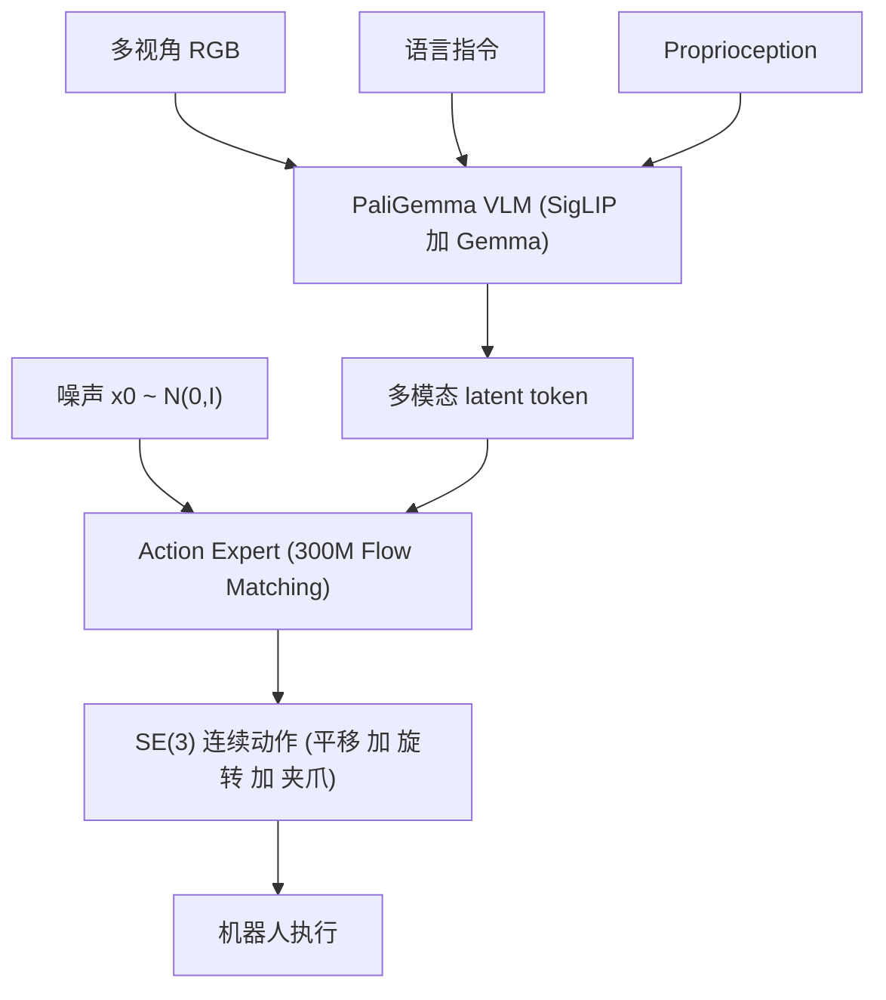

# π0: A Vision-Language-Action Flow Model for General Robot Control

- 本地 PDF：`papers/vla-architecture/pi0_2410.24164.pdf`
- arXiv：https://arxiv.org/abs/2410.24164
- 年份：2024 (v4: Jan 2026)
- 团队：Physical Intelligence
- 阶段：通用 VLA 基础模型 —— Flow Matching 动作生成 + 跨具身预训练

## 一句话总结

π0 是 Physical Intelligence 的通用机器人策略基础模型，基于 VLM 骨干 (PaliGemma) + Flow Matching 动作专家，在 7 种机器人配置、68 个任务上预训练，可通过 prompt 直接执行或微调适配复杂多阶段任务。

## 核心技术

1. **Flow Matching 动作生成** — 用连续归一化流替代扩散模型，将动作去噪建模为 ODE 求解，10 步推理生成 SE(3) 连续动作
2. **VLM 骨干 + Action Expert** — PaliGemma 作为视觉语言骨干，额外 300M action expert 通过 flow matching 输出连续动作
3. **跨具身多任务预训练** — 7 种机器人配置（单臂、双臂、移动操作），68 个灵巧操作任务
4. **直接 Prompt + 微调双模式** — 预训练后可通过语言指令直接执行，或 finetune 到特定长序复杂任务

## 底层原理与数学推导

### 1. Flow Matching 核心公式

给定噪声 $x_0 \sim \mathcal{N}(0, I)$，flow matching 学习一个时间相关的向量场 $v_\theta(x_\tau, \tau, c)$：

$$\frac{dx_\tau}{d\tau} = v_\theta(x_\tau, \tau, c)$$

从 $\tau=0$ 积分到 $\tau=1$ 得到动作：

$$a = x_0 + \int_0^1 v_\theta(x_\tau, \tau, o, l) d\tau$$

其中 $o$ 为观测，$l$ 为语言指令。条件流匹配 (Conditional Flow Matching) 的损失：

$$L_{CFM} = \mathbb{E}_{t, x_0, x_1} \left[ \| v_\theta(x_\tau, \tau, c) - (x_1 - x_0) \|^2 \right]$$

### 2. 与扩散模型的区别

扩散模型建模随机微分方程 (SDE)，flow matching 建模常微分方程 (ODE)。ODE 路径更直，因此推理步数更少（10 vs 16-100）。

### 3. 系统架构

## 物理直觉解释

Flow matching 好比不是在迷宫中随机游走寻找出口（扩散模型），而是沿着一条预先学好的"流线"从噪声直接滑向目标动作——更直、更快。VLM 骨干像是机器人的"常识大脑"，action expert 像是"肌肉记忆"，两者通过 attention 沟通。

## 工程细节与实操指南

- 数据：7 种机器人配置 × 68 任务，涵盖单臂/双臂/移动操作
- 微调后执行复杂长序任务：洗衣折叠（从烘干机取出 → 装篮 → 运到折叠桌 → 折叠多件衣物）、组装盒子、擦桌子
- 支持高频精细动作（10Hz+ 推理）
- VLM 提供语义 grounding，action expert 提供精准动作

## 技术权衡（Trade-off）

| 优势 | 劣势与工程代价 |
|------|----------------|
| Flow matching 10 步推理，比扩散快 | 连续动作在离散动作空间场景下需额外处理 |
| VLM 骨干提供 Internet-scale 语义知识 | 大模型推理延迟仍在 100ms+ |
| 跨具身预训练使其可泛化到不同平台 | 7 种配置仍有限，未覆盖人形机器人和灵巧手 |
| 微调后可执行 10+ 分钟长序任务 | 训练数据工程极其昂贵 |

## 技术价值与演进定位

π0 是 VLA 基础模型的工程标杆——证明了 VLM + Flow Matching 的组合可以产生精确、流畅的连续动作。π0.5 在其基础上将泛化推向开放世界，但 π0 本身的结构定义了 Physical Intelligence 的 VLA 技术路线。

## 与其他论文的关系

- **π0.5** 直接基于 π0 架构，通过异构数据联合训练实现开放世界泛化
- **Diffusion Policy** 是动作扩散的里程碑，π0 用 flow matching 替代扩散
- **OpenVLA** 同为 VLA，但省去了专门的 action expert（直接回归）
- **RT-2** 用离散 token 输出动作，π0 用连续 flow matching，精度更高

## 精读问题

1. Flow matching 的 10 步 ODE 求解用的是什么求解器？Euler vs RK4 的精度差异？
2. Action expert 的 300M 参数与 VLM 骨干的参数量比例如何？是否可进一步精简？
3. 跨具身预训练中，不同机器人平台的动作空间如何统一？SE(3) 是否适用所有场景？
