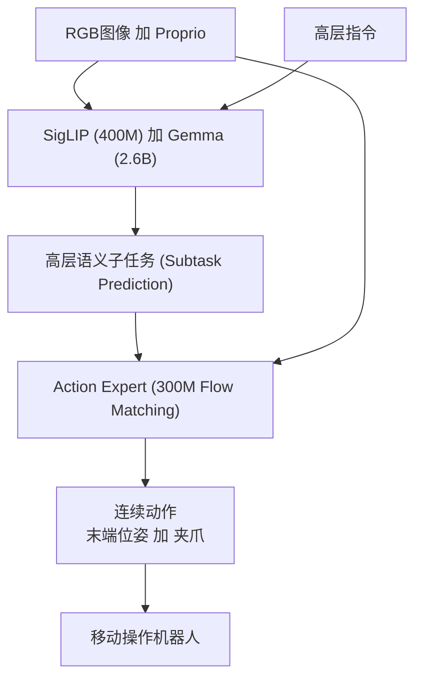

# π0.5: a Vision-Language-Action Model with Open-World Generalization

- 本地 PDF：`papers/vla-architecture/pi05_2504.16054.pdf`
- arXiv：https://arxiv.org/abs/2504.16054
- 年份：2025
- 团队：Physical Intelligence
- 阶段：开放世界 VLA —— 跨具身多源数据联合训练实现零样本泛化

## 一句话总结

π0.5 基于 π0 构建，通过跨具身联合训练（co-training）——97.6% 的训练数据来自非目标平台的机器人数据和网页数据——首次让端到端学习系统在从未见过的家庭环境中完成 10-15 分钟的复杂长序操作（如清洁厨房、整理卧室）。

## 核心技术

1. **异构多源联合训练** — 除 400h 移动操作机器人数据外，融合网页多模态数据（图像描述、问答、目标检测）、在实验室固定/非移动机器人数据、高层语义子任务预测、口头语言指令，97.6% 数据不来自目标平台
2. **分层架构** — 高层先预测语义子任务（如 "pick up the pillow"），低层 action expert（300M 参数 flow matching 头）据子任务生成连续动作
3. **预训练 + 后训练两阶段** — 第一阶段联合训练异构数据 mixture；第二阶段针对性微调移动操作（低层动作 + 高层语义标签）
4. **SigLIP (400M) + Gemma (2.6B) VLM 骨干**，action expert 基于 flow matching 去噪生成连续动作

## 底层原理与数学推导

### 1. 泛化的层次抽象

π0.5 的核心假设：开放世界泛化需要多层次知识迁移：
- **直接经验层**：目标平台上的直接操作数据（最窄，但最精确）
- **跨具身迁移层**：其他机器人的操作数据（拓宽操作技能）
- **语义理解层**：高层子任务标签预测 + 语言指令（拓宽任务理解和组合能力）
- **世界知识层**：网页多模态数据（提供常识推理和语义 grounding）

### 2. Flow Matching 动作生成

低层 action expert (300M) 使用 flow matching：

$$\frac{da_t}{d\tau} = v_\theta(a_t^\tau, o_t, c)$$

从噪声 $a_t^0 \sim \mathcal{N}(0,I)$ 沿向量场 $v_\theta$ 积分得到动作 $a_t = a_t^1$。相比扩散模型，flow matching 推理步数更少（10 步 vs DDIM 16 步）。

### 3. 分层推理流程

## 物理直觉解释

π0.5 的训练策略类似于培养一个"通才管家"：不只是在同一间厨房练习无数次，而是让他从各种来源学习——看菜谱（网页数据）、观察其他人在不同厨房里操作（其他机器人数据）、记住你的口头指示（语言指令）、理解每个子步骤做什么（子任务预测）。最终进入新厨房时，虽然没见过这个具体环境，但能从多元经验中拼凑出正确的操作方案。

## 工程细节与实操指南

### 训练数据分布

| 数据来源 | 占比 | 作用 |
|---------|------|------|
| 移动操作机器人（家庭） | ~2.4% | 直接目标域经验 |
| 其他机器人（固定/移动） | 主要 | 跨具身技能迁移 |
| 实验室固定机器人 | 中等 | 基础操作技能 |
| 网页多模态数据 | 大量 | 视觉常识、语义 grounding |
| 高层子任务标注 | 中等 | 任务分解能力 |
| 口头语言指令 | 少量 | 自然语言理解 |

### 关键设计

- 两阶段训练：Phase 1 跨源预训练 → Phase 2 移动操作微调
- 推理时：每步先预测子任务 → 子任务作为 condition 输入 action expert 生成动作
- 人类口头指导（"close the cabinets", "put the dishes in the sink"）作为高层 prompt
- 支持 10-15 分钟长序任务，如：清洁厨房 = 收拾餐具 + 擦台面 + 关柜门 + 放吸管等

## 技术权衡（Trade-off）

| 优势 | 劣势与工程代价 |
|------|----------------|
| 7.6% 训练数据 → 零样本泛化到全新家庭环境 | 训练数据工程极其复杂，需维护多种数据 pipeline |
| 分层架构使长序任务可分解 | 高层子任务预测错误会级联导致任务失败 |
| Flow matching 推理效率优于扩散 | 300M action expert 仍增加推理延迟 |
| 开源（openpi GitHub） | 训练需要巨大算力（Physical Intelligence 内部基础设施） |

## 实验

- 在从未见过的家庭环境中部署——新厨房、新卧室，零样本
- 任务包括：清洁厨房（收盘子、擦台面、关柜门）、整理卧室（叠被子、放枕头、收衣服）
- 定性展示：机器人能在 10-15 分钟内完成多步骤复杂任务
- 消融：去除非目标平台机器人数据或网页数据后，泛化能力显著下降

## 技术价值与演进定位

π0.5 是 VLA 泛化范式的里程碑：从"训练什么任务做什么任务"到"训练少、泛化广"。核心贡献不是新架构，而是证明了**数据多样性 > 数据规模**——用极少（2.4%）的目标域数据实现零样本泛化，关键在于异构数据的联合训练。这对有限标注的机器人学习场景意义深远。

## 与其他论文的关系

- **π0** 是基础模型，π0.5 将架构不变的前提下将泛化推向开放世界
- **OpenVLA** 开源 7B VLA，但泛化范围受限于训练数据分布；π0.5 用异构数据突破分布限制
- **RT-2** 用 VLM 做 VLA，但缺乏分层和 flow matching 动作生成
- **Diffusion Policy** 的动作扩散被 π0.5 的 flow matching 取代
- **GR-MG / 3D Foresight** 的世界模型思路与 π0.5 的泛化策略正交

## 精读问题

1. 97.6% 非目标域数据的分布如何决定？是否存在最优配比？
2. 高层子任务词汇表如何构建？是否支持开放词汇？
3. 分层结构的两阶段训练 vs 端到端联合训练的优劣？
4. 新家庭环境中的基准比较——与人类遥控操作或其他 baseline 的定量对比？
5. Flow matching 10 步推理相比扩散 16 步，对精细操作质量的影响？
