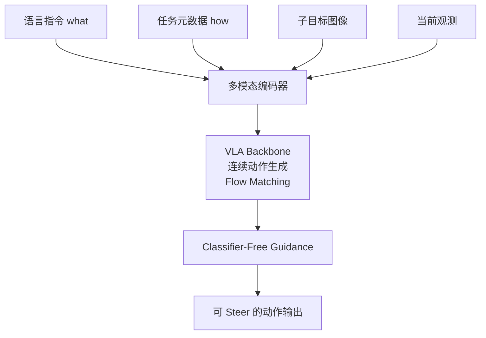

# π0.7: a Steerable Generalist Robotic Foundation Model with Emergent Capabilities

- Local PDF: `/Users/luogu/physical_intelligence/papers/vla-architecture/pi07_2604.15483.pdf`
- arXiv: https://arxiv.org/abs/2604.15483
- Source: https://arxiv.org/abs/2604.15483
- Project: https://www.pi.website/research/pi07
- Authors: Physical Intelligence + 87 authors
- Published: 2026-04-16
- Category: steerable generalist VLA
- Priority: high

## 一句话总结

π0.7 通过在训练中注入多模态上下文（语言 + 元数据 + 子目标图像），使 VLA 不仅能理解「做什么」还能理解「怎么做」，实现了推理时的 steerability、跨 embodiment 零样本迁移、以及在未见组合任务上的组合泛化，在 espresso 机操作等挑战性任务上匹敌 RL finetune 专用模型。

## 核心技术

1. **Diverse Context Conditioning** — 在训练时向模型输入的不再只有语言指令，还包括任务元数据（速度、质量、是否出错）、子目标图像、控制模式等丰富上下文，使得不同策略、不同质量的数据可以被统一纳入训练而不会被模型「平均化」
2. **基于 Flow Matching 的连续动作生成** — 继承 `π0` 系列的 flow matching 框架，860M 参数 action expert 使用条件流匹配损失，输出 50 步动作块，每步执行 15-25 步后再预测
3. **子目标世界模型** — 14B 参数 BAGEL 混合 Transformer 模型在推理时根据当前观测和子任务指令合成子目标图像，为 VLA 提供视觉策略指引，运行在独立异步线程中
4. **Classifier-Free Guidance (CFG) 元数据引导** — 推理时对元数据条件施加 CFG，放大正向元数据（高质量、快速度、无错误）对动作分布的影响

## 底层原理与数学推导

### 训练目标

传统 VLA 的条件上下文仅包含语言指令 ℓₜ，而 π0.7 将上下文拓展为：

$$\mathcal{C}_t = \{\ell_t, \hat{\ell}_t, \mathbf{m}, \mathbf{g}_t, c\}$$

其中 ℓₜ 为整体任务描述，ℓ̂ₜ 为子步骤描述，**m** 为元数据（速度、质量、错误标记），**gₜ** 为子目标图像，c 为控制模式。

模型的训练目标为最大化条件对数似然：

$$\max_{\theta} \mathbb{E}_{\mathcal{D}} \left[\log \pi_{\theta}(\mathbf{a}_{t:t+H} | \mathbf{o}_{t-T:t}, \mathcal{C}_t)\right]$$

观测定义：$\mathbf{o}_t = [\mathbf{I}_t^1, \ldots, \mathbf{I}_t^n, \mathbf{q}_t]$，其中 $\mathbf{I}_t^i$ 为 n 个摄像头图像，$\mathbf{q}_t$ 为机器人关节位姿。

### Flow Matching 动作生成

动作专家使用条件流匹配 (CFM) 损失，而非封闭形式的对数似然。其基本思想是学习一个向量场 $v_{\theta}$，将一个简单先验分布（高斯噪声）逐步变形为动作数据的真实分布：

$$\mathcal{L}_{\text{CFM}} = \mathbb{E}_{t, p_0(a), p_1(a)} \left[ \| v_{\theta}(\phi_t(a), t) - \frac{d}{dt}\phi_t(a) \|^2 \right]$$

其中 $\phi_t(a)$ 是通过在噪声 $a_0$ 和数据 $a_1$ 之间插值定义的流：

$$\phi_t(a) = (1-t)a_0 + t \cdot a_1$$

VLM 骨干（Gemma3 4B）通过 FAST token 监督训练，但 action expert 的梯度不反向传播到 VLM 骨干（Knowledge Insulation / KI 训练方案）。

### 世界模型训练目标

子目标生成模型 gψ 同样使用 flow matching 损失：

$$\max_{\psi} \mathbb{E}_{\mathcal{D}_g} \left[\mathcal{L}_{\text{CFM}}(\mathbf{g}_t^{\star}, g_{\psi}(\mathbf{o}_t, \hat{\ell}_t, \mathbf{m}))\right]$$

其中 $\mathbf{g}_t^{\star}$ 为真实未来子目标图像（每个段落的末尾帧）。世界模型初始化为 14B 参数的 BAGEL 混合 Transformer 模型，具有 web-scale 预训练。

### 推理时 Classifier-Free Guidance

推理时对元数据条件使用 CFG，每个去噪步的计算方式为：

$$\nabla_a \log \pi_{\theta}(\mathbf{a}|\mathbf{o}, \mathcal{C}) + \beta \left(\nabla_a \log \pi_{\theta}(\mathbf{a}|\mathbf{o}, \mathcal{C}) - \nabla_a \log \pi_{\theta}(\mathbf{a}|\mathbf{o}, \mathcal{C}^{\text{uncond}})\right)$$

CFG 权重 $\beta \in \{1.3, 1.7, 2.2\}$。无条件上下文 $\mathcal{C}^{\text{uncond}}$ 将元数据字段替换为中性值。

### 训练时 Dropout 策略

为防止模型过度依赖某一条件模态，训练时对上下文采用随机 Dropout：
- 子目标图像：仅 25% 的样本使用（添加子目标后任务变为「逆动力学」问题，加速收敛）
- 子任务指令 ℓ̂ₜ：当使用子目标时，30% 概率丢弃
- 元数据：15% 概率完全丢弃，每个分量（速度/质量/错误）分别 5% 概率丢弃
- 控制模式：不丢弃

### 实时动作分块 (RTC)

训练时模拟推理延迟 0-12 个时间步（对应 50Hz 下最大 240ms 延迟），使模型学会在延迟下仍能稳定控制。

## 物理直觉解释

- **Diverse Context Conditioning 就像给机器人加上了「策略说明书」**：以前告诉机器人「做咖啡」，它只能从训练数据中猜一个「平均做法」。现在你同时告诉它「要快、高质量、不要出错」，还给它看每一步结束时的「目标画面」，机器人就能确切知道你要哪种做法——快的时候猛发力，精的时候慢操作。
- **元数据的作用像「数据标签」**：训练数据里有高手示范（高质量）、新手尝试（低质量）、失败记录（有错误）。如果不加标签，模型会把好数据和差数据「平均」成平庸策略。加了速度/质量标签，模型学会了区分「这是高质量示范，好好学」和「这是失败案例，吸取教训」，所以差数据反而变成有用经验。
- **子目标图像就像「导航目的地截图」**：一个厨房任务有多个步骤——开冰箱、取菜、关冰箱、放微波炉。每一步给模型看一张「这一步做完应该长什么样」的图片，模型就知道当前该把环境变成什么状态，大幅降低歧义。
- **为什么在 UR5e 上能零样本叠衣服？** 因为模型学到的不是「把衣服这样折」的固定轨迹，而是理解了「把衣服平铺→对齐边缘→折叠」的抽象策略。当面对的机器人体型更大时，模型自动调整策略——原本用两只手配合，现在发现单臂臂展够长，就改成单手操作，像人到了不同体型的环境自动调整做事方式一样。

## 工程细节与实操指南

**模型规模：**
- 总参数量：~5B
- VLM 骨干：Gemma3 4B（含 400M 视觉编码器）
- Action expert：860M 参数 Transformer（flow matching）
- 视频历史编码器：MEM 风格时空压缩
- 世界模型：14B 参数 BAGEL 混合 Transformer

**输入配置：**
- 最多 4 路摄像头图像（前视、双腕、可选后视）
- 最多 6 帧历史图像（间隔 1 秒采样）
- 最多 3 张子目标图像（不含后视图）
- 所有图像缩放到 448×448 像素
- 历史图像以 0.3 概率随机丢弃

**注意力掩码设计：**
- 观测图像 token 与子目标 token 内部双向注意力
- 子目标 token 可额外关注观测 token
- 文本 token 使用因果注意力
- 动作 token（50 个）相互双向注意力，并可关注 VLM 骨干激活

**本体感知编码：**
- 不同于 π0.6 的离散化文本 token，π0.7 使用线性投影将状态维度映射到骨干网络维度
- 每个历史状态为独立 token，对应帧丢弃时一并掩码

**推理流程（Algorithm 1）：**
1. 初始化子任务指令 ℓ̂ₜ
2. 世界模型根据当前观测 + ℓ̂ₜ + 元数据生成子目标图像（异步线程）
3. 构建完整上下文，采样 50 步动作块，执行 Ĥ ∈ {15, 25} 步
4. 每一步检查：子任务是否改变？距上次子目标是否超过 Δ=4 秒？
5. 条件触发时异步刷新子目标图像
6. 执行 Ĥ 步后异步重新采样动作块（RTC 兼容）

**推理超参：**
- 5 步去噪生成 50 步动作块
- CFG 权重 β ∈ {1.3, 1.7, 2.2} 因任务调优
- 速度元数据：设为每个任务长度的第 15 百分位
- 质量元数据：固定为 5（最高）
- 错误元数据：固定为 false

**训练数据组成：**
- 多平台示教数据（静态双臂、移动双臂、单臂 6-DoF）
- 自主策略评估数据（含失败）
- 人工干预策略展开
- 开源机器人数据集（DROID Franka）
- 第一人称人类视频
- Web 数据（目标定位、属性预测、VQA、纯文本）
- 视频语言数据（机器人数据 + Web 数据的视频描述）
- RL 生成数据（Recap 训练蒸馏 π*0.6 策略）

**关键工程发现：**
- 不标注元数据地混合数据会导致性能下降；正确标注后，更多数据（即使质量更低）持续带来提升
- 子目标图像的使用将动作预测任务简化为「逆动力学」问题，加速训练收敛
- 在错配的机器人形态上，模型自动发现新的操作策略而非简单模仿原轨迹

## 消融实验与分析

| 消融因子 | 变化 | 结论 |
|---------|------|------|
| 多模态上下文 | 语言+元数据+子目标 vs 仅语言 | 多模态上下文显著提升 steerability |
| 子目标图像条件 | with vs without | 子目标图像对零样本泛化贡献最大 |
| 跨具身训练数据 | 多具身 vs 单具身 | 跨具身训练是零样本迁移的关键 |

**核心结论**：Steerability 来自训练时注入多模态上下文——子目标图像和元数据让策略学会不仅做什么还怎么做。

## 技术权衡（Trade-off）

| 优势 | 劣势与工程代价 |
|------|---------------|
| 推理时可通过元数据/子目标图像 steer 策略，同一模型适配不同执行风格 | 需要维护庞大的多模态上下文（图像 + 元数据 + 世界模型），推理管线复杂度高 |
| 能够纳入低质量数据和失败数据，数据利用效率远超此前方法 | 元数据标注需人工或自动生成，标注成本和一致性是工程瓶颈 |
| 组合泛化能力强——未见任务、未见组合、未见环境均可处理 | 未见任务的成功率（60-80%）远低于已见任务（>90%），可靠边界模糊 |
| 零样本跨 embodiment 迁移，匹敌专家遥操作水平 | ~5B 参数 + 14B 世界模型，推理延迟和计算成本显著 |
| 通过 RL 蒸馏（Recap）匹敌专用 RL 模型，无需为每任务单独训练 | 需要强大的预训练基础（Gemma3 4B + BAGEL 14B），重度依赖 Google/开源生态 |
| 子目标世界模型提供视觉策略规划，提升复杂长期任务表现 | 世界模型生成质量不稳定时可能误导底层 VLA，引入新的失败模式 |
| 训练时 RTC 模拟延迟使模型对推理延迟鲁棒 | 世界模型 + VLA 的异步架构增加了系统集成调试难度 |

## 技术价值与演进定位

π0.7 代表了 VLA 从「语言条件动作生成」到「多模态上下文引导」的范式跃迁。它证明了：

1. **数据多样性可以成为优势而非噪声** — 只要有正确的上下文标注，低质量、失败、自主数据不仅能用，还能增强泛化。这改变了机器人数据「宁缺毋滥」的传统观念。

2. **组合泛化在物理世界中可以实现** — 不是简单记忆-复现，而是真正的技能重组（remixing），在未见任务上由已有技能组合解决新问题，这与 LLM 的涌现能力形成类比。

3. **Steerability 是跨越「通用 vs 专用」鸿沟的关键** — 同一个模型通过 prompt 即可在速度优先和精度优先之间切换，无需为每种策略单独训练，打破了此前「通用模型性能不如专用模型」的 trade-off。

4. **闭源前沿的开放性标杆** — 虽然权重未开源，但论文披露了丰富的训练细节、数据组成、和消融实验，其公开程度远超同期闭源工作（如 Gemini Robotics），成为学术界的「可参考上界」。

## 与其他论文的关系

- **π0 / FAST**：继承 flow matching 连续动作生成范式，π0.7 在此基础上加入了多模态上下文
- **π0.6 / MEM**：直接继承 MEM 架构中的视频历史编码器和记忆机制，π0.7 新增元数据和子目标图像
- **RT-2 / OpenVLA**：相比纯语言条件范式，π0.7 展示了多模态上下文的巨大增益
- **SuSIE**：子目标图像条件的思想受 SuSIE 等 goal-image conditioning 工作启发，但 π0.7 使用生成式世界模型而非检索式
- **BAGEL**：子目标世界模型基于 BAGEL（14B 混合 Transformer），利用了其 web-scale 图像生成预训练
- **Recap (π*0.6)**：RL 蒸馏数据来自 Recap 训练的 π*0.6 专家模型，将专用 RL 性能注入通用模型
- **HiRobot**：高层语义策略通过 HiRobot 框架微调，将从语言 coaching 中学到的能力固化为自主策略

## 精读问题

1. Diverse Context Conditioning 的 Dropout 策略是如何确定的？不同 Dropout 率的消融实验结果如何？
2. CFG 权重 β 如何根据任务类型选择？速度优先 vs 精度优先任务的最佳 β 值是否不同？
3. 子目标生成使用 BAGEL（14B）这种大规模模型，在实际系统中如何控制推理延迟？异步刷新策略的具体同步机制是什么？
4. 跨 embodiment 迁移中，模型是如何「发现」新的操作策略（如单臂替代双臂）的？是注意力机制自然涌现还是特定模块的作用？
5. 元数据标注的一致性问题：速度/质量的人工标注偏差如何影响训练效果？
6. 「已见」与「未见」任务的边界如何定义？当训练数据规模达到一定程度后，组合泛化与记忆复现的比例是多少？
7. 训练时模拟延迟 0-12 步（RTC），这个窗口是如何确定的？50Hz 控制频率下 240ms 延迟的上限是否有理论依据？
8. 使用 Knowledge Insulation（action expert 梯度不反传 VLM）的设计原理是什么？是否限制了 VLM 表征对动作的学习能力？
