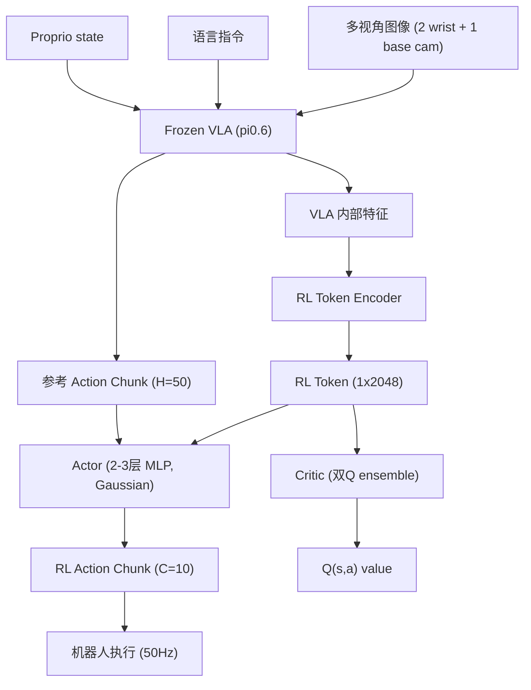

# RL Token: Bootstrapping Online RL with Vision-Language-Action Models

- 本地 PDF：`papers/vla-architecture/RL_Token_2604.23073.pdf`
- arXiv：https://arxiv.org/abs/2604.23073
- 年份：2026（4 月）
- 团队：Physical Intelligence (Charles Xu, Jost Tobias Springenberg, Sergey Levine, Liyiming Ke 等)
- 阶段：VLA + 在线 RL —— 用 RL Token 作为紧凑接口，在真实机器人上几分钟到几小时内精调 VLA

## 一句话总结

RLT (RL Token) 提出了一种轻量级方法，使预训练 VLA 可以通过在线 RL 快速精调：在 VLA 内部训练一个紧凑的 "RL Token"（1×2048 表示），作为小规模 actor-critic 的状态接口，配合动作分块、BC 正则化和参考动作直通，在 4 个高精度真实操作任务上将最难阶段的速度提升最高 3×，成功率从 20% 提升至 65%。

## 核心技术

1. **RL Token 表征提取** — 在 VLA 内部特征上训练 encoder-decoder，将 VLM backbone 的丰富感知信息压缩为 1×2048 紧凑表示，冻结后作为 RL 的 state 输入
2. **轻量 Actor-Critic 在线 RL** — 仅训练 2-3 层 MLP（hidden 256-512），使用 off-policy actor-critic（REDQ 风格的双 Q ensemble），配合 chunked action（C=10，短于 VLA 的 H=50）
3. **BC 正则化 + 参考动作直通** — actor 以 VLA 的参考 action chunk 为条件输入（训练时 50% mask），并通过 BC loss 锚定到 VLA 行为，将 RL 变为局部精调而非无约束搜索
4. **关键阶段聚焦** — 仅在任务的"关键阶段"（最需要精度的 5-20s 片段）切换 RL 策略，其余部分由 base VLA 执行，集中样本预算于最需改进之处
5. **人类参与信号** — 稀疏二值奖励（成功/失败由操作员标注）+ 人工干预数据注入 replay buffer

## 底层原理与数学推导

### 架构

### RL Token 训练

RL Token 训练与 VLA 微调同时进行：在目标任务数据上 fine-tune VLA 的同时，训练 encoder-decoder 从 VLA 内部特征中产生紧凑表示。encoder 从 VLM backbone 的多层 token embedding 中提取信息，decoder 重建任务相关特征。训练完成后 VLA 冻结，仅 RL Token 和 actor-critic 参与在线 RL。

### 在线 RL 目标

**Chunked Actor-Critic**：与标准单步 MDP 不同，RLT 在 action chunk 层面定义策略和价值：

$$\pi(a_{t:t+C-1} | s_t), \quad Q^\pi(s_t, a_{t:t+C-1}) = \sum_{t'=t}^{t+C-1} \gamma^{t'-t} r_{t'} + \gamma^C \mathbb{E}_{a' \sim \pi|s_{t+C}}[Q^\pi(s_{t+C}, a')]$$

C=10（0.2s），控制频率 50Hz，14 维单步动作 → 140 维 chunked action。

**BC 正则化**：actor 损失包含额外的 BC term，锚定到 VLA 的参考动作：

$$\mathcal{L}(\pi_\theta) = -\mathbb{E}_{s,a \sim \mathcal{B}}\left[Q_\psi(s, \pi_\theta(s)) - \alpha \log \pi_\theta(a^{\text{vla}} | s)\right]$$

其中 $a^{\text{vla}}$ 是 VLA 的参考动作 chunk，$\alpha$ 控制正则化强度。

**参考动作直通（Pass-Through）**：actor 以 VLA 参考 action chunk 为额外输入（训练时 50% dropout），使其可以直接复用或微调 VLA 的建议。

### 关键设计选择

1. **C < H**：RL chunk 长度 C=10，短于 VLA 的 H=50，使 RL 策略更具反应性
2. **Chunk subsampling**：训练时每 2 步采一个 chunk，每秒数据产生 ~25 个训练样本，提高样本效率
3. **稀疏奖励 + 短 horizon**：chunked formulation 将 credit assignment horizon 从数百步缩短到约 C 步，使稀疏奖励下的 TD learning 有效

## 物理直觉解释

RLT 的核心直觉：**VLA 已经会做 90% 的事了，只需要在最难的那 10% 上"加练"**。VLA 像是一个学会了各种操作基本功的学徒，但在拧螺丝、穿扎带这种需要亚毫米精度的关键瞬间容易犹豫和失败。RLT 的做法是：(1) 从 VLA 的"大脑"里提取一个浓缩的感知信号（RL Token），(2) 用一个小型 RL 网络在这个信号上做局部优化，同时保持 VLA 的建议作为"安全锚"。

为什么不在 VLA 全模型上做 RL？就像不让学徒在真飞机上学开飞机——全模型 RL 太慢太不稳定，几个小时内根本学不到东西。RLT 的方案等价于只让一个"微调旋钮"（轻量 MLP）来调整 VLA 的最终输出，既利用了 VLA 的全部常识，又有足够的灵活性去精调关键动作。

## 工程细节与实操指南

- **基础模型**：π0.6，50Hz 控制频率，H=50 action chunk（1 秒），14 维单步动作空间
- **RL 网络**：2 层 MLP (hidden 256) for zip tie/Ethernet/charger；3 层 MLP (hidden 512) for screw
- **双 Q ensemble**：两个 Q 函数取 min 计算 target，防止 overestimation bias
- **RL Token 维度**：1×2048，从 VLA 的多层 token embedding 中提取
- **Actor 参数化**：Gaussian policy，固定小标准差
- **训练流程**：
  1. 收集 1-10 小时遥操作演示
  2. 在单任务数据上 fine-tune VLA + 训练 RL Token（2000-10000 gradient steps）
  3. 冻结 VLA，初始化 actor-critic 从零
  4. 在线 RL：400-1000 episodes，实际机器人数据 15 分钟到 5 小时
  5. 先训练关键阶段 → 再扩展到全任务（两阶段策略）
- **人工参与**：操作员在关键阶段切换 RL 策略、标注成功/失败、提供干预数据
- **测试时自动切换**：最后 short fine-tune VLA 预测何时切换 RL 策略，实现测试时自动触发

## 消融实验与分析

| 消融因子 | 变化 | 结论 |
|---------|------|------|
| RL Token vs ResNet | RL Token vs ResNet-10 encoder | RL Token 编码了操作相关的结构，ResNet 无此能力（throughput 降 50%） |
| Action Chunk vs 单步 | C=10 chunk vs single-step | 单步使 credit assignment horizon 过长，无法匹配 base policy |
| BC Regularizer | beta>0 vs beta=0 | 移除 BC 正则化导致最大性能下降——actor 需在全动作空间探索 |
| Reference-Action Pass-Through | with vs without | 移除直通导致更慢学习和更多训练失败，但最终可达到同等性能 |
| 训练数据量 | 5min vs 40min vs full | 仅 5 分钟数据即超越替代方法，40 分钟达最优 |

**核心结论**：RL Token + BC 正则化是 RLT 的两大支柱——前者提供 VLA 级别的感知压缩，后者将 RL 约束为局部精调而非无约束搜索。Pass-through 主要影响学习速度，BC 正则化是成功率的底线保障。

## 技术权衡（Trade-off）

| 优势 | 劣势与工程代价 |
|------|----------------|
| 仅训练轻量 MLP，几小时内精调，无需全模型 RL | 仍需人工标注奖励和干预，非完全自主 |
| RL Token 压缩 VLA 感知，样本效率远高于 ResNet encoder | RL Token 训练需要额外步骤（与 VLA 微调联合训练） |
| Chunked action 缩短 credit assignment horizon | Chunk 长度 C 的选择需手动调整 |
| BC 正则化 + 参考动作直通防止 catastrophic forgetting | 正则化过强限制探索，可能错过更优策略 |
| 关键阶段聚焦使 RL 预算最高效利用 | 需要人工定义"关键阶段"边界 |

## 技术价值与演进定位

RLT 是 VLA 从"模仿学习"走向"在线改进"的关键一步。与 SimpleVLA-RL（全模型 RL 后训练）、RECAP（离线 RL 蒸馏）、PLD（残差探测）等方法相比，RLT 的核心贡献是找到了一个最小侵入的接口（RL Token），使得在线 RL 可以在数小时内产生可感知的改进而无需更新大模型参数。

这代表了 Physical Intelligence VLA 技术栈的"最后一公里"方案——大规模预训练提供泛化基础，RLT 在部署时进行任务级精调。

## 与其他论文的关系

- **π0 / π0.6** — RLT 以 π0.6 为基座 VLA，提供动作先验和感知表征
- **SimpleVLA-RL** — 同样用 RL 改进 VLA，但更新全模型权重（offline RL）；RLT 训练轻量 head（online RL）
- **RECAP** — 离线 RL + 优势条件策略提取，训练全 VLA；RLT 互补，专注于在线精调
- **PLD (Probe-Learn-Distill)** — 残差策略 + 蒸馏；RLT 用 RL Token + 在线 RL，更高效且不修改 VLA 权重
- **HIL-SERL** — 轻量 RL 但不使用 VLA 表征（ResNet），在 50Hz 下失败；RLT 的 RL Token 提供了 VLA 级别的感知
- **DSRL (Diffusion Policy Policy Optimization)** — 约束扩散策略更新的 RL；RLT 与之互补，专注在线效率

## 精读问题

1. RL Token 的信息内容：2048 维中保留了 VLA 的哪些信息（物体位姿、接触力、运动规划）？encoder-decoder 的训练目标是什么？
2. C=10 的 chunk 长度选择依据？对不同任务的最优 chunk 长度是否一致？
3. BC 正则化权重 α 的敏感性？过大过小对探索和稳定性的具体影响？
4. 人工定义的"关键阶段"是否可以通过学习自动发现？reward model 替代人工标注的可行性？
5. RL Token 跨任务的泛化性——一个新任务需要重新训练 RL Token 还是可以复用？
6. 50Hz 下的 chunk 采样（每 2 步）是否会导致训练-推理分布偏移？
