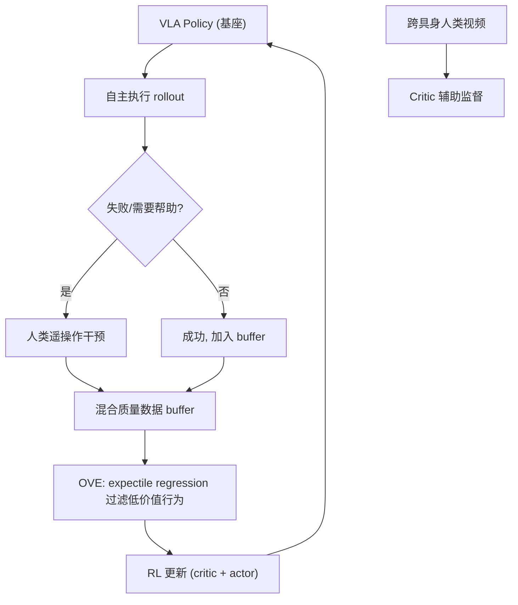

# ROVE: Unlocking Human Interventions for Humanoid Manipulation via Reinforcement Learning

- 本地 PDF：`papers/vla-architecture/ROVE_2606.17011.pdf`
- arXiv：https://arxiv.org/abs/2606.17011
- 年份：2026（6 月）
- 团队：**小鹏机器人** + 复旦大学 + 港中文 + 上海交大
- 阶段：人形 VLA 后训练 —— 从不完美人类干预数据中 RL 迭代改进

## 一句话总结

ROVE 解决人形机器人 VLA 部署后的核心痛点：人类遥操作干预数据本身是不完美的（犹豫、错误、重映射噪声）。提出乐观价值估计（OVE）——用 expectile regression 从混合质量干预数据中抽取高价值行为，配合跨具身人类视频增强，实现 VLA 策略的迭代 RL 改进。

## 核心技术

1. **人在环数据采集流水线** — 针对人形灵巧手遥操作的完整 pipeline：收集部署中的数据 + 人类干预片段 + 适应延迟/犹豫/重映射噪声
2. **乐观价值估计 (Optimistic Value Estimation, OVE)** — 使用 TD bootstrapping + expectile regression 从混合质量轨迹中筛选高价值行为，不对所有数据无差别模仿
3. **跨具身人类视频监督** — Critic 同时从人类执行同类任务的视频中学习，为长尾失败和恢复模式提供监督信号（无需机器人对齐的动作）
4. **迭代改进循环** — rollout → 人类干预 → OVE 过滤 → RL 更新 → 再次 rollout，多轮迭代持续提升

## 底层原理与数学推导

OVE 的核心——expectile regression 替代 standard TD：

$$V^{\text{OVE}}(s) = \arg\min_v \mathbb{E}_{(s,r,s')\sim\mathcal{B}}\left[ \rho_\tau(r + \gamma V(s') - v)^2 \right]$$

其中 $\rho_\tau(\cdot)$ 是 expectile loss（对高价值过估计容忍、对低价值惩罚），$\tau > 0.5$ 使价值估计倾向乐观方向——自动过滤犹豫和错误。

## 物理直觉解释

传统的 interactive imitation learning 假设人类干预 = 最优行为。但在人形灵巧手场景中，人类操作员自己也在"试错"——第一次插充电器插不进去、第二次调整了角度才成功。ROVE 的关键洞察：不要平等对待所有干预数据，用价值函数来挑——插进去的那次比犹豫的那几次更"值钱"。OVE 的 expectile regression 天然做到了这一点。

## 消融实验与分析

| 消融因子 | 结论 |
|---------|------|
| OVE vs standard TD | OVE 在混合质量数据中系统性优于标准 TD |
| 有/无 人类视频辅助 | 人类视频对长尾恢复模式提供关键监督 |
| 迭代轮数 | 多轮迭代持续提升，未观测到饱和 |
| vs HG-DAgger / SFT / standard RL | ROVE 在所有比较中领先 |

## 技术权衡（Trade-off）

| 优势 | 劣势与工程代价 |
|------|----------------|
| 从不完美人类数据中学习，不需要高质量遥操作 | OVE 的 expectile 参数 τ 需要调优 |
| 迭代改进循环无需离线重训整个 VLA | 人在环采集速度受限于操作员带宽 |
| 跨具身人类视频提供低成本额外监督 | 人类视频的 embodiment gap 限制监督精度 |

## 技术价值与演进定位

ROVE 是极少数聚焦 **VLA 后训练迭代** 的工程化论文——填补了"从部署到持续改进"的空白。与 RL Token (PI, 2026) 和 SimpleVLA-RL (2025) 形成 VLA+RL 后训练的三条技术路线——ROVE 的独特贡献是针对**人形灵巧手遥操作干预数据的噪声问题**。

对你个人来说：这是小鹏的论文，你在小鹏工作，直接可以找作者聊。

## 工程细节与实操指南

- **平台**：小鹏人形机器人，灵巧手遥操作，人在环数据采集
- **数据**：自主执行 + 人类干预 + 跨具身人类视频，混合质量
- **OVE 关键参数**：expectile τ > 0.5（倾向乐观过滤）
- **多轮迭代**：rollout→干预→OVE 过滤→RL 更新→rollout

## 精读问题

1. OVE 的 expectile 参数 τ 在不同任务类型中是否需要独立调整？
2. 人类干预和自主 rollouts 的最优比例是什么？
3. 多轮迭代是否存在性能天花板？

## 与其他论文的关系

- **RL Token (PI, 2026)** — online RL 精调 VLA，ROVE 聚焦人在环干预数据的价值过滤
- **SimpleVLA-RL (2025)** — 全模型 offline RL 后训练
- **FlashSAC (RSS 2026 Best Paper)** — RL 底层算法，ROVE 可以使用 FlashSAC 作为 RL backbone
- **Human-as-Humanoid (2026)** — 人类视频 → 机器人动作，ROVE 用人类视频做 critic 辅助监督
