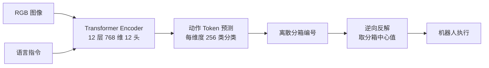

# RT-1: Robotics Transformer

- 本地 PDF：`papers/vla-architecture/RT-1_Robotics_Transformer_2212.06817.pdf`
- arXiv：https://arxiv.org/abs/2212.06817
- 年份：2022
- 阶段：动作 token 化起点

## 一句话总结

RT-1 证明了 Transformer 可以通过离散化动作 token 学习大规模多任务机器人操作，是 VLA 路线的起点。

## 核心技术

1. **均匀离散化动作分箱（Binning）** — 将连续动作空间转化为离散分类问题
2. **高效 Transformer 骨干网络** — 12 层 Encoder，隐藏层维度 768，12 注意力头
3. **多任务跨场景泛化训练范式** — 130k 示教轨迹，1000+ 任务联合训练

## 底层原理与数学推导

RT-1 的核心设计，是解决传统回归方法（如 MSE Loss）处理机器人多模态动作分布时，容易预测出无效「平均动作」的核心缺陷。传统回归对多峰分布的拟合能力极差，而机器人操作中，同一个任务往往存在多种有效的操作方式（如从左侧/右侧抓取杯子），回归方法会输出两种方式的平均动作，导致抓取失败。

RT-1 将连续动作空间转化为离散分类问题，完美适配 Transformer 的自回归训练范式。

**连续动作空间定义**：设机械臂的连续动作空间为 $\mathbf{A} \in \mathbb{R}^d$，其中 $d$ 为动作自由度（通常为 6 维笛卡尔位姿 + 1 维夹爪，共 7 维），每个维度的动作值 $a_i \in [a_i^{\text{min}}, a_i^{\text{max}}]$，由机械臂物理限位决定。

**前向离散化函数（训练阶段）**：将每个维度的连续动作均匀划分为 256 个等距分箱，将连续值映射为 0-255 的离散整数 Token：

$$b_i = \text{floor}\left(\frac{a_i - a_i^{\text{min}}}{a_i^{\text{max}} - a_i^{\text{min}}} \times 255\right), \quad b_i \in \{0, 1, ..., 255\}$$

其中 $\text{floor}(\cdot)$ 为向下取整函数，$b_i$ 为第 $i$ 维动作对应的离散分箱编号。此时，连续控制问题完全转化为 256 维的多分类问题，采用**交叉熵损失（Cross-Entropy Loss）**进行模型优化。

**逆向反解函数（推理执行阶段）**：模型推理输出离散分箱编号后，为减小量化误差，取分箱的中心值作为最终下发给硬件的连续动作值：

$$\hat{a}_i \approx a_i^{\text{min}} + \frac{b_i + 0.5}{255}(a_i^{\text{max}} - a_i^{\text{min}})$$

其中 $\hat{a}_i$ 为反解得到的连续动作值。

## 物理直觉解释

RT-1 的核心逻辑，是**把机器人的连续动作，像文本单词一样切成一个个「动作单词」**，让 Transformer 像读句子一样读机器人的操作轨迹，用处理文本的方式处理机器人动作。

- **为什么用 256 个分箱？** 256 是计算机领域的标准字节长度，既能覆盖机械臂的全行程动作范围，又能控制词表大小，平衡精度与显存占用
- **什么是「阶梯效应」？** 连续的动作被切成 256 个离散的台阶，机器人的动作只能在台阶之间跳跃，无法实现完全平滑的连续运动，这就是离散化带来的固有量化误差

## 工程细节与实操指南

**系统配置与训练超参：**
- 训练数据：Google Everyday Robot 平台，1000+ 日常操作任务，13 万条示教轨迹，数据采样频率 10Hz
- Transformer 架构：12 层 Encoder，隐藏层维度 768，注意力头数 12
- 训练超参：Batch Size = 1024，初始学习率 = 1e-4，余弦学习率衰减，训练步数 30 万步

**落地实操标准步骤：**
1. **数据清洗与归一化**：对各维度动作做 Z-score 归一化，消除平移与旋转的量纲差异，避免分箱分布不均
2. **分箱离散化**：执行上述前向离散化函数，将连续动作映射为离散 Token
3. **温度系数调优（核心）**：在 Softmax 输出阶段引入温度系数 $\tau = 0.7$ 平滑概率分布：

$$p_i = \frac{\exp(z_i / \tau)}{\sum_j \exp(z_j / \tau)}$$

$\tau < 1$ 会放大高概率动作的权重，让模型更有信心地选择确定性行为，避免推理执行时出现无意义的微小抖动，是 RT-1 落地的核心调参点。

## 技术权衡（Trade-off）

| 优势 | 劣势与工程代价 |
|------|---------------|
| 完美适配 Transformer 自回归范式，训练稳定性远超回归方法 | 离散化带来固有量化截断误差，产生「阶梯效应」，无法实现高精度平滑控制 |
| 避免回归方法的「平均动作」问题，适配多模态动作分布 | 分箱数增加会直接导致词表维度爆炸，显存占用呈线性增长，训练成本急剧上升 |
| 首次实现单模型跨 1000+ 任务的泛化，为后续 VLA 模型奠定基础 | 仅能模仿示教轨迹，无任何语义推理与常识理解能力，零样本泛化能力极差 |

## 技术价值与演进定位

RT-1 是 VLA 模型的「开山之作」，首次证明了 Transformer 架构可以规模化处理机器人操作任务。其动作离散化的核心思想，被后续 RT-2 等模型完全继承；同时，它也暴露了**离散 Token 化的精度缺陷**、**纯模仿学习的泛化瓶颈**，为后续五个时代的技术演进指明了核心突破方向：

- RT-2 继承动作 token 化并接入 VLM 词表，引入语义推理
- FAST Tokenizer 优化动作 tokenization 效率
- Diffusion Policy / Octo / Flow Matching 转向连续动作生成，解决精度问题
- OpenVLA 在此基础上做开源端到端 VLA

## 与其他论文的关系

- RT-2 继承并扩展动作 token 化，把动作接入 VLM 词表
- FAST Tokenizer 重新优化动作 tokenization 效率
- Diffusion Policy / Octo 转向连续动作生成，解决离散动作的精度问题

## 精读问题

1. RT-1 的动作分箱具体如何影响控制精度？
2. 为什么离散动作能缓解 MSE 回归的平均动作问题？
3. RT-1 的泛化来自模型架构，还是主要来自数据规模？
4. 温度系数 $\tau = 0.7$ 的理论依据是什么？如何针对不同任务调优？
