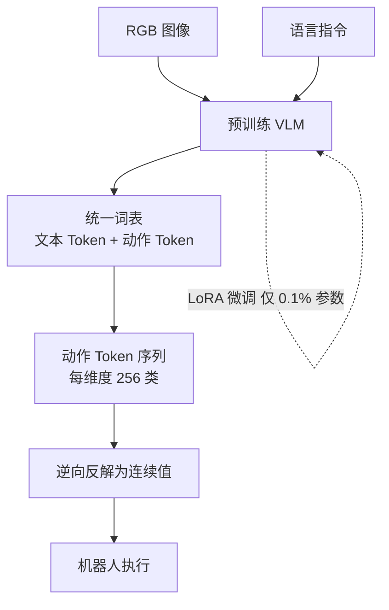

# RT-2: Vision-Language-Action Models

- 本地 PDF：`papers/vla-architecture/RT-2_Vision_Language_Action_Models_2307.15818.pdf`
- arXiv：https://arxiv.org/abs/2307.15818
- 年份：2023
- 阶段：端到端 VLA

## 一句话总结

RT-2 将机器人动作表示为 VLM 词表中的特殊 token，使得视觉语言模型原本为图文数据训练的架构可以无缝迁移学习机器人动作预测，将互联网规模的语义知识注入操作策略。

## 核心技术

1. **动作-语言联合 tokenization** — 将 RT-1 的离散化动作 token 混入 VLM 的文本词表，使 VLM 的 next-token prediction head 能原生预测动作，无需新增任何输出头
2. **联合训练范式（Co-Fine-Tuning）** — 在机器人动作数据和互联网图文数据上联合微调 VLM，既保留视觉语言能力，又学会动作生成，避免灾难性遗忘
3. **语义泛化的涌现** — 通过与物体名称、颜色、形状等语言概念共享同一 token embedding 空间，模型零样本地泛化到未见过物体和指令变体

## 底层原理与数学推导

RT-2 的核心思想是**将机器人动作控制统一到 VLM 的 next-token prediction 框架中**。本质上是将机器人动作视为 VLM 可「翻译」的另一种语言——如同英译中一样，VLM 的任务是从「视觉输入+语言指令」翻译为「动作 token 序列」。

**动作 tokenization（继承 RT-1）**：

与 RT-1 相同的均匀离散化策略。设连续动作空间为 $\mathbf{A} \in \mathbb{R}^d$，$d=7$（6 维位姿 + 1 维夹爪），每个维度 $a_i$ 的取值范围为 $[a_i^{\text{min}}, a_i^{\text{max}}]$。前向离散化：

$$b_i = \text{floor}\left(\frac{a_i - a_i^{\text{min}}}{a_i^{\text{max}} - a_i^{\text{min}}} \times 255\right), \quad b_i \in \{0, 1, ..., 255\}$$

动作 token 序列 $\{b_1, ..., b_d\}$ 与文本 token 序列拼接，形成统一的自回归格式。

**VLM 词表扩展**：

设原始 VLM 词表大小为 $V_{\text{orig}}$（PaLM-E 同源的 256k tokens）。RT-2 在词表中新增 $d \times 256 = 7 \times 256 = 1792$ 个动作 token，形成扩展词表：

$$V_{\text{new}} = V_{\text{orig}} \cup \{\text{act\_1\_0, act\_1\_1, ..., act\_7\_255}\}$$

每个动作 token $\text{act}\_i\_j$ 的 embedding 初始化为对应维度 $i$、分箱 $j$ 的可学习向量，与原有文本 token embedding 在同一空间优化。

**联合训练损失函数**：

RT-2 的损失函数在图文数据与机器人数据之间混合：

$$\mathcal{L} = \lambda_{\text{VL}} \cdot \mathcal{L}_{\text{VL}} + \lambda_{\text{robot}} \cdot \mathcal{L}_{\text{robot}}$$

其中：
- $\mathcal{L}_{\text{VL}} = -\sum_{i} \log p(t_i^{\text{text}} | t_{<i}, I)$ 为图文数据的标准自回归语言建模损失
- $\mathcal{L}_{\text{robot}} = -\sum_{i} \log p(\text{act}_{i} | I_{\text{robot}}, \text{instruction}, \text{act}_{<i})$ 为机器人动作交叉熵损失
- $\lambda_{\text{VL}}$ 和 $\lambda_{\text{robot}}$ 为混合权重，用于平衡两类数据的梯度 magnitude

**关键机制：语义泛化的数学解释**：

RT-2 泛化的关键，在于动作 token 与文本 token 共享 VLM 底层的 Transformer 层和 embedding 空间。当模型在图文预训练阶段学习了"红色杯子"和"蓝色杯子"之间的语义关系（两者的 token 在 embedding 空间中距离相近），联合微调后，模型可以在不看到机器人示教的情况下，将从"红色杯子"学到的操作知识迁移到"蓝色杯子"上。

这就是**互联网知识迁移到机器人操作的数学本质**——embedding 空间中语义相近的概念，在解码层产生相似的动作 token 概率分布：

$$p(\text{act} | I_{\text{蓝色杯子}}, \text{"pick cup"}) \approx p(\text{act} | I_{\text{红色杯子}}, \text{"pick cup"})$$

其根本原因是：联合训练的 Transformer 层在解析"蓝色杯子"的视觉特征时，提取到的 upper-level feature 与"红色杯子"的 feature 在 embedding 空间中距离相近，因此通过了相同的解码路径产生了相似的动作输出。**这不是策略层面的显式逻辑推理，而是 embedding 空间中语义相似性的自然涌现。**

**梯度混合中的优化挑战**：

联合训练时，图文数据保持了原有 VLM 的语言能力（知识保留），而机器人数据驱动动作 token 路径的学习。两者梯度的 balance 是精妙但脆弱的——若 $\lambda_{\text{robot}}$ 过高，模型权重会偏向动作分布导致语言能力退化；若 $\lambda_{\text{VL}}$ 过高，动作 token 路径学习不足。RT-2 在实践中采用动态平衡策略，保持约 1:1 的梯度 magnitude 比例。

## 物理直觉解释

RT-2 的本质，**是把机器人的动作当作一种「外语」来学习**。

- **为什么是同一个模型、同一个损失函数？** VLM 原本做的是：看到图片 "a cat sitting on a chair"，输出文字 "cat, sitting, chair"。RT-2 让它做的是：看到机器人视角图像 + 指令 "pick up the mug"，输出动作 token "move 10cm left, lower 5cm, close gripper"。在模型看来，这两种任务没有本质区别——都是条件概率建模 $p(\text{output} | \text{input})$。唯一的差异是 output 从自然语言换成了动作序列
- **为什么能零样本泛化？** 假设图文数据中模型见过大量"mug"的图片和描述，学到"mug"是一种有把手的圆柱体容器。联合微调后，当指令中出现"mug"时，模型解码层调用的语义特征向量，是预训练阶段就已学好的"mug"概念，因此即使训练数据中从未出现过某个特定 mug 的示教轨迹，模型也能输出合理的操作动作。这就是互联网知识迁移到机器人动作的本质
- **为什么用 256 个分箱？** 完全继承 RT-1：256 是字节长度，平衡精度与词表大小，使每个动作维度的 tokenization 开销仅为 256 个特殊 token

## 工程细节与实操指南

**系统配置与训练超参：**

- 基座模型：PaLM-E（与 RT-2 论文同期，实际使用类似 PaLM-E 的 VLM 结构），约 540B 参数（RT-2-540B）和 12B 参数（RT-2-12B）两种规格
- 动作 tokenization：继承 RT-1 均匀 256 分箱，7 维度动作（6D 笛卡尔位姿 + 1D 夹爪）
- 词表扩展：新增 $7 \times 256 = 1792$ 个特殊 token，embedding 维度与 VLM 主词表对齐
- 联合微调数据：机器人示教数据约 10 万条轨迹 + 互联网图文数据约 10 亿图文对
- 混合权重：$\lambda_{\text{VL}}:\lambda_{\text{robot}} \approx 1:1$（按梯度 magnitude 动态调整）
- Batch Size：1024（12B 模型）/ 512（540B 模型）
- 学习率：1e-4（AdamW），余弦调度，线性 warmup 5000 步
- 训练硬件：TPU v4 pod（1024 芯片），训练周期约数周

**落地实操标准步骤：**

1. **VLM 基座选型**：选择预训练完备的视觉-语言模型，确保 embedding 空间已覆盖丰富的物体、场景、关系概念。PaLM-E 语义空间成熟度是关键
2. **动作 tokenization 集成**：将 RT-1 风格的动作分箱 token 插入 VLM 词表，注意 token embedding 初始化的合理性——建议用小随机数初始化动作 token embedding，而非从文本 embedding 复制
3. **联合训练**：图文 batch 和机器人 batch 交替送入模型，控制梯度 magnitude 在 1:1 范围。实践中可每 2 步机器人数据配 1 步图文数据
4. **推理部署**：输入单张或多张机器人视角图像 + 文本指令，模型输出动作 token 序列（每步 7 个 token）。与 RT-1 相同，逆向反解后下发执行：
   $$\hat{a}_i = a_i^{\text{min}} + \frac{b_i + 0.5}{255}(a_i^{\text{max}} - a_i^{\text{min}})$$
5. **温度系数选择**：推理时 Softmax 温度 $\tau$ 设 0.5-0.7，确保动作输出的确定性。图文推理时 $\tau=1.0$ 保持多样性，两类任务可选用不同温度

**关键工程陷阱：**
- 动作 token 与文本 token 的序列顺序：RT-2 将完整动作序列置于文本输出之后，避免 Transformer 的自回归因果掩码干扰跨维度动作建模。即输入 [图像, 指令]，输出 [文本, act_1, act_2, ..., act_7]，而非将 act token 插入文本之间
- 推理效率瓶颈：540B 模型单次推理数十毫秒至数百毫秒，无法实现 >10Hz 高频控制。实际部署时 RT-2-12B 是更均衡的选择，推理延迟可控制在 50ms 以内

## 消融实验与分析

| 消融因子 | 变化 | 结论 |
|---------|------|------|
| VLM 初始化 | PaLI-X vs PaLM-E vs 随机 | VLM 预训练至关重要，随机初始化大幅下降 |
| 动作 token 方式 | 离散化 vs 连续回归 | 离散 token 与 VLM 词表融合是核心设计 |
| 模型规模 | 5B vs 55B vs 12B | 55B 最佳但边际收益递减 |
| Web 数据 | with vs without VQA 预训练 | Web 语义知识对未见任务泛化关键 |
| Co-finetune | 视觉+语言+动作 vs 仅动作 | Co-finetune 保留语义能力，避免灾难性遗忘 |

**核心结论**：VLM 预训练权重和 Co-finetune 策略是 RT-2 成功的基石；动作接入了 VLM 的词表分布，使 next-token prediction 框架成为通用策略。

## 技术权衡（Trade-off）

| 优势 | 劣势与工程代价 |
|------|---------------|
| 互联网知识直接迁移到操作策略，零样本和语义泛化显著超越纯机器人策略 | 继承 RT-1 离散动作的量化误差，精细操作场景（如精密装配）精度不足 |
| 无需新增模型架构或输出头，纯用 next-token prediction 统一图文和动作建模 | 模型规模极大（540B / 12B），推理计算成本高，难以部署到低算力边缘设备 |
| 联合训练自然地保留了 VLM 的视觉语言能力，一模型多用途 | 联合训练的梯度平衡精妙脆弱，$\lambda_{\text{VL}}$ 与 $\lambda_{\text{robot}}$ 需要精细调谐 |
| 展示机器人策略中语义推理的涌现能力（如识别未见过的物体并执行合理操作） | 语义泛化局限于训练数据中覆盖的语义概念，对完全陌生的物体类别仍会失败 |

## 技术价值与演进定位

RT-2 是 VLA 路线中最关键的论文之一——它回答了 VLM 时代的核心问题：**既然 VLM 已经学会了「看」和「理解」，为什么不直接让它「做」？**

RT-2 的核心贡献不是某个操作性能指标的提升，而是**证明了 VLM 的 next-token prediction 框架本身就是机器人策略的充分框架**。动作本质上是与语言同构的序列预测问题。这一简洁而深刻的认识，使得后续几乎所有 VLA 工作都可以在 RT-2 的范式上展开：

- **PaLM-E -> RT-2 的演进**：PaLM-E 证明 LLM 可理解具身模态，但输出停留在语义文本（需下层控制器二次翻译）。RT-2 将输出从文本改为动作 token，实现了语义到动作的直接（end-to-end）映射，消除了层次化接口的信息损耗
- **RT-2 的动作 tokenization** 被 OpenVLA 完全继承，成为开源 VLA 社区的标准动作表示方案
- **RT-2 的局限**——离散动作精度问题、超大模型推理成本、联合训练平衡——则直接催生了后 RT-2 时代的改进方向：连续动作生成（Diffusion Policy, Flow Matching）、小模型蒸馏（OpenVLA）、更好的动作表示（FAST Tokenizer）

## 与其他论文的关系

- **PaLM-E** 是 RT-2 的直接前身。RT-2 继承了 PaLM-E 的多模态 token 注入和 VLM 语义空间，但将输出从语义文本演进为动作 token，完成了从「感知+规划」到端到端感知-动作的跨越
- **RT-1** 提供了动作离散化的技术和实现基础，RT-2 将 RT-1 的动作 token 从独立分类头搬入 VLM 词表，二者的 tokenization 机制完全兼容
- **OpenVLA** 将 RT-2 的 VLA 范式以 7B 开源模型复现，大幅降低部署门槛，使用的动作 tokenization 和联合训练策略均继承自 RT-2
- **Octo / Diffusion Policy** 是对 RT-2 离散动作路线的替代方案，转向连续动作生成解决精度问题

## 精读问题

1. RT-2 的联合训练中，$\lambda_{\text{VL}}:\lambda_{\text{robot}}$ 的比例是否应在训练过程中动态变化？是否存在最优退火策略 —— 先以图文为主稳定语义空间，再逐步增加动作数据比例？
2. 动作 token 与文本 token 共享 embedding 空间的事实意味着：若某个动作 token 的频率在训练中被放大，是否会「挤出」附近文本 token 的语义信息？类似于词表坍塌问题？
3. RT-2 在物体级别展现出零样本泛化能力（不认识某个杯子但能抓），但在任务级别呢？如果一个任务涉及全新的动词（如从未见过"flip"的操作示教），模型能否泛化？
4. 从信息论角度，VLM 的视觉编码器（ViT）在 RT-2 的推理中扮演什么角色？它提供的信息是否足以支持精确的 3D 空间操作？还是说 RT-2 本质上更依赖 2D 语义特征而非 3D 几何？
