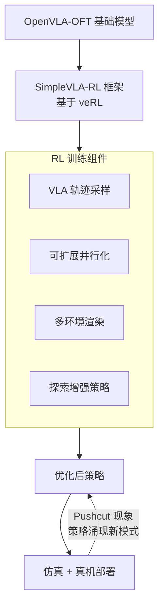

# SimpleVLA-RL: Scaling VLA Training via Reinforcement Learning

- Local PDF: `papers/vla-architecture/SimpleVLA-RL_2509.09674.pdf`
- arXiv: https://arxiv.org/abs/2509.09674
- Project: https://github.com/PRIME-RL/SimpleVLA-RL
- 年份：2025
- 阶段：VLA 的 RL 后训练

## 一句话总结

SimpleVLA-RL 构建了基于 veRL 的强化学习框架用于 VLA 模型后训练，以 OpenVLA-OFT 为基座，在 LIBERO 上达到 SOTA，在 RoboTwin 上超越 π0，并发现了 RL 训练中策略自主涌现新模式的「pushcut」现象。

## 核心技术

1. **veRL 框架适配 VLA** — 将大规模语言模型的强化学习框架 veRL 移植到 VLA 领域，实现高效的策略优化
2. **VLA 专用轨迹采样** — 针对机器人操作任务的长时间序列特性，定制样本效率更高的轨迹采样策略
3. **可扩展并行化** — 支持多仿真环境并行，大幅提升 RL 训练吞吐量
4. **探索增强策略** — 引入特定探索机制，防止策略过早收敛到局部最优
5. **Pushcut 现象发现** — RL 训练过程中策略涌现出训练数据中从未出现过的新行为模式

## 底层原理与数学推导

### 从 SFT 到 RL：VLA 训练范式的跃迁

传统 VLA 训练以监督微调（SFT）为主，其优化目标为最大化示教数据的似然：

$$\theta_{\text{SFT}} = \arg\max_{\theta} \mathbb{E}_{(o, l, a) \sim \mathcal{D}_{\text{demo}}} \left[ \log \pi_{\theta}(a \mid o, l) \right]$$

其中 $\mathcal{D}_{\text{demo}}$ 为人类示教轨迹数据集，$\pi_{\theta}$ 为 VLA 策略网络。SFT 存在两个核心局限：

- **数据瓶颈**：$\mathcal{D}_{\text{demo}}$ 的规模和多样性受限于示教成本，$\log \pi_{\theta}$ 的梯度在覆盖不足的 $(o, l)$ 区域迅速衰减
- **分布偏移**：策略 $\pi_{\theta}$ 在推理时产生的状态分布 $d_{\pi_{\theta}}$ 与训练分布 $\mathcal{D}_{\text{demo}}$ 之间存在 mismatch，导致级联误差

SimpleVLA-RL 的解决思路是引入强化学习的目标函数，让策略直接通过与环境交互的奖励信号进行优化。

### 基于 veRL 的 PPO 目标函数

SimpleVLA-RL 基于 veRL 框架，采用 PPO（Proximal Policy Optimization）算法优化 VLA 策略。标准的 PPO 裁剪目标函数为：

$$L^{\text{CLIP}}(\theta) = \mathbb{E}_{t} \left[ \min\left( r_t(\theta) \hat{A}_t, \text{clip}(r_t(\theta), 1-\epsilon, 1+\epsilon) \hat{A}_t \right) \right]$$

其中 $r_t(\theta) = \frac{\pi_{\theta}(a_t \mid o_t, l)}{\pi_{\theta_{\text{old}}}(a_t \mid o_t, l)}$ 为重要性采样比率，$\hat{A}_t$ 为优势函数估计，$\epsilon$ 为裁剪阈值。

适配 VLA 的关键改造在于轨迹采样方式。设 VLA 模型通过自回归方式预测动作 token 序列 $a_{t:T}$，传统逐时间步采样效率低下。SimpleVLA-RL 的 VLA 专用轨迹采样在时间维度上利用动作序列的因果结构，通过并行化多个 rollout worker 同时收集完整轨迹：

$$S = \{(o^{(i)}_1, l^{(i)}, a^{(i)}_1, r^{(i)}_1, ..., o^{(i)}_T, l^{(i)}, a^{(i)}_T, r^{(i)}_T)\}_{i=1}^{N}$$

其中 $N$ 为并行环境数，$T$ 为轨迹长度。奖励 $r^{(i)}_t$ 由环境提供的任务完成度信号定义。

### Pushcut 现象的数学解读

Pushcut 现象是指在 RL 训练过程中，策略 $\pi_{\theta}$ 产生了在训练数据 $\mathcal{D}_{\text{demo}}$ 中未曾出现的动作模式。从信息论角度看，这是因为 SFT 阶段的模型分布 $p_{\text{SFT}}(a \mid o, l)$ 的支撑集（support）$\text{supp}(p_{\text{SFT}})$ 受限于 $\mathcal{D}_{\text{demo}}$，而 RL 通过奖励信号 $R(a, o)$ 探索了支撑集之外的动作空间：

$$\text{supp}(p_{\text{RL}}) = \text{supp}(p_{\text{SFT}}) \cup \text{supp}(p_{\text{explore}})$$

其中 $\text{supp}(p_{\text{explore}})$ 是在 RL 探索过程中新发现的有效动作区域。形式上，pushcut 对应着策略在探索过程中跨越了 SFT 支撑集的边界：

$$\exists (o, l): \pi_{\theta_{\text{RL}}}(a \mid o, l) > 0 \quad \text{但} \quad \pi_{\theta_{\text{SFT}}}(a \mid o, l) \approx 0$$

这表明 RL 不仅仅是提升了 SFT 已有技能的精度，更重要的是**催生了真正的泛化**——策略学会了训练数据中不存在的操作策略。这与 LLM 中通过 RL（如 RLHF）涌现推理能力的现象在数学上具有相似性。

### 探索增强策略的数学形式

设 VLA 策略的动作分布为 $\pi_{\theta}(a \mid o, l)$，探索增强策略引入一个探索噪声项 $\xi$ 和一个熵正则化项：

$$\pi_{\theta}^{\text{explore}}(a \mid o, l) = (1 - \lambda) \pi_{\theta}(a \mid o, l) + \lambda \cdot \mathcal{U}(a)$$

其中 $\mathcal{U}(a)$ 为动作空间的均匀分布或高斯噪声分布，$\lambda \in [0,1]$ 为探索率。同时，在 PPO 目标中添加熵奖励以维持策略多样性：

$$L^{\text{PPO+Entropy}}(\theta) = L^{\text{CLIP}}(\theta) + \beta \cdot \mathbb{E}_{a \sim \pi_{\theta}} \left[ -\log \pi_{\theta}(a \mid o, l) \right]$$

式中 $\beta$ 为熵系数。熵正则化防止策略过早 collapse 到确定性行为，为 pushcut 现象的发生创造了条件。

## 物理直觉解释

SimpleVLA-RL 相当于**给 VLA 模型安排了一个「实战训练营」**，让它从书本知识（示教数据）走向真实战场（RL 交互）。

- **SFT 像教科书学习**：学生看了大量例题（示教轨迹），学会解题步骤，但碰到没见过的题型就束手无策
- **RL 像模拟考试+纠错**：让学生自己解题（与环境互动），做对了加分（正奖励），做错了扣分（负奖励），逐步学会应对从未见过的题型
- **Pushcut 现象**：就像一个学生通过大量练习，发现了一种老师从没教过的解题方法——这是 RL 最激动人心的特点，不仅是提升熟练度，更是在创造新知识
- **为什么需要探索增强**：如果没有探索，学生只会按课本上的方法解题，永远不会发现更优的解法。随机探索（均匀分布 $\mathcal{U}(a)$）就像允许学生试错，有时乱试能试出更好的方法
- **LIBERO SOTA 和 RoboTwin 超越 π0 的现实意义**：SFT 已经很难进一步提升模型性能了（天花板效应），RL 打开了新的提升空间——就像遇到瓶颈后换了一种训练方法

## 工程细节与实操指南

### 系统配置与训练超参

**基础模型：**
- 基座：OpenVLA-OFT（OpenVLA 的优化微调版本）
- 微调目标：VLA 策略的动作预测能力

**RL 框架配置（基于 veRL）：**
- RL 算法：PPO with clipped objective
- 并行环境数 $N$：推荐 16-64（取决于 GPU 显存）
- 轨迹长度 $T$：50-200 步（取决于任务复杂度）
- 探索率 $\lambda$：初始 0.3，随训练衰减到 0.05
- 熵系数 $\beta$：0.01-0.05
- PPO 裁剪 $\epsilon$：0.2

**实验环境：**
- LIBERO 基准（LIBERO-Long、LIBERO-90、LIBERO-10）
- RoboTwin 1.0 & 2.0
- 真实世界机器人场景

### 落地实操标准步骤

1. **准备基座模型**：先收集人类示教数据，用 SFT 训练或获取预训练的 VLA 模型（如 OpenVLA-OFT），确保基座有一定的基础操作能力
2. **搭建并行环境**：配置多环境渲染，使用 veRL 框架管理并行 rollout worker。推荐 16 个并行环境起步
3. **RL 训练配置**：
   - 设置奖励函数——任务完成+1，失败-1，中间步骤可设置辅助奖励加快收敛
   - 配置轨迹采样策略——VLA 专用轨迹采样可大幅提升样本效率
   - 设置探索增强参数——初期高探索率利于探索，后期降低保证稳定性
4. **监控 pushcut 现象**：定期对比策略输出与 SFT 数据的分布差异，发现新模式时记录下来——这是评估 RL 是否真正带来泛化的关键指标
5. **仿真到真机迁移**：RL 在仿真中训练完成后，需要进行 sim-to-real 迁移。建议在真机上再做短暂 RL 微调（10-20 轮）

### 关键参数调优

- **探索率 $\lambda$ 衰减策略**：线性衰减 $\lambda = \lambda_0 (1 - t/T_{\text{total}})$，$T_{\text{total}}$ 为总训练步数
- **熵系数 $\beta$**：过大会导致动作过于随机、收敛慢；过小会导致过早确定性收敛。推荐从 0.03 开始调优
- **并行环境数 $N$**：与环境交互速度和 GPU 推理速度匹配，避免 rollout worker 成为瓶颈
- **奖励设计**：稀疏奖励（仅任务完成时 +1）最简单但学习慢；密集辅助奖励加速收敛但需精心设计

## 技术权衡（Trade-off）

| 优势 | 劣势与工程代价 |
|------|---------------|
| RL 后训练突破 SFT 的性能天花板，LIBERO SOTA | RL 训练需要仿真环境，真机 RL 存在安全和成本风险 |
| Pushcut 现象证明 RL 带来真正的泛化而非过拟合 | 探索增强策略可能产生不安全动作，需要环境安全约束 |
| 基于 veRL 框架，RL 组件可复用 | 多环境并行计算资源需求高（16+ GPU） |
| RoboTwin 超越 π0 证明了 RL 对 VLA 的有效性 | 奖励函数设计依赖任务，需要大量工程调优 |
| SFT + RL 两阶段训练范式清晰 | 样本效率仍待提升——RL 需要百万级交互步数 |

## 技术价值与演进定位

SimpleVLA-RL 是**将 LLM 领域的 RL 后训练成功迁移到 VLA 领域的开创性工作**。它的意义超越了具体的性能提升：

- 类比 RLHF/RLAIF 对 LLM reasoning 能力的突破，SimpleVLA-RL 证明了 RL 同样能突破 VLA 的操控瓶颈
- Pushcut 现象的发现为 VLA 领域提供了全新的研究视角——RL 不仅是 finetune 工具，更是 emergent behavior 的催化剂
- 成功将 veRL（专为 LLM 设计的大规模 RL 框架）适配到 VLA 领域，减少重复造轮子
- 为「SFT 预训练 → RL 后训练」这一在 LLM 领域被验证有效的范式在机器人领域的落地铺平了道路

演进定位：
- 如果说 SFT 让 VLA 学会「模仿」，RL 让 VLA 学会「思考和创新」
- GR00T N1 等模型也提到了后训练（post-training）阶段，SimpleVLA-RL 提供了更系统的 RL 方案
- 与传统的 Robot RL（如 DrQ-v2、Dreamer）不同，SimpleVLA-RL 是针对 VLA 架构的 RL 框架，利用了 VLA 的预训练知识

## 与其他论文的关系

- **OpenVLA-OFT**：作为基座模型，SimpleVLA-RL 在 OFT 优化的 OpenVLA 上做 RL 后训练
- **π0**：在 RoboTwin 上超越 π0，说明 RL 后训练可让小模型（OpenVLA-7B）超越更大的模型（π0）
- **GR00T N1**：同样有 post-training stage，但 GR00T 更侧重于架构设计，SimpleVLA-RL 专注于 RL 框架本身
- **veRL**：SimpleVLA-RL 构建于 veRL 之上，是 veRL 在机器人领域的首个大规模应用
- **DrQ-v2 / Dreamer**：传统 Robot RL 方法，SimpleVLA-RL 与之的区别在于利用预训练 VLA 而非从零 RL 训练

## 精读问题

1. Pushcut 现象的具体检测方法是什么？如何区分「真正的新策略」和「随机噪声导致的偶然成功」？
2. VLA 专用轨迹采样与标准 RL 轨迹采样的具体差异在哪里？效率提升了多少？
3. 在真机 RL 训练中，SimpleVLA-RL 如何解决安全约束问题？
4. LIBERO SOTA 的具体数值是多少？与 SFT baseline 的差距有多大？
5. 探索增强策略中 $\lambda$ 的衰减策略是否经过系统实验优化？不同任务是否有不同最优衰减曲线？
6. SimpleVLA-RL 在仿真中的奖励函数设计是怎样的？稀疏 vs. 密集奖励对最终性能的影响如何？
7. veRL 框架的哪些组件是 VLA 特化的？哪些与 LLM 场景共用？
