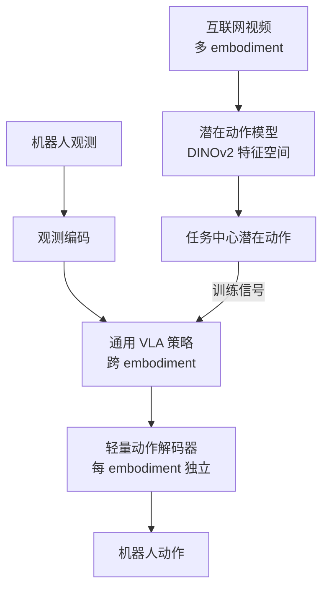

# UniVLA: Learning to Act Anywhere with Task-centric Latent Actions

- Local PDF: `/Users/luogu/physical_intelligence/papers/vla-architecture/UniVLA-ODL_2505.06111.pdf`
- arXiv: https://arxiv.org/abs/2505.06111
- Source: https://arxiv.org/abs/2505.06111
- Project: https://github.com/OpenDriveLab/UniVLA
- Authors: OpenDriveLab (RSS 2025 accepted)
- Published: 2025
- Category: latent action / cross-embodiment
- Priority: high

## 一句话总结

UniVLA 在 DINOv2 特征空间中学习与具体机器人无关的任务中心潜在动作表示，通过双阶段 VQ-VAE 分离任务相关/无关动态，仅用 OpenVLA 1/20 预训练算力（960 vs 21,500 A100-hours）和 1/10 下游数据即在 LIBERO 基准上达到 95.2% 成功率（超越 OpenVLA 的 76.5%），并实现跨 embodiment 部署（机械臂 + 导航 + 人类视频训练）。

## 核心技术

1. **双阶段潜在动作 VQ-VAE** — 第一阶段学习任务无关潜在动作（编码场景中非语义的环境变化如光照、视角），第二阶段冻结第一阶段的 codebook 后学习任务中心潜在动作（编码物体操作等语义变化），实现两种动态的自然分离

2. **DINOv2 特征空间自监督重建** — 以 DINOv2 的 patch-level 空间特征替代像素空间作为重建目标，避免像素级噪声（纹理、光照），利用 DINOv2 的物体中心化和空间感知特性提供语义丰富的学习信号

3. **语言引导动态过滤** — 通过 T5 文本编码器将语言指令编码为 conditioning signal，受限于 codebook 容量约束，迫使模型自动将高层任务语义排除出第一阶段的任务无关潜在动作，实现自动解耦

4. **跨 embodiment 轻量解码** — 学习任务中心潜在动作后，对每台机器人只需训练一个 10.8M 参数的轻量动作解码器（+ LoRA 微调，共约 123M 可训练参数），即可将通用潜在动作映射到具体机器人的动作空间

## 底层原理与数学推导

### 问题定义

给定当前视觉观测 $O_t$ 和未来观测 $O_{t+k}$，UniVLA 的目标是学习一个与具体 embodiment 无关的潜在动作表示 $a_z$，使得在所有机器人平台上：

$$O_{t+k} \approx \mathcal{F}(O_t, a_z, \ell)$$

其中 $\ell$ 为语言指令，$\mathcal{F}$ 为基于 DINOv2 特征空间重建的解码器。

### Stage 1：任务无关潜在动作学习

第一阶段的目标是建模环境共性动态——即与任务无关但在不同观测间发生的变化（如光照变化、相机视角变化），这些动态不携带任务语义。

**编码过程：**

$$\hat{a}_{\text{TI}} = \mathcal{I}([O_t; O_{t+k}; a_{\text{TI}}; \ell])$$

$$\tilde{a}_{\text{TI}} = \text{VQ}(\hat{a}_{\text{TI}})$$

其中 $\mathcal{I}$ 是一个带因果时间掩码的时空 Transformer（编码器），$a_{\text{TI}}$ 是可学习的任务无关动作 token，$\text{VQ}(\cdot)$ 是 VQ-VAE 矢量量化操作，将连续编码映射到最近的 codebook 条目。

**解码重建（在 DINOv2 特征空间）：**

$$\hat{O}_{t+k} = \mathcal{F}([O_t; \tilde{a}_{\text{TI}}; \ell])$$

**自监督重建损失：**

$$\mathcal{L}_{\text{TI}} = \|\hat{O}_{t+k} - O_{t+k}\|^2$$

其中 $\hat{O}_{t+k}$ 和 $O_{t+k}$ 均为 DINOv2 的特征嵌入，而非像素。该损失迫使 $\tilde{a}_{\text{TI}}$ 编码足以从 $O_t$ 重建 $O_{t+k}$ 的所有变化信息。

**关键设计意图**：由于 codebook 容量有限，加入语言指令 $\ell$ 作为 conditioning signal 后，第一阶段被迫将高层任务语义信息排除在 $a_{\text{TI}}$ 之外——因为语言已经提供了任务相关的完整信息，codebook 的最优策略是编码其余的环境动态。这实现了任务无关动态的自然分离。

### Stage 2：任务中心潜在动作学习

第二阶段冻结第一阶段的所有参数（包括 codebook VQ），新增一个任务中心 codebook VQ$_{\text{TC}}$，建模与任务执行直接相关的语义动态（如物体被抓起、移动到目标位置）。

**编码过程：**

$$\{\hat{a}_{\text{TI}}, \hat{a}_{\text{TC}}\} = \mathcal{I}([O_t; O_{t+k}; a_{\text{TI}}; a_{\text{TC}}])$$

$$\tilde{a}_{\text{TI}} = \text{VQ}(\hat{a}_{\text{TI}}), \quad \tilde{a}_{\text{TC}} = \text{VQ}_{\text{TC}}(\hat{a}_{\text{TC}})$$

**解码重建：**

$$\hat{O}_{t+k} = \mathcal{F}([O_t; \tilde{a}_{\text{TI}}; \tilde{a}_{\text{TC}}])$$

**任务中心重建损失：**

$$\mathcal{L}_{\text{TC}} = \|\hat{O}_{t+k} - O_{t+k}\|^2$$

Stage 2 优化的是新增的 VQ$_{\text{TC}}$ codebook 和 Transformer 编码器中与任务中心分支相关的参数。最终的潜在动作表示为 $a_z = \tilde{a}_{\text{TC}}$，共 $N=4$ 个离散 token。

### 策略预训练损失

在潜在动作模型训练完成后，基于 Prismatic-7B VLM 骨干网络 $\pi_{\phi}$ 进行策略预训练，学习从当前观测和语言指令预测下一潜在动作的自回归任务：

$$\mathcal{L}_{\text{pretrain}} = \mathbb{E}_{o_t, \ell, a_{z, < i}} \left[ -\sum_{i=1}^{N} \log \pi_{\phi}(\hat{a}_{z,i} = a_{z,i} | o_t, \ell, a_{z,<i}) \right]$$

其中 $N=4$ 为动作 token 数，$a_{z,<i}$ 为前 $i-1$ 个已预测 token 的历史信息（类似 Chain-of-Thought 的逐步预测）。

### 动作解码器注意力机制

从 VLM 的最后一层输出的视觉嵌入 $E_v$ 和潜在动作嵌入 $E_a$ 出发，动作解码器通过多头注意力将视觉信息聚合到潜在动作中：

**视觉嵌入处理：**

$$E'_v = \mathcal{A}(Q=q_v, K=V=E_v)$$

其中 $q_v$ 为可学习的查询向量。

**潜在动作嵌入处理（将视觉信息注入动作）：**

$$E'_a = \mathcal{A}(Q=q_a + E'_v, K=V=E_a)$$

其中 $q_a$ 为可学习的动作查询向量。$E'_a$ 通过线性投影映射到目标机器人的具体动作空间。

### 下游微调目标

在具体机器人平台上，端到端联合优化两个目标：

1. **潜在动作预测损失**（自回归负对数似然，同上 $\mathcal{L}_{\text{pretrain}}$）
2. **底层动作 L1 回归损失**：$\mathcal{L}_{\text{low-level}} = |a_{\text{gt}} - a_{\text{pred}}|$

总微调损失为两者之和，同时在 VLM 骨干中使用 LoRA 进行参数高效微调。

### 历史动作注入

将上一步的 4 个潜在动作 token 追加到语言指令中作为上下文提示，灵感来源于 Chain-of-Thought：

$$\text{prompt} = [\ell; a_z^{\text{prev}}]$$

该操作在导航任务（R2R）中将 Oracle Success Rate 从 30.6% 提升到 47.1%（+16.5%），在 LIBERO-Long 中从 88.1% 提升到 92.0%。

## 物理直觉解释

UniVLA 的核心直觉是 **「所有机器人看到的世界其实是一样的，只是动手方式不一样」**。

- **DINOv2 特征空间**：就是机器人的「通用世界语言」。不管哪个机械臂看到一只杯子，DINOv2 的特征都能表达「这是一个圆柱形容器，有把手，能抓取」。在像素空间训练会让模型关注纹理和光照等噪音，在 DINO 特征空间训练则直接聚焦在物体的语义和空间结构上。
- **双阶段潜在动作**：就像区分「风在吹（无关动态）」和「杯子被拿起（相关动态）」。第一阶段学的是「风吹树叶动、光线变暗」这类不改变任务状态的动态；第二阶段在知道什么是环境噪音后，专门学习「物体被移动、夹爪在闭合」这类真正的操作动态。这种分离使潜在动作表示与具体机器人解耦——不同机器人看到的「拿起杯子」在潜在空间中是同一个动作。
- **跨 embodiment 部署**：就像人类学习开车——只要学会了「方向盘左转 = 车左转」这个抽象概念，换一辆不同方向盘手感（不同解码器）的车也能马上适应。UniVLA 的通用策略就是那个「抽象驾驶能力」，而 10.8M 参数的动作解码器就是「适应这台特定车的适配器」。
- **算力效率的根源**：因为潜在动作在语义空间而非动作空间学习，UniVLA 可以用大量的无标注视频（互联网视频、Ego4D 人类视频）进行预训练。这些视频没有机器人动作标注，但包含了丰富的「下一个状态」信息，可以天然地用来训练 VQ-VAE 重建模型。相比之下，OpenVLA 需要 21,500 A100-hours 来学习动作空间到语言空间的映射，因为每个标注过的机器人轨迹都极其昂贵。

## 工程细节与实操指南

### 系统配置与资源

- **预训练计算**：960 A100-hours（对比 OpenVLA 的 21,500 A100-hours，约 1/22）
- **下游微调数据**：LIBERO 各套件 50 条/10 任务，总计 500 条示教（OpenVLA 使用 5,000 条，为 1/10）
- **推理硬件**：NVIDIA RTX 4090 即可实现 10Hz 闭环推理（单步 0.18s，chunk size 4 时 0.68s）
- **VLM 骨干**：Prismatic-7B（SigLip + DINOv2 双视觉编码器融合 → LLaMA-2 7B LLM）

### 训练流程

**Stage 1（任务无关 VQ-VAE）**：
- 输入：$O_t$（当前帧）、$O_{t+k}$（未来帧，k ≈ 1 秒间隔）、语言 $\ell$
- 编码器：时空 Transformer + 因果时间掩码
- 解码器：仅空间 Transformer（不含历史帧）
- 目标：在 DINOv2 特征空间重建 $\hat{O}_{t+k}$
- Codebook 容量：$|C|$（第一阶段单独训练）

**Stage 2（任务中心 VQ-VAE）**：
- 冻结 Stage 1 所有参数 + codebook
- 新增 codebook VQ$_{\text{TC}}$（第二阶段优化）
- 全模型唯一输出 $a_z = \tilde{a}_{\text{TC}}$（4 tokens）

**策略预训练（潜在动作自回归预测）**：
- Prismatic-7B VLM 从头训练，无 LoRA
- 预训练数据：Open X-Embodiment 子集 + GNM 导航数据集 + Ego4D 人类视频
- 变体：UniVLA-Bridge（仅 Bridge-V2）、UniVLA-Human（仅 Ego4D）、UniVLA-Full（全部数据）

**下游微调**：
- LoRA 微调 VLM 骨干
- 训练轻量动作解码器（10.8M 参数）+ LoRA ≈ 123M 可训练参数
- 端到端联合优化：潜在动作预测 + 底层动作 L1 loss
- 动作 chunk size 可自定义，实机部署使用 chunk size = 12

### 动作解码器详细设计

| 组件 | 参数 |
|------|------|
| 视觉嵌入聚合 | 多头注意力池化，可学习查询 $q_v$ |
| 动作嵌入注入 | 注意力 $Q=q_a+E'_v, K=V=E_a$ |
| 潜在动作 token 数 | $N=4$ |
| 投影层 | 线性投影 → 目标机器人动作空间 |
| 总解码器参数量 | 10.8M |

### 关键调优点

1. **历史动作注入**：每次预测时，将上一步的 4 个潜在动作 token 拼接到 prompt 中，实现时间连贯性
2. **Codebook 容量选择**：容量需要足够大以编码任务相关动态，但又要小到迫使与语言协作完成任务无关动态的过滤（论文未公开具体容量值，但这是决定解耦质量的核心超参）
3. **k 间隔选择**：$O_t \to O_{t+k}$ 的帧间间隔决定潜在动作的时间分辨率，论文使用 ≈1 秒间隔（即 10Hz 下的 10 帧）

## 消融实验与分析

| 消融因子 | 变化 | 结论 |
|---------|------|------|
| 双阶段 VQ-VAE | with vs without (单阶段) | 任务相关/无关动态分离贡献最大 |
| 预训练数据量 | full vs 1/10 vs 1/100 | 仅用 1/20 OpenVLA 预训练算力即超越 |
| DINOv2 vs 其他 encoder | 不同 visual encoder | DINOv2 特征空间对动作表示最优 |

**核心结论**：双阶段 VQ-VAE（分离任务相关/无关动态）是节省预训练算力的核心。

## 技术权衡（Trade-off）

| 优势 | 劣势与工程代价 |
|------|---------------|
| 预训练算力仅 960 A100-hours（1/22 of OpenVLA），算力门槛极低 | 双阶段 VQ-VAE 训练流程复杂，需要两次独立的训练阶段，且 Stage 1 质量直接影响 Stage 2 |
| 跨 embodiment 统一策略，人类视频也可用于训练提升性能 | 潜在动作到真机动作的二次解码会引入误差累积，LIBERO-Long 92.0% 代表的上限受限 |
| LIBERO 平均 95.2%（+18.5% over OpenVLA），LONG 92.0%（+38.3% over OpenVLA） | DINOv2 特征空间在动态场景或非结构化环境中表征能力有上限 |
| 数据效率极高：10% LIBERO 数据即超越 OpenVLA 100% 数据 | 开放世界泛化（Lightning 66.7%, Visual Distractor 53.3%）仍有 30%+ 失效空间 |
| 导航 R2R 47.1%（+29.6% over OpenVLA 17.5%），同时覆盖操作和导航 | 潜在动作解码器需要为每台新机器人单独训练（虽然轻量，但仍需少量示教数据） |
| 异构数据持续提升：添加人类视频 Ego4D 后性能继续增长 | 历史动作作为 Chain-of-Thought 式的 prompt 拼接，在长程任务中的上下文窗口扩展问题未讨论 |
| 10Hz 实时推理（RTX 4090），部署成本低 | 仅验证了桌面级任务，复杂灵巧手/全身移动操作未覆盖 |

## 技术价值与演进定位

UniVLA 在 VLA 路线上的核心突破是 **「如何用无动作标注的视频预训练机器人策略」**。此前 VLA 模型的训练严重受限于 action-annotated 机器人数据的稀缺性：

- **RT-2 / OpenVLA 路线**：将机器人动作 token 映射到 VLM 词表，依赖大规模带标签的机器人示教数据进行训练，每个新的动作空间都需要重新微调
- **扩散策略 / Flow Matching 路线**：从高维观测直接回归连续动作，也需要同分布的机器人示教数据
- **UniVLA 的突破**：在 DINOv2 特征空间学习潜在动作，动作表示本身与具体机器人解耦。机器人数据只是最终阶段「适配器」的训练所需，而大规模预训练可以完全使用无标注视频

UniVLA 的「潜在动作」思路在课程体系中与以下工作形成互补和对照：
- **JEPA（Joint-Embedding Predictive Architecture）** 的具身化实践——在特征空间预测，而非像素空间
- **VQ-Bot** 等早期潜在动作工作的系统性扩展——引入语言引导的双阶段分离是关键增量
- **GR00T N1** 的数据金字塔策略——GR00T 用不同层次的数据训练不同模块，UniVLA 用不同类型的数据训练同一模块的不同抽象层次

## 与其他论文的关系

- **OpenVLA**：直接对比基线。UniVLA 以 1/20 预训练算力和 1/10 下游数据全面超越（LIBERO 95.2% vs 76.5%），核心差异在于潜在动作空间 vs 直接动作 token 化的表示效率
- **RT-2**：动作 token 化路线的代表。RT-2 在 VLM 词表中新增动作 token，UniVLA 则在潜在特征空间中学习动作，两种表示层级的对比——UniVLA 更抽象、更跨 embodiment
- **LAPA**：另一个潜在动作方法。UniVLA 在 LAPA 基础上增加了语言引导的任务中心过滤（双阶段分离），LIBERO 平均从 65.7% 提升到 95.2%
- **GR00T N1**：互补关系。GR00T N1 的数据金字塔策略将不同来源的数据分配给不同网络模块，UniVLA 则将所有异构数据压缩到同一潜在动作空间
- **JEPA 系列（I-JEPA, V-JEPA）**：UniVLA 的双阶段潜在动作模型本质上是在 DINOv2 特征空间中做 JEPA 风格的预测，是其思想的具身化应用
- **Octo / Diffusion Policy**：UniVLA 的最终动作解码器也是连续动作生成，但与 Diffusion Policy 不同——UniVLA 先生成潜在 token 再解码，Diffusion Policy 直接从噪声迭代去噪到动作

## 精读问题

1. 双阶段 VQ-VAE 的 codebook 容量具体是多少？容量如何影响任务相关/无关动态的分离边界？
2. 帧间间隔 $k$ 的选择依据是什么？更小的 $k$ 是否有助于建模更精细的操作但放大无关动态的影响？
3. 动作解码器中的 $q_v$ 和 $q_a$ 可学习查询的训练是否稳定？是否对随机种子敏感？
4. DINOv2 特征空间在操作和导航任务上的表现差异（LIBERO 95.2% vs R2R 47.1%）——是导航任务天然更难，还是 DINOv2 在导航场景中特征质量下降？
5. 第一阶段的任务无关潜在动作是否真的完全「无关」？在复杂场景中，环境动态和操作动态是否存在纠缠导致信息泄漏？
6. LoRA 微调的总参数量 123M（VLM 7B 的 1.7%），但动作解码器只有 10.8M——为什么解码器需要比 LoRA 更多的参数？是否可以更精简？
7. 历史动作的 Chain-of-Thought prompt 拼接在长程任务中如何处理上下文窗口边界问题？超过 2048 tokens 后的性能如何？
