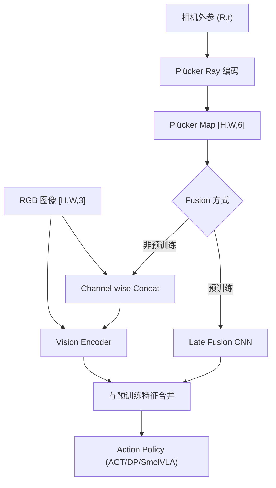

# Do You Know Where Your Camera Is? View-Invariant Policy Learning with Camera Conditioning

- 本地 PDF：`papers/vla-architecture/ViewInvariant_2510.02268.pdf`
- arXiv：https://arxiv.org/abs/2510.02268
- 项目页：https://ripl.github.io/know_your_camera/
- 代码：https://github.com/ripl/CamPoseOpensource
- 年份：2025 (ICRA 2026 Best Paper on Robot Learning)
- 团队：TTIC, Waymo, JHU, TRI (Anand Bhattad 等)
- 阶段：视角鲁棒策略 —— 相机移动后策略不失效

## 一句话总结

当相机被移动或重新定位后，现有模仿学习策略大概率失效。这篇论文提出将策略条件化到相机外参（用 Plücker ray 编码每个像素的 3D 射线），使策略天然对相机视角鲁棒，在 6 个新操作任务上系统性超越 SOTA。ICRA 2026 Best Paper on Robot Learning。

## 核心技术

1. **Plücker Ray 编码** — 每个像素不再只是 RGB，而是 (R, G, B, d_x, d_y, d_z, m_x, m_y, m_z)——6D 射线表示（方向+动量），显式编码该像素在 3D 空间中的位置
2. **Camera Conditioning** — 策略以 Plücker map 为附加输入：(1) 非预训练 encoder：channel-wise concat 到 RGB 图像；(2) 预训练 encoder：late fusion 小 CNN
3. **联合随机裁剪** — 图像和 Plücker map 联合随机裁剪，去除背景姿态 shortcut
4. **6 个新 benchmark 任务** — RoboSuite + ManiSkill，配对固定视角/随机视角变体

## 底层原理与数学推导

## 物理直觉解释

为什么相机一动策略就崩？因为现有策略学的是"在像素 (200, 300) 的位置做动作"——换了个相机角度，(200, 300) 的像素对应的是完全不同的 3D 位置。Plücker ray 给每个像素加了一个"3D 坐标标签"——告诉策略"这个像素对应的是物理世界中从相机原点出发、沿着这个方向射出的射线"。策略学会了用 3D 信息做决策，而不是记忆像素位置。

## 消融实验与分析

| 消融因子 | 结论 |
|---------|------|
| Plücker ray vs 无 camera conditioning | Camera conditioning 在相机移动后一致提升性能 |
| 视觉外观随机化 vs 固定背景 | 随机化外观消除背景 shortcut，使 camera conditioning 的效果更明显 |
| 联合随机裁剪 vs 无裁剪 | 联合裁剪带来显著增益 |
| 适用 ACT/DP/SmolVLA | 所有架构均受益 |

## 工程细节与实操指南

- **Plücker Ray 计算**：给定相机内参 K 和外参 (R,t)，每像素 (u,v) 的 Plücker ray = (direction, moment)，direction = R @ K^{-1} @ [u,v,1]^T
- **输入格式**：RGB [H,W,3] + Plücker map [H,W,6] → channel-wise concat [H,W,9]
- **预训练 encoder 适配**：late fusion——小 CNN 处理 Plücker map → 特征与预训练 encoder 的视觉特征合并
- **联合随机裁剪**：图像和 Plücker map 做相同的 spatial crop，防止背景泄露相机位姿信息
- **硬件**：UR5 机械臂 + 3 个可移动第三视角相机
- **任务**：Pick Place, Plate Insertion, Hang Mug 等 6 个新 benchmark

## 精读问题

1. Plücker ray 编码对相机内参变化的鲁棒性？不同焦距/畸变参数是否需要重新编码？
2. Late fusion 对预训练 encoder 的特征是否会产生分布偏移？
3. 动态相机（手持或机械臂上安装）的场景是否适用？

## 技术权衡（Trade-off）

| 优势 | 劣势与工程代价 |
|------|----------------|
| 即插即用，不修改策略架构 | 需要知道相机外参（标定） |
| Plücker ray 是通用表示，适配任何策略 | 6 通道额外输入增加了 encoder 计算量 |
| 6 个新 benchmark 填补了评估空白 | 仅限于静态场景的相机移动，未涉及运动中相机 |

## 技术价值与演进定位

这篇工作的意义不仅是"解决了相机移动后策略失效"——它论证了**3D 视觉对机器人学的关键价值**（与 FP3 异曲同工）。Plücker ray 提供了一个轻量级的"2D 图像 + 3D 信息"融合方案，比 FP3 的全 3D 点云更轻量，比纯 2D 图像更鲁棒。

## 与其他论文的关系

- **FP3 (ICRA 2026 Finalist)** — 全 3D 点云方案，camera conditioning 是更轻量的替代
- **3D Foresight** — 3D 辅助任务增强策略，camera conditioning 从输入层面解决视角问题
- **ACT / Diffusion Policy / SmolVLA** — 被增强的 baseline 策略架构
