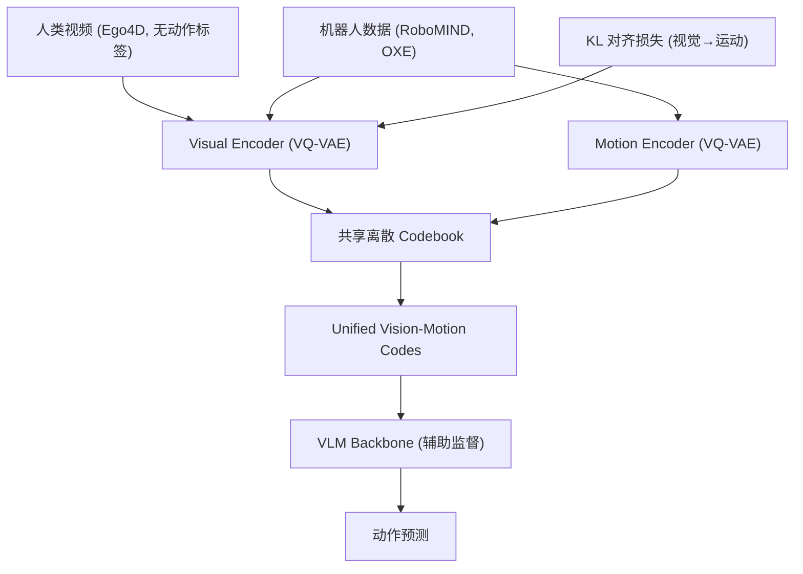

# XR-1: Unified Vision-Motion Codes for General-Purpose VLA Models

- 本地 PDF：`papers/vla-architecture/XR-1_2511.02776.pdf`
- arXiv：https://arxiv.org/abs/2511.02776
- 代码：https://github.com/Open-X-Humanoid/XR-1
- 权重：https://huggingface.co/collections/X-Humanoid/xr-1
- 年份：2026 (ICML 2026 Oral, top 0.7%)
- 团队：北京人形机器人创新中心 + 北航 + 北大
- 阶段：开源 VLA 新标杆 —— UVMC 统一视动编码 + 三阶段训练 + 6 具身 120+ 任务

## 一句话总结

XR-1 提出 Unified Vision-Motion Codes (UVMC)：用双分支 VQ-VAE 将视觉动态和机器人运动联合编码到共享离散 latent 空间。三阶段训练（自监督 UVMC → VLA 预训练 → 任务适配），14,000+ 真实轨迹、6 种具身形态、120+ 任务。平均成功率 70.3%（π0.5 仅 49.8%），新任务 20 次演示即可适配，全套开源。ICML 2026 Oral。

## 核心技术

1. **UVMC (Unified Vision-Motion Codes)** — 双分支 VQ-VAE：视觉分支编码场景动态，运动分支编码机器人动作，共享离散 codebook。KL 对齐损失强制视觉编码向运动编码靠拢，使人类视频（无动作标注）也能参与训练
2. **三阶段训练** — Stage 1: 自监督 UVMC 学习（Ego4D + RoboMIND + OXE）→ Stage 2: UVMC 引导的 VLA 预训练（UVMC tokens 作为辅助监督注入 VLM backbone）→ Stage 3: 任务特定 post-training（20 demos 足矣）
3. **跨具身 codebook** — UVMC 的离散 codebook 天然具身无关，同一 code 可以表示"抓取"这一动作无论是在 UR5 还是人形机器人上
4. **全栈开源** — 模型权重 + RoboMIND 数据集 + 训练代码全部开源，首个通过国家标准测试的 VLA

## 底层原理与数学推导

UVMC 的核心公式——双分支 VQ-VAE 的联合优化：

$$\mathcal{L}_{\text{UVMC}} = \mathcal{L}_{\text{rec}}^{\text{vis}} + \mathcal{L}_{\text{rec}}^{\text{mot}} + \mathcal{L}_{\text{vq}} + \beta \cdot D_{\text{KL}}(q_{\text{vis}} \| q_{\text{mot}})$$

KL 对齐损失是关键——强制视觉编码分布向运动编码靠拢，使没有动作标签的人类视频也能学到有用的 motion prior。

## 物理直觉解释

XR-1 解决的核心问题：**"看到别人做"和"自己会做"之间缺一个翻译层**。人类视频告诉你"杯子被拿起来了"，但没有告诉你机械臂该转多少度。传统 VLA 直接映射像素到关节角——像素和关节角之间的距离太远，训练效率低。UVMC 在两个世界之间架了一座桥——把"看到杯子移动"和"机械臂运动模式"映射到同一个离散"语言"里，VLM 只要学会说这种"语言"，就能把视觉翻译成动作。

## 工程细节与实操指南

- **Stage 1 数据**：Ego4D 人类视频 + RoboMIND + Open X-Embodiment 机器人数据，异构联合训练
- **Codebook 大小**：VQ codebook 约 8192 个 code
- **VLM Backbone**：基于开源 VLM（论文未公开具体模型，但从架构描述类似 PaliGemma 或 Qwen-VL）
- **Stage 3 适配**：仅需 20 demos / 新任务，相比 π0.5 的 50+ demos 更高效
- **硬件**：UR-5e 单/双臂、Franka 双臂、AgileX Cobot Magic 2.0、天工 1.0/2.0 人形
- **评估**：14,000+ 真实 world rollouts

## 消融实验与分析

| 消融因子 | 结论 |
|---------|------|
| UVMC vs 无 UVMC (direct action) | UVMC 是关键增益——消融后成功率大幅下降 |
| KL 对齐损失 vs 无对齐 | 无对齐时视觉和运动的 latent space 不共享，人类视频无法利用 |
| 三阶段 vs 两阶段（跳过 Stage 2） | Stage 2 的 UVMC-guided VLA pretrain 对泛化至关重要 |
| 跨具身 vs 单具身 | 跨具身训练带来 40%+ 提升（unseen robot） |

## 技术权衡（Trade-off）

| 优势 | 劣势与工程代价 |
|------|----------------|
| UVMC 架起人类视频→机器人动作的桥梁 | 双分支 VQ-VAE 训练复杂，codebook collapse 风险 |
| 20 demos 适配新任务，数据效率极高 | Stage 1 需要大规模的异构数据预训练 |
| 全栈开源，可直接复现 | 6 种具身形态仍以单/双臂为主，未全覆盖 |
| 首个通过国家标准测试的 VLA | 工业落地仍需更多场景验证 |

## 技术价值与演进定位

XR-1 代表 2026 年 VLA 的核心方向——**不是更大的模型，而是更聪明的中间表征**。UVMC 的思路和 FAST Tokenizer（DCT 频域压缩）、G0.5 ActionCodec（VQ 跨本体分词）形成互补——三者都在试图回答"动作应该怎么表示"。XR-1 的独特贡献是把视觉和动作统一到同一个 codebook 里，解决了 VLA 最根本的 grounding 问题。

## 与其他论文的关系

- **π0.5** — XR-1 的直接对标和超越对象（70.3% vs 49.8%）
- **LingBot-VLA 2.0** — 同为开源 VLA 标杆，互补——XR-1 偏学术突破（UVMC），LingBot 偏工业落地（60K 小时数据）
- **FAST Tokenizer** — DCT 频域动作压缩，XR-1 用 VQ-VAE 做视觉+动作联合压缩
- **MINT (RSS 2026)** — 频域意图-执行解耦，XR-1 的 vision-motion 联合编码是另一种解耦思路

## 精读问题

1. UVMC codebook 的 8192 个 code 是否足够覆盖所有操作模式？codebook 增大是否能继续提升？
2. KL 对齐损失的 β 权重如何选择？视觉和运动编码分布的 alignment 程度如何量化评估？
3. Stage 3 的 20 demos 是否对所有任务类型都足够？contact-rich 精密任务是否需要更多？
4. 人类视频中的动作和机器人执行的 action 存在 embodiment gap——UVMC 是否能真正缩小这个 gap 还是仅仅在 latent space 中"看起来对齐"？
