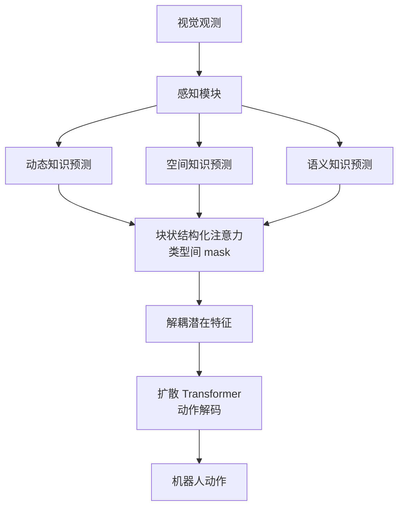

# DreamVLA: A Vision-Language-Action Model Dreamed with Comprehensive World Knowledge

- Local PDF: `/Users/luogu/physical_intelligence/papers/vla-reasoning/DreamVLA_2507.04447.pdf`
- arXiv: https://arxiv.org/abs/2507.04447
- Source: https://arxiv.org/abs/2507.04447
- Published: 2025-07
- Category: world knowledge / foresight
- Priority: medium

## 一句话总结

DreamVLA 不直接预测未来图像（计算量大、冗余信息多），而是通过块状结构化注意力分离地预测三类紧凑世界知识（动态区域、深度、语义），再用扩散 Transformer 将解耦的隐含特征解码为动作序列，在真机任务达 76.7% 成功率、CALVIN ABC-D 平均任务长度 4.44。

## 核心技术

1. **三模态紧凑世界知识预测** — 同时预测动态运动区域（CoTracker 二值掩码）、空间深度（单目深度估计）和高层语义（SAM 特征），取代计算密集且含大量冗余信息的像素级未来图像预测
2. **块状结构化注意力掩码（Block-wise Structured Attention）** — 动态/深度/语义三种查询子 token 之间互相屏蔽注意力，仅共享视觉、语言和状态编码，防止不同类型知识的信息泄漏与梯度干扰
3. **基于扩散 Transformer（DiT）的动作解码** — 利用扩散模型对多模态动作条件分布的强大建模能力，从 LLM 输出的解耦隐含特征中生成连续动作序列

## 底层原理与数学推导

DreamVLA 的核心设计理念是「预测-动作」循环（perception-prediction-action loop）：模型先理解当前观测，预测未来世界的紧凑知识表示，再依据这些知识预测逆动力学（inverse dynamics）生成动作。

**世界知识嵌入（World Embedding）**：给定语言指令 $l$、当前观测 $o_t$ 和状态 $s_t$，模型通过 `<dream>` 查询 token 将其映射为紧凑的隐含表示：

$$w_{t+n} = M(l, o_t, s_t \mid \langle\text{dream}\rangle)$$

其中 $M$ 是统一的多模态 Transformer。三种知识通过分离的子查询各自预测：

$$\hat{p}_{t+n} = P(w_{t+n}) = [\hat{f}_{t+n},\ \hat{d}_{t+n},\ \hat{c}_{t+n}]$$

其中 $\hat{f}$ 为动态区域二值掩码，$\hat{d}$ 为单目深度图，$\hat{c}$ 为高层语义特征。

**动态区域重建损失（dVAE）**：采用变分自编码器框架，证据下界（ELBO）形式化为：

$$\mathcal{L}_{\text{dyn}} = \frac{1}{|\mathcal{D}|} \sum_{x_i \in \mathcal{D}} \mathbb{E}_{z \sim Q_\phi(z|x_i)}[-\log P_\psi((x_i)_M \mid z)]$$

其中 $Q_\phi$ 为编码器，$P_\psi$ 为解码器，仅重建被掩码的运动区域 $(x_i)_M$，忽略静态背景。

**深度预测损失**：对齐归一化后的像素级 MSE，加入尺度对齐系数 $\alpha$ 消除单目深度估计的全局歧义：

$$\mathcal{L}_{\text{depth}} = \frac{1}{HW} \sum_{i,j} \big( \hat{d}_{t+n}^{(i,j)} - \alpha \cdot d_{t+n}^{(i,j)} \big)^2$$

$$\alpha = \frac{\sum_{i,j} \hat{d}_{t+n}^{(i,j)} \cdot d_{t+n}^{(i,j)}}{\sum_{i,j} (d_{t+n}^{(i,j)})^2}$$

Depth-Anything 模型作为自监督教师网络提供深度真值。

**对比语义预测损失（InfoNCE）**：将预测的语义特征拉近到真值特征，同时推远空间偏移后的负样本：

$$\mathcal{L}_{\text{sem}} = -\log \frac{\exp(\hat{c}_{t+n}^T \cdot c_{t+n} / \tau)}{\sum_{k} \exp(\hat{c}_{t+n}^T \cdot c_k / \tau)}$$

其中 $\tau$ 为温度系数，$k$ 为空间维度上的 token 数量。

**扩散 Transformer 动作损失**：采用标准的噪声预测训练目标，余弦调度：

$$\mathcal{L}_{\text{DiT}} = \mathbb{E}_{\tau, \varepsilon} \big[ \| \varepsilon - \varepsilon_\theta( \sqrt{\bar{\alpha}_\tau} \cdot a_{t:t+n-1} + \sqrt{1-\bar{\alpha}_\tau} \cdot \varepsilon,\ \tau,\ c ) \|_2^2 \big]$$

其中 $\varepsilon_\theta$ 为 DiT 去噪器，$\varepsilon \sim \mathcal{N}(0, I)$，$\bar{\alpha}_\tau$ 为余弦噪声调度系数，$c$ 为 LLM 输出的隐含动作嵌入。

**块状结构化注意力机制**：总共有三种 `<dream>` 子查询（dynamic、depth、semantics）和一个 `<action>` 查询。每个子查询只能关注共享的视觉/语言/状态 token，三者之间互相屏蔽直接注意力。这类似于 MoE 网络中的专家路由（specialist routing），防止不同知识类型交叉耦合导致的梯度噪声。

## 物理直觉解释

DreamVLA 的逻辑可以类比人类操作陌生物品时的思维过程：「先看一眼，预测接下来会发生什么，再决定怎么做」。

- **为什么不直接预测像素？** 想象你要抓一个杯子——你不需要精确知道杯子每个像素未来 0.5 秒的颜色变化，你只需要知道「杯子会往哪移动」（动态）、「杯子离我多远」（深度）、「那是个杯子」（语义）。DreamVLA 只预测这三种关键信息，大幅减少计算量和冗余。
- **什么是块状注意力？** 就像公司里市场部、技术部和财务部各司其职，可以共享公司公告（共用的观测信息），但不需要互相干涉对方的具体工作——动态预测不需要知道深度图的每个细节。
- **动态区域为什么用二值掩码而不是光流？** 全光流就像给每个像素画速度矢量箭头，计算量巨大且大多数像素（背景）对控制没有贡献。二值掩码只标记「哪些像素在动」，就像用荧光笔标出重点，省力又高效。

## 工程细节与实操指南

**系统配置与训练超参：**
- 优化器：AdamW，学习率 $1 \times 10^{-3}$，权重衰减 $1 \times 10^{-4}$
- 学习率调度：余弦退火，5% 线性预热
- Batch size：64，训练轮数：20
- GPU：8 张 NVIDIA A800（单卡 80GB）
- 扩散步数（DiT）：10 步，余弦噪声调度
- 每模态查询 token 数：$K=9$（$K=4$ 性能不足，$K=16$ 显存浪费）

**损失函数权重：**
| 损失项 | 权重 | 说明 |
|--------|------|------|
| $\lambda_{\text{dyn}}$（动态区域） | 0.1 | 二值掩码重建 |
| $\lambda_{\text{depth}}$（深度） | 0.001 | 最小权重，防止深度噪声主导优化 |
| $\lambda_{\text{sem}}$（语义） | 0.1 | 对比学习 |
| $\lambda_{\text{DiT}}$（动作） | 1.0 | 主损失 |

**训练流程：**
1. **预训练**：在 CALVIN（无语言标注）和完整 DROID 数据集上，预测整帧图像而非紧凑知识
2. **微调**：在各目标数据集上使用三类世界知识预测目标
3. **LIBERO 策略**：先在 LIBERO-90 预训练，再在各子任务 track 微调

**推理优化：** 推理时跳过所有解码器头——模型直接输出世界嵌入 $\hat{p}_{t+n}$，无需像素级重建，保留精度增益的同时维持低延迟。

**动态区域生成细节：** 使用 CoTracker 提取光流轨迹，识别「随机械臂末端执行器或可移动物体运动的像素」，生成二值掩码而非完整光流场。

## 技术权衡（Trade-off）

| 优势 | 劣势与工程代价 |
|------|---------------|
| 紧凑世界知识比像素级预测高效百倍，显著减少冗余信息处理 | 三类知识的定义和粒度可能不适用于所有任务，需要针对特定场景调整知识类型 |
| 块状注意力机制有效防止多任务学习中的互扰，每种知识保持独立表示 | 三模态预测增加训练复杂度，深度损失的权重需要精细调试（$\lambda_{\text{depth}}=0.001$） |
| 扩散 Transformer 天然适配多模态动作分布，在 CALVIN 和真机上均达 SOTA（4.44 / 76.7%） | 消融实验显示深度和语义特征单独使用时反而会降低性能，必须配合动态区域才能生效 |

## 技术价值与演进定位

DreamVLA 属于「前瞻预测 + 动作生成」路线（区别于纯模仿学习和直接 VLA mapping），是继 F1 像素级预测之后的有力替代方案。核心洞察是：**像素级预测包含大量与任务无关的冗余信息，紧凑知识预测更具计算效率和泛化潜力**。

它与 F1 两条路线的竞争关系，将推动该领域在「预测什么形式的未来信息」这一核心问题上进一步分化：
- F1 路线：预测像素，保留全部信息，但计算量大、冗余多
- DreamVLA 路线：预测紧凑知识，高效聚焦，但知识定义不通用
- 未来可能融合：自适应的知识粒度选择、任务驱动的预测格式

## 与其他论文的关系

- **F1-VLA**：预测完整未来图像，计算量大。DreamVLA 用紧凑知识替代像素，更高效
- **Seer / VPP**：同为前瞻预测类方法，但在 CALVIN 上 DreamVLA（4.44）超越两者（4.28 / 4.29）
- **CLOVER**：用离散化的潜在编码预测未来，DreamVLA 使用更丰富的知识结构（动态+空间+语义）
- **UP-VLA**：不确定性感知预测，DreamVLA 关注知识类型多样性而非不确定性建模

## 精读问题

1. DreamVLA 的三类世界知识在具体任务中如何发挥互补作用？消融实验中动态区域贡献最大（4.32），深度和语义是在此基础上的增量提升（4.40 → 4.44），三类知识的相对重要性是否随任务类型变化？
2. 块状结构化注意力与标准因果注意力的 0.69 差距（3.75 → 4.44）说明跨知识类型的互扰是主要瓶颈。这种设计是否适用于其他多任务 VLA 架构？
3. 深度损失权重 $\lambda_{\text{depth}}=0.001$ 极低，是深度预测本身噪声大还是模型设计问题？是否有更鲁棒的深度表示方法？
4. CoTracker 提取的动态区域二值掩码比完整光流场效果好（4.44 vs 4.23），这种简化策略的适用边界在哪里？对于高速运动场景，二值掩码是否足够？
5. DreamVLA 目前仅用于并行夹爪 + RGB 场景，扩展到灵巧手、3D 点云、触觉传感时，知识类型是否需要重新设计？
