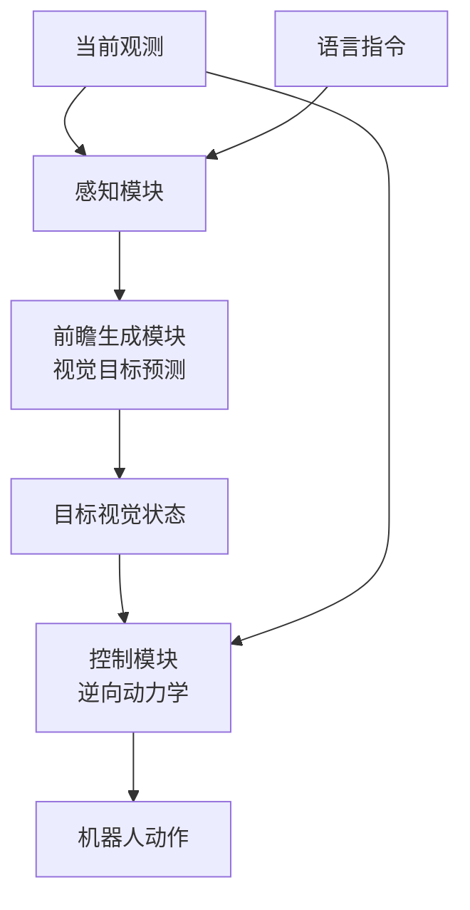

# F1-VLA: A Vision-Language-Action Model Bridging Understanding and Generation to Actions

- Local PDF: `papers/vla-reasoning/F1-VLA_2509.06951.pdf`
- arXiv: https://arxiv.org/abs/2509.06951
- Project: https://aopolin-lv.github.io/F1-VLA/
- 年份：2025
- 阶段：视觉前瞻引导的 VLA

## 一句话总结

F1-VLA 在 VLA 决策流程中引入显式视觉前瞻（visual foresight）生成——先预测「目标状态应该长什么样」，再通过逆向动力学将前瞻转化为动作，相比传统 VLA 在动态场景中提升了约 29 个百分点的成功率。

## 核心技术

1. **Mixture-of-Transformer 三模块架构** — 感知模块、前瞻生成模块、控制模块各司其职，构成"理解→生成→行动"的完整链路
2. **下一尺度预测（Next-Scale Prediction）** — 合成目标导向的未来视觉状态，作为显式的规划中间目标
3. **前瞻引导的逆动力学（Foresight-Guided Inverse Dynamics）** — 将动作生成重新定义为：在给定当前观测与目标前瞻的条件下，反推动作序列
4. **三阶段训练策略** — 对齐预训练 → 多专家联合预训练 → 特定平台微调
5. **大规模多任务数据集** — 覆盖 136 个任务，超过 33 万条示教轨迹

## 底层原理与数学推导

### Mixture-of-Transformer 的前向传播

F1-VLA 的核心是将传统 VLA 的"状态 $\rightarrow$ 动作"反应式映射，拆解为三个串行模块的联合优化。设当前视觉观测为 $o_t$，语言指令为 $l$，机器人动作为 $a_t$，三个模块依次处理：

**感知模块（Perception Expert）**：将多模态输入编码为共享表征：

$$h_t = f_{\text{perc}}(o_t, l)$$

其中 $f_{\text{perc}}$ 是一个多模态 Transformer，输出隐含层表征 $h_t \in \mathbb{R}^{d}$，$d$ 为隐藏层维度。

**前瞻生成模块（Generation Expert）**：基于当前表征 $h_t$，采用下一尺度预测机制合成目标导向的未来视觉状态 $\hat{o}_{t+\tau}$：

$$\hat{o}_{t+\tau} = f_{\text{gen}}(h_t, g)$$

其中 $g$ 为任务目标条件，$\tau$ 为预测的时间视界。$\hat{o}_{t+\tau}$ 是显式生成的图像级未来状态，而非隐式特征向量。这里 $f_{\text{gen}}$ 本质上是一个条件图像生成器，其训练目标为最小化生成视觉前瞻与真实未来观测之间的差异：

$$\mathcal{L}_{\text{foresight}} = \mathbb{E}_{o_{t+\tau} \sim \mathcal{D}} \left[ \| \hat{o}_{t+\tau} - o_{t+\tau} \|_2^2 \right]$$

**下一尺度预测的数学本质**：与传统方法直接回归下一帧像素不同，Next-Scale Prediction 采用多尺度层次化生成策略。它将视觉前瞻分为粗到细的 $S$ 个尺度，每个尺度 $s \in \{1, ..., S\}$ 在前一尺度的基础上进行残差精修：

$$\hat{o}^{(s)} = \hat{o}^{(s-1)} + \Delta^{(s)}, \quad \text{其中} \quad \Delta^{(s)} = f_{\text{gen}}^{(s)}(h_t, \hat{o}^{(s-1)}, g)$$

最终输出的视觉前瞻为 $\hat{o}_{t+\tau} = \hat{o}^{(S)}$。这种层次化策略降低了直接生成高维视觉目标的难度，使模型能够循序渐进地构建未来场景。

**控制模块（Action Expert / Control Module）**：实现前瞻引导的逆动力学，将多模态上下文（当前观测 + 视觉前瞻 + 语言指令）联合映射为具体的动作序列：

$$a_t, a_{t+1}, ..., a_{t+T} = f_{\text{ctrl}}(o_t, \hat{o}_{t+\tau}, l)$$

控制模块的损失函数为动作预测的负对数似然：

$$\mathcal{L}_{\text{action}} = -\sum_{i=0}^{T} \log p(a_{t+i} \mid o_t, \hat{o}_{t+\tau}, l)$$

### 逆动力学的关键优势

传统方法使用正动力学建模，即预测 $p(o_{t+1} \mid o_t, a_t)$，需要显式建模物理动态。F1-VLA 的前瞻引导逆动力学将动作生成建模为条件分布 $p(a_t \mid o_t, \hat{o}_{t+\tau})$，因此不需要显式的物理模型，而是通过"合理的未来视觉状态"隐式约束动作生成。这等价于求解一个逆向规划问题：

$$a^* = \arg\max_a \log p(a \mid o_t, \hat{o}_{t+\tau}) + \lambda \cdot \text{Sim}(\hat{o}_{t+\tau}, f_{\text{forward}}(o_t, a))$$

其中 $f_{\text{forward}}$ 是环境的隐式正向模型，$\text{Sim}(\cdot,\cdot)$ 是相似度度量，$\lambda$ 是平衡系数。在实际实现中，$\hat{o}_{t+\tau}$ 直接作为控制模块的输入条件，让 Transformer 隐式学习这种约束关系。

### 三阶段训练策略的形式化

**阶段 I（对齐预训练）**：仅训练前瞻生成模块与感知模块的对齐，使生成模块能够基于感知模块的输出生成合理的视觉展望。优化目标仅为 $\mathcal{L}_{\text{foresight}}$。

**阶段 II（多专家联合预训练）**：在大规模 VLA 数据集上联合训练三个模块，优化联合损失：

$$\mathcal{L}_{\text{joint}} = \mathcal{L}_{\text{action}} + \alpha \mathcal{L}_{\text{foresight}} + \beta \mathcal{L}_{\text{aux}}$$

其中 $\mathcal{L}_{\text{aux}}$ 为辅助损失（如语言理解对比损失），$\alpha$ 和 $\beta$ 为权重超参数。此阶段使用 330k+ 条轨迹，覆盖 136 个任务。

**阶段 III（特定平台微调）**：在目标机器人平台（如 Genie-1、ARX LIFT II、Franka）上，使用领域特定数据集进行轻量微调，优化 $\mathcal{L}_{\text{action}}$。

## 物理直觉解释

F1-VLA 的核心直觉是：**优秀的操作者在动手前会先「想象」结果**。就像一个篮球运动员投篮前会先判断球飞向篮筐的轨迹，F1-VLA 让机器人先「想象」操作完成时的画面，再反推出应该怎么做。

- **三模块是三种认知能力**：感知模块相当于眼睛 + 耳朵（理解环境与指令），前瞻生成模块相当于想象力（设想目标状态），控制模块相当于运动皮层（把想法转化为肌肉动作）
- **下一尺度预测不是简单地预测下一帧**，而是像画家画一幅画：先勾勒大致轮廓（低尺度），再逐步添加细节（高尺度），最终形成清晰的未来画面
- **为什么三阶段训练**：第一阶段让「想象力」学会基本画面生成；第二阶段训练三种能力协同工作；第三阶段让模型适应具体机器人的物理特性（关节限位、动力学特性等）
- **与 π0 的对比**：π0 看到状态直接输出动作，像闭着眼睛凭感觉做事；F1-VLA 先睁眼看清前方再行动，因此在动态环境中（如传送带、人机交互）表现大幅领先

## 工程细节与实操指南

### 系统配置与训练超参

**模型架构：**
- Mixture-of-Transformer 三模块设计，基座为 π0
- 感知模块：多模态 Transformer，支持视觉与语言联合编码
- 前瞻生成模块：条件图像生成 Transformer，输出为像素空间
- 控制模块：逆动力学 Transformer，输出为机器人动作序列

**训练数据：**
- 预训练：330k+ 条示教轨迹，136 个操作任务
- 微调数据集：Genie-1 平台（摘花、人机交接、茶杯取放）、ARX LIFT II（长程操作、动态追踪）、Franka（快速清扫）

**训练超参：**
- 阶段 I：对齐预训练，学习率 1e-4，仅优化生成模块
- 阶段 II：联合预训练，学习率 1e-4，三模块同时优化，α=0.1，β=0.05
- 阶段 III：微调，学习率 5e-5，目标平台 50-100 条轨迹

### 落地实操标准步骤

1. **选择基座模型**：当前以 π0 为基座，确保基础的 VLA 能力覆盖
2. **数据准备工作**：收集目标平台的示教数据，确保多样性（不同光照、背景、物体布局）
3. **三阶段训练流水线**：对齐预训练（需要大规模未来帧标注）→ 联合预训练 → 微调
4. **推理优化**：前瞻生成模块在推理阶段增加了额外开销，需注意端到端推理延迟
5. **前瞻质量监控**：定期采样化生成的视觉前瞻图像，人工检查质量——前瞻质量直接决定下游控制精度

### 关键参数调优

- **预测时间视界 $\tau$**：$\tau$ 太短（<3 步）前瞻无意义，太长（>20 步）生成质量下降。推荐 $\tau=5-10$ 步
- **尺度数量 $S$**：$S=3$ 为推荐值（粗 → 中 → 细），更多尺度增加计算量但收益递减
- **联合训练权重 $\alpha$**：在动态场景中增大 $\alpha$（0.1→0.3），让前瞻质量更优

## 消融实验与分析

| 消融因子 | 变化 | 结论 |
|---------|------|------|
| 视觉前瞻模块 | with vs without foresight | 显式视觉前瞻在动态场景中提升 29pp 成功率 |
| 三个专家模块 | full vs ablated experts | 每个专家模块均有正向贡献 |
| 前瞻质量 | 不同生成质量 | 前瞻质量直接影响下游动作精度 |

**核心结论**：显式视觉前瞻生成是 F1-VLA 的核心——先预测目标状态再生成动作，从反应式升级为规划式。

## 技术权衡（Trade-off）

| 优势 | 劣势与工程代价 |
|------|---------------|
| 显式视觉前瞻显著提升动态场景成功率（+20~40%） | 前瞻生成模块引入额外推理延迟，端到端速度降低 |
| 三模块解耦设计支持独立调试与优化 | 三阶段训练流程复杂，总训练成本更高 |
| 逆动力学范式避免了对显式物理模型的依赖 | 前瞻生成质量是瓶颈——低质量前瞻会误导动决策 |
| 在 ARX LIFT II 长程任务上从 0% 提升到 40% | 对基座模型（π0）的依赖性强，模型替换成本高 |
| 生成视觉目标提供了可解释的中间结果 | 三模块间的梯度传播可能存在优化困难 |

## 技术价值与演进定位

F1-VLA 是 VLA 路线中**从"反应式"到"规划式"转变的标志性工作**。它明确指出了传统 VLA 的短视问题并提供了可量化的改进方案：

- 开创了"先预测、后动作"的 VLA 范式，是视觉前瞻在 VLA 中的首次大规模验证
- 证明了显式中间规划目标比隐式世界模型在动态环境中更有效
- 三阶段训练为后续 VLA 的模块化训练提供了参考框架
- 与 UniVLA 的 world modeling post-training 形成互补——前者是显式前瞻，后者是隐式因果

演进定位：
- 传统 VLA（RT-2/π0）→ 隐式 world model（UniVLA）→ 显式视觉前瞻（F1-VLA）
- 未来方向：两种范式的融合——既学习因果规律，又生成显式规划目标

## 与其他论文的关系

- **π0（基座模型）**：F1-VLA 建立在 π0 之上，用三专家架构替代了 π0 的直接动作预测
- **UniVLA**：World modeling post-training（隐式因果）vs visual foresight generation（显式前瞻），互补路线
- **VPP / Genie Envisioner**：纯视觉预测策略，缺少语义理解；F1-VLA 在预测中融合了语言指令
- **RT-Trajectory**：F1-VLA 为 VLA 中的规划问题提供了比 RT-Trajectory 更通用的解决方案

## 精读问题

1. 下一尺度预测中，多尺度残差精修的具体实现方式是什么？不同尺度间的特征如何传递？
2. 前瞻引导的逆动力学与直接逆动力学（如行为克隆）在目标函数上有何本质区别？
3. 三阶段训练中，阶段 I 的对齐预训练如何保证前瞻生成模块产出的稳定性？
4. 预测时间视界 $\tau$ 对前瞻质量和控制性能的具体影响规律是怎样的？
5. F1-VLA 的前瞻生成质量在真实世界部署中的可靠性边界在哪里？
6. Mixture-of-Transformer 三模块之间的梯度反向传播是否存在优化困难？如何解决的？
