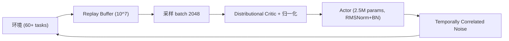

# FlashSAC: Fast and Stable Off-Policy Reinforcement Learning for High-Dimensional Robot Control

- 本地 PDF：`papers/vla-architecture/FlashSAC_2604.04539.pdf`
- arXiv：https://arxiv.org/abs/2604.04539
- 年份：2026 (RSS 2026 Best Paper)
- 团队：KAIST, Holiday Robotics, KRAFTON, TU Darmstadt, KTH, DFKI
- 阶段：新一代 off-policy RL 算法 —— 大模型 + 低更新率 + 稳定化技术

## 一句话总结

FlashSAC 将 scaling law 引入 off-policy RL：用更大模型（2.5M）配合极低更新频率（2 次梯度更新/1024 步数据）、大 batch（2048）和大 replay buffer（10^7），加 RMSNorm + 预激活 BN + 权重归一化防止 bootstrapping 崩溃。60+ 任务 10 个仿真器全面超越 PPO/SAC/TD3/REDQ，人形机器人在 Unitree G1 上 sim-to-real <20 分钟。RSS 2026 Best Paper。

## 核心技术

1. **Low UTD Ratio** — 每 1024 步仅做 2 次梯度更新（vs REDQ 的 20 次），大幅降低 overfitting 风险
2. **Large Model Scaling** — 2.5M 参数策略网络（vs 通常 SAC ~0.3M），更大的模型容量配合更少的更新步
3. **稳定化三板斧** — RMSNorm (weight norm) + 预激活 BN (feature norm) + 显式梯度范数裁剪，三重保障防止 critic divergence
4. **Distributional Critic** — 分布式价值函数 + 自适应奖励缩放，处理高维任务中奖励量级的巨大差异
5. **Temporally Correlated Noise** — 探索噪声在时间上相关（非每步独立采样），在高维动作空间中更有效地探索

## 底层原理与数学推导

与传统 SAC 的核心差异——更新频率：

$$\text{UTD} = 2/1024 \text{ (FlashSAC)} \quad \text{vs} \quad \text{UTD} = 1 \text{ (SAC)} \quad \text{vs} \quad \text{UTD} = 20 \text{ (REDQ)}$$

低 UTD 的直觉：大 batch + 大模型 + 少更新 = 每次更新的梯度估计更准确，减少了 bootstrapping 误差累积。

## 物理直觉解释

SAC 就像一个学生每做一道题就看一遍答案——学得快但容易过拟合。FlashSAC 反过来——做 1024 道题才看两遍答案——但题目量足够大、模型容量足够大，学到的是真正通用的"解题规律"而不是"He题答案"。在大 batch (2048) 面前，即使只更新两次，样本覆盖的多样性也远远超过小 batch 反复更新。

## 消融实验与分析

| 消融因子 | 结论 |
|---------|------|
| UTD=2/1024 vs UTD=1/1 (SAC) | 低 UTD 在高维任务中系统性优于高 UTD |
| 大模型 (2.5M) vs 小模型 (0.3M) | 更大模型在低 UTD 下有更好的泛化 |
| 有/无 归一化三板斧 | 无归一化时 critic 在高维任务中发散 |
| Distributional vs 标量 critic | Distributional critic 稳定性和最终性能均更优 |
| Correlated vs 独立噪声 | 相关噪声在高维动作空间中探索效率更高 |

## 技术权衡（Trade-off）

| 优势 | 劣势与工程代价 |
|------|----------------|
| Sim-to-real Unitree G1: <20min 平地, ~4h 楼梯 | 大 replay buffer (10^7) 需要大量内存 |
| 低 UTD 降低 overfitting，训练更稳定 | 对仿真器吞吐量要求高（需要快速生成大量数据）|
| 归一化三板斧防止训练崩溃 | 复杂的归一化组合增加了调参维度 |
| 通用性极强（60+ 任务，10 个仿真器） | sim-to-real 仍需要手工设计 reward |

## 技术价值与演进定位

FlashSAC 获得 RSS 2026 Best Paper 的原因：它不是修修补补的改进，而是**对 off-policy RL 训练范式的重新思考**——借鉴了 LLM 时代的 scaling law 直觉（大模型 + 大批量 + 低更新率）。这直接影响了 VLA 的 RL 后训练路线（RL Token、SimpleVLA-RL、ROVE）——证明了 RL 可以在高维机器人控制上达到实用级别。

## 工程细节与实操指南

- **网络**：2.5M 参数 actor，ReLU 激活，RMSNorm + 预激活 BN
- **Critic**：Distributional (51 atoms), 自适应 reward scaling
- **Replay Buffer**: 10^7 transitions, batch 2048
- **探索**：时间相关噪声（参数化 noise process, correlation = 0.9）
- **硬件**：Unitree G1 sim-to-real, 10 个仿真器 60+ 任务

## 与其他论文的关系

- **SAC / TD3 / REDQ** — 被超越的 baseline
- **RL Token (PI, 2026)** — VLA + online RL，FlashSAC 提供了更好的 RL 底层算法
- **ROVE (XPeng, 2026)** — 人形机器人的人机协同 RL 后训练，可直接受益于 FlashSAC
- **SimDist (RSS 2026)** — 仿真蒸馏加速 RL，和 FlashSAC 互补

## 精读问题

1. UTD=2/1024 是否对所有任务类型都是最优的？低 UTD 在奖励稠密 vs 稀疏任务中的表现差异？
2. 归一化三板斧是否可能过度约束 critic 的表达能力？
3. Sim-to-real 的 <20 分钟在接触-rich 操作任务（如拧螺丝）中是否仍然成立？
