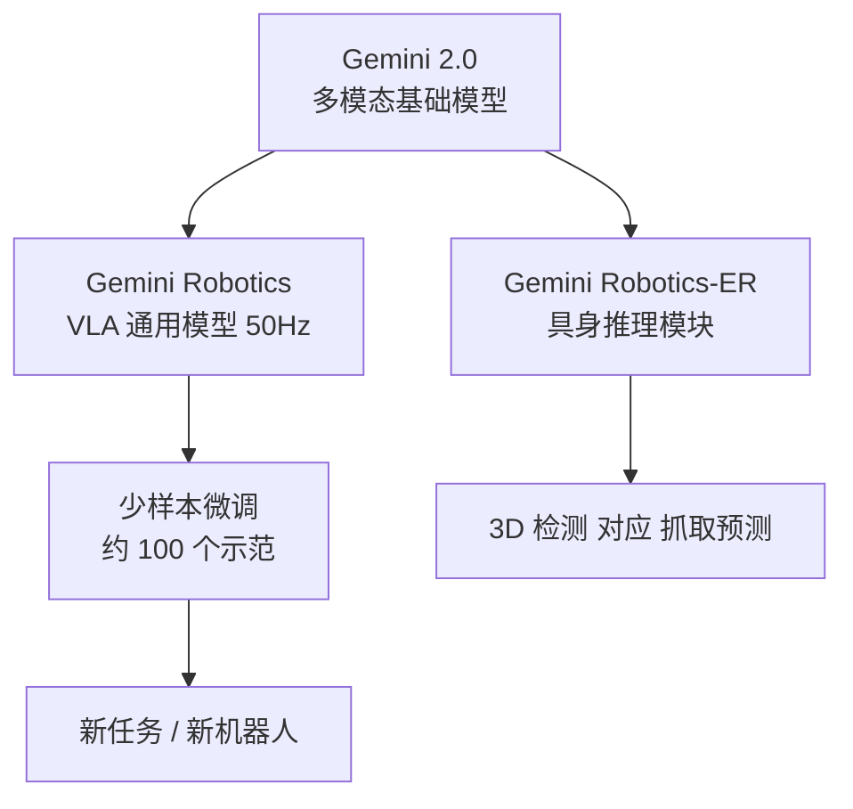

# Gemini Robotics: Bringing AI into the Physical World

- Local PDF: `/Users/luogu/physical_intelligence/papers/vla-reasoning/Gemini_Robotics_2503.20020.pdf`
- arXiv: https://arxiv.org/abs/2503.20020
- Source: https://arxiv.org/abs/2503.20020
- Project: https://deepmind.google/models/gemini-robotics/
- Authors: Gemini Robotics Team, Google DeepMind (117+ authors)
- Published: 2025-03-25
- Category: closed/frontier VLA
- Priority: high

## 一句话总结

Gemini Robotics 是 Google DeepMind 基于 Gemini 2.0 构建的双模型 VLA 家族——Gemini Robotics 直接输出机器人动作，Gemini Robotics-ER 专注于空间推理和物理世界理解，通过约 100 个示范即可微调学习新任务，代表了闭源 VLA 在通用操作能力上的上界。

## 核心技术

1. **双模型架构（Gemini Robotics + Gemini Robotics-ER）** — 将「具身推理」和「动作控制」解耦为两个互补模型。ER 模型提供空间理解、物体检测、轨迹预测等认知能力；动作模型在此基础上加入低层连续控制，通过本地 decoder 将推理结果转化为 50Hz 的机器人动作
2. **Gemini 2.0 驱动的 VLA** — 直接基于 Gemini 2.0 Flash/Pro 多模态大模型，保留其世界知识和语义推理能力，通过精调适配机器人控制
3. **~100 示范快速微调** — 对于短时程任务，仅需 100 个示教（约 15 分钟至 1 小时数据采集）即可微调达到 70% 以上成功率
4. **In-Context Learning 零样本/小样本控制** — 支持通过代码生成（零样本）和文本序列化轨迹（ICL，10 个示范）两种方式在不微调的情况下控制机器人
5. **安全框架** — 首个系统讨论 VLA 安全的前沿工作，涵盖负责任开发和风险缓解

## 底层原理与数学推导

### 双模型架构设计

Gemini Robotics 模型由两个组件构成：

1. **云侧 Gemini Robotics 骨干**：Gemini Robotics-ER 的精简蒸馏版本，端到端延迟从秒级优化至 160ms 以下
2. **本地动作 Decoder**：运行在机器人端，补偿骨干网络延迟。从观测到动作块的端到端延迟约 250ms，通过多动作预分块实现 50Hz 有效控制频率

这种云-端分离设计的本质是**将推理与控制的实时性要求解耦**——复杂的语义和空间推理在云端完成，高频率的实时控制在本地执行。

### Action Chunking（动作分块）

模型采用 action chunking 策略（Zhao et al., 2023）：一次性预测长度为 H 的动作序列 $\mathbf{a}_{t:t+H}$，仅执行其中 Ĥ < H 步后重新预测：

$$\mathbf{a}_{t:t+H} \sim \pi_{\theta}(\mathbf{a} | \mathbf{o}_{1:t}, \mathbf{c})$$

其中 $\mathbf{o}_{1:t}$ 为历史观测序列，$\mathbf{c}$ 为上下文条件（图像 + 指令）。通过 chunking 降低了决策频率的要求，使云端-本地延迟预算充足。

### In-Context Learning 的小样本动作表示

ICL 模式下，k 条遥操作轨迹 $\{\tau_1, \tau_2, \ldots, \tau_k\}$ 被转化为物体和末端执行器位姿的文本序列：

$$\tau_i = \{(p_1^{\text{obj}}, p_1^{\text{ee}}), (p_2^{\text{obj}}, p_2^{\text{ee}}), \ldots\}$$

其中 $p_j^{\text{obj}}$ 为物体 j 时刻位姿，$p_j^{\text{ee}}$ 为机械臂末端位姿。这些位姿被 token 化为文本添加到 prompt 中。模型同时生成描述性语言注释来激发推理能力。该方法继承自 Di Palo and Johns (2024)，但 Gemini Robotics-ER 可以内部完成关键点提取，无需外部感知模块。

### 零样本代码生成控制

零样本模式下，模型接收到的是：
1. 系统提示（描述机器人硬件和 API）
2. API 文档（包括位姿移动、夹爪控制、状态读取等函数签名）
3. 任务指令

模型需要**内生生成 Python 代码**调用 API 完成操控。每步循环：拍摄图像 → 代码生成（内含检测、指向、轨迹预测）→ 执行 → 反馈 → 重规划。这本质上是将「物理行动」抽象为「代码行动」，要求模型同时理解物理世界和编程语义。

### ERQA 基准

论文提出 ERQA（Embodied Reasoning Question Answering）——包含 400 道多项选择 VQA 题的评估基准，涵盖空间推理、轨迹推理、动作推理、状态估计、指向、多视图推理和任务推理七个维度，28% 的问题涉及多张图像。来源包括 OXE、UMI Data、MECCANO、HoloAssist、EGTEA Gaze+。

### 微调训练数据

- 12 个月的 ALOHA 2 遥操作示教数据，数千小时机器人车队采集
- 涵盖数千种多样化的操作技能、物体、难度、长时程和灵巧度要求
- 非动作数据：web 文档、代码、多模态内容（图像、音频、视频）、具身推理数据、VQA 数据

## 物理直觉解释

- **为什么 Gemini Robotics 要分成两个模型？** 就像人脑有「思考」和「执行」两个系统——你决定「拿起杯子」只需要零点几秒的思考，但手部实际完成抓取需要精细的运动协调。ER 模型负责「思考」（物体在哪、怎么抓），动作模型负责「执行」（具体的关节角度和力度）。如果让一个模型同时做所有事，要么推理慢得跟不上控制频率，要么控制粗糙得抓不准物体。

- **~100 个示范为什么够？** 因为 Gemini 2.0 已经有大量的世界知识——它知道杯子是什么、怎么抓取、桌面是什么。100 个示范不是从零学习，更像是「看 100 遍人类演示后，把已有的«如何用手抓东西»的知识映射到具体的机器人手臂上」。这就像让一个经验丰富的厨师第一次用某个品牌的厨具——只需要试几次就适应了。

- **ICL 模式怎么「看图写代码」？** 想象你看到一张桌面照片（这是什么物体、在哪里），然后要求你写一段代码「移动机械臂到那个物体位置，夹紧」。Gemini Robotics-ER 在内部完成了「看到杯子→计算杯子 3D 位置→生成夹取轨迹」的推理链，然后把这段推理翻译成 Python 代码调用 API。本质上，机器人控制被转化成了一个编程问题。

- **为什么 Gemini Robotics 擅长处理变形物体（衣物、电线）？** 传统方法需要精确的物理模型来预测布料或软线的形态。Gemini 2.0 的视觉基础模型见过海量的人类处理变形物体的视频——折叠衣服、缠绕耳机线——它不需要精确的物理仿真，而是用视觉模式匹配来推断变形行为，这来自 web-scale 预训练带来的「物理常识」。

## 工程细节与实操指南

**模型架构细节：**

**Gemini Robotics-ER（具身推理模型）：**
- 基于 Gemini 2.0 Flash / Pro Experimental
- 输入：图像 + 语言指令
- 输出：物体检测框 [y0, x0, y1, x1]、指向点 [y, x]、抓取位姿 [y, x, θ]、2D 轨迹（多点连接）、3D 边界框（单目度量级）
- 支持开放词汇检测——按名称、类别、属性、功能查询（例如同时检测「洒了什么」和「什么可以用来清理」）
- 支持 Chain-of-Thought 推理（CoT 将 ERQA 得分从 46.3 提升至 50.3，Pro Experimental 从 48.3 提升至 54.8）

**Gemini Robotics（动作模型）：**
- 构建于 Gemini Robotics-ER 之上
- 云侧骨干：ER 蒸馏版，延迟 < 160ms
- 本地 decoder：补偿延迟，端到端 250ms，50Hz 控制频率
- 输入：多模态 prompt（当前场景图像 + 文本指令）
- 输出：动作块（action chunks）

**基线设置：**
- π0 复现版（他们在相同数据混合上训练的 π0 版本，超越公开 checkpoint）
- 多任务扩散策略（基于 Chi et al., 2024，类似 ALOHA Unleashed 的任务条件版本）
- 所有基线在相同数据混合上训练至收敛
- Gemini Robotics 分布式运行（云 + 本地 decoder），基线在本地 Nvidia RTX 4090 上运行

**少样本微调：**
- 8 个长时程任务的子任务
- 2,000-5,000 集/任务（完整灵巧任务微调）
- 7/8 任务在 ≤100 个示范时达到 >70% 成功率
- 2 个任务达到 100% 成功率
- 从零开始训练：成功率为 0%，说明预训练的物理常识表征不可或缺

**跨 embodiment 迁移：**
- 双机械臂 Franka（平行夹爪）微调后平均 63% 成功率
- Apollo 全尺寸人形机器人（五指灵巧手）成功适配
- 适配后的模型对视觉干扰、初始条件偏移和物体形状变化更具鲁棒性

**控制频率与延迟预算：**
- 端到端延迟（观测到动作）：~250ms
- 有效控制频率：50Hz（通过 action chunking 实现）
- 云-端协同补偿骨干网络延迟

## 技术权衡（Trade-off）

| 优势 | 劣势与工程代价 |
|------|---------------|
| 继承 Gemini 2.0 的强大世界知识和语义推理，开放词汇、未见物体泛化远超基线 | 闭源模型，架构细节和关键超参未公开，无法复现或独立验证 |
| 双模型解耦：ER 模型专注推理，动作模型专注控制，各自优化 | 云-端分布式部署复杂度高，依赖网络连接，无法完全离线运行 |
| ~100 示范即可学习新短时程任务，数据效率远超此前方法 | 长时程灵巧任务仍需 2,000-5,000 集微调，资源需求仍然很高 |
| 支持多种控制范式（零样本代码、ICL、微调），灵活适配不同场景 | 零样本/ICL 的成功率（25-65%）远低于微调（>80%），可靠性差距大 |
| 首个系统讨论 VLA 安全的前沿工作，为行业安全标准提供参考 | 安全讨论偏初步，缺乏具体实现方案和红队测试细节 |
| ERQA 开放基准为具身推理评估提供标准化工具 | 评估仅在 7 个模拟任务和少量真实任务上进行，泛化性评估范围有限 |
| 预训练的物理常识表征是核心价值——从零训练成功率为 0% | 充分训练依赖 12 个月的机器人车队数据采集，进入壁垒极高 |
| 跨 embodiment 适配后对扰动的鲁棒性优于单任务扩散策略 | 新 embodiment 适配仍需一定量的示教数据，并非零样本 |

## 技术价值与演进定位

Gemini Robotics 的核心贡献不在于提出全新的算法，而在于**证明了前沿 VLM（Gemini 2.0）可以直接转化为物理世界的操作能力**。这为 VLA 路线提供了重要验证：

1. **VLM 的「物理常识」假设成立**：Gemini 2.0 从未直接训练过机器人控制，但其通过互联网图像、视频、文档学到的「物体如何交互」的知识，可以通过精调有效迁移到物理操作中。这支持了「规模越大、物理直觉越强」的 Scaling Law 假设。

2. **分离「推理」与「动作」可能成为 VLA 架构范型**：Gemini Robotics 将具身推理（detection、pointing、trajectory）和动作控制分离的设计，与 π0.7 的 VLM backbone + action expert 解耦思路异曲同工，暗示了 VLA 架构的分层共识正在形成。

3. **少样本能力的实际边界**：~100 示范有效，但仅限于短时程任务；长时程灵巧任务仍需数千示范。这为「少样本学习」的实际效用提供了诚实的上界评估。

4. **闭源 VLA 竞争的序幕**：Gemini Robotics 和 π0.7 在 2025-2026 年先后发布，共同展示了闭源 VLA 的能力上限，推动了开源 VLA（OpenVLA、Octo）的追赶压力。

## 与其他论文的关系

- **RT-2**：Gemini Robotics 是 RT-2 路线的直接继承者——将更强的 VLM backbone（Gemini 2.0 vs PaLI-X）引入 VLA。Gemini Robotics 在数据效率、灵巧操作和安全性上全面超越 RT-2
- **π0 / π0.7**：竞争关系。Gemini Robotics 使用离散动作 token + 云-端协同，π0.7 使用 flow matching 连续动作。两者在灵巧操作、泛化性上各有优势，但 Gemini Robotics 的开放性远低于 π0.7
- **Octo / OpenVLA**：作为闭源上界，Gemini Robotics 为开源 VLA 提供了性能锚点和追赶目标
- **ALOHA Unleashed (Chi et al., 2024)**：多任务扩散策略基线直接继承 ALOHA Unleashed 的方法
- **Di Palo and Johns (2024)**：ICL 动作表示的文本序列化方法继承自此，但 Gemini Robotics-ER 内置了关键点提取能力
- **Zhao et al. (2023)**：Action chunking 策略直接引用
- **ERQA**：提出的新基准，为具身推理评估提供标准化工具，与 RealworldQA、BLINK 等现有基准互补

## 精读问题

1. Gemini Robotics 的云-端协同延迟预算（160ms 骨干 + 90ms decoder = 250ms 总延迟）是否包含网络传输？实际部署时网络带宽和延迟波动的影响如何？
2. ICL 模式下 10 个示范的轨迹被 token 化为文本序列，这个 token 化方式的具体信息损失是多少？是否丢失了力控、速度等高维度信息？
3. 零样本代码生成中，模型如何处理代码执行错误（如抓取点不可达、运动规划失败）？错误恢复机制是怎样的？
4. Gemini Robotics 在变形物体操作上远超基线的原因是什么？是得益于 Gemini 2.0 的视觉预训练（见过更多变形物体视频），还是动作表征本身更适合软体操控？
5. 从零开始在微调数据上训练 Gemini Robotics 成功率为 0%，这意味着「物理常识」几乎全部来自预训练——那么微调的作用到底是什么？是适配动作空间、校准精度、还是学习低级 motor control？
6. 安全框架的具体实施细节是什么？论文如何定义「机器人安全」风险类别？是否有实际的 red teaming 结果？
7. Gemini Robotics-ER 的 pointing 和 grasping 能力输出的是归一化图像坐标还是物理世界坐标？单目 3D 边界框的度量精度依赖什么先验？
8. ERQA 基准中 400 道题评估了 7 个能力维度，这些维度的权重分布是否合理？是否存在模型在某些维度极强但整体得分掩盖了短板的可能？
