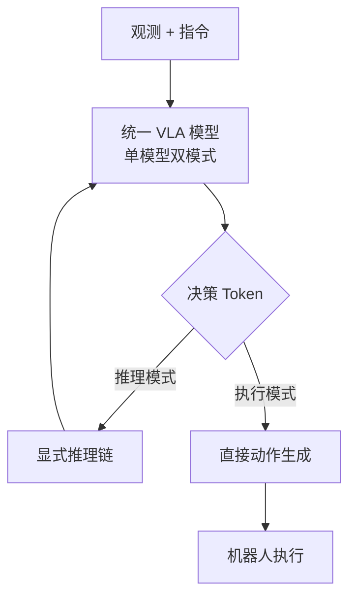

# OneTwoVLA: A Unified Vision-Language-Action Model with Adaptive Reasoning

- Local PDF: `/Users/luogu/physical_intelligence/papers/vla-reasoning/OneTwoVLA_2505.11917.pdf`
- arXiv: https://arxiv.org/abs/2505.11917
- Authors: (CC BY 4.0)
- Published: 2025
- Category: reasoning-action integration
- Priority: high

## 一句话总结

OneTwoVLA 将 System 1（快速动作执行）和 System 2（显式推理）融合到单个 VLA 模型内，通过 Decision Token 机制自适应地在推理模式与动作模式间切换，在长程任务规划（87% vs 57%）、错误检测恢复（80% vs 57%）、人机交互（100% vs 65%）和视觉 grounding（88% vs 5%）四个维度全面超越纯动作 VLA 和双系统方案。

## 核心技术

1. **单模型双模式架构** — 基于 π₀ VLA 构建，同一组权重通过 Decision Token 在 Reasoning Mode（生成文本推理）和 Acting Mode（生成动作 chunk）间切换，消除双系统分离架构的通信瓶颈和延迟

2. **Decision Token 自适应切换机制** — 引入 `[BOR]`（Begin of Reasoning）和 `[BOA]`（Begin of Action）两个特殊决策 token，模型在推理间隔输出 `[BOR]` 触发显式推理，在动作间隔输出 `[BOA]` 直接生成动作，无需外部门控网络

3. **具身推理合成数据管道** — 三步自动合成流水线：Gemini 2.5 Pro 生成场景描述 → FLUX.1-dev 文生图 + 鱼眼/夹爪合成 → Gemini 生成任务指令与推理标注，产出 16,000 样本（6,000 visual grounding + 10,000 long-horizon planning），80% 质量合格率

4. **推理内容标准化结构** — 推理文本由四部分组成：场景描述 + 高层任务计划（K 个有序子任务）+ 历史执行总结 + 下一步具体操作

## 底层原理与数学推导

### Decision Token 门控机制

OneTwoVLA 的核心创新是将「是否推理」的决策内化为模型自身的 token 预测问题。模型在每个时间步 $t$ 根据当前多视角观测 $I_t^1:n$、参考图像 $I_\textref^1:n$、语言指令 $\ell$ 和已有推理内容 $R$，预测一个决策 token：

$$\textDT \sim \pi_\theta^\textdecide(\cdot | I_t^1:n, I_\textref^1:n, \ell, R)$$

其中 $\textDT \in \\texttt[BOR], \texttt[BOA]\$。推理模式下的输出为文本推理序列：

$$\hatR \sim \pi_\theta^\textreason(\cdot | I_t^1:n, I_\textref^1:n, \ell, R)$$

动作模式下的输出为连续动作 chunk：

$$A_t \sim \pi_\theta^\textact(\cdot | I_t^1:n, I_\textref^1:n, \ell, R, s_t)$$

其中 $s_t$ 为当前本体感知状态（仅在动作模式下输入）。

训练时 Decision Token 由标注数据中的真实间隔类型监督，采用交叉熵损失：

$$\mathcalL_\textDT = -\sum_i \log p(\textDT_i^* | I_t^1:n, I_\textref^1:n, \ell, R)$$

其中 $\textDT_i^*$ 为真实的决策 token 标签——推理间隔中 `[BOR]` 表示旧推理过时需要更新，`[BOA]` 表示推理已就绪；动作间隔中始终预测 `[BOA]`。

### VLM 推理损失

推理文本部分采用标准的自回归交叉熵损失，最大化给定观测和历史下正确推理序列的概率：

$$\mathcalL_\textreason = -\sum_j \log \pi_\theta(r_j | I_t^1:n, I_\textref^1:n, \ell, R_<j)$$

### 动作专家损失

动作专家继承自 π₀，采用 **Flow Matching Loss** 进行连续动作分布建模：

$$\mathcalL_\textact = \mathbbE_t \sim \mathcalU[0,1], \epsilon \sim \mathcalN(0,1) \left[ \left\| v_\theta(A_t, t, \textcontext) - \fracd\phi_tdt(A_0, \epsilon) \right\|^2 \right]$$

其中 $\phi_t$ 为概率路径，将数据分布 $p_0$ 平滑变形到高斯噪声分布，模型学习预测该路径的向量场 $v_\theta$。Flow Matching 的优势在于支持连续动作生成，避免了 RT-1 式离散化的阶梯效应，同时能表达多模态动作分布。

**总训练损失：**

$$\mathcalL_\texttotal = \mathcalL_\textDT + \mathcalL_\textreason + \mathcalL_\textact$$

### 推理-动作间隔标注算法

给定一条机器人示教轨迹（长度为 $N=32$ 的下采样帧序列），分两阶段标注：

**Stage 1（关键帧识别）：** 使用 Gemini 2.5 Pro 在每个子任务完成后标注推理间隔 $R = \(r_j^s, r_j^e)\_j=0^K$，将轨迹划分为 $K+1$ 个推理间隔和 $K$ 个动作间隔。

**Stage 2（推理内容生成）：** 对每个推理间隔，取中间帧 $\hatI_j$，生成四项推理内容——场景描述 $D_j$、完整计划 $P$、历史摘要 $H_j = (p_1, \ldots, p_j)$、下一步 $X_j = p_j+1$。

标注质量评估：81.5% 的间隔判断正确，83.3% 的场景描述合理。

## 物理直觉解释

OneTwoVLA 的核心直觉是 **「机器人做事时并不需要每时每刻都在思考，但在关键节点必须停下来想一想」**。

这就像人类做菜：你不会在拿盐的每一步都深思熟虑——拿盐这个动作是自动化的（System 1）。但当「锅里该放什么」这个决策点出现时，你会停下来看食谱、回忆下一步（System 2）。OneTwoVLA 就是在 VLA 内部学习了这个「何时该停下来想、何时该直接做」的判断能力。

- **Decision Token 就像大脑中的开关**：机器人从观测中判断当前处在任务的什么阶段，如果刚完成一个子任务（如把鸡蛋打进了碗里），就触发推理检查下一步；如果正在执行已知动作序列，就直接输出动作 token。
- **合成数据管道的意义**：机器人示教数据中缺乏「推理标注」（因为人类示教者不会边演示边自言自语）。OneTwoVLA 用 LLM + 文生图模型自动生成「场景 + 任务 + 推理标注」三元组，相当于给机器人补上了「内心独白」的训练数据。
- **为什么单一模型比双系统好**：双系统（LLM 规划 + VLA 执行）就像经理写好了 SOP 交给工人执行——但经理不知道工人的实际能力边界，可能写出 180 度旋转这种 SOP，工人的自由度根本不支持。单一模型通过权重共享，推理和动作天然对齐了能力边界。

## 工程细节与实操指南

### 系统配置

- **硬件平台：** Franka 七自由度机械臂 + 平行夹爪 + GoPro 鱼眼腕部相机（主实验）；双 ARX 六自由度双臂 + 3 相机（泛化实验）
- **示教数据采集：** UMI 系统（Chi et al., 2024）采集视觉 grounding 演示
- **推理硬件：** NVIDIA RTX 4090 GPU（支持 10Hz 闭环推理）
- **物体随机化：** 10×10 cm² 随机化摆放区域

### 训练数据集

| 数据集 | 数量 | 用途 |
|--------|------|------|
| Tomato-Egg 示教 | 200 条 | 长程操作基准 |
| Hotpot 示教 | 600 条 | 长程操作 + 错误恢复 |
| Cocktail 示教 | 300 条（每任务 100） | 长程操作 + HRI |
| Atomic Skills | 2,000 条 | 基础技能训练 |
| Single-Env VG | 200 条（每物体 50） | 视觉 grounding |
| Open-World VG | 933 条（16 环境，180 物品） | 开放世界 grounding |
| 合成数据 | 16,000 条（6k VG + 10k LHP） | VLM 推理共训练 |

### 推理管道（Algorithm 1）

1. 模型根据当前观测预测 Decision Token
2. 若 DT == `[BOR]`：进入推理模式，生成四部分文本推理，更新推理缓存 $R$ 和参考图像 $I_\textref$
3. 若 DT == `[BOA]`：进入动作模式，基于最新推理 $R$ 生成动作 chunk $A_t$ 并下发执行
4. 重复 1-3 直到任务完成

**推理延迟代价**：每次推理需要 2-3 秒停顿，但只在关键节点触发，总体任务完成时间与纯动作 VLA 持平。

### 合成数据质量控制

16,000 合成样本的抽查质量：40/50（80%）完全正确，2 张图像错误，8 个文本错误。合成数据的主要价值体现在开放世界视觉 grounding 上：无合成数据时开放世界总成功率仅 8%，加入合成数据后提升到 73%。

### 部署要点

- Acting Mode 使用动作 chunk 输出（π₀ 的流匹配策略），可自定义 chunk size
- 推理内容的「新鲜度」由参考图像 $I_\textref$ 和推理缓存 $R$ 共同维护——推理更新后同步更新参考图像，避免旧图像误导后续动作
- 开放世界部署需确保合成数据覆盖分布外的物体和场景

## 技术权衡（Trade-off）

| 优势 | 劣势与工程代价 |
|------|---------------|
| 单模型消除双系统通信瓶颈，推理与动作天然对齐能力边界 | 推理触发需停顿 2-3 秒，高动态任务中可能影响实时性 |
| 自适应切换只在关键节点推理，总体任务时间与 flat VLA 持平 | Decision Token 训练依赖高质量间隔标注（81.5% 判断准确率），标注意成本高 |
| 合成数据管道可扩展生成推理训练数据，弥补机器人示教缺乏推理标注的不足 | 合成推理质量上限受限于 LLM/VLM 基座模型（80% 正确率），错误推理会误导动作 |
| 长程规划 87% vs π₀ 57%（+30%），错误恢复 80% vs π₀ 57%（+23%） | 需要两阶段标注流程（N=32 下采样 + Gemini 标注），数据流程复杂 |
| 四个维度验证全面性：规划 + 恢复 + HRI + Grounding | 只在桌面级操作验证，未在复杂移动操作或灵巧手任务上测试 |
| 视觉 grounding 开放世界 73%（+合成数据），相比 π₀ 的 5% 大幅领先 | 合成数据 16K 规模仍然有限，推理多样性受限于预设场景模版 |

## 技术价值与演进定位

OneTwoVLA 在 VLA 发展路线上开辟了新的分支方向——**推理-动作融合范式**。此前的主流路线分为两个阵营：

1. **Flat VLA（RT-2 / π₀ / OpenVLA）**：端到端观测→动作映射，缺乏显式推理能力，在长程任务中容易丢失当前步骤、无法检测和恢复错误
2. **双系统方法（GR00T N1 / Hi Robot）**：LLM 负责高层推理 + VLA 负责底层执行，两个系统独立训练，存在能力边界不匹配和推理延迟问题

OneTwoVLA 证明了第三种路径的可行性：**单一模型的推理-动作融合**。这条路径的关键优势在于推理和动作共享视觉表征和模型权重，推理结果天然适配动作能力的边界。

与课程体系中其他论文的关系：
- **π₀**：OneTwoVLA 的动作专家直接继承自 π₀，是其行动模式的直接扩展，增加了推理层
- **GR00T N1**：对比的双系统基线，OneTwoVLA 的统一策略在长程规划和 HRI 上均显著优于分离系统
- **π0.7**：自适应推理与 steerability 是互补方向，π0.7 控制「做什么风格的行为」，OneTwoVLA 控制「什么时候需要思考」
- **RT-2**：推理增强路线可以叠加在任意观测→动作 VLA 架构上，包括 RT-2 的后继模型

## 与其他论文的关系

- **π₀（Black et al., 2024）**：OneTwoVLA 的动作专家直接继承自 π₀ 的流匹配动作生成，是 π₀ 的行动能力+推理层的结合体。对比实验中 π₀ 在长程规划仅 57%，OneTwoVLA 提升到 87%
- **GR00T N1**：代表双系统路线（LLM 推理 + 扩散策略执行），OneTwoVLA 通过权重共享消除两个系统的能力边界不匹配，在 HRI 上 100% vs 65%
- **Hi Robot**：使用 LLM 输出高层 action plan 给低层策略执行，OneTwoVLA 将其作为双系统基线之一进行对比
- **Gemini Robotics**：Gemini 作为推理引擎的双系统方案，OneTwoVLA 与其推理延迟对比显著更优
- **π0.7（Steerability）**：互补方向——π0.7 控制行为风格，OneTwoVLA 控制推理深度，两者可以结合

## 精读问题

1. Decision Token 的策略梯度是否可以通过强化学习优化，而非仅依赖标注数据中的固定间隔标签？
2. 推理内容四部分（场景描述 + 计划 + 历史 + 下一步）的设计对推理质量各有多大的贡献？可以消融到什么程度？
3. 合成数据 80% 正确率的错误样本中，哪些类型的错误对下游动作影响最大？
4. OneTwoVLA 的 2-3 秒推理延迟在更高速的任务中（如物体接抛、乒乓球）如何优化？
5. Flow Matching Loss 和交叉熵损失在联合训练中的尺度平衡如何处理？
6. 在开放世界任务中，合成数据覆盖的 180 类物品是否已经达到泛化极限？增加更多合成品类是否能线性提升 73% → 更高？
7. 单模型双模式中，推理参数和动作参数是否真的「完全共享」，还是在某些层有独立适配？
