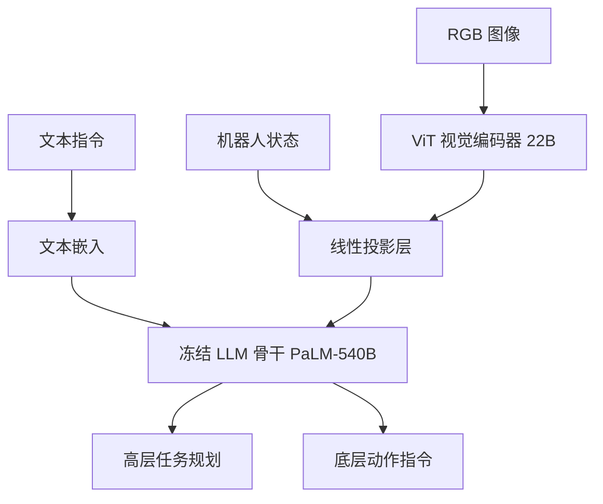

# PaLM-E: An Embodied Multimodal Language Model

- 本地 PDF：`papers/vla-reasoning/PaLM-E_Embodied_Multimodal_Language_Model_2303.03378.pdf`
- arXiv：https://arxiv.org/abs/2303.03378
- 年份：2023
- 阶段：具身多模态语义

## 一句话总结

PaLM-E 将连续传感器观测（图像、状态估计、场景点云）通过可学习的投影矩阵映射到 LLM 的 token embedding 空间，使大语言模型在不修改预训练权重的前提下，接收并理解具身模态输入，从而进行语义推理与操作规划。

## 核心技术

1. **多模态 token 注入（Multimodal Token Injection）** — 将图像、机器人状态等连续传感器信号编码为向量，通过可学习线性投影映射到 LLM 的 embedding 空间，与文本 token 拼接形成统一序列
2. **冻结 LLM 预训练权重的增量训练策略** — 保持 PaLM 预训练权重不变，仅训练新增的模态编码器与投影层，避免灾难性遗忘
3. **层次化解释（Hierarchical Grounding）** — 高层 LLM 输出语义规划文本（如 "pick up the red block from table"），由下层低层控制器解析为具体动作序列，形成认知与运动的分层接口

## 底层原理与数学推导

PaLM-E 的核心思想是**将具身模态的连续感知信号编码为 LLM 可理解的离散 token 向量的形式**，使得 LLM 可以在统一的序列建模框架内同时处理文本指令和传感器输入。

**模态编码与投影机制**：

给定一幅机器人视角的图像 $I \in \mathbb{R}^{H \times W \times 3}$，首先经过一个视觉编码器（ViT）提取特征：

$$z = \text{ViT}(I), \quad z \in \mathbb{R}^{N \times d_v}$$

其中 $N$ 为视觉 token 数（通常取 256），$d_v$ 为视觉编码器输出的特征维度。然后，通过一个可学习的线性投影层 $W_p \in \mathbb{R}^{d_v \times d_{\text{LLM}}}$ 将视觉特征映射到 LLM 的 token embedding 空间：

$$e_{\text{img}} = z W_p, \quad e_{\text{img}} \in \mathbb{R}^{N \times d_{\text{LLM}}}$$

其中 $d_{\text{LLM}}$ 为 LLM 的隐藏层维度（PaLM-540B 中为 2560）。

**统一序列拼接**：

将文本 token embedding $e_{\text{txt}}$ 与具身 token embedding $e_{\text{img}}$ 在序列维度拼接：

$$E = [e_{\text{txt}}^1, ..., e_{\text{txt}}^m, e_{\text{img}}^1, ..., e_{\text{img}}^N] \in \mathbb{R}^{(m+N) \times d_{\text{LLM}}}$$

拼接后的序列 $E$ 直接送入 LLM 的 Transformer 层进行自回归建模。由于图像编码 $e_{\text{img}}$ 已在语义上与文本 token 对齐（通过联合训练投影层），LLM 可以自然地跨模态进行推理。

**目标函数**：

PaLM-E 的优化目标为标准自回归语言建模的交叉熵损失，仅对文本 token 计算 loss，不对视觉 token 做重建或对比学习：

$$\mathcal{L} = -\sum_{i=m+1}^{m+N_{\text{out}}} \log p(t_i | t_{<i}, E_{\text{input}})$$

其中 $t_i$ 为输出文本 token，条件概率由 LLM 的自回归解码过程给出。这种设计极大简化了训练流程——不需要图像重建头或额外的对齐损失函数。

**投影层的梯度传播机制**：

投影层 $W_p$ 是唯一连通视觉编码器与 LLM 的梯度通道。在反向传播中，损失 $\mathcal{L}$ 对投影层权重的梯度为：

$$\frac{\partial \mathcal{L}}{\partial W_p} = \frac{\partial \mathcal{L}}{\partial E} \cdot \frac{\partial E}{\partial W_p} = \sum_{i=1}^N \frac{\partial \mathcal{L}}{\partial e_{\text{img}}^i} \cdot (z^i)^\top$$

视觉编码器 ViT 也可通过此通道接收梯度更新（实践中可选择冻结或微调），但 LLM 主体部分的权重始终冻结，这一选择是**防止灾难性遗忘**的关键：预训练 LLM 中储存的海量互联网语义知识不应在与机器人数据的微调中被覆盖。

## 物理直觉解释

PaLM-E 的本质，**是把 LLM 当作一个「不缺常识的大脑」，给它装上一双「机器人的眼睛」**。

- **为什么投影层就够用了？** LLM 的 embedding 空间本身具有极强的语义结构——"苹果"和"香蕉"的 embedding 距离近，"苹果"和"汽车"的距离远。图像经过 ViT + 投影层后，如果输出的 embedding 也在 LLM 的语义空间中合理排列，LLM 就能像读文字一样"读"图像内容，不需要修改模型内部任何参数
- **冻结 LLM 的意义**：想象一个精通物理学的教授，给他一副特制眼镜让他能看到力场——他不需重新学习物理，只需学会解读新眼镜传来的信息。同理，LLM 的世界知识（物体属性、空间关系、因果推理）已经完全足够，仅需学会解析新的传感器模态
- **层次化接口的必要性**：LLM 输出的是语义 token（如 "move gripper 10cm left"），而非底层电机电流指令。这是因为 LLM 的推理粒度天然是语义级的——就像人类思考"拿起杯子"时，大脑并不会显式计算每一块肌肉的收缩量。PaLM-E 精确地在这条认知边界上划清了 LLM 和底层控制器的责任

## 工程细节与实操指南

**系统配置与训练超参：**

- 基座模型：PaLM-540B（5400 亿参数，仅解码器 Transformer，隐藏层维度 2560），权重全部冻结
- 视觉编码器：ViT-4B（40 亿参数），可选择性微调
- 投影层：单层线性变换 $W_p \in \mathbb{R}^{d_v \times d_{\text{LLM}}}$，参数量约 $d_v \times d_{\text{LLM}}$（以 ViT 输出 1024 维、LLM 维度 2560 计，约 260 万参数）
- 训练数据：混合互联网图文数据 + 机器人示教数据（约 5.6 万条轨迹），多任务联合训练
- Batch Size: 512（受限于 540B 模型显存需求），训练步数约 15 万步
- 学习率：1e-4（AdamW 优化器），线性 warmup 2000 步后余弦衰减

**落地实操标准步骤：**

1. **传感器校准与归一化**：对机器人关节角度、夹爪宽度、力传感器读数做 Z-score 归一化，消除不同传感器量纲差异
2. **图像预处理**：统一尺寸为 $224 \times 224$，做随机颜色抖动、裁剪增强，提升泛化性
3. **输入封装**：将文本指令 tokenize 为离散 token 序列 $e_{\text{txt}}$；图像经 ViT 编码 + 投影层处理为 $e_{\text{img}}$；在序列末尾添加状态向量投影 $e_{\text{state}}$（若使用状态信息）。最终拼接为 $(m+N+K) \times d_{\text{LLM}}$ 的统一序列
4. **语义规划输出后处理**：LLM 输出文本形式的操作步骤（如 "Move to the left of the mug, lower gripper, close gripper, lift"），通过有限状态机或正则表达式解析为下层控制器的可执行路径。这一解耦使同一 LLM 可适配不同型号的机器人底层接口

**关键工程陷阱：**
- 模态注入的位置：PaLM-E 发现将视觉 token 插入在文本 token 之前，而非拼接在末尾，在复杂场景理解上有 3-5% 的准确率提升——因为 LLM 在自回归解码时，早期步骤即可访问视觉上下文
- 梯度阻塞策略：视觉编码器与投影层的梯度不应流入冻结的 LLM，PyTorch 实现中需通过 `.requires_grad_(False)` 对 LLM 部分断梯度，或在优化器中排除 LLM 参数

## 消融实验与分析

| 消融因子 | 变化 | 结论 |
|---------|------|------|
| 模态注入方式 | token projection vs 文本描述 | 可学习投影矩阵优于文本化 |
| LLM 冻结 vs 微调 | frozen vs full fine-tune | 冻结 LLM 保留预训练知识是关键 |
| 输入模态组合 | 视觉+状态 vs 单模态 | 多模态融合显著优于单模态 |

**核心结论**：可学习的模态投影矩阵使 LLM 在不修改预训练权重的前提下理解具身传感器输入。

## 技术权衡（Trade-off）

| 优势 | 劣势与工程代价 |
|------|---------------|
| 冻结 LLM 权重保留全部预训练知识，避免灾难性遗忘 | 投影层是唯一的信息通道，若映射不充分会成为信息瓶颈，限制多模态理解上限 |
| 层次化设计解耦语义推理与底层控制，提升系统灵活性 | 产生语义-动作的信息损耗：高层规划的指令需下层控制器补充大量低层级执行细节 |
| 单模型支持跨多种感知模态（图像、状态、点云）的统一输入 | 模型规模极大（540B），推理成本极高，不适合边缘部署和实时控制场景 |
| 证明 LLM 可原生接收连续传感器输入，开创具身多模态新范式 | 不直接输出底层动作，无法实现端到端的高频（>10Hz）闭环控制 |

## 技术价值与演进定位

PaLM-E 是**多模态 LLM 用于具身智能的起点**,首次证明了冻结 LLM 预训练知识、通过投影层接入具身模态的技术路线可行。它的核心贡献不在于提升某个具体操作任务的 SOTA，而在于开启了「语言模型+感知输入」这一全新的研究范式：

- **语义层面**：PaLM-E 让 LLM 的理解能力从纯文本扩展到物理世界——模型知道"红色方块在蓝色方块上面"这样的空间关系，而且能基于此进行任务规划
- **架构层面**：提出的模态 token 注入、冻结 LLM 增量训练、层次化接口三大设计，直接为后续模型奠定了基础
- **局限层面**：PaLM-E 本质只做"感知+规划"，不做底层控制。它用 LLM 输出的语义文本作为中间表示，而非直接的动作 token，这决定了它更适合作为系统架构中的高层组件，而非完整的端到端控制方案

后续演进清晰地分了两个方向——RT-2 继承具身多模态思想，收窄为端到端 VLA 架构：去掉层次化接口，将动作 token 直接接入 VLM 输出层。而 VoxPoser 则保留了层次化设计，用 LLM/VLM 生成 3D value map 而非文本，实现了更丰富的空间约束表达，但其架构更加复杂、链路更长。

## 与其他论文的关系

- **RT-2** 直接继承 PaLM-E 的多模态 token 注入思想，但将输出从语义文本改为动作 token，完成从「感知+规划」到「感知+动作」的端到端演进
- **VoxPoser** 同样使用 LLM/VLM 做高层语义推理，但输出形式从文本改为 3D value map，将空间约束直接传递到运动规划器，避免语义-动作的信息损耗
- **OpenVLA** 延续 PaLM-E 的视觉-语言融合方案，但采用更小的开源 VLM（7B 参数而非 540B），并加入端到端动作输出头，大幅降低了部署门槛

## 精读问题

1. PaLM-E 的投影层 $W_p$ 是否构成信息瓶颈？如果视觉 token 数 $N$ 从 256 减少到 64，多模态任务性能会如何变化？
2. 冻结 LLM 权重虽然防止了灾难性遗忘，但也限制了具身模态对 LLM 语义空间的适配能力。这种「零和博弈」是否存在一个最优的微调层数 compromise？
3. PaLM-E 的层次化语义接口输出文本操作步骤，再由下层控制器执行——这种信息传输路径中丢失了什么信息？RT-2 的端到端动作输出相比于层次化设计有哪些本质优势？
4. 当 PaLM-E 处理多张图像或多视角输入时，如何保持跨视角的空间一致性？ViT 的位置编码是否需要为 3D 场景做特殊设计？
