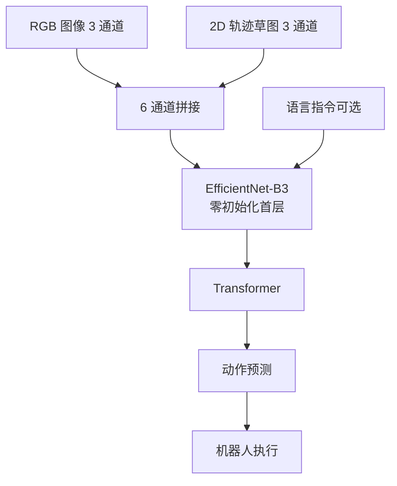

# RT-Trajectory: Robotic Task Generalization via Hindsight Trajectory Sketches

- 本地 PDF：`papers/vla-reasoning/RT-Trajectory_Robotic_Task_Generalization_2311.01977.pdf`
- arXiv：https://arxiv.org/abs/2311.01977
- 主页：https://rt-trajectory.github.io/
- 年份：2023
- 阶段：通过中间层任务表征（轨迹草图）实现任务泛化
- 作者：Google DeepMind + UCSD + Stanford（Jiayuan Gu, Sean Kirmani, Ted Xiao 等）

## 一句话总结

RT-Trajectory 提出将粗粒度 2D 轨迹草图画到 RGB 图像上作为策略的条件输入，从而让机器人泛化到训练中从未见过的全新操作任务——这是 VLA 中「任务表征」维度的关键创新。

## 核心技术

1. **2D 轨迹草图覆盖（Trajectory Sketch Overlay）** — 将机械臂末端执行器的 2D 轨迹绘制在相机 RGB 图像上作为策略输入，提供中间粒度的任务描述
2. **事后轨迹标注（Hindsight Trajectory Labeling）** — 利用已有示教数据集中的机器人位置信息自动标注轨迹草图，无需额外人工标注
3. **条件融合架构** — 将轨迹草图与 RGB 图像在通道维度拼接（concatenate），直接送入预训练 EfficientNet-B3 图像编码器
4. **多重推理轨迹生成方式** — 支持人类手绘、人类示范视频、LLM 生成代码、图像生成模型四种轨迹草图输入方式
5. **Frechet 距离运动相似性分析** — 量化评估未见任务轨迹与训练集的运动相似度，解释泛化来源

## 底层原理与数学推导

### 1. 核心动机：任务表征的中间粒度

RT-Trajectory 的核心洞察是：现有任务条件化方法位于过度详细和过度抽象两个极端。

- **语言条件**过于抽象：「把苹果放进碗里」不包含任何运动信息，无法区分「平移动」和「旋转放入」
- **目标图像条件**过于具体：包含了大量任务无关信息（背景、光照），且很难为新任务采集目标图
- **完整视频条件**过度详细：对所有状态逐一指定，学习困难和标注成本极高
- **轨迹草图**位于中间层：足够详细到表达运动指引，又足够粗略到允许策略结合视觉上下文灵活适应

### 2. 轨迹草图构建

从示教轨迹中提取三种基本元素：

**2D 轨迹**：给定末端执行器在机器人基座坐标系中的 3D 位置序列 $\{p_t\}_{t=1}^T$，通过已知的相机外参 $[R|t]$ 和内参 $K$ 投影到图像平面：

$$u_t = K [R|t] p_t, \quad u_t \in \mathbb{R}^2$$

将相邻时间步的像素坐标通过直线连接，在空白图像上绘制轨迹曲线。

**颜色编码时间进度**：在 RGB 图像的红色通道编码归一化时间步信息：

$$R(u_t) = \frac{t+1}{T}$$

表示当前时间步在整条轨迹中的相对位置，帮助策略理解运动的时序关系（如运动方向、速度变化）。

**2.5D 高度编码**：在绿色通道编码末端执行器的归一化高度：

$$G(u_t) = \frac{h_t + 1 - h_{\text{min}}}{h_{\text{max}} - h_{\text{min}}}$$

其中 $h_t$ 为末端执行器相对机器人基座的高度。这使得策略可以区分视觉上投影位置相同但高度不同的轨迹（如桌面操作 vs 抽屉内操作）。

**交互标记**：检测夹爪与物体的接触动作（抓取/释放），在关键时间步画出绿色（夹紧）和蓝色（释放）圆圈。接触检测公式：

$$\delta_t = \hat{p}_t - p_t, \quad \text{抓取触发条件：} \delta_t > 0 \land \hat{p}_t > \epsilon$$

其中 $p_t$ 为实测夹爪位置，$\hat{p}_t$ 为目标夹爪位置，$\epsilon$ 为关闭动作阈值。

### 3. 架构设计

RT-Trajectory 基于 RT-1 架构进行改造：

1. **输入拼接**：轨迹草图（RGB 图像）与相机 RGB 图像在通道维度拼接，形成 6 通道输入（3 通道原始图 + 3 通道轨迹草图）
2. **图像编码器**：使用 ImageNet 预训练的 EfficientNet-B3，首个卷积层的输入通道从 3 扩展为 6，新增权重初始化为零
3. **移除语言条件**：由于使用轨迹草图代替语言指令，移除原 RT-1 中的 FiLM 层
4. **输出**：延续 RT-1 的动作 Token 化方案（256 个离散动作分箱）
5. **训练方式**：行为克隆（Behavior Cloning），最小化动作预测的负对数似然

### 4. 训练与推理机制

**训练阶段**：
1. 从示教数据集中提取末端执行器轨迹
2. 生成事后轨迹草图（使用轨迹中的真实位置数据）
3. 将草图与 RGB 图拼接，训练条件策略 $\pi(a_t | o_t, c_{\text{traj}})$

**推理阶段**（四种生成方式）：

| 方式 | 描述 | 自动化程度 |
|------|------|-----------|
| 人类手绘 (GUI) | 用户在当前相机图像上绘制轨迹 + 标注高度 | 低（需人工） |
| 人类示范视频 | 从第一人称视频提取手部姿态，映射为机器人轨迹 | 中 |
| LLM + Code as Policies | LLM 写代码生成 3D 路径点，投影为 2D 轨迹 | 高 |
| 图像生成模型 (PaLM-E) | VLM 生成轨迹 Token，解码为轨迹图 | 高 |

### 5. Frechet 距离运动分析

为量化未见任务轨迹与训练集运动模式的差异，使用离散 Frechet 距离：

$$\text{FD}(\tau, \tau') = \max\left(d(\rho_0, \rho'_0), \min\begin{cases}
\text{FD}(\tau[1:], \tau'[1:]) \
\text{FD}(\tau, \tau'[1:]) \
\text{FD}(\tau[1:], \tau')
\end{cases}\right)$$

其中 $\tau = \{\rho_0, ..., \rho_m\}$ 为轨迹路径点序列，$d(\cdot, \cdot)$ 为欧氏距离。FD 越小表示运动模式越相似。

## 物理直觉解释

RT-Trajectory 的核心思想是「画一条线告诉机器人怎么动」。语言指令的问题是太模糊——你说「把易拉罐放到抽屉里」，但机器人不知道应该先往下再往前还是直接平移。轨迹草图就像在 Google 地图上画一条路线，告诉机器人「沿着这条路径走」，但具体怎么走（遇到障碍怎么绕，抓取角度怎么调整）由机器人自己决定。

- **为什么画线而不是直接控制？** 画线是中间层——不指定每个关节角度（太详细），也不只给「把东西放好」（太模糊）。线给了大致路径，但机器人用视觉反馈自行调整精确执行。

- **2.5D 高度信息为什么重要？** 2D 轨迹从相机视角看是平面上的线，无法区分「把手伸到桌面高度」和「把手伸到抽屉内部」（视觉上投影位置可能一样）。加上绿色通道的高度编码后，轨迹图变成了伪 3D 表示，高度不同的任务可以区分。

- **事后轨迹标注的妙用**：已有示教数据里只有 RGB 图像和机器人状态，没有轨迹图。但你可以用机器人关节位置计算出末端轨迹，然后投影到图像上。这就像在有答案的作业上自动画出解题路径——不需要额外人工。

- **为什么轨迹草图能泛化到新任务？** 因为操作的底层模式是运动轨迹。一个「pick and place」任务和一个「折叠毛巾」任务在语言层面完全不同，但在运动层面有相似的弧线轨迹。当新任务的轨迹草图与训练集中的某些运动模式相近时，模型可以「借用」已有知识进行插值推理。

## 工程细节与实操指南

### 训练数据

- **基础数据集**：RT-1 Everyday Robots 数据集
- **可见技能**：8 种操作技能（Pick, Move Near, Place Upright, Knock Over, Open/Close Drawer, Place into Receptacle, Pick from Receptacle）
- **训练任务数**：542 个可见任务
- **示教规模**：约 73K 条真实机器人示教
- **机器人平台**：Everyday Robots 移动操作臂（7-DoF 手臂 + 二指夹爪 + 移动底座）

### 未见评估任务

设计了 7 个全新任务，测试不同维度泛化：

| 未见技能 | 测试维度 | 难点 |
|----------|----------|------|
| Place Fruit | 新容器 | 将水果放入细高容器 |
| Upright and Move | 技能组合 | 先立直再移动 |
| Move within Drawer | 新高度区域 | 抽屉内部平面操作 |
| Restock Drawer | 精确定位 | 放到抽屉特定位置 |
| Pick from Chair | 新高度 + 新工作空间 | 从椅子面（比桌子低）拾取 |
| Fold Towel | 可变形物体 | 毛巾折叠操作 |
| Swivel Chair | 非刚性系统交互 | 推动转椅旋转 |

### 训练超参数与架构

- **骨干网络**：RT-1 Transformer + EfficientNet-B3 图像编码器
- **输入**：6 通道图像（3 RGB + 3 轨迹草图），历史 6 帧
- **动作 Token 化**：同 RT-1，256 个离散分箱
- **轨迹草图分辨率**：与输入图像相同
- **高度编码**：归一化到 [0,1] 范围，映射到绿色通道
- **训练损失**：行为克隆的交叉熵损失

### 推理时的轨迹生成

**GUI 绘制流程**：
1. 获取机器人当前相机图像
2. 用户在图像上拖拽鼠标绘制曲线
3. 点击画布添加抓取/释放标记（绿色/蓝色圆圈）
4. 可选：标注曲线上关键点的高度值（未标注点自动插值）
5. 生成最终 2.5D 轨迹草图，输入策略

**Code as Policies 流程**：
1. VLM 检测场景中物体的名称和位置
2. LLM 接收任务指令 + 物体信息 + 机器人约束
3. LLM 编写 Python 代码生成 3D 路径点
4. 路径点通过相机矩阵投影为 2D 轨迹
5. 添加交互标记，生成轨迹草图

## 实验结果精华

### 未见任务泛化（核心对比）

| 方法 | Place Fruit | Upright and Move | Move within Drawer | Restock Drawer | Pick from Chair | Fold Towel | Swivel Chair | **总体** |
|------|-------------|-------------------|--------------------|---------------|-----------------|------------|-------------|---------|
| **RT-Trajectory (2.5D)** | **75%** | **50%** | **100%** | 67% | **38%** | **75%** | **70%** | **67%** |
| RT-Trajectory (2D) | 75% | 33% | 67% | **92%** | 0% | 75% | 0% | 50% |
| RT-1 (语言条件) | 0% | 17% | 33% | 42% | 0% | 0% | 17% | 17% |
| RT-2 (VLM) | 33% | 0% | 0% | 17% | 0% | 0% | 0% | 11% |
| RT-1-Goal (目标图像) | 8% | 0% | 17% | 42% | 17% | 0% | 50% | 26% |

关键发现：
- RT-Trajectory (2.5D) 以 67% 大幅超越 RT-1（17%）、RT-2（11%）和 RT-1-Goal（26%）
- 语言条件下 RT-1 和 RT-2 泛化到新任务时几乎完全失效
- 2.5D 高度编码对需要精确高度感知的任务（Swivel Chair, Pick from Chair）至关重要

### 不同轨迹生成方式的比较

**人类示范视频**：RT-Trajectory 在 Pick 任务上 94-100%（vs IK Planner 42%），Fold Towel 上 75%（vs IK Planner 25%）。轨迹草图虽比训练数据更抖动，但策略仍能适应。

**LLM Code as Policies**：Pick 任务 89%（vs IK Planner 83%），Open Drawer 60%（vs IK Planner 71%）。LLM 生成的轨迹更精确线性，但 RT-Trajectory 的视觉适应能力使其在需要自适应调整的任务上优于纯 IK 规划。

### 涌现能力

1. **视觉提示工程**：同一起始场景下，改变轨迹草图即可改变策略行为模式。类似于大语言模型的 prompt engineering，失败时无需重新训练，只需修改轨迹提示。
2. **失败重试行为**：在打开抽屉任务中，首次抓取把手失败后，策略会自动切换到抓取抽屉边缘并再次尝试——这种重试行为并未被显式编程。
3. **真实场景鲁棒性**：在两个新建筑的真实厨房、卧室、浴室场景中，面对全新背景、光照、物体、家具几何，RT-Trajectory 仍能成功完成任务。

## 技术权衡

| 优势 | 劣势与工程代价 |
|------|---------------|
| 轨迹草图是任务泛化的「甜点」表征——介于过详细和过抽象之间 | 依赖相机标定：2D 投影需要精确的相机内参和外参，标定错误会直接导致轨迹失效 |
| 4 种推理时轨迹生成方式提供极大的灵活性 | 推理时需要人工或自动生成轨迹草图，增加了使用环节（不如语言指令直接） |
| 大幅超越语言和目标图像条件方法的未见任务泛化能力 | 2D 轨迹存在高度歧义性（2.5D 编码部分缓解但需要额外高度标注） |
| 支持视觉提示工程，无需重训练即可调整行为 | 轨迹草图生成质量直接影响策略执行效果，低质量草图导致失败 |
| 涌现重试行为等非显式编程能力 | 仅支持固定相机 + 固定基座的桌面操作场景，未推广到移动操作 |
| 定量分析（Frechet 距离）揭示泛化来源于运动模式插值 | 轨迹生成自动化依赖外部系统（LLM, VLM, 手部姿态估计），稳定性不可控 |

### 轨迹草图质量的依赖问题

RT-Trajectory 的一个核心局限性是策略性能对轨迹草图质量的敏感依赖：

1. **手工绘制质量**：用户绘制曲线的平滑度、高度标注的准确性直接影响执行效果。论文发现 suboptimal 轨迹提示可以通过「工程调优」（同一个场景试不同轨迹）来改善。
2. **自动化生成的不稳定性**：
   - LLM 生成的轨迹偏精确线性，与训练数据中的自然轨迹差异较大
   - 图像生成模型产生的轨迹噪声较大
   - 人类视频提取的轨迹抖动较大
3. **没有约束机制**：策略仅能「尽力跟随」轨迹，无法处理轨迹中指定的避障或强制约束区域

## 技术价值与演进定位

RT-Trajectory 贡献了一种全新的任务表征范式——轨迹草图。它不像 RT-1/RT-2 那样在「模型规模」或「知识来源」上突破，而是在「人机交互接口」和「任务泛化机制」上做出了关键创新：

核心贡献：
1. **首次提出轨迹草图作为机器人策略的条件输入**，证明了中间粒度任务表征对泛化的关键作用
2. **事后轨迹标注方法**使得该方法可以无缝应用于任何现存示教数据集
3. **系统性的运动泛化分析**（Frechet 距离）揭示了轨迹条件策略的泛化来源——运动模式的插值而非语义理解
4. **多种轨迹生成方式**验证了该方法作为通用接口的灵活性

## 与其他论文的关系
- **RT-1**：直接继承其架构和数据集，但用轨迹草图替代语言条件+FiLM层
- **RT-2**：对比基线（11% vs 67%），说明单纯增大模型和知识规模无法解决运动泛化
- **Code as Policies / PaLM-E**：作为轨迹草图的生成器出现，形成互补关系
- **VoxPoser**：也在 3D 空间生成动作约束，但基于 3D 价值图而非 2D 轨迹草图

## 精读问题

1. 轨迹草图能泛化到什么程度？是否所有操作任务都能被 2D 轨迹有效表达？
2. 2.5D 高度编码为什么能带来如此大的性能提升（50% -> 67%）？高度信息是否可以通过 RGB 图像本身推断？
3. 轨迹草图与语言条件能否结合，实现更灵活的任务指定？
4. Frechet 距离分析显示未见任务的运动和训练集有相似性，但能否预测策略是否成功？
5. 轨迹草图的自动化生成如何随 VLM/图像生成模型的进步而自然提升？这是否构成一条 Scalable 的路线？
