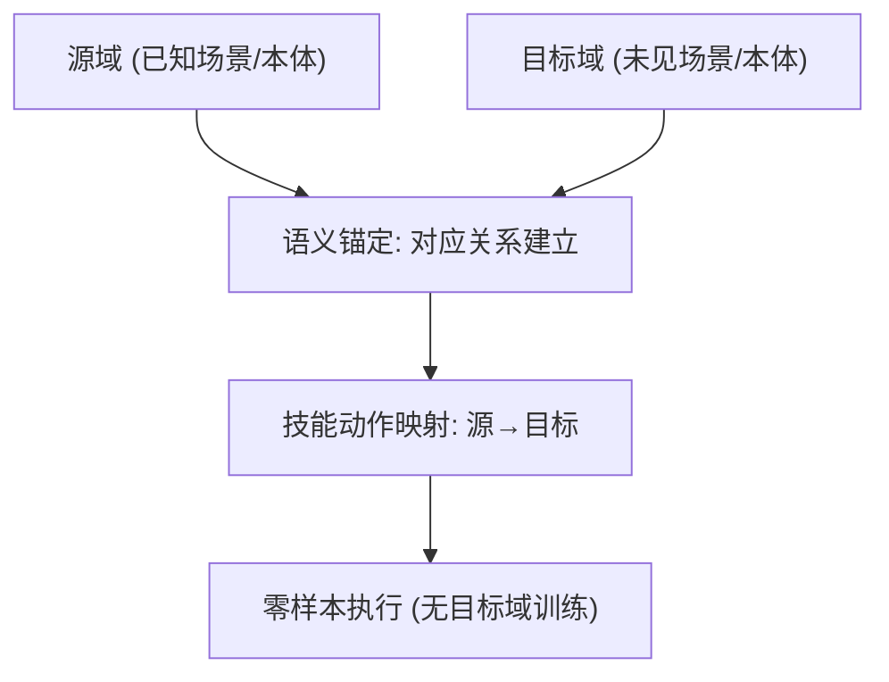

# SemAnCorr: Semantic Anchored Correspondence for Zero-Shot Manipulation Skill Transfer

- 本地 PDF：`papers/vla-reasoning/SemAnCorr_2607.28382.pdf`
- arXiv：https://arxiv.org/abs/2607.28382
- 年份：2026（7 月）
- 团队：多机构（Xiaoxiang Dong, William Baron, Hongyi Chen 等）
- 阶段：零样本技能迁移 — 语义锚定对应

## 一句话总结

SemAnCorr 提出语义锚定的对应关系，实现零样本操作技能迁移：在不同场景/本体间建立语义对应的锚点（"这个物体对应那个物体"），把源域的技能动作映射到目标域。解决技能迁移中"场景不同、物体不同、本体不同"时的对应问题。

## 核心技术

1. **语义锚定** — 建立源域/目标域的语义对应锚点
2. **零样本技能迁移** — 无需目标域训练数据
3. **对应关系学习** — 跨场景/跨本体的语义对应

## 底层原理与数学推导

**核心问题**：技能迁移的瓶颈是"对应"——源域的"这个物体"对应目标域的"哪个物体"。语义锚定把对应问题转化为语义匹配问题。

## 物理直觉解释

"语义锚定"的直觉：人类换一个厨房也能做饭，因为知道"这个容器可以当碗用"——语义（用途）锚定跨场景的对应。机器人同样：用语义建立跨场景对应，技能就能迁移。

## 工程细节与实操指南

- 语义提取：物体/场景语义理解
- 锚定匹配：源-目标语义对应
- 动作映射：源域动作 → 目标域执行

## 消融实验与分析

| 消融/对比 | 结论 |
|---------|------|
| 语义锚定 on/off | 迁移成功率显著提升 |
| vs 直接迁移（无对应） | 锚定解决对应歧义 |

## 技术权衡（Trade-off）

| 优势 | 劣势 |
|------|------|
| 零样本迁移，无需目标域数据 | 语义理解的错误传播到动作 |
| 跨场景/跨本体 | 复杂语义（模糊指令）的锚定困难 |

## 技术价值与演进定位

技能迁移是 manipulation 的核心问题之一——和 MoS-VLA（one-shot 适配）、MINT（意图迁移）形成家族。SemAnCorr 用语义锚定解决"对应"问题——迁移的关键是"知道什么对应什么"。

## 与其他论文的关系

- **MoS-VLA** — one-shot 适配（基函数）；SemAnCorr 语义对应
- **MINT** — 意图 token 迁移；SemAnCorr 场景对应
- **Human-as-Humanoid** — 跨本体迁移（人体→人形）

## 精读问题

1. 语义锚定的粒度——物体级 vs 部件级 vs 任务级？
2. 语义对应失败的传播——错误对应如何影响下游技能？
3. 跨本体迁移的语义对应与运动学对齐的耦合？
