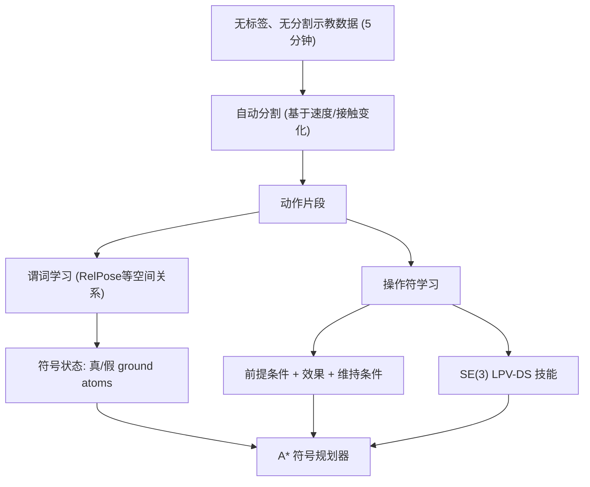

# SymSkill: Symbol and Skill Co-Invention for Data-Efficient and Reactive Long-Horizon Manipulation

- 本地 PDF：`papers/vla-architecture/SymSkill_2510.01661.pdf`
- arXiv：https://arxiv.org/abs/2510.01661
- 项目主页：https://symskill.github.io/
- 年份：2026 (ICRA 2026 Best Conference Paper + Best Paper on Planning and Control)
- 团队：UPenn GRASP Lab (Yifei Simon Shao, Vijay Kumar, Pratik Chaudhari, Nadia Figueroa 等)
- 阶段：符号 + 技能共同发明 —— 打通符号规划与机器人柔顺操作的鸿沟

## 一句话总结

SymSkill 提出符号与技能共同发明框架：从无标签、无分割的示教数据中无监督联合学习谓词（predicates）、操作符（operators）和目标导向技能，在线时通过符号规划器动态组合技能实现长程操作，配合实时故障恢复和柔顺控制器。仅需 5 分钟无标签玩耍数据即可在 Franka 上执行 12 步组合任务，RoboCasa 85% 单步成功率。ICRA 2026 双奖（全场最佳 + 规划控制最佳）。

## 核心技术

1. **符号与技能共同发明 (Co-Invention)** — 离线阶段从无标签、无分割演示中同时学习符号抽象（谓词 + 操作符）和连续技能（SE(3) Dynamical Systems），无需人工标注操作符或分步边界
2. **SE(3) LPV-DS 技能学习** — 每个操作符对应一个全局稳定的 Linear Parameter Varying Dynamical System，通过 GMM 拟合示教轨迹 + 半定规划求解 Lyapunov 稳定约束，确保技能的稳定性和抗扰动能力
3. **符号在线规划 + 实时故障恢复** — A* 搜索在符号空间组合技能，在线监测符号状态变化；运动层故障（障碍物）通过 attractor resampling 自动恢复，符号层故障（非预期状态变化）触发重规划
4. **柔顺控制器** — 被动的 compliant controller 使技能在人类推拉和环境扰动下保持安全

## 底层原理与数学推导

### 离线 Pipeline

### SE(3) LPV-DS 技能

位置控制（LPV-DS）公式——连续线性时不变系统的混合：

$$v = \sum_{k=1}^{K} \gamma_k(x) A_k (x - x^*)$$

其中 $\gamma_k(x)$ 由 GMM 分配权重，$A_k$ 通过半定规划（SDP）学习并满足全局渐近稳定性约束。方向控制用 Quaternion-DS。

### 谓词与操作符

谓词 $\psi(A, B) \in \{\text{True}, \text{False}\}$ 定义空间关系。操作符 $\alpha$ 包含：
- **参数**：所需物体/参考坐标系类型
- **前提条件**：执行前必须成立的谓词
- **效果**：执行后添加/删除的谓词
- **维持条件**：执行过程中必须保持的谓词
- **技能**：$\langle f, g \rangle$：DS 策略 + 抓取动作

### 在线执行

1. 用户指定目标谓词集合
2. A* 规划器在符号空间搜索操作符序列
3. 执行每个操作符的技能，同时监测符号和运动状态
4. 运动层故障 → attractor resampling 在连续空间恢复
5. 符号层故障 → 触发重规划
6. 柔顺控制器被动应对物理扰动

## 物理直觉解释

SymSkill 让机器人从"背动作"进化到"理解题目"。传统模仿学习就像背答案——看到场景 A 做动作 B，场景变了就不行了。SymSkill 的做法是：从演示中自主发现"推"和"拉"是两个不同的操作，并且"推"的前提是"手在物体后方"——它自己归纳出这些符号概念，然后像积木一样组合成多步计划。

5 分钟的无标签数据就够，因为这 5 分钟不是用来"背"的，是用来"理解结构"的——就像你看别人做一道新菜 5 分钟，你能理解步骤之间的逻辑关系，第二天换了个厨房也能复现。模仿学习需要看成百上千遍才能泛化，因为它不理解结构。

## 工程细节与实操指南

- **自动分割**：基于末端速度变化和手指接触状态检测动作边界，无需人工标注分步
- **谓词类型**：RelPose（相对位姿关系）、Contact、Grasped 等空间关系谓词
- **GMM 拟合**：对每个分割片段的示教轨迹拟合 GMM，确定 LTI 系统数量 K
- **SDP 求解**：每个 $A_k$ 通过半定规划学习，约束条件确保 $\dot{V}(x) < 0$（全局稳定性）
- **符号规划**：A* 搜索，heuristic 为剩余未满足的目标谓词数量
- **柔顺控制器**：基于 passive DS controller，外力推拉时自然顺应而不失稳
- **硬件**：Franka Panda 7-DoF 机械臂
- **真实实验**：5 分钟玩耍数据 → 学习 11 个操作符 → 执行 12 步组合任务

## 消融实验与分析

| 消融因子 | 变化 | 结论 |
|---------|------|------|
| 符号规划 + 技能 | full SymSkill vs 端到端 IL | IL 无法泛化到未见过的多步组合 |
| 有/无实时故障恢复 | recovery on vs off | 无恢复时任何运动层失败即终止 |
| 柔顺控制 | compliant vs stiff | 无柔顺时人类扰动导致不稳定 |
| 数据量 | 5min vs 2min vs 10min | 5 分钟足够，更多数据边际增益小 |
| 有/无自动分割 | auto segmentation vs manual | 自动分割效果接近人工标注 |

**核心结论**：符号抽象使组合泛化成为可能——11 个操作符可以动态组合出训练中从未出现过的任务序列。实时故障恢复是长程操作可靠性的必要保障。

## 技术权衡（Trade-off）

| 优势 | 劣势与工程代价 |
|------|----------------|
| 5 分钟数据即可学习符号抽象和技能 | 当前谓词以空间关系为主，覆盖面有限 |
| 符号规划天然支持组合泛化和重排 | 符号抽象的质量直接影响规划能力 |
| 实时故障恢复 + 柔顺控制，安全性好 | SDP 求解的 scalability 对高维系统有挑战 |
| DS 技能有形式化的稳定性保证 | DS 对复杂动态任务（如穿插拧紧）表达能力有限 |

## 技术价值与演进定位

SymSkill 是 VLA 技术树上最重要的分叉之一：它证明"更大的模型 + 更多的数据"不是唯一出路，符号推理 + 技能学习可以在极少数据下达到更强的泛化能力。与 PALM 的 affordance reasoning 和 G0.5 的 Native CoT 形成互补——三者都是让 VLA 从"反应"走向"思考"，但 SymSkill 走的是离散符号路线，前两者是端到端推理路线。ICRA 2026 双奖加冕表明社区对这一方向的高度认可。

## 与其他论文的关系

- **PALM (CVPR 2026)** — 同为长程操作，PALM 用连续 affordance + progress，SymSkill 用离散符号 + 规划
- **VoxPoser (2023)** — 用 LLM 代码生成 3D value map 做零样本操作，SymSkill 从数据自主发现符号而非依赖 LLM
- **G0.5 (2026)** — Native CoT 是端到端推理，SymSkill 是显式符号规划
- **RT-Trajectory (2023)** — 轨迹草图作为中间表征，SymSkill 的谓词是更抽象的中间表征
- **ACT / Diffusion Policy** — 纯模仿学习 baseline，SymSkill 在泛化上系统性超越

## 精读问题

1. 谓词类型目前以 RelPose 为主——如何扩展到力觉、视觉遮挡、语义约束等更丰富的谓词？
2. SDP 求解 $A_k$ 的 scalability 瓶颈——高维系统（如双臂、全身）能否保持实时性？
3. 符号抽象的质量依赖自动分割的准确性——分割错误的传播路径和恢复机制？
4. SymSkill 能否和 VLA（如 OpenVLA/π0）结合——VLA 提供开放词汇的语义 grounding，SymSkill 提供符号规划和技能组合？
