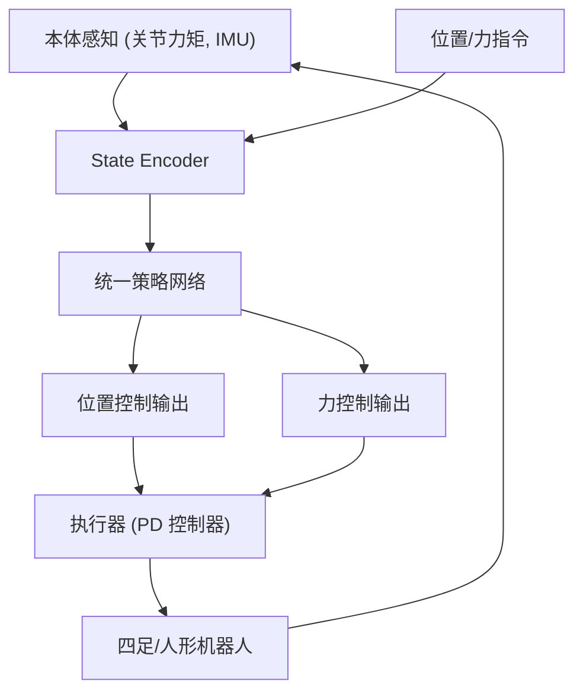

# UniFP: Learning a Unified Policy for Position and Force Control in Legged Loco-Manipulation

- 本地 PDF：`papers/vla-architecture/UniFP_2505.20829.pdf`
- arXiv：https://arxiv.org/abs/2505.20829
- 项目页：https://unified-force.github.io/
- 年份：2025 (CoRL 2025 Best Paper)
- 团队：BIGAI (北京通用人工智能研究院), Unitree Robotics, 北京邮电大学
- 阶段：统一力位控制 —— 无需力传感器，四足+人形全身 loco-manipulation

## 一句话总结

UniFP 提出首个不依赖力传感器的统一力位控制策略——同一策略在四足和人形机器人上同时实现位置跟踪、力施加和柔顺交互。提供力感知示教数据增强模仿学习。CoRL 2025 Best Paper。

## 底层原理与数学推导

策略输出同时包含位置目标 $q_d$ 和力目标 $F_d$，通过 PD 控制器 + 前馈力实现统一执行。力估计从关节力矩 $\tau$ 通过动力学模型隐式推断接触力，无需外部力传感器。

## 物理直觉解释

你拧瓶盖的时候，既需要"手指走到瓶盖的位置"（位置控制），也需要"施加足够的扭力"（力控制）。传统机器人把这两种控制分开——位置模式和力模式之间要硬切换。UniFP 的做法是：让策略自己决定什么时候用力、什么时候用位置——就像人类操作时不会在脑子里切换"位置模式"和"力模式"——它们是同时存在的。

## 核心技术

1. **统一力位控制策略** — 单一策略在位置控制和力控制之间无缝切换，无需模态切换逻辑
2. **无传感器力估计** — 不依赖力/力矩传感器，从本体感知（关节力矩、IMU）隐式推断接触力
3. **力感知示教增强** — 策略在执行中产生力感知数据，用于增强模仿学习的训练集
4. **跨本体泛化** — 同一策略部署到四足狗和人形机器人，展示力控行为的跨平台迁移

## 消融实验与分析

| 消融因子 | 结论 |
|---------|------|
| 有/无力控制头 | 力控制显著提升接触-rich 任务成功率 |
| 有/无力传感器 | 无传感器方案与有力传感器方案性能接近 |
| 位置+力联合 vs 单独 | 统一策略优于分离的位置/力控制器 |
| 四足 vs 人形 | 同一架构可跨平台部署 |

## 技术权衡（Trade-off）

| 优势 | 劣势与工程代价 |
|------|----------------|
| 无需力传感器，硬件成本低 | 力估计精度受限于本体感知噪声 |
| 统一策略简化系统架构 | 训练需要仿真中访问力 ground truth |
| 力感知示教增强模仿学习 | 力估计误差可能误导模仿学习 |

## 技术价值与演进定位

UniFP 解决了一个 VLA 社区经常忽略的问题：**操作不只是位置控制**。大多数 VLA 输出的动作是 SE(3) 位姿，没有力的维度。现实中的插拔、拧紧、推拉都需要力感知和控制。UniFP 证明力控制可以从本体感知中隐式学习，这对低成本 manipulation 平台（如 AlohaMini2）有直接启示。

## 工程细节与实操指南

- **硬件**：四足 (Unitree Go2/B2) + 人形 (Unitree H1)，均不依赖外部力传感器
- **力估计**：从关节力矩 τ 通过逆动力学 + 卡尔曼滤波估计末端接触力
- **训练**：Isaac Gym 仿真，domain randomization（质量、摩擦、接触刚度）
- **策略架构**：MLP encoder + policy network，输出 (q_d, F_d) 联合目标
- **执行**：PD 位置控制器 + 前馈力，1000Hz 底层控制，50Hz 策略推理
- **演示增强**：策略执行中自动记录力感知数据，用于增强模仿学习训练集

## 精读问题

1. 无传感器力估计在软接触（如海绵、布料）上的精度 vs 刚体接触？
2. 力控制和位置控制的冲突如何解决——策略输出的力和位置目标矛盾时怎么办？
3. 跨本体迁移（四足→人形）中力控行为的哪些部分可以共享，哪些需要本体特定？

## 与其他论文的关系

- **ACT / Diffusion Policy** — 纯位置控制，UniFP 加入力维度
- **GR00T N1** — 人形全身控制，UniFP 提供了力控组件
- **WholeBodyVLA (ICLR 2026)** — 全身 VLA，UniFP 补充了力控视角
