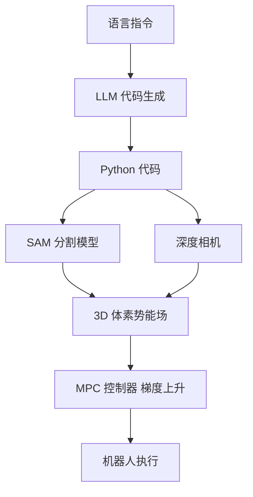

# VoxPoser: Composable 3D Value Maps

- 本地 PDF：`papers/vla-reasoning/VoxPoser_Composable_3D_Value_Maps_2307.05973.pdf`
- arXiv：https://arxiv.org/abs/2307.05973
- 年份：2023
- 阶段：空间接地与零样本操作

## 一句话总结

VoxPoser 不走端到端动作预测路线，而是让 LLM/VLM 以代码形式输出空间约束，在 3D 体素空间中构建可组合的价值函数（value map），由传统运动规划器（MPC / 轨迹优化）求解执行，实现零样本的复杂操作任务。

## 核心技术

1. **代码形式的任务约束生成** — LLM 接收任务指令和场景感知信息，输出 Python 代码片段，这些代码调用 3D 体素操作 API 直接在空间中构建 affordance 和 constrain map
2. **可组合 3D 价值图（Composable 3D Value Maps）** — 将操作任务分解为多个空间约束，每种约束表示为一个 3D 体素价值函数，最终通过加权组合形成统一的优化目标，引导运动规划器求解
3. **LLM + VLM + 传统运动规划器的混合系统架构** — LLM 负责任务分解与代码生成，VLM（如 ViT + 开放词汇检测）负责感知与空间 grounding，运动规划器负责轨迹执行，三模块各司其职

## 底层原理与数学推导

VoxPoser 的核心思想是**将语言指令转化为可优化的空间价值函数**——将机器人操作任务定义为一个在 3D 体素空间中的受约束优化问题，而非端到端的动作序列预测。

**3D 体素空间的数学定义**：

设操作场景的 3D 工作空间为 $\mathcal{W} \in \mathbb{R}^3$，将其离散化为均匀体素网格：

$$\mathcal{V} = \{v_{i,j,k} \mid 1 \leq i \leq N_x, 1 \leq j \leq N_y, 1 \leq k \leq N_z\}$$

其中每个体素 $v_{i,j,k}$ 对应空间中的一个立方体区域，$N_x, N_y, N_z$ 为各轴向的体素数量。VoxPoser 的典型分辨率为 $100^3 = 1,000,000$ 个体素，每个体素的边长 $s$ 由工作空间范围决定：

$$s = \frac{L_x}{N_x} = \frac{L_y}{N_y} = \frac{L_z}{N_z}$$

**价值函数的构建**：

每个任务被分解为若干子目标，每个子目标对应一个价值函数 $f_m: \mathcal{V} \rightarrow \mathbb{R}$。价值函数在体素空间中为每个位置赋值，正值表示该位置对完成任务有促进作用（affordance），负值表示该位置应避免（constraint）。

LLM 生成的代码通过三种操作构建价值函数：

1. **几何操作**：在体素空间中标记特定区域。例如，"避开杯子上方 10cm"对应代码：
   ```python
   voxels = get_voxels_in_region(center=mug_position, size=(0.05, 0.05, 0.10))
   affordance_map[voxels] = -1.0  # 负值：禁止进入
   ```

2. **距离变换**：定义到特定参考物的空间关系。例如，"靠近桌沿"对应：
   ```python
   dist = compute_sdf(table_edge_point)  # 有符号距离场
   affordance_map += 1.0 / (1.0 + dist)  # 距离越近，价值越高
   ```

3. **方向场**：定义操作方向偏好。例如，"从上方抓取"对应：
   ```python
   affordance_map *= (z_component > 0)  # 仅允许从上往下的方向
   ```

**价值函数组合与运动规划**：

所有价值函数通过加权求和形成统一的优化目标：

$$V_{\text{total}}(v) = \sum_{m=1}^{M} w_m \cdot f_m(v)$$

其中 $w_m$ 为各价值函数的权重（由 LLM 基于任务语义分配），$M$ 为子目标总数。

机器人运动规划定义为在体素空间中的轨迹优化问题：

$$\tau^* = \arg\min_{\tau} \left[ -\sum_{t=0}^{T} V_{\text{total}}(\tau(t)) + \lambda \cdot \text{smoothness}(\tau) \right]$$

其中 $\tau(t)$ 为轨迹在时间 $t$ 的位置，$\text{smoothness}(\tau)$ 为轨迹平滑正则项（如加速度惩罚），$\lambda$ 为正则化系数。这个优化问题可以通过标准的 MPC（模型预测控制）求解器或轨迹优化算法求解，无需任何训练数据。

**开放词汇感知的 grounding 机制**：

VoxPoser 使用开放词汇检测模型（如 OWL-ViT 或 GLIP）+ 分割模型（SAM）将语言指令中的物体名称（"the red mug"、"the table"）映射到 3D 体素空间中的具体位置。给定深度图像 $D \in \mathbb{R}^{H \times W}$ 和 RGB 图像 $I \in \mathbb{R}^{H \times W \times 3}$，首先检测物体 $o$ 在图像中的 2D 边界框 $bbox_o = (x_1, y_1, x_2, y_2)$，然后利用深度信息和相机内参将其反投影到 3D：

$$P_o = \pi^{-1}(bbox_o, D, K)$$

其中 $\pi^{-1}$ 为相机投影的逆映射，$K$ 为相机内参矩阵，$P_o$ 为物体 $o$ 在 3D 空间中的位置或点云。反投影后的物体位置直接填入 LLM 生成的代码模板，完成从语言到 3D 空间的 grounding。

**与传统端到端 VLA 路线的核心差异**：

相比于 RT-2 的端到端动作 token 预测，VoxPoser 的数学本质完全不同：

| 维度 | RT-2（端到端 VLA） | VoxPoser（模块化空间推理） |
|------|--------------------|--------------------------|
| 动作表示 | 离散化 token 序列 $b_1,...,b_7$ | 连续轨迹 $\tau(t)$ |
| 学习范式 | 从数据中隐式学习动作分布 $p(\text{act}\|I,\text{text})$ | 显式构建优化目标，无动作数据训练 |
| 优化方式 | 神经网络前向推理（单步） | 迭代轨迹优化（多步 MPC） |
| 信息路径 | 像素 $\to$ 语义 $\to$ 动作 token | 语言 $\to$ 代码 $\to$ 价值图 $\to$ 轨迹 |
| 泛化基础 | embedding 语义相似性 | 代码的组合泛化 + 规划器的物理约束 |



## 物理直觉解释

VoxPoser 的本质，**不是让模型猜测动作，而是让模型画出「哪里可以去、哪里不能去」的地图**。

- **价值图 vs 直接预测动作**：端到端方法（RT-2）像让一个新手直接模仿专家的舞步——如果没见过某个动作，就会摔跤。VoxPoser 像给舞者一张地形图，标注了"这里是高地"、"那里是沼泽"——舞者不需要学过这支舞，只需要根据地图自己找路走过去。换言之，VoxPoser 把「学动作」变成了「学约束」
- **为什么代码生成是关键？** 代码具有组合泛化和抽象推理能力。LLM 生成"避开障碍物上方 5cm"的代码，和生成"沿着桌面边缘移动"的代码，背后使用的是同一套空间操作 API。这种模块化能力是直接输出动作 token 的 VLM 难以企及的——语言模型更擅长输出代码的逻辑结构，而非精确的动作数值
- **为什么不用训练数据？** VoxPoser 放弃了「从数据中学动作分布」这条路线，转而利用现成的感知模型（VLM 做物体检测）和现成的规划器（MPC 做轨迹优化）。唯一需要 LLM 做的是「根据语义写代码」——这在 NLP 领域已经是成熟的 few-shot / zero-shot 能力。VoxPoser 巧妙地将机器人操作的难点从「动作预测」转移到了「约束定义」，而后者恰好是 LLM 擅长的
- **零样本从何而来？** 因为 VoxPoser 的每个组件（物体检测、分割、深度估计、运动规划器）都是通用模型，不需要为特定任务收集示教。用户只需说"把苹果放到碗里"，LLM 就生成对应的值函数代码，VLM 找到苹果和碗的位置，规划器算出路径——全程零特定任务训练

## 工程细节与实操指南

**系统配置与关键组件：**

- LLM：GPT-4 或 Codex（用于代码生成），以 few-shot prompt 提供 3D 体素操作 API 的使用示例。prompt 中包含约 5-10 个 API 调用样例和对应的任务描述
- VLM 感知：OWL-ViT（开放词汇目标检测）+ SAM（分割一切模型）+ 深度估计算法（如 DPT 或 ZoeDepth），将语言中的物体名称映射到 3D 坐标
- 3D 体素引擎：自定义体素操作 API，支持基础几何（球体、立方体、圆柱体）的空间标记、有符号距离场（SDF）计算、方向向量场操作
- 运动规划器：MPC（模型预测控制）或 CHOMP / TrajOpt 等轨迹优化器，以 $V_{\text{total}}$ 为目标函数，输出平滑可执行的连续轨迹
- 体素分辨率：$100^3 = 1,000,000$ 个体素，对应标准操作台面（约 1m x 1m x 0.5m）下每个体素边长 1cm

**落地实操标准步骤：**

1. **场景感知（Perception）**：从 RGB-D 相机获取当前场景的彩色图和深度图，运行 OWL-ViT + SAM 进行开放词汇物体检测和分割，将检测到的物体名称和 3D 位置存入场景图（scene graph）
2. **任务解析与代码生成（LLM 推理）**：向 LLM 发送 prompt，内容包含：（a）任务指令（如 "put the apple in the bowl"），（b）场景图中的物体列表及坐标，（c）3D 体素 API 的文档和 few-shot 示例。LLM 输出 Python 代码，调用体素 API 构建 $f_1, f_2, ..., f_M$
3. **价值函数组合**：执行 LLM 生成的代码，将各 $f_m$ 通过加权组合为 $V_{\text{total}}$。权重 $w_m$ 嵌入在代码中（如代码直接调用 `affordance_map *= 0.5` 或 `affordance_map += 2.0 * f_2()`）
4. **轨迹优化**：以 $V_{\text{total}}$ 为优化目标，以当前机械臂位姿为起点，使用 MPC 求解最优轨迹 $\tau^*$。MPC 的每次迭代计算在体素空间中进行查找和插值，无需训练神经网络
5. **执行与闭环**：将 $\tau^*$ 下发到底层 PD 控制器执行。每步执行后更新场景感知，判断任务是否完成。VoxPoser 支持每步重新规划（re-planning）频率约 1-3Hz

**关键工程陷阱：**
- 体素分辨率的选择：$100^3$ 是经验值，分辨率过高（如 $200^3$）导致体素引擎内存激增（8x）和规划器计算开销过大；过低（如 $50^3$）则空间精度不足以完成精密操作
- LLM 代码生成的可靠性：LLM 可能生成语法错误或语义不正确的代码。实践中采用运行时防护（try-except 捕获异常）+ 重试机制（最多 3 次），严重错误的代码直接 Fallback 为默认行为（如直接移动到目标位置上方）
- 感知延迟与规划延迟的平衡：OWL-ViT + SAM + 深度估计的完整感知管线约 500-1000ms，运动规划约 100-300ms——单步总延迟约 1-2s，无法做到高频闭环。VoxPoser 更适合中低频的粗放操作（放置、推、拉），不适合高速动态操作（接抛球、高速抓取）
- 物体追踪的稳定性：开放词汇检测在每步中可能产生不一致的检测结果（某帧检测到苹果，下一帧丢失），需引入卡尔曼滤波或持久化物体 ID

## 技术权衡（Trade-off）

| 优势 | 劣势与工程代价 |
|------|---------------|
| 完全零样本操作——无需任何示教轨迹即可完成复杂任务，泛化到全新物体和场景 | 系统链路极长，每步延迟 1-2 秒，难以实现高频闭环控制 |
| 代码生成提供组合泛化和精确空间推理能力，LLM 擅长的领域 | 依赖多个外部感知模型（检测、分割、深度估计），任何一环失败导致整体任务失败 |
| 价值函数可解释、可 Debug——工程师可以直接查看 3D 体素中每个位置的赋值，理解机器人的决策逻辑 | 代码生成的可靠性有限，LLM 输出的代码需要运行时验证和异常处理，增加了系统复杂度 |
| 避免端到端方法对大规模动作数据的依赖 | 无法学习底层技能（如精确力控操作），运动规划器的成功完全取决于价值函数定义的质量 |
| 3D 空间约束的表达力远强于离散动作 token，可描述连续避障、方向偏好等复杂约束 | 缺乏从经验中改进的能力——每次任务都是从头规划，没有学习组件 |

## 技术价值与演进定位

VoxPoser 在 VLA 路线图中代表了一条与 RT-2 截然不同的技术路线：**不是端到端动作预测，而是模块化空间推理**。

它的核心贡献在于证明了「LLM + VLM + 规划器」这一混合系统可以在零样本设置下完成实际机器人操作任务。在 RT-2 等端到端模型需要大规模示教数据才能泛化的时代，VoxPoser 展现了纯分解式推理的潜力：

- **System 1 vs System 2 的视角**：RT-2 属于 System 1（快速、直觉式、从数据中学到的动作映射），VoxPoser 属于 System 2（慢速、推理式、显式规划）。这两条路线代表了具身智能的核心范式分歧，VoxPoser 有力地证明了 System 2 路线在某些任务上可以取得 System 1 方法难以企及的泛化性
- **代码作为中间表示**：VoxPoser 使用 LLM 输出代码而非直接输出动作或文本，这是它在架构上的关键创新。代码相比自然语言具有更强的结构性和可执行性，相比动作 token 具有更强的抽象能力和组合泛化能力。这一idea在后续工作中被广泛采纳（如 Code as Policies, ProgPrompt）
- **局限与演进**：VoxPoser 的局限主要在于系统复杂度和执行频率——它证明了零样本操作的可能性，但离部署还需要工程化打磨。后续工作（如 Robotic See-Through, CLIPort, PerAct）试图在世袭 VoxPoser 的空间推理思想的同时，通过 3D 神经网络简化系统链路、提升执行频率

## 与其他论文的关系

- **RT-2** 与 VoxPoser 同期发表，代表两条截然不同的技术路线。RT-2 走端到端 VLA（System 1），VoxPoser 走模块化空间推理（System 2），二者在面对同一个问题（零样本操作）时给出了完全不同但各有价值的答案
- **PaLM-E** 与 VoxPoser 在系统架构上有相似之处：都使用 LLM 做高层语义推理。不同之处在于 PaLM-E 输出文本操作步骤，VoxPoser 输出可执行的代码和 3D 价值函数，后者提供了更丰富的空间表达能力
- **RT-Trajectory** 与 VoxPoser 都关注空间 grounding 问题，但 RT-Trajectory 使用视觉示教轨迹（RGB 图像中的轨迹标注）引导策略，而 VoxPoser 使用 3D 体素价值函数
- **Code as Policies** 是 VoxPoser 的前期工作，同样使用 LLM 生成代码作为机器人策略的中间表示。VoxPoser 在此基础上增加了 3D 体素价值图和感知 grounding 组件
- **Octo / OpenVLA（端到端路线）** 与 VoxPoser（模块化路线）之间的对比，反映了当前具身智能领域最核心的方法论分歧：数据驱动的隐式策略 vs 知识驱动的显式规划

## 精读问题

1. VoxPoser 的价值函数组合使用加权求和 $V_{\text{total}} = \sum w_m f_m$，这种线性组合能否表达所有类型的操作约束？哪些约束（如接触力、关节限位、动力学可行性）本质上难以用体素空间的价值函数表达？
2. VoxPoser 零样本能力的来源究竟是什么？是 GPT-4 的代码生成能力足够强，还是开放词汇感知 + 通用规划器的组合本身就覆盖了大量场景？如果替换 LLM 为更小的开源模型（如 CodeLlama-7B），性能会下降多少？
3. VoxPoser 和 RT-2 在零样本操作任务上表现各有什么倾向？是否存在一类任务天然适合体素价值函数（如避开障碍物），而另一类任务天然适合端到端策略（如精确力控插拔）？
4. 体素分辨率从 $100^3$ 降低到 $30^3$ 时，任务成功率如何变化？是否存在一个「足够好」的最低分辨率，使得 VoxPoser 可以在保持体素引擎轻量化的同时完成大多数任务？
