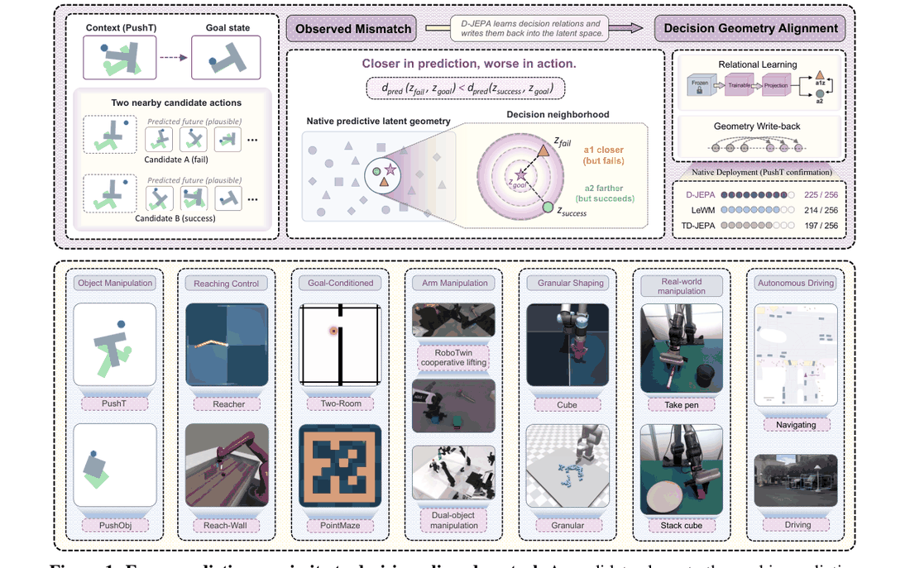
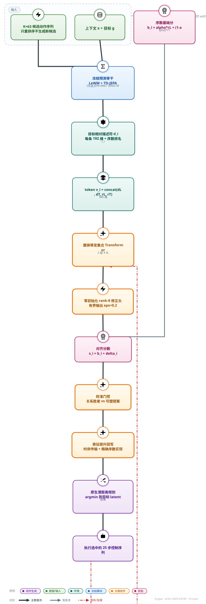
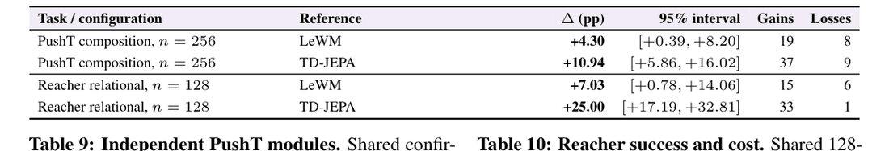

# D-JEPA: A Decision-Aligned Latent World Model（决策对齐的 JEPA 潜空间世界模型）

- arXiv：https://arxiv.org/abs/2609.24749
- 来源：https://arxiv.org/abs/2609.24749
- 项目主页：https://nebulis-lab.com/D-JEPA
- 本地 PDF：`/Users/luogu/physical_intelligence/papers/world-model/D-JEPA_2609.24749.pdf`
- 年份：2026
- 分类：world-model
- 优先级：high

## 一句话总结

D-JEPA 抓住了 JEPA 潜空间世界模型一个被忽视的失效模式——**决策局部预测鸿沟**：LeWM 对 63 个候选的全集排序与真实结果的 within-start Spearman 相关高达 0.90，但收窄到真正竞争执行权的前 4 个候选时暴跌至 0.11（混合结果 shortlist 内成功/失败对反转率 49.0%）；它把这个问题变成一个可监督的学习任务，用执行结果训练一个有界、置换等变的集合关系算子去修正"预测上离目标近"与"执行上会成功"之间的错位，再把学到的决策结构写回 JEPA 兼容的未来表征，使原生潜距离规划即可恢复对齐选择——PushT 87.89%（n=256）、RoboTwin 平均 +15.04 个百分点（61.72 到 76.76）、真机 PiPER +17 个百分点（64.0 到 81.0）、七个困难驾驶场景 PDMS 从 57.36 升至 95.34。

## 九问速览

1. **Problem**：潜空间世界模型"预测准"却"最后一步选错"——决策边界附近的候选排序失准
2. **Bottleneck**：全局指标掩盖局部失效；端到端重训表征会破坏已有预测结构
3. **Insight**：全集 Spearman 0.90 而前 4 候选仅 0.11——预测精度与决策正确性数学上可分离
4. **Method**：用执行结果训练有界、置换等变的集合关系算子修正排序，再写回潜表征
5. **Evidence**：PushT 76.95→87.89%、RoboTwin +15.04pp、真机 PiPER +17pp
6. **Ablation**：关系对齐单独 +10.16pp 为最大干预；双源描述符 93.75 vs 单源约 84
7. **Assumption**：冻结骨干的序数 cost 有信息；候选池质量决定性能上限（Oracle 83.40）
8. **Failure**：候选分布随在线搜索漂移时 rank 统计退化；只重排序、不生成新候选
9. **Opportunity**：跨任务复用关系算子、动态候选分布下的对齐保持未验证

| 维度 | 论文答案 |
|---|---|
| Perception | 图像上下文+目标帧；RoboTwin 为 4 路 240x320 RGB+14 维关节+20 维末端状态 |
| Closed-loop | 池内闭环：63 候选集合上一次选定，执行完整 25 控制步序列，无执行中修正 |
| Correction | 校准门在关系赢家与塑性提案间切换；驾驶接口以真观测替换 KV 缓存 |
| Deployment | 仿真训练关系算子→RoboTwin 仿真+PiPER 真机配对试验+7 个驾驶场景泛化 |

## 核心技术

*论文 Figure 1（p1）：Figure 1: From predictive proximity to decision-aligned control. A candidate closer to the goal in p*

1. **决策局部预测鸿沟诊断**（第 3 节 + 附录 C.1）：96-start PushT 审计发现，全集层面预测相关性很好（LeWM 0.90 / TD-JEPA 0.80），但 top-4 shortlist 内相关性崩塌（0.11 / 0.13）；两个模型各有 8/96 个 start 把更低预测距离给了失败候选。命题 1 进一步证明：候选平均预测误差趋零、全局 Spearman 趋 1 时，执行 regret 仍可为任意 $\Delta$——全局预测精度与决策正确性在数学上可分离。
2. **有界关系对齐算子**（式 1）：对完整候选集 $\{a_i\}_{i=1}^{K}$（$K=63$），双模型 token 为 $v_i=[d^L_i; d^T_i; r^L_i; r^T_i]\in\mathbb{R}^{386}$（192 维 LeWM 差分 + 192 维 TD-JEPA 差分 + 2 个序数坐标），经共享编码器（386 到 64）和两层置换等变 Transformer（4 头、FFN 128、零 dropout、无位置编码）后，由零初始化的 rank-8 修正头给出 $\delta_i=\epsilon\tanh(W_{\text{up}}\tanh(W_{\text{down}}h_i))$，$\epsilon=0.2$。
3. **决策监督损失**（式 2、6、7）：成功质量项 $-\log\sum_{i:y_i=1}p_i$（softmax 温度 $T=0.05$）奖励任一成功候选；边界排序项对当前低分子集（16 个候选）内的成功/失败对施加 softplus margin（margin 0.02）；修正正则 $\frac{\lambda_{\text{trust}}}{K}\sum_i\delta_i^2$（权重 0.1）抑制不必要的全局重排。
4. **预测可塑性 + 校准组合**（4.2 节）：只对 TD-JEPA 最后一个 predictor block 和投影层做梯度更新（600 步、lr $2\times10^{-6}$），其原生距离最优者作为"塑性提案"；校准门仅当其优势超过阈值 0.0065339543 时才取代关系默认赢家。
5. **跨几何的序数接口**：每个预测几何（LeWM、TD-JEPA、JEPA-WM、DINO-WM）的 cost 经集合内 rank 转成尺度无关的序数坐标 $r^m_i=(\mathrm{rank}(c^m_i)-1)/(K-1)$；命题 3 证明序数证据对任意严格递增变换不变，稠密描述符留在各自几何内——异构几何靠"只比顺序、不比刻度"通信。四几何 token 为 $\mathbb{R}^{388}$。
6. **表征提升（Representation Lifting）**（式 3、4）：Reacher 上用时间条件化有界系数网络做 same-action temporal transport（每步 L2 位移上界 $\rho=0.1$，实测最大 0.0017227774）；PushT 上做 exact ordinal realization，把最终严格 rank $\pi_i$ 编码为终端未来到目标的 RMS 半径 $\pi_i/(K+1)$，使原生 MSE 距离 $(\pi_i/(K+1))^2$ 严格复现学到的排序（命题 4）。
7. **理论保证**（附录 H）：命题 2 证明有界修正保持所有 base 分差大于 $2\epsilon$ 的偏好，且新赢家必在 base 最小者的 $2\epsilon$ 邻域内——修正只可能在决策边界附近"翻案"。

## 底层原理与数学推导

整体信息流：冻结的预测骨干产出候选未来 → 关系算子在集合层面读出决策结构 → 学到的结构经表征提升写回未来潜变量 → 部署时用原生潜距离规划，无需额外打分头。

*架构速览：D-JEPA 抓住了 JEPA 潜空间世界模型一个被忽视的失效模式——**决策局部预测鸿沟**：LeWM 对 63 个候选的全集排序与真实结果的 within-start Spearman 相关高达 0.90，但收窄到真*

**决策监督的完整目标**。对候选 $i$，softmax 概率 $p_i=\exp(-s_i/T)/\sum_j\exp(-s_j/T)$，关系损失为

$$\mathcal{L}_R=-\log\sum_{i:y_i=1}p_i+\lambda_{\text{local}}\mathcal{L}_{\text{local}}+\frac{\lambda_{\text{trust}}}{K}\sum_i\delta_i^2,$$

其中成功质量项（式 6）奖励"任一成功候选胜出"而非锚定单条参考轨迹；局部项（式 7）在动态刷新的低分子集 $\mathcal{T}_k$（$k=16$，当前得分最低的 16 个）内对每个成功-失败对施加

$$\mathcal{L}_{\text{local}}=\operatorname*{mean}_{i\in\mathcal{T}_k:y_i=1,\;j\in\mathcal{T}_k:y_j=0}\;\operatorname{softplus}\!\left(\frac{\mu+s_i-s_j}{T}\right),$$

若子集单类则回退到全集配对。监督集中在决策边界附近，但推理时算子仍处理全部 $K$ 个候选——这是"全集上下文、边界监督"的关键不对称。

**预测可塑性目标**（式 8）只训最后 predictor block 与投影：

$$\mathcal{L}_P=\mathcal{L}_{\text{success}}+\lambda_B\mathcal{L}_{\text{boundary}}+\lambda_K\mathcal{L}_{\text{rank}}+\lambda_Z\mathcal{L}_{\text{latent}},$$

权重 0.5/0.25/1.0，配合非尾部分布 KL 罚与得分差一致性项，保证适应只发生在目标决策子集、不破坏其余轨迹的预测几何。

**Exact ordinal realization**（式 4）：令 $\pi_i\in\{1,\dots,K\}$ 为门控后的严格 rank，$u_i$ 为归一化到单位 RMS 范数的原始终端目标相对方向，则

$$\tilde{z}^T_{i,H}=z^T_g+\frac{\pi_i}{K+1}u_i,\qquad \tilde{z}^T_{i,t}=\hat{z}^T_{i,t}\;(t<H),$$

原生 MSE 目标距离为 $(\pi_i/(K+1))^2$，严格随 rank 递增，因此"取最近未来"精确恢复对齐动作。Reacher 的 temporal transport（式 3）为 $\tilde{z}^T_{i,t}=\hat{z}^T_{i,t}+\beta_{i,t}\,\frac{\hat{z}^L_{i,t}-\hat{z}^T_{i,t}}{\max(\lVert\hat{z}^L_{i,t}-\hat{z}^T_{i,t}\rVert_2,\eta)}$，系数网络输入 $[\,r^L_i, r^T_i, r^R_i, q, t/H\,]$ 共 5 个标量，经 $5\to32\to1$ 的 GELU 网络后用 tanh 夹在 $\rho=0.1$。

**为什么必须有界**（命题 2）：设 $s_i=b_i+\delta_i$，$|\delta_i|\le\epsilon$。若 $b_j-b_i>2\epsilon$ 则任意合法修正下仍有 $s_i<s_j$；且对齐后赢家 $i_s$ 满足 $b_{i_s}-b_{i_b}\le 2\epsilon$。推论：base 大幅领先的赢家绝不被推翻，修正只能在 base 最小者 $2\epsilon=0.4$ 邻域内换人。这把"学习决策关系"限制成一个局部、可校准的操作，避免关系算子重写整个几何。

**命题 1 的构造**（附录 H.1）：取 $q_1=0$、$q_i=\Delta[1+(i-2)/(K-1)]$（$i\ge2$）、$c_1=q_2$、$c_2=q_1$、其余 $c_i=q_i$，则平均平方误差仅 $2\Delta^2/K$、Spearman 达 $1-\frac{12}{K(K^2-1)}$（$K=63$ 时约 0.999952），但预测选中候选 2 而真实最优是候选 1，regret 恰为 $\Delta$。**全局指标再漂亮也锁不死最后一步的选择**——这是整篇论文的数学根基。

## 物理直觉解释

**第一段：预测几何不等于决策几何**。把潜空间世界模型想成一张**导航地图**：它对"从全城 63 条路线到目的地的粗略远近"排得很准（Spearman 0.90），但真正决定走哪条路的时刻，是车已经开到小区门口、只剩两条岔路的时刻——而地图恰恰在这个尺度上失灵（top-4 相关性 0.11）。D-JEPA 的诊断实验给出了一个具体的物理例子：LeWM 给失败候选 A 的预测距离 0.2027，比成功候选 B 的 0.2167 更近，差距 0.014——在全集尺度上这点误差完全可以容忍，但它直接决定了执行哪条动作序列、方块被推去哪个方向。物理世界的不连续性（推偏 2 厘米就撞出桌面）会放大潜空间里看似微小的排序错误，所以"哪里接近决策边界，哪里的排序就必须额外精确"。

**第二段：有界修正是方向盘微调而不是重画地图**。关系算子的输出 $\delta_i$ 被 $\epsilon=0.2$ 的 tanh 硬夹住、且修正头零初始化——训练开始时它就是恒等映射，学到的只是"在 base 得分胶着的候选之间，执行证据说该翻谁"。这像**老司机的小幅方向盘修正**：地图（冻结的预测骨干）仍负责大方向，关系算子只在没有把握的地段根据"以前走过这条路的结果"微调，绝不允许把整张地图推倒重画。命题 2 给出了这条纪律的数学形式：base 分差大于 0.4 的偏好被原样保留，修正赢家一定落在 base 最优的 0.4 邻域内。这套设计直接回应了附录 F 提到的一个受控适应实验教训——全局预测误差的改进与动作选择的改进可以脱钩，无约束地改表征反而会把别处好好的预测结构搅坏。

**第三段：把决策结构写回潜空间，像图书馆按"受欢迎度"重新排架**。Exact ordinal realization 做的事在潜空间里非常具体：保持每个候选未来的方向 $u_i$ 不变，只把它到目标的半径改写成 rank 的单调函数 $\pi_i/(K+1)$。这相当于**图书馆把书按借阅排名重新上架**——之后任何人（任何下游消费者）只要用最原始的"按距离找书"接口，读出的顺序就是决策对齐后的顺序，不需要知道排名是怎么来的。价值在于部署接口的零侵入：自包含 checkpoint 里既有预测路径又有关系计算，但调用方看到的仍然是 JEPA 原生的"预测未来、算到目标的潜距离、取最近"三步（表 6 验证原生距离 100% 恢复关系选择的动作与全部 16,128 个 rank），推理延迟 34.02 ms 甚至略低于关系读出的 35.03 ms，因为省掉了集合算子的显式打分。

## 工程细节与实操指南

- **关系算子规格**：候选编码器 386 到 64（LayerNorm + GELU）；两层 pre-norm Transformer，4 头注意力，FFN 64 到 128 到 64（GELU），零 dropout，无候选位置编码（置换等变性要求）；修正头 64 到 8 到 1，输出层零初始化，输出经 tanh 夹到 $\epsilon=0.2$。四几何版本 token 388 维。
- **PushT 关系训练超参**：1,000 步 AdamW，每 batch 8 个 start，lr $3\times10^{-4}$，weight decay $10^{-4}$，梯度裁剪 1.0，每 50 步做一次校准评估；温度 $T=0.05$，margin $\mu=0.02$，局部对权重 $\lambda_{\text{local}}=0.25$，修正平方罚权重 0.1；决策子集 16 候选；融合系数 $\alpha=0.42$；关系门阈值 $-0.0316252634$。
- **预测可塑性超参**：384 个拟合 start + 128 个校准 start，600 步，lr $2\times10^{-6}$，weight decay $10^{-3}$，梯度裁剪 0.25；boundary/rank/latent 保持权重 0.5/0.25/1.0；组合门阈值 0.0065339543。
- **Temporal transport 超参**：384 个 start、1,500 步训练、取 1,200 步快照；温度 0.1，全对 softplus 排序损失权重 0.25，未来保持 MSE 权重 0.02；系数网络 $5\to32\to1$，界 $\rho=0.1$。
- **驾驶接口**：Drive-JEPA 每场景 32 条轨迹（8 个 ego 位姿、0.5 s 间隔、4 s 视界）；score-correction 输入 288 维（256 维 query + 6 辅助通道 + score + rank + 24 轨迹坐标），anchor-relative 版本 282 维；AdamW lr $10^{-3}$（score）/ $3\times10^{-4}$（anchor-relative），batch 16/64，30 epochs / 从 {8,16,32} 选；leave-one-source-log-out 校准从 $\alpha\in\{0,0.1,0.25,0.5,1\}$、$\lambda\in\{0,0.1,0.3\}$、$m\in\{0,0.005,0.02\}$ 中选。
- **推理延迟**（表 6，256 个无标签 PushT start，batch 16，2 次预热 + 10 次计时取中位）：关系读出 35.03 ms，校准组合 52.16 ms，序数实现 34.02 ms，不含仿真执行。
- **评估规模**：PushT 256 start（另有 128-start 机制消融群体与 n=32 早期诊断）、Reacher 128、Granular 64、RoboTwin 每任务 128（共 512）、PiPER 每任务 50 对配对真机试验、驾驶 7 场景各 32 条轨迹；候选池 63（PushObj 形状实验同），执行完整 25 控制步序列。
- **训练硬件（GPU 型号/数量）**：待确认——PDF 未披露任何训练或延迟测量所用 GPU 型号与卡数（延迟协议只给了 batch 与重复次数）。
- **代码/权重发布**：待确认——论文只给项目页 nebulis-lab.com/D-JEPA，未在正文声明代码或 checkpoint 开源。
- **数据规模**：PushObj 形状实验 512 拟合 + 256 校准 start（形状 T/L/Z/+），形状确认每几何 100 start；外观实验 126 拟合 + 63 校准 start、7 种外观条件各 50 个新 start 评估；RoboTwin 观测为 4 路 240x320 RGB + 14 维关节 + 20 维末端状态，转成 16 维双臂命令。

## 实验协议清单

| 项目 | 论文设置 | 来源与备注 |
|---|---|---|
| 观测 | PushT 图像 224x224（继承 LeWM 协议）；RoboTwin 4 路 240x320 RGB+关节/末端状态 | 附录 A；笔记工程细节 |
| 动作空间 | 潜空间规划候选动作序列（25 控制步）；RoboTwin 16 维双臂命令；驾驶为轨迹 | 第 4 节 |
| 控制频率 | 未报告（执行完整 25 步序列） | PDF 未披露 |
| 重规划频率 | 每 25 控制步（序列执行完后重选候选） | 附录 C |
| 动作 horizon | 25 控制步/候选序列 | 第 3.1 节 |
| 数据 | 继承 LeWM/TD-JEPA 预训练 checkpoint 与数据集；PushObj 512 拟合+256 校准 start | 附录 A |
| 奖励 | 无（仿真执行二元成功标签监督关系算子） | 式 2 |
| Reset | 仿真内精确恢复 start（同 start 执行全部 63 候选） | 附录 A |
| 成功定义 | 成功率%（PushT/RoboTwin）；驾驶 PDMS | 第 4 节 |
| 评估次数 | PushT 256、Reacher 128、Granular 64、RoboTwin 每任务 128、PiPER 每任务 50 对、驾驶 7x32 轨迹 | 表 6-8 |
| 随机种子 | bootstrap 重采样 1 万次（seed 3072）；训练种子未报告 | 附录 D |
| 扰动测试 | 外观 7 条件各 50 新 start（模糊/噪声等）；形状 4 种各 100 start | 图 20 |
| 真机 | PiPER 每任务 50 对配对试验 | 第 4.4 节 |
| 算力 | 未报告（PDF 未披露 GPU 型号与卡数） | 笔记已注明待确认 |
| 特权信息 | 训练期用仿真执行结果+未来帧做监督；部署只用原生潜距离 | AGT 式部署一致性 |

**附录陷阱自查**：
- privileged 信息：训练期反事实执行（63 候选全 rollout）与未来帧监督；推理不泄漏
- reward shaping：无
- reset 难度：仿真内精确恢复 start（真机不可行的开销）
- eval budget：充足（PushT n=256）
- 底层控制栈：无强 planner 兜底，直接执行选定序列
- 数据优势：与基线共享候选池/数据/start，配对比较公平

## 消融实验与分析

*论文 Table 8（p16）：Table 8: Paired success differences on the core formal populations. A gain is D-JEPA success with ba*

机制消融（表 5/9，共享 256-start PushT 确认群体）逐级叠加三个机制：

| 配置 | 预测证据 | 决策机制 | 成功率 (%) | Δ(pp) |
|---|---|---|---|---|
| TD-JEPA 原生 | 时序 | 原生距离 | 76.95 | 0.00 |
| + 预测可塑性 | 适应后时序 | 原生距离 | 79.69 | +2.74 |
| + 关系对齐 | 双源 | 集合关系 | 87.11 | +10.16 |
| + 校准组合（完整 D-JEPA） | 双源 + 适应 | 门控组合 | 87.89 | +10.94 |

预测源消融（128-start 机制群体，同一关系架构）：LeWM 单源 84.38、TD-JEPA 单源 83.59、双源描述符 93.75（+9.37）；候选预算从 8 增至 63 时 D-JEPA 从 81.96% 升至 87.11%（LeWM 80.42 到 83.59，TD-JEPA 基本持平 77.10 到 76.95）。诊断端（表 11，96 start）：LeWM within-start Spearman 在 shortlist 63/16/4 下为 0.895/0.621/0.108，反转率 3.95%/20.44%/49.02%。

**核心结论：**
1. **关系对齐是最大的单一干预**：单独引入即 +10.16 pp（76.95 到 87.11），预测可塑性单独只有 +2.74 pp，但校准组合再叠加到 87.89——两个机制互补而非冗余。
2. **双源证据的增益不是"更多参数"**：同一关系架构下，双描述符 93.75 比任一单源（84.38/83.59）高约 +9 pp，说明 LeWM 的"目标相对几何"与 TD-JEPA 的"时序进展"携带的决策信息确实互补。
3. **决策局部鸿沟随 shortlist 收窄而恶化**：反转率从全集 3.95% 涨到 top-4 的 49.02%（LeWM），且 pooled 相关（0.52）远高于 within-start（0.11）——跨 start 排序掩盖了单 start 内的失效，诊断必须做 within-start。
4. **候选越多关系算子越强**：D-JEPA 成功率随预算单调上升（81.96 到 87.11）而基线饱和，符合"学会利用更丰富候选集内部关系"的机制假设。
5. **真机与驾驶的增益与仿真同源**：RoboTwin 上固定修正 66.80、标量门 66.21 都远低于完整模型 76.76（无保持门则掉到 71.48），Oracle 上限 83.40——门控组合的每个部件在真机设定下都必要。

## 技术权衡（Trade-off）

| 优势 | 劣势 |
|---|---|
| 不改预测骨干本体：冻结 LeWM/TD-JEPA，风险被压缩到 rank-8 修正头（有界、零初始化、可校准） | 需要候选集执行结果监督：训练期反事实执行（同 start 恢复 + 逐候选 rollout）在真机上昂贵，论文真机部分依赖录制执行与配对试验 |
| 命题 2 保证可解释的失败模式：最多在 base 最优 2e = 0.4 邻域内翻案，大幅领先者绝不被推翻 | 只重排序、不生成新候选：性能上限受候选池质量约束（Oracle 83.40 vs D-JEPA 76.76，RoboTwin 上仍有 6.6 pp 头寸） |
| 序数接口让异构几何（LeWM/TD-JEPA/JEPA-WM/DINO-WM）免刻度融合，命题 3 保证对单调变换不变 | 依赖冻结骨干的原生 cost 提供序数证据——若骨干系统性偏置（如 TD-JEPA 时序偏置），rank 池同源偏置 |
| 表征提升后部署接口零侵入：原生潜距离 100% 恢复对齐决策，延迟 34.02 ms 甚至低于关系读出 | exact ordinal realization 只改终端步（H 步），H-1 步轨迹的预测几何未被对齐；序数半径编码丢弃了终端方向的决策信息 |
| 通用接口：同一关系原则套用于潜空间规划、VLA action chunk（RoboTwin）、Drive-JEPA 轨迹、V-JEPA 2-AC 候选 | 任务局部拟合/校准/确认群体需严格切分（384/64/256 等），换任务需重训关系算子，跨任务泛化未验证 |

## 技术价值与演进定位

这篇论文在 JEPA 演进线（I-JEPA 到 V-JEPA 到 V-JEPA 2 到 LeWorldModel/SD-JEPA/NoGaussianRequired）里开辟了一个与"更稳的训练目标"（LeWM）、"更好的先验"（SD-JEPA、NoGaussianRequired）正交的新轴：**预测几何与控制决策的对齐**。此前这条线的隐含假设是"潜距离排序准 = 规划好"，D-JEPA 用 96-start 审计加命题 1 的构造性证明同时从经验和数学两端击穿了这个假设，指出失效集中在决策边界附近——一个此前的 plan-cost fidelity 工作（A Control Theory of Predictability）和 TD-JEPA 的任务依赖部署研究都擦到但没有形式化的区域。它的第二个贡献是把"表征学习"与"表征改写"分离：学到的决策结构可以无损写回 JEPA 兼容的未来几何（命题 4），这意味着决策对齐可以作为一种后处理层叠加到任何潜空间世界模型上，而不必重训骨干。对库内研究而言，它把"世界模型评测该测什么"从预测精度推向了决策保真度——WorldArena 这类基准若不测决策局部反转率，就会漏掉这条线上最要命的失效模式。

## 与其他论文的关系

1. **notes/world-model/leworldmodel.md（LeWM，2603.19312）**：D-JEPA 的双骨干之一与主要对照。LeWM 原生 PushT 83.59，D-JEPA 校准组合 87.89（配对差 +4.30 pp，95% CI [0.39, 8.20]，19 胜 8 负）；诊断上 LeWM 正是决策局部鸿沟最严重的模型（top-4 反转率 49.0% vs TD-JEPA 38.2%）。LeWM 追求的端到端稳定性没有解决"最后一步选错"的问题。
2. **notes/world-model/v-jepa2.md（V-JEPA 2，2506.09985）**：真机 PiPER 实验直接把 V-JEPA 2-AC 当候选生成器与规划器：同一 planner 下 PushT 56.0 到 74.0（+18.0 pp）、双立方堆叠 72.0 到 88.0（+16.0 pp），说明决策对齐可叠加在 V-JEPA 2 的 MPC 管线之上而不替换它。
3. **notes/world-model/sd-jepa.md（SD-JEPA，2605.31111）与 notes/world-model/no-gaussian-required.md（2608.17542）**：同属 JEPA 训练目标修正线（子空间先验 / 对比先验），都在改"表征怎么学"；D-JEPA 不改学习目标而改"学到的几何如何对齐决策"，两者正交可叠加——D-JEPA 的序数接口原则上可吃 SD-JEPA 的分空间表征作为第五个几何源。
4. **notes/world-model/td-mpc2.md（TD-MPC2，2310.16828）**：TD-MPC 系用任务导向潜动态 + value 函数解决同样的问题（预测几何该为控制服务）；D-JEPA 的差异是不引入 value 学习、改用执行结果的直接监督 + 有界关系修正，且能跨异构骨干复用（TD-MPC2 的价值头绑定自身表征）。
5. **notes/world-model/dreamer-v3.md / notes/world-model/daydreamer.md**：Dreamer 系在想象中训策略（学一个世界模型来产生行为），D-JEPA 在真实候选集合上做决策（用执行结果修世界模型的排序）；前者要完整重放动力学，后者只需一步未来几何排序，工程代价低一个量级（34 ms vs 想象 rollout）。
6. **notes/world-model/worldarena.md（WorldArena，2602.08971）**：WorldArena 度量感知与功能效用，但按 D-JEPA 的诊断，全集级指标会掩盖 top-4 内 49% 的反转——决策局部反转率与 within-start 相关衰减应成为世界模型基准的标配指标。
7. **notes/world-model/vjepa.md / notes/world-model/ijepa.md**：JEPA 主线的源头（视频/图像自监督预测），D-JEPA 是该线首次把"执行结果监督"引入潜几何改写的节点，其 ordinal realization 保证写回后的几何仍是标准 JEPA 表征。
8. **notes/world-model/tacwam.md（TacWAM，2607.28391）**：TacWAM 用注意力掩码严格隔离"部署时可得锚点 vs 训练期未来 token"，与 D-JEPA 的"表征提升不泄漏训练特权信息"是同一部署一致性原则在触觉与潜几何两个侧面的体现。

## 精读问题

1. 关系算子在 63 个候选上训练，部署时若候选由在线 CEM/交叉熵搜索动态生成、分布随搜索迭代偏移（附录 G.3 提到 set-relative ranks 只在构造共享池后施加），rank 统计的分布漂移会让对齐质量退化多少——能否设计一个 candidate-shift 压力测试量化这种退化？
2. 决策局部鸿沟的诊断全部基于 PushT 的 96 个审计 start，这种"top-4 反转率 49%"的量级在 Reacher/Granular/RoboTwin/驾驶上分别是多少——鸿沟大小是否可以预测 D-JEPA 的改进空间（即能否用诊断指标做 gain 的先验估计）？
3. exact ordinal realization 把终端步半径编码为 $\pi_i/(K+1)$ 却保留原方向 $u_i$，丢掉了方向上的决策信息——若把方向也按对齐后几何重排（例如对成功候选做方向聚类），是否能进一步改善下游 MPC 的多步滚动？
4. 修正界 $\epsilon=0.2$ 在 PushT 上手工设定，它与任务的成功/失败 cost 尺度之间应满足什么标度关系——能否从 base 得分的校准分布自动推导 $\epsilon$ 的任务自适应值？
5. 双源描述符互补（84.38/83.59 到 93.75）的机制是什么——是 LeWM 与 TD-JEPA 在失败模式上不相关，还是序数坐标的尺度无关性起了主要作用？把稠密描述符换成纯序数（386 维降到 4 维）还能保留多少增益？
6. 训练期反事实执行要求每个 start 恢复初始状态并执行全部 63 个候选，真机上不可行——D-JEPA 能否改为从少量真实执行 + 世界模型反事实外推来监督关系算子，代价是引入论文所批评的"预测即真值"偏差，这个二阶偏差有多大？
