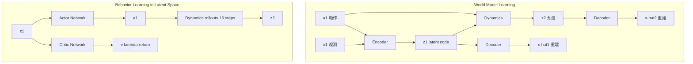

# DayDreamer: World Models for Physical Robot Learning

- 本地 PDF：`papers/world-model/DayDreamer_2206.14176.pdf`
- arXiv：https://arxiv.org/abs/2206.14176
- 年份：2022 (CoRL 2022 / PMLR 2023)
- 团队：UC Berkeley (Philipp Wu, Alejandro Escontrela, Danijar Hafner, Ken Goldberg, Pieter Abbeel)
- 阶段：世界模型在真实机器人在线学习

## 一句话总结

DayDreamer 将 Dreamer 世界模型 RL 直接部署到真实机器人上，不使用仿真器，单一超参配置在四台不同机器人（四足、机械臂、轮式）上从零在线学习，仅需 1 小时训练即学会行走和操作。

## 核心技术

1. **Online Real-World World Model** — 直接在真实机器人在线学习世界模型，无 sim-to-real gap
2. **RSSM (Recurrent State-Space Model)** — Dreamer v2 的世界模型架构，latent space imagination
3. **异步 Actor-Learner** — Actor 线程收集数据，Learner 线程训练世界模型 + 策略，并行解耦
4. **单组超参跨四台机器人** — 无需针对每个机器人/任务单独调参，覆盖连续/离散动作、密集/稀疏奖励、本体感知/视觉输入

## 底层原理与数学推导

### RSSM 世界模型

Dreamer 的世界模型由四个网络组成：

- **Encoder**: enc(st | st−1, at−1, xt) — 融合多模态传感器输入到 latent 表征
- **Dynamics**: dyn(st | st−1, at−1) — 学习 latent space 前向动态，不依赖中间观测
- **Decoder**: dec(st) ≈ xt — 重建传感器输入，提供丰富学习信号和人工可检查的预测可视化
- **Reward**: rew(st+1) ≈ rt — 从 latent 状态预测任务奖励

### Actor-Critic 行为学习

世界模型训练好后，在 latent space 中做大规模并行 imagination rollout（batch size 16K）：

**λ-return**（平滑 N 步回报，避免人为选择 horizon）:
$$V^\lambda_t = r_t + \gamma\left[(1-\lambda)v(s_{t+1}) + \lambda V^\lambda_{t+1}\right], \quad V^\lambda_H = v(s_H)$$

**Actor 目标** — 最大化 λ-return + 熵正则防止策略坍塌：
$$\mathcal{L}(\pi) = -\mathbb{E}\left[\sum_{t=1}^H \ln \pi(a_t|s_t) \cdot \text{sg}(V^\lambda_t - v(s_t)) + \eta H[\pi(a_t|s_t)]\right]$$

- 连续动作用 reparameterization gradient 反向传播 return 梯度通过 dynamics
- 离散动作用 Reinforce gradient
- Actor/Critic 梯度不反向传播到世界模型（防止过乐观预测）
- 使用 target critic（slow copy）计算 λ-return

### 异步架构

Learner 线程持续训练世界模型 + actor-critic；Actor 线程并行计算动作与环境交互采集数据。解耦使学习步与真实环境动作频率无关（四足需 20 Hz 控制但训练可 batch 16K）。

## 物理直觉解释

DayDreamer 的核心直觉：**在脑子里模拟，而不是在现实里试错**。就像人学走路——你不需要每次都真摔倒才能知道什么动作会导致摔倒。你在脑子里想象"如果我这样抬腿会怎样"，然后选看起来最好的动作。RSSM 就是这个"脑子里的模拟器"——它从每次真实尝试中学习更准确的环境模型，然后用这个模型在想象中快速试错上千次，挑出最优策略再执行。

为什么能 1 小时学会走路？因为真实交互只用于更新世界模型（耗时但数据高效），而策略优化全部在 latent space 完成（16K batch 并行无需物理时间）。这就像一个学生在课堂上快速刷题 vs 每次都要去实验室做实操作——前者效率高百倍。

## 工程细节与实操指南

- **异步 Learner-Actor**: Learner 线程训练网络不等待环境，Actor 线程部署最新策略到机器人。关键是为满足 20 Hz 控制频率（50ms 延迟要求）
- **传感器融合**: Encoder 将 RGB 图像 + 本体感知（关节角度、角速度）拼接为 broadcasted planes 输入 CNN，融合为统一 latent
- **Butterworth 滤波器**: 四足电机的保护机制——滤除高频动作指令，防止尖刺信号损坏电机
- **离散/连续动作统一**: A1 四足用连续动作（motor angles → PD controller），XArm/UR5 用离散动作（pick, place, move directions），Sphero 用连续动作，同一超参处理全部
- **自动 reset**: 四足没有物理 reset 机制——摔倒后自己学会翻身，无人工干预
- **稀疏奖励**: Pick & place 任务仅完成任务时给 reward，无中间引导信号——世界模型须自己学到物体定位
- **超参统一**: 网络结构、学习率、batch size、imagination horizon 16 步，所有 4 个实验完全一致
- **开源**: 论文公开了基础设施代码，可直接复现

## 技术权衡（Trade-off）

| 优势 | 劣势与工程代价 |
|------|----------------|
| 无 sim-to-real gap，策略直接在真实动力学上优化 | RSSM 需要持续在线交互更新，初期探索缓慢 |
| Imagination rollout 16K batch 并行，训练效率极高 | 世界模型质量决定策略质量，差模型误导学习 |
| 单一超参跨多机器人，部署门槛低 | 高维观测（如 256×256 RGB）对 decoder 重建质量要求高 |
| 异步架构满足实时控制需求 | 双线程协调增加工程复杂度，策略可能有 lag |
| Decoder 重建提供可视化 debug 能力 | 频繁的 encoder-decoder 路径比纯 latent 方法（TD-MPC2）多计算开销 |

## 技术价值与演进定位

DayDreamer 证明了世界模型可以让真实机器人实现**无仿真在线学习**——不需要先在模拟中训练再迁移。这一范式对机器人学习影响深远，直接启发了后续的 GR 系列（视频预训练世界模型）。

## 与其他论文的关系

- **Dreamer v3** — 算法改进（symlog、KL balancing、free bits），DayDreamer 基于 Dreamer v2。v3 的改进可直接提升 DayDreamer 的线上效率
- **TD-MPC2** — 另一条世界模型路线，不做解码器（隐式），优势是计算更高效但缺少可视化 debug 能力
- **GR-1 / GR-MG** — 继承"世界模型 + 机器人策略"路线，但用视频预训练替代在线学习，更适合大规模数据场景
- **DrQv2 / SAC / Rainbow** — DayDreamer 在各自对比实验中超越的 model-free baseline

## 精读问题

1. Dreamer v2 → v3 的改进（symlog, KL balancing）是否也能提升线上真实机器人的学习效率？
2. 异步 actor-learner 在真实机器人上的 safety 保证？错误策略可能损坏硬件
3. 1 小时从零学走路——如何 reset 四足机器人？自动化 reset 还是人工？
4. 世界模型学到的是 robot-specific 还是 task-general 的动力学？对跨任务重用的可行性？
