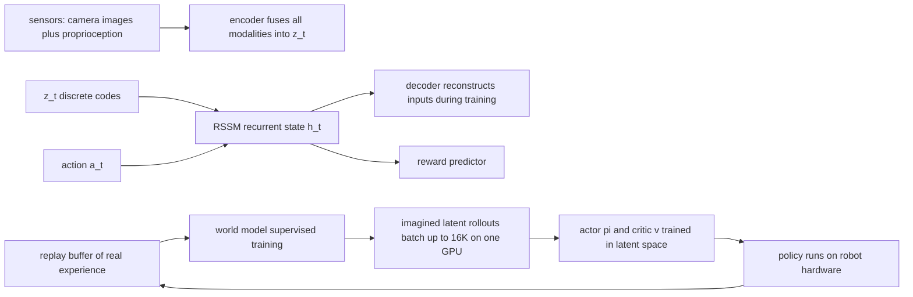

# DayDreamer: World Models for Physical Robot Learning

- 本地 PDF：`papers/world-model/DayDreamer_2206.14176.pdf`
- arXiv：https://arxiv.org/abs/2206.14176
- 年份：2022（CoRL 2022）
- 团队：UC Berkeley（Philipp Wu、Alejandro Escontrela、Danijar Hafner 共同一作；Ken Goldberg、Pieter Abbeel）
- 阶段：latent 世界模型 RL 从仿真走向真机的分水岭——不建仿真器、不做示教，4 台真实机器人用同一组超参直接在线学习

## 一句话总结

把 Dreamer（基于 DreamerV2 实现 + 异步 actor/learner）原封不动部署到 A1 四足、UR5 与 XArm 机械臂、Sphero 轮式机器人共 4 个平台：A1 从仰卧状态在 1 小时内从零学会翻身、站立并以 pronking 步态行走，之后被杆子推倒只需 10 分钟在线适应就能抗扰或快速翻回；UR5/XArm 在稀疏奖励下 8 到 10 小时学会视觉抓放（2.5 与 3.1 objects/min，接近人类操作员）；Sphero 仅凭俯视 RGB 在 2 小时内导航到目标（平均距离 0.15）——全程无仿真器、无重置策略、同一组超参，证明世界模型的数据效率足以承担真机时间成本。

## 核心技术

1. **完全复用的 Dreamer 世界模型（RSSM + 离散码）**：encoder 融合本体感受与相机输入 $x_t$ 得到随机表征 $z_t$，dynamics 用递归状态 $h_t$ 预测表征序列，decoder 重建全部模态（既提供表示学习信号也允许人工检视模型预测），reward head 学任务奖励。
2. **Latent 想象中的 actor-critic**：批量想象 rollout 典型 batch size 达 **16K**（单 GPU），与 Isaac Gym 这类专业并行仿真器同量级——这是"在脑子里模拟比在物理世界里试错便宜"的量化证据。
3. **解耦的异步训练架构**：learner 线程持续更新网络，actor 线程并行计算动作；这解决了两件事——高控制频率机器人（A1 是 20Hz）等不起同步训练，以及慢速环境（XArm 约 0.5Hz）也不必让 GPU 干等数据。相比 Hafner et al. 2020，删除了"训练频率"超参。
4. **多模态传感器融合靠 encoder 自然完成**：图像与关节角、夹爪开度、末端笛卡尔位置一起编码进 latent，不需要手工设计的状态估计器或滤波层。
5. **任务间零调参**：从 locomotion（连续动作、稠密分级奖励）到操纵（离散动作、稀疏奖励）到导航（连续力矩、纯图像、需要推断朝向），四个实验共享附录 D 的同一张超参表。

## 底层原理与数学推导

### 1. 世界模型组件（论文式 1）

四模块形式化：

$$
\begin{aligned}
\text{Encoder}: &\quad \mathrm{enc}_\theta(s_t \mid s_{t-1}, a_{t-1}, x_t) \\
\text{Decoder}: &\quad \mathrm{dec}_\theta(s_t) \approx x_t \\
\text{Dynamics}: &\quad \mathrm{dyn}_\theta(s_t \mid s_{t-1}, a_{t-1}) \\
\text{Reward}: &\quad \mathrm{rew}_\theta(s_{t+1}) \approx r_t
\end{aligned}
$$

所有部件以 stochastic backpropagation（重参数化变分推断）联合优化。关键工程取向是**预测表征而非原始观测**：解码只在训练时提供梯度信号，行为学习阶段完全不调用 decoder，避免逐像素误差累积并支撑大批量并行 rollout。

```mermaid
flowchart LR
    SENS["sensors: camera images plus proprioception"] --> ENC["encoder fuses all modalities into z_t"]
    Z["z_t discrete codes"] --> WM["RSSM recurrent state h_t"]
    A["action a_t"] --> WM
    WM --> DEC["decoder reconstructs inputs during training"]
    WM --> RWD["reward predictor"]
    S0["replay buffer of real experience"] --> TRAIN["world model supervised training"]
    TRAIN --> IMAG["imagined latent rollouts batch up to 16K on one GPU"]
    IMAG --> AC["actor pi and critic v trained in latent space"]
    AC --> POLICY["policy runs on robot hardware"]
    POLICY --> S0
```

### 2. Lambda-return 与 actor 目标（论文式 3-4）

critic 回归 $\lambda$-return 以覆盖 $H$ 步想象视界之外的长远收益：

$$
\begin{aligned}
V^\lambda_t &.= r_t+\gamma\left((1-\lambda)\,v(s_{t+1})+\lambda\,V^\lambda_{t+1}\right)\\
V^\lambda_H &.= v(s_H)\\
L(\pi) &.= -\,\mathbb{E}\Bigl[\textstyle\sum_{t=1}^{H}\log\pi(a_t|s_t)\,\mathrm{sg}(V^\lambda_t-v(s_t))+\eta\,H(\pi(a_t|s_t))\Bigr]
\end{aligned}
$$

$\mathrm{sg}$ 表示 stop-gradient——actor 只从优势项获得方向，critic 的噪声不会被回传进 actor。论文明确说明梯度估计器的选择按动作类型分流：连续控制用重参数化梯度（梯度穿过可微 dynamics 网络），离散控制用 Reinforce。这与 DreamerV1/V2 的用法一致，却与后来 DreamerV3 统一用 Reinforce 形成对照。

### 3. 分级门控奖励（A1 行走，论文式 5）

A1 的奖励由五项构成，且每项只在前序条件满足度达到 0.7 后才生效（curriculum 内建于奖励结构）：

$$
r_{\text{up}} .= \frac{(\hat{z}^{\mathsf T}[0,0,1]+1)}{2},\qquad
r_{\text{hip}} .= 1-\tfrac{1}{4}\|q_{\text{hip}}+0.2\|_1,\qquad
r_{\text{knee}} .= 1-\tfrac{1}{4}\|q_{\text{knee}}+1.0\|_1,\qquad
r_{\text{vel}} = 5\left(\frac{\max(0,Bv_x)}{\|Bv\|_2}\cdot\mathrm{clip}(Bv_x/0.3,-1,1)+1\right)
$$

这个设计的直觉是：直立是站立的前提、正确的髋膝姿态是行走的前提，任何一步作弊都会因下一项权重为 0 而失去收益来源。整个 episode 无重置——机器人摔倒后必须自己翻身，因此"恢复"本身就是被奖励塑造的行为。

## 物理直觉解释

**没有仿真器的根本理由是世界模型自己就是仿真器**。传统腿足运动学习的标准流程是在 MuJoCo/Isaac 里做大规模域随机化训练再迁移，问题在于仿真的接触动力学、电机摩擦永远只是现实的近似，且学到的策略无法继续适应世界的变化。DayDreamer 的替代方案是把"模拟器"换成一条会随经验自我修正的学习回路：机器人每走一米，这段经历就进 replay buffer，世界模型立刻变得更准，而策略又在一个越来越准的自建沙盘里打磨。类比是学徒不用先背下完整的物理教材再上岗，而是在师傅身边一边干活一边在心里修正对世界的预期——错误预期的代价是一次真实的摔跤，而不是一次昂贵的仿真器重写。

**1 小时学会走路意味着什么**。此前真机端到端 RL 记录多为数十小时到数天，或者依赖 recovery controller 保证安全。A1 在前 5 分钟滚下背、约 25 分钟时站起来、1 小时时学会 pronking 步态前进——时间预算短到"实验当天可以迭代三次"。这让 RL 首次变成了可以放在实验室日常工作流里的工具，而不是数周的项目。其机制上不可或缺的一环是想象 rollout 的批量化：单卡 16K 条 latent 序列的并行量让每个真实样本被重复消费的边际成本几乎为零，等于给稀缺的真机时间配了一台免费放大器。

**10 分钟适应被推倒展示了持续学习而非鲁棒化的区别**。域随机化教出来的是"对所有扰动都平均僵硬"的策略；DayDreamer 里的适应是信息论意义上的重新校准——被杆子反复碰过之后，replay buffer 中新增了"受到外力"的经验片段，模型对这类转移的预测精度上升，策略随之分化出两种应对：轻推就顶住、重推就主动倒地再翻回来。后一种策略在"不许摔倒"的约束框架里根本不可表达。同理，XArm 在日出强光下性能崩塌又在约 5 小时内恢复并超过原有水平，说明持续在真实分布上做在线更新的世界模型自带一种缓慢但可靠的概念漂移处理能力。

## 工程细节与实操指南

| 项目 | 值 | 备注 |
|------|-----|------|
| Replay buffer | FIFO 容量 $10^6$，攒满 $10^4$ 步后开始训练 | 异步 learner 持续消费新数据，无训练频率超参 |
| Batch | 32 条 × 序列长 32；MLP 4×512，LayerNorm+ELU | 四个实验共用 |
| RSSM | 512 维；32 个 latent × 每 latent 32 类；KL balancing 0.8 | 即 DreamerV2 配置 |
| Actor-critic | $H=15$，$\gamma=0.95$，$\lambda=0.95$，target 更新间隔 100 | 正文第 2 节文字提到视界 16，附录 D 表为 15，两处不一致以附录为准 |
| 优化 | lr $10^{-4}$，Adam eps $10^{-6}$，梯度裁剪 100 | 全部 optimizer 共享 |
| 并行架构 | learner 与 actor 双线程异步 | 高频环境（A1 20Hz）必要；同时去掉了训练频率超参 |

四台机器人的设定差异都在环境侧而非算法侧：A1 是 Unitree A1 十二个直驱电机经 PD 控制实现角度指令、20Hz 控制、指令过 Butterworth 低通护电机、仅当走到场地尽头才人工搬回；UR5 为高性能工业臂 2Hz、第三人称 RGB + 关节角/夹爪/末端位置、离散动作（沿 X/Y/Z 增量移动 + 夹爪开关）、Z 向平移仅在持物时可用，奖励为抓取 +1 / 同箱释放 −1 / 放入对面箱 +10，人类基线由 3 名演示者各操作 20 分钟测得；XArm 是低成本 7 自由度臂（约 0.5Hz），加 RealSense 深度图，软物体用细绳系在夹爪上以防卡死角；Sphero Ollie 双电机连续力矩 2Hz、仅俯视 RGB、奖励为负 L2 距离、100 步一回合并用大功率随机动作打乱位姿。

实操要点：(1) Rainbow baseline 处理本体输入的方式是把关节读数广播成图像平面拼接到 RGB 通道上，这是没有 joint encoder 时的替代融合方案；(2) 检查想象是否合理可直接看 decoder 输出（论文附录 B 展示了 UR5/XArm 的 latent rollout 解码帧）；(3) 若模仿此管线，必须先解决安全性——本文靠低通滤波 + 场地边界人工干预兜底，没有任何显式 safety layer。

## 消融实验与分析

| 实验 | 对照设置 | 关键数字结果 |
|------|------|------|
| A1 行走曲线（图 4，最大奖励 14） | Dreamer vs SAC | Dreamer 前 **5 分钟**滚下背部、约 **25 分钟**站立、**1 小时**形成 pronking 步态；SAC 只学会翻身，站不起来也走不了，且训练中需人工帮它解脱腿部卡死构型 |
| 扰动适应（图 8 及正文） | 1 小时训练后被大杆反复击倒 | 追加 **10 分钟**在线学习即可承受轻推或快速倒地翻转复位 |
| UR5 多物体抓放（图 5，人类基线） | Dreamer vs Rainbow vs PPO vs 人类 | Dreamer **8 小时**达 **2.5 objects/min**，接近人类；Rainbow 与 PPO 收敛于"抓起即在同一箱放下"的局部最优 |
| XArm 抓放（图 6） | Dreamer vs Rainbow（RGB-D + 软物体 + 细绳动力学） | Dreamer **10 小时**达 **3.1 objects/min**，接近人类水平；Rainbow 完全失败；另观察到用绳子把物体拉出角落的多模态行为 |
| 光照漂移恢复（附录 A 图 A.1） | 日出强光导致性能骤降 | 约 **5 小时**恢复并超越原性能（快于从零重训） |
| Sphero 导航（图 7，120 分钟窗口） | Dreamer vs DrQ-v2 | Dreamer 平均离目标距离 **0.15**（以场地尺度为单位），**2 小时**内稳定到达目标；DrQ-v2 性能相近 |
| 超参一致性 | 全部实验 | 4 台机器人共用附录 D 同一张表， locomotion/manipulation/navigation 三类任务间不调参 |

**核心结论**：(1) 本文不是算法创新文而是可行性论证，其最有说服力的数字是一组横向对照——模型无关算法 SAC/Rainbow/PPO 在同等真机时间预算下要么陷入低级局部最优（Rainbow/PPO 的同箱放置）、要么只能完成第一步子技能（SAC 只会翻身），而带世界模型的 agent 能在 1 小时至 10 小时的真机预算里跨过完整的任务链。(2) 扰动与光照两个实验共同表明：受益的不只有初始学习速度，还有持续适应能力，这是"冻结策略的 sim-to-real"结构性做不到的。(3) 数据效率的来源可以直接归因到 latent 想象的大批量自举——16K batch 的想象 rollout 让每个真机样本支撑约三个数量级更多的梯度信号。

## 技术权衡（Trade-off）

| 优势 | 代价与边界 |
|------|-----------|
| 不写仿真、不做 domain randomization、天然贴合真实动力学（如软物体 + 绳索） | 学习期间硬件磨损不可避免，作者自述可能需要维修；奖励门槛低的任务才会自动涌现安全行为 |
| 无重置训练使 recovery 行为内生 | 长回合探索效率仍受物理约束限制，超出 8-10 小时的复杂任务未被验证 |
| 同组超参跨 4 平台即插即用 | 论文范围限于单任务在线学习，未触及多任务或多技能组合 |
| 多模态融合免掉手工状态估计 | Sphero 实验显示纯图像 + 对称机体条件下 DrQ-v2 也能追平——世界模型的优势主要体现在需要长期信用分配与建模多步动力学的任务上 |

## 技术价值与演进定位

DayDreamer 把"Dreamer 数据效率高"这一实验室结论转译成硬件命题：当交互成本以小时计、坏机风险以次数计时，世界模型的想象自举恰好补齐了缺口。它在两条演进线索上都留下坐标——对 Dreamer 一系，它验证了相同算法与超参可直接落到真机，后来的工作开始在这个平台上研究持续学习与安全探索；对外部社区，它开源了整套异步真机训练基础设施（含多动作空间与多传感器支持），成为后续 real-world model-based RL 的常用起点。需要注意它的角色定位：算法本身是 DreamerV2 的搬运加上工程化改造（异步双线程、无限流式 replay、接口抽象），创新点在于把"learning directly in the real world without simulators or demonstrations"做成一个被充分测试的默认选项。

## 与其他论文的关系

- **Dreamer v2 / Dreamer v3 — 直接算法底座与后续升级**：DayDreamer 基于 DreamerV2 官方实现（RSSM 512、32 latents×32 classes、KL balancing 0.8），只换掉了训练调度（去掉 training frequency 超参、改为持续异步优化）；次年 DreamerV3 把整套鲁棒化（symlog、free bits、twohot 等）补齐后宣称跨 150+ 任务统一超参，可作为本工作真机管线的换代内核。
- **Visual Foresight（Finn et al.）— 真机 model-based RL 的上一代**：两者都直连现实世界学习，但 Visual Foresight 预测视频像素并用 CEM 规划，限于短视界任务且规划时代价高昂；DayDreamer 在 compact latent 空间做批量策略优化，视界与吞吐都上一个台阶。
- **域随机化 sim-to-real 一系（Peng et al., Lee et al., Miki et al.）— 正面对立的路线选择**：那条线用海量廉价仿真交换真实精度，代价是分布外的脆弱与不可继续适应；本文数字直接对比了这条线的成本结构（1 小时真机 vs 数小时仿真加迁移工程）。
- **TD-MPC2 — latent 世界模型 RL 的另一支及其真机延伸**：TD-MPC2 与 DayDreamer 同属 Hafner 思想谱系但在模型目标上分歧（JEP 无重建 vs 重建），其后续 Modem-V2 走到了真实机器人操纵场景，可与本文的 XArm/UR5 设置相互印证。
- **DrQ-v2 — 无模型视觉连续控制的公平基准**：在 Sphero 导航上两者性能相当，作者以此诚实地标定出世界模型的适用区间——静态感知 + 单步动态可控的任务不必上世界模型。
- **RMA（Kumar et al.）/ 快速运动适应 — 被动适应 vs 在线适应的对照**：RMA 类方法先离线学好 adaptation module 再低延迟推理；DayDreamer 的适应发生在训练回路内部，响应慢（10 分钟级别）但无需预设扰动的参数化假设。

## 精读问题

1. **想象的现实性如何监督**：16K batch 的 latent rollout 完全建立在当前世界模型之上，若模型在某些区域（如与绳索耦合的软物体动力学）系统性偏乐观，策略会被误导——论文用什么信号能让研究者发现这类盲区？decoder 可视化足够吗？
2. **无重置训练的安全边界**：A1 的自由摔倒由奖励结构和低通滤波兜底，但如果换成要避障的足式或人形平台，"允许摔倒才能学会起身"的设置是否还成立？能否在世界模型层面引入代价模型提前否决危险动作？
3. **持续学习的机理**：光照变化后的性能跃迁到底是 world model 权重的迁移、还是 replay buffer 分布漂移带来的 re-exploration？若把 replay buffer 容量缩小一个数量级，适应速度会退化为多少？
4. **1 小时记录的可复制性**：该结果依赖于 A1 的 PD 控制与 Butterworth 滤波等硬件工程细节；在扭矩直控或高频欠驱动平台上，同样超参的起点探索能力是否会崩溃？
5. **与人形/全身控制的差距**：四个任务的共同点是自由度不超过 12 且任务链短（翻身-站立-行走三步）。对人形这种全身协调 + 更长链条的任务，世界模型需要哪些结构扩展？
