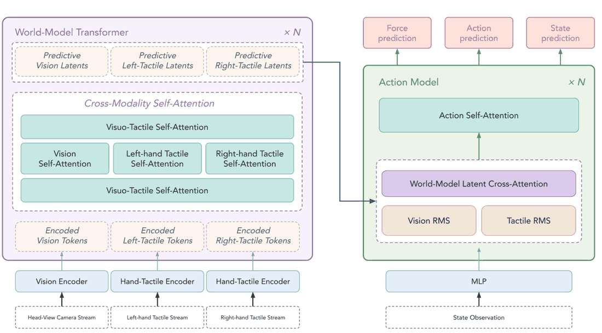
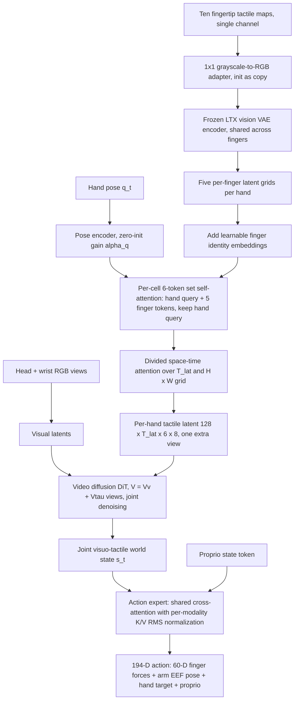
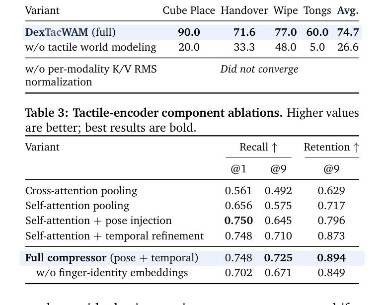

# DexTacWAM: A Visuo-Tactile World-Action Model for Dexterous Manipulation（灵巧操作的视触觉世界-动作模型）

- arXiv：https://arxiv.org/abs/2609.24976
- 来源：https://arxiv.org/abs/2609.24976
- 项目主页：https://dextacwam.github.io/
- 本地 PDF：`/Users/luogu/physical_intelligence/papers/world-model/DexTacWAM_2609.24976.pdf`
- 年份：2026
- 分类：world-model
- 优先级：high

## 一句话总结

DexTacWAM 把 TacWAM 一系的视触觉世界建模从平行夹爪推进到 22-DoF 双灵巧手：核心主张是**触觉接触演化本身要作为被预测世界状态的一部分**（$s_t=\{z^v_t,\hat{z}^{\tau,L}_t,\hat{z}^{\tau,R}_t\}$），而不是只当策略输入——每个指尖触觉图独立过冻结视觉 VAE（复用 LTX 视频模型的图像 latent 先验），经手指身份嵌入 + 手姿态注入 + 时空注意力的 5:1 触觉压缩器聚合成每手一个 latent，沿视图轴拼进视频扩散世界模型做联合去噪，动作专家用逐模态 K/V RMS 归一化的交叉注意力消费预测特征；在六个接触密集真机任务上平均 70.6 分对最强基线 RDP 的 38.0（工具中介的 Tongs 任务 60.0 vs 10.0），去掉触觉世界建模（只留触觉条件化）四任务均值从 74.7 崩到 26.6，压缩器保住 89.4% 的接触召回同时训练提速 2.26 倍、推理提速 1.29 倍，且"持续视觉到触觉学习"只用约 4 小时触觉数据 + 每任务约 100 条演示就给预训练视频模型加上触觉预测能力、视觉预测质量损失被钉在 0.5 dB 以内。

## 九问速览

1. **Problem**：22-DoF 双灵巧手的接触密集操作缺视触觉世界建模
2. **Bottleneck**：纯视觉 WAM 看不到力/变形/滑移；多指尖触觉 token 洪水淹没视频模型
3. **Insight**：触觉接触演化应作为被预测世界状态；5:1 压缩可保 89.4% 接触召回
4. **Method**：冻结视觉 VAE+手指身份/姿态注入的触觉压缩器→视频扩散联合去噪+动作专家
5. **Evidence**：六任务均值 70.6 vs 最强基线 RDP 38.0；去触觉世界建模 74.7→26.6
6. **Ablation**：触觉世界建模-48.1 分为最大项；去逐模态 K/V RMS 归一化不收敛
7. **Assumption**：预训练视频模型先验可迁移到触觉 latent（LTX VAE 图像先验）
8. **Failure**：约 4 小时触觉数据之外的传感器/安装变化；力监督仅训练期可用
9. **Opportunity**：动作专家预训练、跨平台触觉迁移未做

| 维度 | 论文答案 |
|---|---|
| Perception | 多视角 RGB+每指尖触觉图（外观/致密力场/网格变形流）；memory 4 帧 |
| Closed-loop | chunk 级闭环：每 action chunk（54 步）结束后用新观测重推理 |
| Correction | 预测触觉 latent 条件化动作专家，闭环执行可纠正漂移；KV 无真值替换机制 |
| Deployment | 触觉-488 语料+每任务约 100 条演示训练→6 个真机接触任务直接评测 |

## 核心技术

*论文 Figure 2（p4）：Figure 2: Overall architecture of DexTacWAM. A two-block transformer design. Left: the World-Model T*

1. **触觉即世界状态**：与"触觉当策略输入/辅助感知"的惯例不同，压缩后的左右手触觉 latent 与视觉 latent 一起构成联合世界状态 $s_t$，世界模型在 $s_t$ 上学动力学；消融证明这一选择（而非触觉信息本身）贡献了主要增益——把触觉预测拿掉、让动作专家直接条件化编码触觉特征，四任务均值 74.7 掉到 26.6。
2. **冻结视觉 VAE 当触觉编码器**：指尖触觉图（单通道致密 marker 网格变形）经初始化为"灰度复制三通道"的 1×1 卷积适配器后送入冻结 LTX 视觉 VAE——致密触觉图的空间局部结构（接触区域、变形模式、边缘、压敏纹理变化）与图像式 latent 编码兼容，直接继承视频模型的空间先验，免去从零训触觉 VAE。
3. **手指与姿态感知的 5:1 触觉压缩器**：每个时空 cell 上做 6-token 集合自注意力（1 个手 query + 5 个带身份嵌入 $e_i$ 的手指 token），保留手 query 输出实现 5:1 压缩；手姿态经姿态编码注入手 query（解决同一接触模式在不同手形下的歧义）；再经轻量 divided space-time attention（时间轴 $T_{\text{lat}}$、空间轴 $H'W'$）建模滑移/重抓/交接等时间性接触事件；输出 $\hat{z}^\tau\in\mathbb{R}^{C\times T_{\text{lat}}\times H'\times W'}$（$C=128$，$6\times8$ 网格）作为额外"视图"进入 DiT，视图数从 11（头 + 10 指尖）降到 3（头 + 双手）。
4. **模态分裂去噪目标**：视觉与触觉 latent 沿视图轴拼接后由共享 DiT 联合去噪，损失按模态分块（式 3），$\lambda_v=\lambda_\tau=1.0$，同时保留全局场景演化与局部接触演化。
5. **逐模态 K/V RMS 归一化动作专家**：视觉 latent 稠密全局、触觉 latent 稀疏接触敏感，直接拼接做交叉注意力会让 K/V 分布失衡——动作专家在注意力前把 K/V 按模态切开各自做无参数 RMSNorm 再拼回；去掉它动作专家**直接不收敛**。动作目标是 194 维连续向量（10 指 × 6D 力块 = 60 维 + 相对末端位姿的臂块 + 手目标 + 本体感觉预测），单一 flow-matching MSE 统一训练，力预测作为动作向量一部分被直接监督而非单独加权损失；部署时动作模型**不接收任何力输入**。
6. **持续视觉到触觉学习（三阶段）**：Stage 1 在 diverse-488 语料（约 4 小时、488 段双手灵巧交互，训 0-463、留 464-487 做分析）上只训轻量触觉模块（灰度适配器 + 压缩器 + 姿态编码器 + TimeSformer + 辅助头），LTX VAE 冻结；Stage 2 冻结触觉编码器、直接在每任务约 100 条演示上微调预训练视频 DiT 做跨模态世界建模（**无触觉中期训练**）；Stage 3 从 Stage 2 checkpoint 热启、动作专家从零初始化，同一批任务演示训练。

## 底层原理与数学推导

架构是两块 Transformer：世界模型 Transformer（×N）融合视觉与双手触觉 token（模态内自注意力 + 共享跨模态自注意力）产出预测 latent 构成联合世界状态；动作模型（×N）以本体感觉状态 token 为条件交叉注意力到世界模型 latent 上预测力、动作与下一状态。

**模态分裂去噪目标**（式 3）：干净联合 latent $s_{\text{clean}}=[z^v\Vert\hat{z}^\tau]$，采样噪声水平 $\sigma\in(0,1]$ 与高斯噪声 $\epsilon$，训练 DiT 预测 flow-matching 速度 $v_\theta(s_\sigma,\sigma)\approx\epsilon-s_{\text{clean}}$，损失分模态加权：

$$\mathcal{L}_{\text{wm}}=\lambda_v\,\mathbb{E}\big\lVert v_\theta(s_\sigma,\sigma)[:V_v]-(\epsilon-z^v)\big\rVert_2^2+\lambda_\tau\,\mathbb{E}\big\lVert v_\theta(s_\sigma,\sigma)[V_v:]-(\epsilon-\hat{z}^\tau)\big\rVert_2^2,$$

视觉块取前 $V_v$ 个视图、触觉块取其余——共享一套 DiT 参数但两模态的预测目标各自计损，防任一模态被另一模态的重建难度主导。

**逐模态 K/V RMS 归一化**（式 4）：动作交叉注意力前把 K/V 序列按模态切分、各自无参数 RMSNorm 后拼回：

$$e_x=\big[\mathrm{RMS}_v(x[:V_vL])\;\Vert\;\mathrm{RMS}_\tau(x[V_vL:])\big],\qquad h_a=\mathrm{Attn}_a(h,e_x),$$

注意力模块本身跨模态共享、只归一化注意力前的 K/V 统计——无任何可学习模态门或分模态动作通路，却在softmax 端压制视觉主导，且去掉后动作专家不收敛（唯一的"硬依赖"组件）。

**动作目标**（式 5）：单一 flow-matching MSE 覆盖 194 维全向量，$\mathcal{L}_{\text{act}}=\mathbb{E}_\sigma\lVert v^a_\theta(h,\sigma)-(\epsilon_a-a_t)\rVert_2^2$；臂块参数化为相对 chunk 起点实测位姿的增量，使预测目标在工作空间内中心化、尺度稳定——对双手交接这类需要精细相对对齐的任务最关键。

**压缩器的残差构造**（式 12-15）：每 cell 的集合编码输出以残差形式加在 softmax 加权手指平均上，

$$\tilde{z}_{t,h,w}=\sum_{i=1}^{5}\mathrm{softmax}(\ell)_i\,z^\tau_{t,i,h,w}+\alpha\,\tilde{z}^{\text{set}}_{t,h,w},\qquad \hat{z}^\tau=\tilde{z}^\tau+\alpha_t\big(\tilde{z}^\tau_{\text{refined}}-\tilde{z}^\tau\big),$$

其中手指 logits $\ell$ 与残差增益 $\alpha$ 初始化为均匀平均起点；姿态注入用手 query 加法 $q^{\text{hand}}_{t,h,w}\leftarrow q^{\text{hand}}+\alpha_q E_q(q_t)+p_{h,w}$（$\alpha_q$ 零初始化）。**全零初始化的门 = 压缩器从恒等平均出发逐步学习**，与动作专家 K/V 归一化一样属于"结构先验 + 温和引入"的设计语言。时间轴对齐视觉 latent 轨道：$T_{\text{lat}}=\text{mem\_size}+\lceil\text{chunk}/8\rceil+1$（式 10）。

**接触保持的度量**（式 6）：Retention = 融合后召回 / 融合前召回，直接量化 5:1 压缩丢了多少定位接触信息；配合融合前后两个触觉流解码器（$L_{\text{pre}}=\lVert\hat{x}^{\text{flow}}_{\text{pre}}-x^{\text{flow}}\rVert_1$、$L_{\text{post}}$ 同形，Stage 1 权重 $\lambda_{\text{loc}}=1.0$、$\lambda_{\text{loc,pre}}=0.3$）把"可解码回接触流"锁进压缩 latent。

## 物理直觉解释

**第一段：触觉是盲文，指尖是读盲文的手指**。视觉看灵巧手操作像隔着玻璃看人解魔方——手一合拢，物体与指腹的接触关系全部被手背挡住（Cube Place 任务里臂膀直接遮挡头相机视野），此时指尖的致密触觉图就是**贴着物体表面读盲文**：哪个指腹被压、剪切朝哪个方向、压力在增大还是消退，都是"魔方当前状态"的直接拼写。DexTacWAM 与以往工作的分水岭在于它不只让策略"摸着读"，而是让世界模型**学着预测盲文下一刻怎么变**——预测未来的触觉分布等于预测"我即将建立的接触会不会滑、会不会脱"，这正是抓取稳定性的物理定义。Tongs 任务（60.0 vs 所有视觉基线不超过 10）是最纯粹的证明：番茄被夹子夹着，相机根本看不到夹持力，唯一证据是通过工具传到指尖的力，预测这个力的演化就是预测任务成败。

**第二段：5:1 压缩像五人乐队的混音师**。十个指尖流相当于**十位乐手同时演奏**，若都进世界模型，DiT 要对 11 个视图做联合注意力（3168 个 view token），训练一步 3.87 秒。压缩器是混音师：把每只手五名乐手的声部（带身份嵌入——听得出是谁在演奏）混成一条音轨（每手一个 latent 网格），混音时还参考乐谱位置（手姿态注入——同一个音在不同把位含义不同），最后做时间连贯性处理（时空注意力——滑音与断奏要连起来听）。消融证明混音师的每个手法都有账可查：换成简单 cross-attention 池化召回掉到 0.492，补上姿态 0.645、补上时间精炼 0.710、全加上 0.725；抽掉乐手身份嵌入（五指可互换）召回掉到 0.671——**触觉 token 必须保持"可归因到指"，不能搅成一袋无主接触**。混音完成后 864 个 token、1.71 秒一步，快 2.26 倍。

**第三段：K/V 归一化是同声传译的音量拉平**。视觉 latent 像一位嗓门洪亮的演讲者（稠密、全局、数值幅度大），触觉 latent 像一位轻声的旁白（稀疏、局部、幅度小），直接塞进同一个 softmax 注意力里，**旁白几乎永远被演讲者盖过**——softmax 是归一化的竞争，幅度失衡等于票数失衡，动作专家训练直接发散。逐模态 RMSNorm 像给同声传译的每个声道**独立拉平电平**：两个模态各自以自身 RMS 为基准缩放后再进共享注意力，谁也不靠先天音量取胜、只能靠内容的相关性赢注意力。这个组件零参数、实现只有几行，却是全文唯一"去掉就不收敛"的部件——多模态融合的失败往往不在架构容量而在分布尺度的粗暴共存，这与 D-JEPA 用序数坐标统一异构几何（只比顺序不比刻度）是同一条经验法则在两个论文里的独立再现。

## 工程细节与实操指南

- **平台与传感**：22-DoF 双手灵巧操作平台，双手各 5 指配备 Sharpa 视觉式触觉传感（指面致密接触观测：接触激活、压力变化、接触移位与释放）；相机按任务设定且各方法一致——Cube Place 仅头相机（制造自遮挡）、Tongs/Bowl 头 + 右腕、Handover/Wipe/Bottle Cap 头 + 双腕；ViTacFormer 部署按 30 Hz 时间线对齐。
- **模型规模**：世界模型骨干 2B（DiT）+ 动作专家 160M = 2.16B；对照 GE 2B + 160M = 2.16B（同骨干同专家规模，隔离触觉通路）、π0.5 2.5B + 400M = 2.9B、ViTacFormer 100M、RDP 200M。
- **三阶段超参（表 8）**：Stage 1（触觉适配）——单 GPU，batch 16，AdamW(0.9, 0.95)，lr $1.0\times10^{-4}$，wd $1.0\times10^{-4}$，常数调度 + 1K 步 warmup，BF16 + TF32，每 5K 步存档；损失 $\lambda_{\text{loc}}=1.0$、$\lambda_{\text{loc,pre}}=0.3$，flow 加权为 square-root-magnitude-aware，采样 $T_{\text{choices}}\in\{1,9\}$。Stage 2（世界模型微调）——DDP，batch 16/进程、有效 64，lr $3.0\times10^{-4}$，wd $1.0\times10^{-5}$，梯度裁剪 1.0，梯度检查点开，BF16；chunk 9、memory 4、caption dropout 0.06、条件帧噪声 0.1；$\lambda_v=\lambda_\tau=1.0$；Table 5 显示 Handover 微调 25K 步、Wipe 30K 步。Stage 3（动作微调）——有效 batch 64（DeepSpeed ZeRO-2 或单 GPU），lr $5.0\times10^{-5}$，wd $1.0\times10^{-5}$，裁剪 1.0；动作 chunk 54、194 维目标、动作损失尺度 1.0；推理时 memory 帧干净。
- **数据规模**：diverse-488 预训语料约 4 小时 488 段（464 训 + 24 留出）；每任务约 100 条遥操作演示（同时喂 Stage 2 与 Stage 3）；评估每方法每任务 20 次真机试验。
- **延迟与吞吐（单卡 RTX 4090）**：压缩使 DiT 视图 11 到 3、view token 3168 到 864（3.67 倍），端到端延迟 363.0 到 281.6 ms/chunk（1.29 倍，低于 1.8 s 的动作 chunk 执行时间，可实时滚动）；训练迭代 3.87 到 1.71 s/iter（2.26 倍）。
- **训练 GPU 型号与卡数**：待确认——表 8 只写"单 GPU / DDP / ZeRO-2 或单 GPU"，未给型号与数量；延迟测量明确用 RTX 4090。
- **代码**：待确认——论文给项目页 https://dextacwam.github.io/ 但正文未声明代码开源。
- **评估注意**：四项二值任务（Cube Place、Tongs、Bowl、Bottle Cap）合并 80 试验/方法做统计；Handover（三段各 0.33）与 Wipe（五段各 0.2）为加和评分——引用单任务分数时需注明评分制不同。

## 实验协议清单

| 项目 | 论文设置 | 来源与备注 |
|---|---|---|
| 观测 | 多视角 RGB+每指尖 SAF 触觉三通道（外观/力场/变形流）；分辨率未报告；memory frames 4 | 第 3.1 节/附录 A.6 |
| 动作空间 | 22-DoF 双灵巧手关节命令 | 摘要/第 3 节 |
| 控制频率 | 30 Hz（时间聚合与训练对齐） | 附录 A |
| 重规划频率 | 每 action chunk 结束重推理 | 第 3.4 节 |
| 动作 horizon | action chunk 54 步；视频 chunk 9 帧 | 附录 A.6 表 |
| 数据 | diverse-488 语料约 4 小时/488 episodes（0-463 训练、464-487 留出）+每任务约 100 条演示 | 第 5.1 节 |
| 奖励 | 无（自监督视频/触觉预测+演示模仿） | 第 3 节 |
| Reset | 人工（真机演示与评测） | 全文隐含 |
| 成功定义 | 任务得分%（每任务 20 次真机试验） | 表 2 |
| 评估次数 | 每方法每任务 20 次真机试验；压缩器评测留出 24 段（每双手任务 150 帧） | 第 5 节/附录 |
| 随机种子 | seed 42（留出分析） | 附录 |
| 扰动测试 | 未见碗颜色/相机视角泛化（图 6） | 图 6 |
| 真机 | 六接触密集任务（双灵巧手平台） | 表 2 |
| 算力 | Stage-1 单 GPU；推理/压缩评测提及 RTX 4090；训练 GPU 型号未详报 | 附录 A/第 4 节 |
| 特权信息 | 力仅训练期做统一动作目标的辅助监督；部署时动作模型无力输入 | 附录 A.7 |

**附录陷阱自查**：
- privileged 信息：有力——力块只在训练期进动作目标，部署零力输入（论文显式声明）
- reward shaping：无
- reset 难度：真机人工 reset，任务为桌面受控场景
- eval budget：20 trials/任务，中等
- 底层控制栈：无强 planner，动作专家直接出 chunk
- 数据优势：基线用同一演示数据训练（同 epochs），公平

## 消融实验与分析

*论文 Table 2（p7）：Table 2: Policy-level ablations. Best task score (%) in bold*

主结果（每方法每任务 20 次真机试验）与关键消融：

| 消融轴 | 变体 | 关键数字 | 量级 |
|---|---|---|---|
| 主结果（六任务均值） | DexTacWAM vs RDP vs π0.5 vs GE vs ViTacFormer | 70.6 vs 38.0 vs 27.5 vs 27.3 vs 18.2 | 最强基线 +32.6 分 |
| 策略级消融（四任务均值） | 完整 vs 去触觉世界建模 | 74.7 → 26.6（Cube Place 90.0→20.0、Tongs 60.0→5.0） | −48.1 分，最大单项 |
| 策略级消融 | 去逐模态 K/V RMS 归一化 | 动作专家不收敛（开环预测不跟踪真值，未进闭环） | 硬依赖 |
| 压缩器组件（留出 24 段） | cross-attn → self-attn → +pose → +temporal → 全量 | Recall@9：0.492 → 0.575 → 0.645 → 0.710 → 0.725；Retention@9：0.629 → 0.717 → 0.796 → 0.873 → 0.894 | 全压缩器保留 89.4% 召回 |
| 压缩器组件 | 全量去手指身份嵌入 | Recall@9 0.725 → 0.671、Retention@9 0.894 → 0.849 | 指纹必须可归因 |
| 触觉预测质量（留出轨迹） | 潜空间 + 接触流 + 抗平凡基线 | cosine 0.967、NMSE 0.063、接触 P/R/F1 = 0.749/0.725/0.737、相对 copy-last-frame 误差比 0.561× | 非复制平滑 |
| 视觉保真保持（配对） | 视触觉 vs 纯视觉对照 | Handover（25K 步）PSNR 17.84 vs 17.78；Wipe（30K 步）17.07 vs 17.14；ΔPSNR 95% CI [−0.16, +0.28] / [−0.49, +0.36] dB | 损失上界 0.5 dB |
| 泛化（Bowl 留出配置） | 未见颜色 / 未见堆叠高度 | 13/20 与 12/20（训练分布内持平） | 外观与几何双泛化 |
| 统计合并（四二值任务） | DexTacWAM vs RDP | 55/80（68.8%，Wilson 95% CI [57.9, 77.8]）vs 24/80（30.0%，[21.1, 40.8]）；Fisher 精确检验 p = 1.59×10⁻⁶ | 显著 |
| 表征结构（A.11，1,350 段右手片段） | 冻结 VAE 右拇指 vs 压缩后手 latent | 5-NN 95.6% → 96.4%、线性探针 99.0% → 99.6%、轮廓系数 0.060 → 0.081（均匀随机 16.7%、多数类 22.2%） | 压缩不丢任务结构 |

**核心结论：**
1. **接触演化作为世界状态是主要增益来源**：同样的触觉特征、同样的动作专家，只把"预测触觉"换成"条件化触觉"，四任务均值 74.7 崩到 26.6（−48.1）——比"要不要用触觉"（RDP 拿同样十指 wrench 只到 38.0）重要得多；预测式触觉让动作专家拿到的是"接触将如何发展"的前瞻特征而非当前帧读数。
2. **工具中介与遮挡任务是预测触觉的最大受益场景**：Tongs 60.0 对所有相机基线不超过 10（ grasp 状态只能从传过工具的力推断）、Cube Place 90.0 对 π0.5 的 10.0（自遮挡下视觉定位失效）；接触可部分观察性越差，触觉世界建模的边际价值越高。
3. **压缩器的三个结构要素全部可量化兑现**：5:1 压缩保留 89.4% 接触召回（从 cross-attn 基线的 62.9% 一步步补齐姿态与时间精炼），换来 2.26 倍训练与 1.29 倍推理提速；手指身份嵌入贡献 0.054 召回——接触信息必须保持指级可归因。
4. **视觉先验迁移近乎免费但确有边界**：视觉预测 PSNR 配对差 95% CI 把损失钉在 0.5 dB 内（SSIM/LPIPS 差异同样可忽略）；触觉预测本身非平凡（相对 copy-last-frame 误差 0.561×，且 A.10 显示预测随交互改变剪切方向而非静态拓印）。
5. **动作专家的融合纪律是硬门槛**：逐模态 K/V RMS 归一化移除后动作专家发散——多模态动作学习中分布尺度对齐的优先级高于任何容量设计。
6. **注意两处论文瑕疵**：4.2 节正文把 74.7→26.6 的出处标为 "(Table 1)"，实际数据在 Table 2（表号笔误）；且"去触觉世界建模"变体在 Cube Place（20.0）与 Handover（33.3）上的分数与 ViTacFormer 主表同任务分数完全相同（Wipe/Tongs 不同），论文未解释此重合，引用时建议以 Table 2 数值为准并留意这一巧合。

## 技术权衡（Trade-off）

| 优势 | 劣势 |
|---|---|
| 触觉进世界状态（而非仅条件化）：74.7 vs 26.6 的消融差距，前瞻接触特征对遮挡/工具/摩擦任务决定性 | 推理仍需世界模型前向（281.6 ms/chunk），且依赖预训视频 DiT 骨干——比轻量策略（RDP 200M）重一个量级 |
| 复用冻结视觉 VAE + 4 小时触觉适配 + 每任务约 100 演示：数据与算力上把触觉预训练问题缩到任务级 | 仅在视觉式（视触觉）传感上验证，电容/压阻/压电/磁敏等其他原理未测（作者自认限制一） |
| 5:1 压缩保留 89.4% 召回同时 2.26 倍训练 / 1.29 倍推理提速，延迟低于 chunk 执行时间可实时 | 压缩是有损的：Retention 0.894 意味着约一成定位接触信息丢失，对依赖单指微弱接触信号的任务（如 Bottle Cap 初接触）是否够用未单测 |
| 逐模态 K/V RMSNorm 零参数解决融合失衡，实现极简 | 成功演示训练（success-only）：无失败/恢复数据，一旦进入分布外失败态预测与动作同时劣化（作者自认限制二，附录 A.9） |
| 动作目标统一 194 维流匹配（力作为动作向量一部分），无需手调力损失权重；部署零力输入 | 动作专家从零初始化、只见每任务约 100 条演示——对比 π0.5 的 400M 预训动作专家处于数据劣势，上限未被探索 |
| 六任务全胜 + Fisher p=1.59×10⁻⁶ 的统计强度 + 未见颜色/堆叠高度的泛化 | 任务集自建、评分制混合（二值与加和并存），与外部基准不可直接对标；六任务均在一个平台上 |

## 技术价值与演进定位

DexTacWAM 在 WAM 谱系里补上了"分布式多指触觉"这一格：此前的视触觉世界建模（VT-WM、OmniVTA、VTAM）停在平行夹爪——触觉是局部的、结构简单的两路信号；灵巧手把问题升维成"十个指尖流 + 手姿态依赖的接触几何"，直接建模会让视图数爆炸。它的两个通用贡献超出灵巧操作本身：一是**把"模态进世界状态"与"模态进策略条件"清晰分开并用 48 分的消融差距定量定价**——这给所有想做多模态 WAM 的工作提供了一个设计判据（什么模态值得预测、什么模态只值得条件化）；二是**持续视觉到触觉学习**证明了预训练视频先验可以经最小适配（4 小时、轻量模块、VAE 冻结）扩展到新传感模态而几乎不付视觉质量代价（<0.5 dB）——这条"旧模态先验养新模态"的路线对力觉、听觉、甚至事件相机都直接可迁移。相对库内 TacWAM（平行夹爪、触觉未来只做监督被掩码隔离出动作通路），DexTacWAM 代表了另一个极端——预测触觉 latent 直接喂动作专家——两者的对比正是上述判据的一对受控样本。

## 与其他论文的关系

1. **notes/world-model/tacwam.md（TacWAM，2607.28391）**：最直接的谱系对照。TacWAM 是平行夹爪 + 三模态掩码注意力：未来触觉 token 被 AGT 掩码严格隔离在动作通路外（只做训练监督、部署一致性优先），四真实任务平均 75.0（对最强基线 +37.5）；DexTacWAM 是灵巧手 + 触觉 latent 作为世界状态直接喂动作专家（前瞻特征优先），六任务平均 70.6（对最强基线 +32.6）。两者数字不可直接比（平台、任务、评分制全不同），但设计取向相反：一个防触觉未来泄漏、一个主动让动作吃预测触觉——TacWAM 的掩码在 DexTacWAM 框架里对应"去触觉世界建模"变体的某种中间态，谁在何种接触任务上更优未被共同基准裁决。
2. **notes/rl/dexterous/hapticvla.md（HapticVLA）**：同一"接触丰富操作"问题的无触觉推理路线——HapticVLA 追求部署时不带触觉传感；DexTacWAM 的结论（触觉可部分观察性高的任务上 60.0 vs 10）恰好划出了该路线的失效边界：工具中介力与遮挡接触是必须在线感知的。
3. **notes/architecture/diffusion-policy.md（Diffusion Policy）与 RDP 基线**：RDP（RSS 2025）把十指 6D wrench 直接注入 diffusion policy，是最强基线（38.0）——同样原始触觉信号，"当策略输入"与"当被预测世界状态"之间隔着 32.6 分的差距；这个对照是论文最有说服力的一组控制变量。
4. **notes/architecture/pi05.md（π0.5）**：大规模机器人策略预训练的代表基线（2.9B，无触觉输入，平均 27.5）——在接触密集任务上被 2.16B 的视触觉 WAM 大幅反超（70.6），定量展示了"预训练视觉先验不覆盖接触动力学时"通用策略的盲区；同时 DexTacWAM 的视频骨干微调与 π 系的动作专家设计同属 flow-matching 谱系。
5. **notes/world-model/what-matters-wam.md（WhatMattersWAM，2609.24048）**：该研究的目标轴结论是"ID 下辅助世界建模目标普遍降性能"——DexTacWAM 的消融给出一个重要反例维度：当辅助目标携带策略看不见的模态（触觉）时，其增益不是正则化性的而是信息性的（74.7 vs 26.6）；两文合读可细化结论为"冗余模态的辅助目标要分阶段，新模态的预测目标必须前置"。
6. **notes/world-model/dreamzero.md / notes/world-model/worldvla.md（WAM 主线）**：DexTacWAM 延续 WAM"视频生成底座 + 动作生成"范式但把世界状态从纯视觉扩为视触觉；与 DreamZero（WAM 即零样本策略）不同，它坚持任务内演示微调路线——因为触觉动力学无法从人类视频零样本获得，这也解释了为何"数据高效"（4 小时 + 100 演示）是它的核心卖点。
7. **notes/architecture/flow-matching.md（Flow Matching）**：世界模型（flow 速度预测，式 3）与动作专家（式 5）双流匹配目标共享同一数学形式，视觉/触觉联合去噪与 194 维动作去噪在同一训练纲领下统一——是该技术在多模态 WAM 中的完整应用样本。

## 精读问题

1. "去触觉世界建模"变体在 Cube Place（20.0）与 Handover（33.3）上的分数与 ViTacFormer 主表完全相同——这是两种方法在这些任务上真的等价，还是消融实现与基线共享了部分组件？需要作者澄清实验独立性？
2. 触觉世界建模增益（74.7 vs 26.6）的机制是"前瞻特征"还是"预测目标对共享骨干的正则化"——若给条件化变体也加一个不喂动作专家的触觉预测辅助头（预测但不消费），能否分离这两种解释？
3. 5:1 压缩的 Recall@9 上限是 0.725（融合前 0.748 附近），损失约一成——对依赖单指微弱初始接触的任务（Bottle Cap 初次建立摩擦、Tongs 夹住番茄前的轻触）做逐任务召回-成功率相关分析，压缩损失是否会显性化为成功率损失？
4. 逐模态 K/V RMSNorm 是无参数的，那么模态间幅度失衡能否更早干预——例如在 Stage 2 的联合去噪损失里也做模态分裂的 RMS 归一化（而不只是动作交叉注意力），世界模型训练是否同样受益？
5. 持续视觉到触觉学习把视觉 PSNR 损失钉在 0.5 dB 内，但触觉预测质量（cosine 0.967、接触 F1 0.737）与专用触觉世界模型（如 VT-WM 系）相比处于什么水平——缺失的直接对照：在同一任务上从头训一个触觉 DiT（不用视觉先验）需要多少数据才能追平？
6. success-only 训练使失败态成为分布外（附录 A.9 自认）——若用扰动/干预采集 10-20% 失败-恢复演示混入 Stage 2/3，触觉世界模型对滑移后的再接触预测能否改善，Bottle Cap 的 60.0 还有多少头部空间？
7. 手姿态注入用全局手姿态 $q_t$ 编码，但同一接触模式的歧义更多来自**手指间相对构型**——用相对关节角或指间距离替代全局姿态，Recall@9 的 0.645（仅 pose）与 0.725（全量）之间的差距会怎么变？
