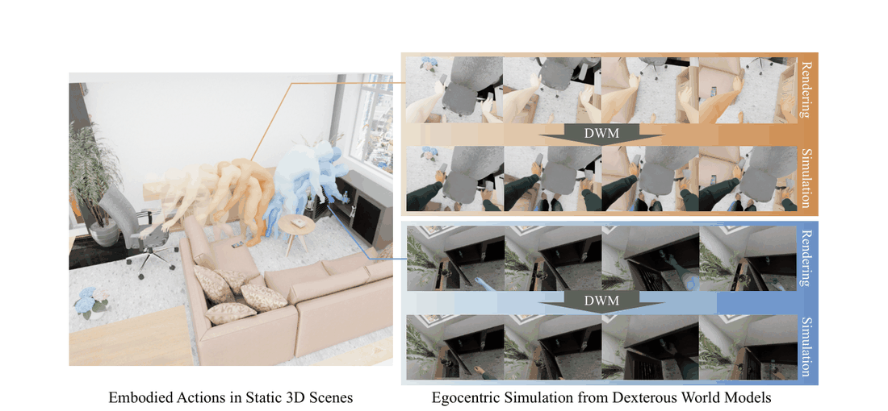
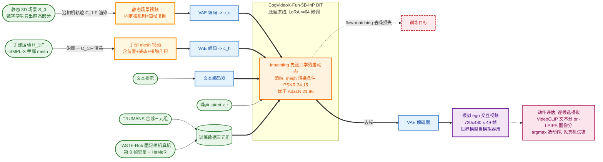
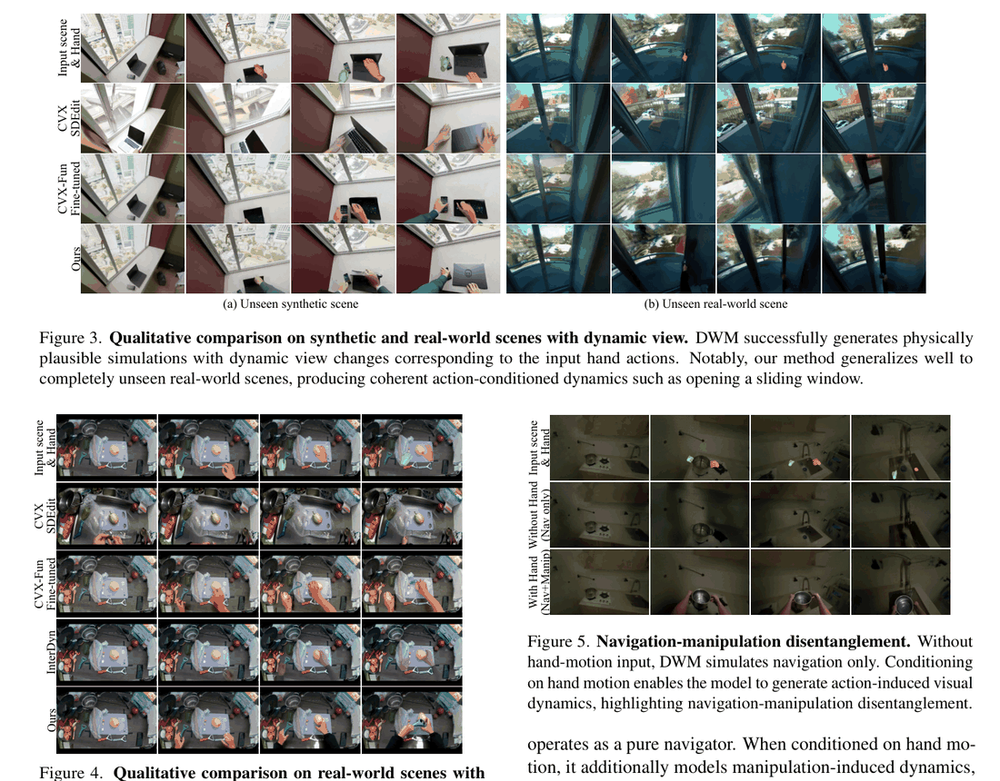

# Dexterous World Models (DWM)

- arXiv: https://arxiv.org/abs/2512.17907
- Source: https://arxiv.org/abs/2512.17907
- Project: https://snuvclab.github.io/dwm
- Local PDF: `/Users/luogu/physical_intelligence/papers/world-model/DWM_2512.17907.pdf`
- Year: 2026
- Category: scene-action conditioned video diffusion / dexterous world model
- Priority: high

## 一句话总结

静态 3D 数字孪生只会「看」不会「动」的问题，被 DWM 用「把静态场景渲染当输入、只学动作诱导的残差动态」的方式解决：以 CogVideoX-Fun-5B-InP（全遮罩下近似恒等映射的视频修复模型）为初始化，用 LoRA 微调一个以「静态场景视频渲染（沿相机轨迹）+ 自我中心手部 mesh 渲染」为条件的视频扩散世界模型，在 TRUMANS 合成 + TASTE-Rob 真实固定相机的混合数据上训练（4×A100 10 天），在 144 样本基准上真实静态相机 LPIPS 0.227 / DreamSim 0.057 全面超过 CVX-Fun 微调基线（0.265 / 0.089），且在训练中从未见过的真实动态相机场景（Aria 采集，PSNR 21.654）上仍保持泛化，并能用 VideoCLIP / LPIPS 对候选动作打分实现基于模拟的动作评估。

## 九问速览

1. **Problem**：3D 重建的数字孪生是静态的，无法模拟灵巧手交互诱导的动态
2. **Bottleneck**：视频世界模型用文本当动作太粗糙，且场景生成与动态耦合
3. **Insight**：显式给定静态场景 S0 作条件，模型只学残差 ΔS；inpainting 先验≈恒等映射
4. **Method**：场景-动作条件视频扩散，静态场景视频 + ego 手部 mesh 渲染双条件
5. **Evidence**：真实静态相机 LPIPS 0.227 vs 基线最优 0.240，DreamSim 0.057 vs 0.089（144 样本×3 种子）
6. **Ablation**：手部 mesh 渲染条件比 AdaLN/手部 mask 提升 PSNR 24.151 vs 21.962；混合数据真实场景 PSNR +3.6
7. **Assumption**：已知静态 3D 场景且可沿任意相机轨迹渲染；手部动作用 mesh 轨迹给定
8. **Failure**：非刚体/易变形物体失效；依赖文本提示才有最佳质量；无显式 3D/深度/接触推理
9. **Opportunity**：换掉文本依赖、接入深度/接触先验、作可微模拟器用于策略学习

| 维度 | 论文答案 |
|---|---|
| Perception | 输入为静态场景沿相机轨迹的渲染视频 + ego 手部 mesh 渲染视频 + 文本，输出 720×480×49 帧交互视频 |
| Closed-loop | 预测层面闭环有限：可按条件生成后果并给候选动作打分（VideoCLIP/LPIPS 排序），无执行后反馈重规划 |
| Correction | 无在线校正；恒等先验 + 静态场景条件充当「结构锚」，防生成漂移而非修正累积误差 |
| Deployment | 训练 = 合成 TRUMANS + 固定相机真实 TASTE-Rob；评测含训练中完全未见的真实动态相机场景（48 段 Aria 采集），泛化成立；无真机控制闭环 |

## 核心技术

**信息流拆法（Figure 2）。** 三路条件进入同一个 DiT 视频扩散骨干：(1) 静态场景 $S_0$ 沿指定相机轨迹 $C_{1:F}$ 渲染成「静态场景视频」，经 VAE 编码为 latent $c_s$——它锁定了相机的自我中心运动与场景外观，是空间一致性的锚；(2) 手部动作 $H_{1:F}$（SMPL-X 全身中分割出的手部 mesh）沿同一相机轨迹渲染成「手部 mesh 视频」，编码为 $c_h$——提供像素对齐的几何与运动线索，是动力学的驱动信号；(3) 文本提示经 text encoder 给语义指导。三路条件与加噪的 noisy latent $z_t$ 沿通道维拼接后送入 DiT $\epsilon_\theta$ 预测噪声，去噪后 VAE 解码出交互视频。注意静态场景视频与手部视频都在「同一 ego 相机轨迹」下渲染——这就是把 3D 条件压平成 2D 视频条件的关键近似（式 5）。

*论文 Figure 1（p1）：Figure 1. Dexterous World Models predict egocentric visual dynamics of static 3D scenes, driven by d*

**什么预训练、什么冻结、什么训练。** 基座是 CogVideoX-Fun-V1.5-5B-InP（视频修复扩散模型），全 mask $m=1$ 时它近似一个「带生成先验的恒等映射」——输入完整视频就复现它。这一性质被用来定义残差学习：静态场景视频作输入时基线输出就是「保持场景不动」，手部条件再引导扩散过程只合成操作诱导的改变。微调时只训练 LoRA 层（rank 64，α=64）和 image projection 层，DiT 其余参数与 VAE 全部冻结；监督信号是交互视频（TRUMANS 里交互前后状态可精确对齐，TASTE-Rob 里固定相机使首帧重复即静态视频）。

**数据构造（hybrid triplet）。** 训练需要三元组（静态场景视频、手部 mesh 视频、GT 交互视频），真实动态 ego 视角下无法采集，于是：合成侧用 TRUMANS（虚拟相机刚体绑定在头部关节、双眼中点对齐），三路渲染严格同步；真实侧用 TASTE-Rob 固定相机视频，$C_t = C_0$ 使 $\Pi(S_0;C_t) = V_0$ 恒成立（首帧复制 F 次构造静态视频），手部 mesh 用 HaMeR 从视频恢复。评测侧自建 48 段 Aria 眼镜动态视角数据（SLAM 毫米级轨迹 + 交互前帧重建 3D Gaussian 场景再沿轨迹渲染）。

**Loss 是标准 latent diffusion MSE**（式 7），无额外蒸馏/对比项——novelty 全在条件构造与初始化选择上，而非目标函数。

## 底层原理与数学推导

**世界模型的残差分解（式 1）。** 把未来状态写成「初始场景 + 动作诱导的增量」：

$$
p_\theta(S_{1:F} \mid S_0, A_{1:F}) = p_\theta\big((S_0 + \Delta S_t)_{t=1:F} \mid S_0, A_{1:F}\big)
$$

已有导航类世界模型（如 Navigation World Models）只处理 $A_{1:F} = C_{1:F}$、$\Delta S = \emptyset$ 的静态情形；而已有「人体动作条件」方法（如 PlayerOne）要模型从单帧 $I_0$ 同时幻觉场景与动态，可写成对 $S_0$ 与 $\Delta S_{1:F}$ 的联合边缘化（式 2）——动力学模型被迫把 $S_0$ 当输出的一部分去生成，场景生成与状态变化互相纠缠，破坏因果一致性。

**DWM 的条件化分解（式 4）。** 把 $S_0$ 从输出移到条件里，再引入隐变量 $\Delta S_{1:F}$：

$$
p_\theta(V_{1:F} \mid S_0, A_{1:F}) = \int_\Delta p^d_\theta(\Delta S_{1:F} \mid S_0, H_{1:F})\, p^o_\theta(V_{1:F} \mid S_0, \Delta S_{1:F}, C_{1:F})\, d\Delta S
$$

动力学模型 $p^d$ 只产生动作诱导的状态变化（不再依赖 $C$，因为相机不影响世界状态），观测模型 $p^o$ 把演化中的世界沿相机轨迹渲染成帧。因果链变成：操作驱动状态转移，相机轨迹决定这些变化如何被看见。

**ego 渲染近似与 2D 残差（式 5–6）。** 实例化时进一步假设视觉序列只通过 ego 渲染依赖 $S_0$ 与 $A_{1:F}$：

$$
p(V_{1:F} \mid S_0, A_{1:F}, T) \approx p\big(V_{1:F} \mid \Pi(S_0; C_{1:F}),\ \Pi(H_{1:F}; C_{1:F}),\ T\big),\qquad V_{1:F} = \Pi(S_0; C_{1:F}) + \Delta V_{1:F}
$$

即把 3D 条件压平成两段 2D 视频条件，且输出被参数化为「静态渲染 + 2D 残差动态」。当 $\Delta S_t$ 很小时 $\Delta V_t$ 也小、输出贴近静态渲染——这正是 inpainting 初始化的用武之地：全 mask 修复模型本来就擅长「大部分照抄 + 局部重生成」。

**训练目标（式 7）。** 标准 latent diffusion 噪声回归：

$$
\mathcal{L}_{\text{LDM}} = \mathbb{E}_{z_0, t, \epsilon}\Big[\big\|\epsilon - \epsilon_\theta(z_t, t \mid c_s, c_h)\big\|_2^2\Big]
$$

**固定相机的退化情形（式 8）。** 真实固定相机数据下 $\Pi(S_0; C_t) = \Pi(S_0; C_0) = V_0\ \forall t$，所以静态视频 = 首帧复制——这就是无需 3D 重建即可构造真实三元组的数学依据。

**动作评估（式 9–11）。** 对候选动作逐一模拟出 $V^{(i)}_{1:F}$ 后，文本目标用 VideoCLIP 余弦相似度 $s^{(i)}_{\text{text}} = \text{sim}_{VC}(V^{(i)}_{1:F}, g_{\text{text}})$，图像目标用 $s^{(i)}_{\text{img}} = -\text{LPIPS}(I^{(i)}_F, I_{\text{goal}})$，取 $A^* = \arg\max_i s^{(i)}$——把「世界模型当模拟器」落地为免奖励、免真机试错的目标驱动动作选择。

## 物理直觉解释

**「先给模型一张描好的图纸，它只需要学怎么把图纸画脏」。** 传统视频世界模型像让画家凭一句口信（文本提示）从白纸画整个房间再加上有人在里面翻东西——画房间本身已经耗掉大部分容量，动作的因果后果反而画不准。DWM 直接把渲染好的静态场景视频摊在画家面前：画家 90% 的工作是描红（inpainting 先验的恒等性），只有手碰到的地方才需要动笔。这就是「残差动态学习」的物理含义——真实世界的交互大多是局部事件（抓、开、推），绝大多数像素帧间不变，把不变部分显式供给模型，等于告诉它「因果只发生在接触附近」。消融佐证了这一点：换成 AdaLN 注入 MANO 参数（无像素对齐）PSNR 掉到 21.962，手部 mask（只有位置无关节）LPIPS 恶化到 0.338，唯有 mesh 渲染条件（既有位置又有姿态与接触几何）拿到 24.151。

**「inpainting 模型是个会画画的照相机」。** 全 mask 下的视频修复模型行为像一台照相机：输入什么就复现什么，但它复现的过程里带着预训练学到的空间结构、时序平滑、外观连续性等「物理常识」。DWM 的巧思是把这个恒等性当初始化——训练起点处模型对任何输入都「什么都不改变」，手部条件只能通过梯度逐步学会「在哪里制造改变」。附录 D 的消融把这层直觉量化了：I2V 初始化的模型 0 步时 DreamSim 0.337（一开始就乱改），inpainting 初始化 0 步时 0.110，训练 4000 步后 0.088 vs 0.103——起点选在「保守」一侧，收敛又快又稳。这类似控制系统里给被控对象一个稳定的 nominal 模型再做增量辨识，而不是从零辨识整个对象。

**「相机管看、手管变，两者解耦才不串味」。** 场景如何被观察（locomotion 引起的视角变化）与世界如何被改变（manipulation 引起的状态变化）是两种物理上独立的因果源。若让模型从单帧同时生成两者，它会把「我走近了」误学成「物体动了」。DWM 把相机轨迹作为渲染条件显式给出，Figure 5 的导航-操作解耦实验显示：不给手部条件时模型退化为纯导航器（场景不因动作改变），给上手部条件才出现操作诱导的动态。这就像**剧院的舞台布景与演员动作分工**——布景轨道（相机）由舞台机械负责，演员（手）只负责改变道具状态，两者混在一起排练就会互相干扰。混合数据消融同样体现该分工的价值：仅用 TRUMANS 训练在真实静态相机上 PSNR 只有 17.959，加入 TASTE-Rob（即使全是固定相机）后升到 21.547——真实物理细节（流体、材质形变）是合成数据补不上的另一条腿。

## 工程细节与实操指南

- **基座与微调配置（附录 A）**：CogVideoX-Fun-V1.5-5B-InP；LoRA rank 64、α=64；只训 LoRA + image projection 层；AdamW，lr $1\times 10^{-4}$，effective batch size 56；4×A100 训练约 10 天。输出 720×480、49 帧。
- **评测协议**：144 样本 = 48 TRUMANS 未见序列（Synthetic Dynamic）+ 48 TASTE-Rob 未见样本（Real-World Static）+ 48 自采 Aria 样本（Real-World Dynamic）；每样本 3 个随机种子生成取平均；指标 PSNR / SSIM / LPIPS / DreamSim。
- **基线复现要点**：CVX SDEdit 用 CogVideoX 去噪、noise strength 0.75、50 步；CVX-Fun Fine-tuned 用同一基座微调但去掉手部视频条件、mask 全 1；InterDyn 仅在静态相机设定下比较（ControlNet 注入手部 mask）。
- **真实动态视角数据采集协议（附录 C）**：Aria 眼镜 SLAM 提供毫米级轨迹 → 操作前探索帧重建 3D Gaussian 场景（gsplat）→ 沿交互期轨迹渲染得静态场景视频。覆盖 pick-and-place、关节物体操作（开洗衣机、折叠椅）、反事实动态（按电梯门开、开水龙头出水）。作者明说该协议只够评测规模，扩到训练规模需自动化。
- **动作评估实操**：文本目标用 VideoCLIP（VideoCLIP-XL）相似度；图像目标取生成视频末帧与目标图算 LPIPS，取负作分数；论文示例 4 个 rollout 的 CLIP 分 19.031–22.242、LPIPS 0.275–0.309，分差足以区分动作。
- **机器人视频生成扩展（附录 F）**：沿 Masquerade 流程把 DWM 生成的 ego 人类交互视频转成机器人臂视频（mask 掉人体、手部位姿映射到机器人控制构型），可作免物理模拟器的视觉仿真器与策略学习数据增广。
- **部署注意**：仍需文本提示才有最佳质量（附录 E：无 prompt 时物体一致性变弱、运动精度下降）；文本依赖的蒸馏是作者列出的开放问题。

## 实验协议清单

| 项目 | 论文设置 | 来源与备注 |
|---|---|---|
| 观测 | 静态场景视频渲染 + ego 手部 mesh 视频（沿同一相机轨迹）+ 文本提示；输出 720×480、49 帧 | 摘要 / 附录 A；视频帧率未报告 |
| 动作空间 | $A_{1:F} = \{C_{1:F}, H_{1:F}\}$：相机轨迹 + 手部 mesh 轨迹（SMPL-X/MANO；TASTE-Rob 侧由 HaMeR 恢复） | 第 3.1–3.2 节 |
| 控制频率 | 未报告（视频生成任务，49 帧时长对应的 fps 未给出） | 全文未见 |
| 重规划频率 | 不适用（动作评估为一次性候选排序，未描述执行后 receding-horizon 重规划） | 第 3.4 节 |
| 动作 horizon | 49 帧视频（单次生成的时域范围） | 附录 A |
| 数据 | 训练：TRUMANS 合成 ego 交互 + TASTE-Rob 固定相机真实视频（规模未报告）；评测：144 样本（48/48/48） | 第 4 节 / 附录 C |
| 奖励 | 无奖励函数；目标对齐分数 = VideoCLIP 相似度（文本目标）或 −LPIPS（图像目标） | 式 9–11 |
| Reset | 不适用（视频预测评测，无环境 reset） | 第 4 节 |
| 成功定义 | 与 GT 交互视频的 PSNR↑ / SSIM↑ / LPIPS↓ / DreamSim↓ | 第 4 节 |
| 评估次数 | 每样本生成 3 个视频（随机种子）取平均；基准共 144 样本 | 第 4 节 |
| 随机种子 | 每样本 3 seeds（评测期生成）；训练种子未报告 | 第 4 节 |
| 扰动测试 | 无显式扰动实验；泛化压力来自「训练全无的动态相机真实场景」与「训练无开窗动作仍能生成开窗」 | 第 4.1 节 / Figure 3 |
| 真机 | 无真机闭环控制；真实数据评测含自采 Aria 动态视角 48 段；附录 F 仅离线演示转机器人视频 | 附录 C / F |
| 算力 | 训练 4×A100 约 10 天 | 附录 A |
| 特权信息 | 训练用合成数据的完美对齐三元组（TRUMANS 状态可控）与 HaMeR 伪标签手部 mesh；评测需 GT 交互视频 | 第 3.3 节 |

**附录陷阱自查**：
- privileged 信息：静态 3D 场景本身是特权输入（评测时由 SLAM+3DGS 重建提供）；合成训练数据状态完全可控；无 GT 几何直接进模型
- reward shaping：无 reward；动作评估分数（CLIP/LPIPS）即目标函数，存在 CLIP 分数与物理成功不对齐的常规风险
- reset 难度：不适用（无控制回路）
- eval budget：144 样本 × 3 seeds，规模中等；PSNR 等指标对「生成任务」是否反映交互正确性有限（DreamSim/LPIPS 更偏感知相似）
- 底层控制栈：无底层控制器；生成用 CogVideoX-Fun 推理栈（去噪步数未报告，仅 SDEdit 基线给了 50 步）
- 数据优势：合成对齐三元组是普通视频世界模型拿不到的监督；真实侧只有固定相机，动态相机真实数据完全缺席训练——反而构成对泛化声明的有利压力测试

## 消融实验与分析

*论文 Table 1（p7）：Table 1. Quantitative comparisons on synthetic and real-world datasets. Our method consistently achi*

### A. 混合训练数据（Table 2）

| 训练数据 | 合成动态 PSNR↑ | 合成动态 DreamSim↓ | 真实静态 PSNR↑ | 真实静态 LPIPS↓ | 真实静态 DreamSim↓ | 真实动态 PSNR↑ |
|---|---|---|---|---|---|---|
| 仅 TRUMANS | 24.151 | 0.093 | 17.959 | 0.304 | 0.124 | 20.654 |
| TRUMANS + TASTE-Rob（Ours） | 25.031 | 0.086 | 21.547 | 0.227 | 0.057 | 21.654 |

**核心结论**：加入固定相机真实数据后，真实静态相机 PSNR +3.588、DreamSim 减半以上（0.124→0.057），且在「训练中从未出现的动态相机真实场景」上也 +0.999——真实物理动态的监督信号可从固定相机迁移到动态相机，混合数据策略成立。

### B. 手部动作条件形式（Table 3，合成数据）

| 条件形式 | PSNR↑ | SSIM↑ | LPIPS↓ | DreamSim↓ |
|---|---|---|---|---|
| AdaLN（全局聚合） | 21.962 | 0.806 | 0.306 | 0.127 |
| AdaLN（逐帧） | 22.789 | 0.827 | 0.288 | 0.110 |
| 手部二值 mask | 22.876 | 0.797 | 0.338 | 0.137 |
| 手部 mesh 渲染（Ours） | 24.151 | 0.834 | 0.304 | 0.094 |

**核心结论**：像素对齐 + 显式关节结构的 mesh 渲染条件全面最优；参数空间注入（AdaLN）缺像素对齐，mask 有对齐但无关节信息——手-场景接触与外观变化需要「位置 + 姿态 + 接触几何」三者齐备。

### C. 基座初始化（Table 4，DreamSim↓ 随训练步数）

| 初始化 | 0 | 1000 | 2000 | 3000 | 4000 |
|---|---|---|---|---|---|
| I2V | 0.337 | 0.240 | 0.221 | 0.150 | 0.103 |
| Inpainting（Ours） | 0.110 | 0.166 | 0.098 | 0.103 | 0.088 |

**核心结论**：inpainting 初始化从第 0 步就占据大幅优势（0.110 vs 0.337），全程更优——「恒等映射 + 生成先验」的假设被训练动力学直接验证；I2V 初始化收敛慢且定性上难以学会动作条件动态（Figure 8）。

### D. 文本提示的作用（附录 E，定性）

无 prompt 时模型仍能生成手部操作诱导的物体运动，但物体一致性变弱、运动精度下降；有 prompt 时物体身份稳定、操作结果保真度更高——文本先验与动作驱动条件互补，当前管线去不掉文本。

## 技术权衡（Trade-off）

| 优势 | 劣势与工程代价 |
|------|---------------|
| 静态场景显式条件化：残差学习聚焦因果动态，未接触区域天然保真 | 需要可渲染的静态 3D 场景（3DGS 等）作前置，且相机轨迹必须已知/可估计 |
| inpainting 恒等先验：训练稳定、起点保守、收敛快 | 继承视频扩散全部推理成本；输出固定 720×480×49 帧，长时程交互无法一次覆盖 |
| 手部 mesh 渲染条件：像素对齐 + 关节几何，控制精度最高 | 部署期需高质量手部 mesh 轨迹（HaMeR 级估计或动作生成器），误差会传导进条件通道 |
| 混合数据（合成对齐 + 真实动态）：监督与真实性兼得 | 真实侧仅固定相机，动态相机真实数据无训练监督；真实动态视角数据采集协议不可扩展（作者自认） |
| VideoCLIP/LPIPS 动作评估：免奖励、免试错的模拟式选择 | 排序依赖感知相似度代理，无物理约束（无 3D/深度/接触推理），对反事实动态的正确性无硬保证 |
| LoRA 微调 5B 基座：4×A100×10 天可负担，基座能力可复用 | 冻结主体意味着时序压缩率、latent 空间等都受 CogVideoX-Fun 限制，改动余地小 |

## 技术价值与演进定位

DWM 的定位是「视频扩散式交互数字孪生的第一步」：在 Genie/GameNGen 类交互环境、驾驶模拟器、以及 robot-arm 固定相机世界模型之间，它选了一条此前空缺的路线——已知静态 3D 场景 + 灵巧手 ego 动作 → 交互动态。它对世界模型文献的两个具体贡献值得在演进线上标记：一是把「场景条件化 + 残差动态」写成清晰的因果分解（式 2 vs 式 4 的对照），这实际上是对所有 image-to-video 式世界模型（从单帧幻觉整个场景）的一次结构性批评；二是把 inpainting 先验重新诠释为「恒等映射 + 生成先验」并用于残差学习的初始化——这个 trick 对所有「输出大部分等于输入」的世界模型任务（场景编辑、反事实仿真）都有直接参考价值。它的局限（无显式 3D/接触/深度推理、非刚体失效、文本依赖）恰是后续把几何先验与扩散动力学融合工作的入口，也与库内 EgoGenesis（在线锚定投影记忆 + Action-3D RoPE 的 ego 世界-动作模型）、PAIWorld（3D 一致世界基础模型）所代表的「显式几何进世界模型」潮流形成互补。

## 与其他论文的关系

- **UniPi / SuSIE（视频即策略谱系）** — 思想血缘最近：都用视频扩散当规划器、用目标对齐分数选动作。差异在动作条件：UniPi 只有文本，SuSIE 用子目标图像，DWM 换成像素对齐的手部 mesh 轨迹 + 静态场景渲染——把「文本动作不可精确定义手形与时序」这一批评直接落实为解法。
- **EgoExo-WM（本目录 egoexo-wm.md）** — 同为 ego 灵巧操作世界模型、同有「模拟候选动作再按目标打分」的用法，但预测空间相反：DWM 在像素/latent 扩散空间出视频、用 CLIP/LPIPS 打分；EgoExo-WM 在冻结 DINOv3 latent 出一步预测、用 latent L2 打分。DWM 的场景条件化（残差学习）与 EgoExo 的数据扩展（exo→ego 转换）恰好是两条正交的增益来源。
- **Dreamer-v3 / TD-MPC2（latent RL 世界模型）** — 对照组：低维 latent 动力学绑定奖励训练，DWM 无奖励、纯生成式，用感知相似度替代 value；DWM 不能在线修正误差，但能表达 Dreamer 类模型无法承载的精细视觉交互。
- **SimDist（仿真蒸馏）** — 数据策略同构：SimDist 用仿真预训练加速真实适应，DWM 用 TRUMANS 合成对齐监督 + TASTE-Rob 真实动态混合，Table 2 即是该混合策略的受控验证。
- **DexTacWAM / TacWAM（灵巧操作 WAM）** — 下游竞合：它们从触觉通道补「接触力学」监督，恰好指向 DWM 自认缺失的接触显式建模；把 DWM 的视觉残差与触觉未来预测拼在一起是显而易见的组合方向。
- **V-JEPA 2** — 另一极端的 ego 世界模型：预测在冻结特征空间、规划用 CEM 能量最小化，便宜但无像素细节；DWM 贵而逼真。两者共同说明「ego 动作条件预测 + 目标驱动排序」框架对预测空间选择的鲁棒性。

## 精读问题

1. 全 mask inpainting 初始化的恒等性只在 $t=0$ 成立；训练中残差信号是否会逐步侵蚀该恒等性？能否在 loss 中加静态区域重建正则（如按 $\Delta V$ 的稀疏先验）来显式保护它？
2. 动态相机真实场景零训练样本仍泛化（PSNR 21.654）的机制是什么——是 ego 渲染近似的组合泛化，还是扩散先验的兜底？可否用「合成动态相机 + 真实静态相机」的因子化消融把这两种解释拆开？
3. 动作评估依赖 VideoCLIP / LPIPS，二者与「物理上正确的交互」之间没有保证；若换成用 DWM 自身的重建指标（如对 GT 结果帧的 DreamSim）做 ranker，选择准确率会变好还是陷入自洽偏差？
4. 手部 mesh 条件来自 HaMeR（TASTE-Rob）或 SMPL-X 重放（TRUMANS），若换成动作生成模型（如 motion diffusion）产出的「假想手部轨迹」，模型对分布外手部动作的仿真误差如何累积？这是通往「想象式规划」的关键缺口。
5. 附录 F 的机器人视频转换（Masquerade 式手→机械臂替换）能否闭环：用 DWM + 转换管线生成合成机器人交互数据训练策略，再回到 DWM 里评估策略？整个循环中哪一环的保真度最先成为瓶颈？
6. 残差动态 $\Delta V$ 与场景几何的关系从未显式化；把 Point4D 类长程 4D 轨迹预测接为辅助监督（预测被操作物体的逐点 3D 轨迹），能否修复非刚体/形变物体的失效模式？
