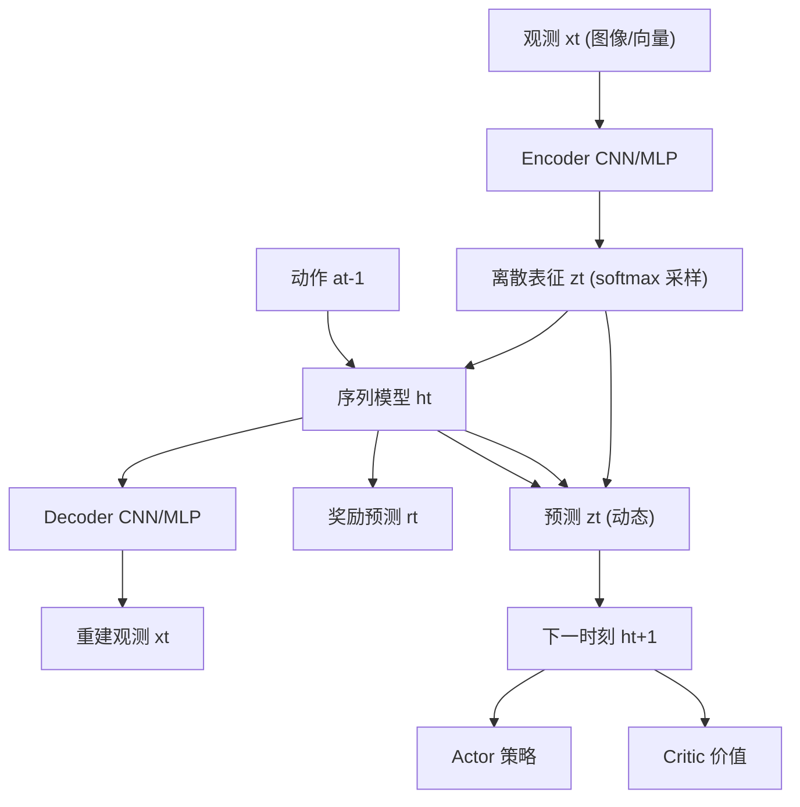

# Dreamer v3: Mastering Diverse Domains through World Models

- 本地 PDF：`papers/curriculum/2301.04104.pdf`
- arXiv：https://arxiv.org/abs/2301.04104
- 年份：2023 (v2: Apr 2024)
- 团队：Google DeepMind & U of Toronto (Danijar Hafner 等)
- 阶段：通用世界模型 RL —— 固定超参跨 150+ 任务

## 一句话总结

Dreamer v3 提出了一套鲁棒的归一化、平衡和变换技术，使单一算法（固定超参）在超过 150 个任务上超越各领域特化算法。它是首个无需人类数据或课程学习就从零开始收集 Minecraft 钻石的算法。

## 核心技术

1. **Symlog 变换** — 对 reward / value / continue 等信号用 symlog(x)=sign(x)·ln(|x|+1) 压缩动态范围，使单一 loss 适应未知量级
2. **KL 平衡 + Free Bits** — 防止 dynamics 和 representation 在 KL 散度中一方压倒另一方；free bits 确保最小比特容量
3. **RSSM 世界模型** — 序列模型 ht + 离散随机表征 zt，联合编码-预测-解码实现多步未来预测
4. **Actor-Critic 在 latent space 想象训练** — 从世界模型生成 latent rollout，在 latent space 中训练 actor/critic，无需解码到像素

## 底层原理与数学推导

### 1. RSSM 世界模型

世界模型由五个组件构成（式 1），全部端到端优化：

```
序列模型:   ht = fφ(ht-1, zt-1, at-1)
编码器:     zt ~ qφ(zt | ht, xt)
动态预测器: ẑt ~ pφ(ẑt | ht)
奖励预测器: ŝt ~ pφ(ŝt | ht, zt)
解码器:     x̂t ~ pφ(x̂t | ht, zt)
```



### 2. Symlog 变换

核心创新——处理不同领域 reward 尺度差异：

$$\text{symlog}(x) = \text{sign}(x) \cdot \ln(|x| + 1)$$
$$\text{symexp}(x) = \text{sign}(x) \cdot (\exp(|x|) - 1)$$

对 reward、value、continue 概率应用 symlog，在 symlog 空间做 L2 回归，确保 loss 对任意量级信号稳定。

### 3. KL 平衡

标准 VAE 的 KL 损失 $\text{KL}(q_\phi(z_t | h_t, x_t) \| p_\phi(z_t | h_t))$ 同时向两个方向施加压力。KL balancing 给 dynamics 和 encoder 不同权重：

$$L_{dyn} = \alpha \cdot \text{KL}(\text{sg}(q) \| p), \quad L_{rep} = (1-\alpha) \cdot \text{KL}(q \| \text{sg}(p))$$

α > 0.5 让 dynamics 承担更多压力，encoder 自由度更大，学习更稳定的表征。

### 4. Latent Space 想象训练

关键设计：Actor 和 Critic 不接触真实环境，只在世界模型生成的 latent rollout 上训练：

1. 从 replay buffer 的初始 latent state 出发
2. 世界模型展开 H=16 步 latent 轨迹
3. Actor 学习最大化 λ-return（TD-λ，λ=0.95）
4. Critic 回归 λ-return target

每步可并行生成 16K latent 轨迹（单 GPU），效率远超真实环境交互。

## 物理直觉解释

Dreamer v3 像是在大脑中建立一个"世界模拟器"——不是直接对现实反应，而是在脑中预演各种可能动作的后果，选择最好的方案。Symlog 变换相当于给所有信号装上一个"对数刻度尺"，不管 reward 是 1 还是 100000，压缩到相似量级后算法不会"晕"。KL 平衡则像在"观测记忆"和"动态预测"之间保持适当张力——不完全相信记忆也不完全相信预测。

## 工程细节与实操指南

| 超参 | 默认值 | 说明 |
|------|-------|------|
| 想象步长 H | 16 | latent rollout 长度 |
| λ (TD-λ) | 0.95 | return 估计指数衰减 |
| KL 平衡 α | 0.8 | dynamics 承担更多压力 |
| Free bits | 1 nat | 最小信息容量 |
| Batch size | 16 | 序列长度 |
| 想象 batch | 1024 | 每次训练生成的 latent 轨迹数 |
| 模型大小 | 18M~200M | 越大数据效率越高 |

## 消融实验与分析

| 消融因子 | 变化 | 结论 |
|---------|------|------|
| Symlog 变换 | with vs without | 对不同量级奖励的归一化至关重要 |
| KL 平衡 | with vs without | 使先验和后验的 learning rate 解耦，防止 posterior collapse |
| Free bits | 不同阈值 | 1 nat free bit 最优，防止 KL 过快坍缩 |
| 想象 horizon H | 15 vs 8 vs 30 | H=15 在计算和规划质量间最优 |
| 世界模型 vs model-free | RSSM vs 无模型 | 世界模型提供 10x 以上的样本效率 |
| 单组超参 150+ tasks | 固定超参 vs task-specific | 无需针对每个环境调参是核心贡献 |

**核心结论**：Symlog + KL 平衡 + Free bits 使 Dreamer v3 在 150+ 任务上固定超参超越特化算法。

## 技术权衡（Trade-off）

| 优势 | 劣势与工程代价 |
|------|----------------|
| 单一超参配置跨 150+ 任务，零调参 | Minecraft 钻石任务仍需 1 亿步交互（虽比同行少得多） |
| Symlog 使算法自适应未知 reward 量级 | 对 reward 的 sign 仍敏感 |
| Latent space 想象训练比真实环境快 1000x | 世界模型误差累积会误导策略 |
| 模型越大数据效率越高 | 200M 参数训练需多 GPU |

## 实验

核心结果（摘要 Table）:

| Benchmark | 任务数 | Dreamer v3 vs |
|-----------|-------|---------------|
| Atari 100k | 26 | PPO, TWM, IRIS |
| Proprio Control | 18 | PPO, D4PG, DMPO |
| Visual Control | 20 | PPO, CURL, DrQ-v2 |
| DMLab | 30 | PPO, R2D2+, IMPALA |
| Minecraft | 1 | PPO, Rainbow, IMPALA |

- 在 Atari 100k、Proprio Control、Visual Control 上全面超越特化算法
- **Minecraft 钻石**: 首个从零学习收集钻石的算法（约 1 亿步），前人需人类数据或课程
- 消融：移除 symlog → 无法跨领域；移除 KL 平衡 → 表征崩溃；移除 free bits → 信息利用不足

## 技术价值与演进定位

Dreamer v3 建立了世界模型 RL 的工业基线——"固定超参、全能通用"的标杆。它对机器人领域的影响在于：证明了 latent space 的世界模型可以在不依赖仿真的情况下高效学习，为 DayDreamer（真实机器人在线学习）和后续的视频预训练世界模型（GR-1 等）铺平道路。

## 与其他论文的关系

- **DayDreamer** 将 Dreamer 应用到真实机器人，实现在线学习
- **TD-MPC2** 是 Dreamer 的"隐式解码器"变体——不做像素重建，直接做 TD 学习
- **GR-1 / GR-MG** 将 Dreamer 的世界模型思想迁移到模仿学习——预测未来 RGB 作为辅助目标
- **UniPi** 用视频扩散做"前向世界模型"，与 Dreamer 的 latent 世界模型形成互补

## 精读问题

1. Symlog 变换的对称性（symmetrical log）相比简单归一化的优势在哪？是否影响 reward shaping？
2. RSSM 的离散表征 vs 连续表征的选择依据？离散化在机器人状态空间中是否同样有效？
3. 世界模型的多步预测误差随步长 H 如何增长？H 的选择是否取决于任务的时间尺度？
4. Dreamer v3 在真实机器人上的 adaptation（如 DayDreamer）是否保留了固定超参的鲁棒性？
