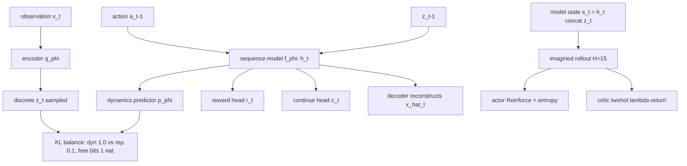

# Dreamer v3: Mastering Diverse Domains through World Models

- 本地 PDF：`papers/world-model/Dreamer_v3_2301.04104.pdf`
- arXiv：https://arxiv.org/abs/2301.04104
- 年份：2023（arXiv 2023-01 v1，2024-04 v2；论文未标注会议）
- 团队：Google DeepMind 与 University of Toronto（Danijar Hafner、Jurgis Pasukonis、Jimmy Ba、Timothy Lillicrap）
- 阶段：latent 世界模型 RL 主线的通用性里程碑——固定超参跨 8 个领域 150+ 任务，首个从零学会 Minecraft 收集钻石的算法

## 一句话总结

Dreamer v3 用一组固定超参数（归一化、KL 平衡 + free bits、symlog 变换三大类鲁棒技术）在 Atari、ProcGen、DMLab、DMControl、BSuite、Minecraft 等 150+ 任务上超越各领域调参专家算法，并在 Minecraft Diamond 上成为首个不用人类数据或课程学习、从零在 100M 步内拿到钻石的算法，同时证明模型规模 12M 到 400M 单调提升性能且越大越省环境交互。

## 核心技术

1. **RSSM 世界模型（序列模型 + 离散随机表征）**：递归状态 $h_t$ 由 GRU 演化，编码器把观测 $x_t$ 变成向量 softmax 分布采样的离散表征 $z_t$，straight-through 梯度穿过采样；$h_t$ 与 $z_t$ 拼成模型状态 $s_t = \{h_t, z_t\}$，从 $s_t$ 同时预测奖励、continue flag 并重建观测。
2. **不对称 KL 平衡 + free bits**：dynamics 损失（训练序列模型预测下一表征）权重为 1，representation 损失（把后验拉向先验）权重仅 0.1；两个 KL 都在 1 nat 处做 $\max(1,\cdot)$ 截断，既保住最小信息容量又避免一方压倒另一方。
3. **Symlog / symexp 数值变换**：reward、value、continue 及向量观测统一经过 $\mathrm{symlog}(x)=\mathrm{sign}(x)\ln(|x|+1)$ 压缩量级，critic 用 symexp twohot 分布回归（101 个指数间隔 bin），梯度大小与目标数值大小解耦。
4. **Latent 想象中的 actor-critic**：actor 用 Reinforce 加熵正则（$\eta=3\times10^{-4}$）最大化 symlog 后的 percentile 归一化 $\lambda$-return；critic 输出 categorical 分布并对称向自身 EMA 做正则；两者只在世界模型想象的 $H=15$ 步轨迹上训练，从不接触真实观测重建。
5. **优化器与稳定组合拳**：LaProp（eps=$10^{-20}$）、AGC(0.3) 自适应梯度裁剪、RMSNorm + SiLU、block-diagonal GRU（8 个 block）、1% uniform mixture 注入所有 categorical 分布防零概率。

## 底层原理与数学推导

### 1. RSSM 世界模型与三项损失

世界模型由六个映射组成（论文式 1）：

$$
\begin{aligned}
\text{序列模型}:\quad & h_t = f_\phi(h_{t-1}, z_{t-1}, a_{t-1}) \\
\text{编码器}:\quad & z_t \sim q_\phi(z_t \mid h_t, x_t) \\
\text{动态预测器}:\quad & \hat{z}_t \sim p_\phi(\hat{z}_t \mid h_t) \\
\text{奖励预测器}:\quad & \hat{r}_t \sim p_\phi(\hat{r}_t \mid h_t, z_t) \\
\text{Continue 预测器}:\quad & \hat{c}_t \sim p_\phi(\hat{c}_t \mid h_t, z_t) \\
\text{解码器}:\quad & \hat{x}_t \sim p_\phi(\hat{x}_t \mid h_t, z_t)
\end{aligned}
$$

总目标以 $\beta_{\text{pred}}=1,\ \beta_{\text{dyn}}=1,\ \beta_{\text{rep}}=0.1$ 加权（论文式 2-3）：

$$
\begin{aligned}
L_{\text{pred}} &= -\ln p_\phi(x_t \mid z_t, h_t) - \ln p_\phi(r_t \mid z_t, h_t) - \ln p_\phi(c_t \mid z_t, h_t) \\
L_{\text{dyn}} &= \max\bigl(1,\ \mathrm{KL}\left[\mathrm{sg}(q_\phi(z_t \mid h_t, x_t)) \,\|\, p_\phi(z_t \mid h_t)\right]\bigr) \\
L_{\text{rep}} &= \max\bigl(1,\ \mathrm{KL}\left[q_\phi(z_t \mid h_t, x_t) \,\|\, \mathrm{sg}(p_\phi(z_t \mid h_t))\right]\bigr)
\end{aligned}
$$

两个方向的 KL 各带一个 stop-gradient（$\mathrm{sg}$）：$L_{\text{dyn}}$ 只更新序列模型让先验追后验，$L_{\text{rep}}$ 只让后验变得可预测。$\max(1,\cdot)$ 就是 free bits——当某一项已经压到 1 nat（约 1.44 bits）以下时其梯度关闭，学习压力集中到 prediction loss 上。v3 用 $1{:}0.1$ 的不对称权重实现 KL 平衡（v2 使用的是 0.8 型权重系数，DayDreamer 继承了 0.8 方案），从而在复杂 3D 场景（需要强正则压掉无关细节）与像素决定成败的静态背景游戏之间不再需要换超参。

```mermaid
flowchart TB
    X["observation x_t"] --> ENC["encoder q_phi"]
    ENC --> Z["discrete z_t sampled"]
    A["action a_t-1"] --> SM["sequence model f_phi: h_t"]
    Z_prev["z_t-1"] --> SM
    SM --> DP["dynamics predictor p_phi"]
    SM --> RP["reward head r_t"] 
    SM --> CP["continue head c_t"]
    SM --> DEC["decoder reconstructs x_hat_t"]
    Z --> KLQ["KL balance: dyn 1.0 vs rep 0.1, free bits 1 nat"]
    DP --> KLQ
    S["model state s_t = h_t concat z_t"] --> AC["imagined rollout H=15"]
    AC --> ACT["actor Reinforce + entropy"]
    AC --> CRIT["critic twohot lambda-return"]
```

### 2. Symlog 与 symexp twohot

对回归目标 $y$，网络在变换空间里做平方误差，读出时取逆变换：

$$
\begin{aligned}
\mathrm{symlog}(x) &.= \mathrm{sign}(x)\ln(|x|+1)\\
\mathrm{symexp}(x) &.= \mathrm{sign}(x)(e^{|x|}-1)\\
L(\theta) &.= \tfrac{1}{2}\left(f(x,\theta)-\mathrm{symlog}(y)\right)^2,\qquad \hat{y}=\mathrm{symexp}(f(x,\theta))
\end{aligned}
$$

对称性与符号保持是关键：纯 $\ln$ 无法处理负值，symlog 在原点附近近似恒等（不扰动小目标）、在大值处退化为对数压缩。对随机目标（奖励、回报），critic 与 reward 头输出 $B=\mathrm{symexp}(-20,\ldots,+20)$ 上的 softmax，目标用 twohot 编码：

$$
\mathrm{twohot}(y)_k .= \frac{|b_{k+1}-y|}{|b_{k+1}-b_k|},\qquad
\mathrm{twohot}(y)_{k+1} .= \frac{|b_k-y|}{|b_{k+1}-b_k|},\qquad
L = -\,\mathrm{twohot}(y)^{\mathsf T}\log\mathrm{softmax}(f(x,\theta))
$$

交叉熵只依赖各 bin 的概率而不是 bin 对应的连续数值，因此梯度尺度彻底脱离目标尺度；加权平均又能落在 bin 之间，表达任意连续值。

### 3. Return 归一化下的 actor 学习

actor 以固定熵尺度工作，要求 return 近似落在 $[0,1]$ 区间但不放大稀疏奖励噪声（论文式 6-7）：

$$
S \.= \mathrm{EMA}\bigl(\mathrm{Per}(R^\lambda_t,95)-\mathrm{Per}(R^\lambda_t,5),\ 0.99\bigr),\qquad
L(\theta) \.= -\sum_{t=1}^{T}\mathrm{sg}\!\left(\frac{R^\lambda_t-v_\psi(s_t)}{\max(1,S)}\right)\log\pi_\theta(a_t|s_t)+\eta\, H\bigl[\pi_\theta(a_t|s_t)\bigr]
$$

三个设计点缺一不可：(a) 分母下限 $\max(1,L)$ 中 $L=1$，小 return 不被放大，避免稀疏奖励时把函数逼近噪声放大到淹没熵正则；(b) 用 5%-95% 百分位距而非极差，容忍多模态 return 分布中的离群回合；(c) EMA 平滑避免归一化常数跳变引入非平稳性。对比方案中 advantage 归一化会放大噪声、标准差归一化在稀疏奖励下方差趋零而爆炸、约束熵优化收敛慢，论文报告这些替代方案都无法找到跨域稳定的超参。

### 4. Critic 的分布式目标与自我正则

critic 对每个模型状态学一个 categorical 回报分布，$\lambda$-return 目标为 $R^\lambda_t = r_t + \gamma c_t[(1-\lambda)v_t + \lambda R^\lambda_{t+1}]$，末端 $R^\lambda_T = v_T$。因目标依赖自身预测，额外加两项稳定剂：EMA 衰减 0.98 的自正则（相当于可微的 target network，仍允许用当前网络算 return），以及 reward/critic 输出层零初始化（防止随机初始化网络想象出巨大虚假奖励拖延学习起步）。奖励难预测的环境还用 0.3 权重的 critic replay 损失：把想象起点处的 $\lambda$-return 当作 on-policy 价值标注回填到 replay 序列上再算一遍 critic 损失。

## 物理直觉解释

**世界模型是智能体自建的"物理沙盘"，策略只在沙盘里练兵**。Model-free RL 的基本循环是"真实试错 -> 从错误修正"，这在机器人或稀疏奖励游戏里代价极高。Dreamer v3 把这件事拆开：先用 replay 数据学一个能预测"给这个动作、世界下一步长什么样、得多少分、会不会结束"的 latent 模拟器，然后 actor 和 critic 完全在这个模拟器的想象轨迹上训练——好比棋手不在正式对局里试错，而是打谱推演几百种变化，只把结论带回现实。每步可以并行展开一整批想象轨迹（单块 A100 即可），于是 DMLab 上 100M 帧的成绩超过了 IMPALA 与 R2D2+ 在 1B 步的水平，数据效率增益超过 1000%。**信息瓶颈式的离散表征则是沙盘的沙粒粒度选择**：$z_t$ 由 32 个 softmax 分布组成，太细会记住无关像素，太粗丢掉任务信息，free bits（1 nat 下限）+ 不对称 KL 就是在自动寻找这个粒度。

**Symlog 是一把双向对数温度计，让算法"见多大场面都不慌"**。Atari 的分数是几百到几百万，DMControl 的奖励不到 10，同一个平方误差函数遇到前者会把梯度撑爆、遇到后者干脆不动。Symlog 把任意量级压进一个温和的对数刻度，正负对称、原点附近恒等，再用 symexp 还原读数。配合 twohot 分布回归，critic 甚至不需要知道 return 是 3 还是 300 万也能稳定训练——bin 的位置定了量级，交叉熵只关心概率形状。**Percentile return 归一化则像是给探索强度装了一个自适应油门**：分母用 5%-95% 分位距并设 1 的下限，奖励密集时分母变大、策略更专注利用；奖励稀疏时分母停在 1、不会被除以接近零的标准差炸出噪声，策略得以维持大熵慢探索。这正是 Minecraft 钻石这种"几乎不存在奖励信号"的任务还能学起来的前提之一。

**最反直觉的发现是"先看懂世界，再谈得分"**。图 6b 显示把 reward 与 value 的梯度从表征中切断，14 任务均值几乎没有变化；把无监督重建梯度切断，性能大幅崩坏。这说明 Dreamer 表征质量的主体来自"理解世界长什么样"的任务无关信号，而非任务信号本身——与多数 actor-critic 直觉相反。这直接回应了 $h_t+z_t$ 这种表征的结构性弱点（若只有 reward 监督，模型只需记住少数与得分相关的特征）。它也给 Minecraft 一类任务提供了正确路径：奖励每回合最多 12 次且分散在 36000 步里，能够撑起学习的只有世界模型自身的预测目标。随之而来的是一个工程红利——既然主要监督是重建，就存在在世界模型上做无监督预训练、再接到新任务的算法变体空间。

## 工程细节与实操指南

| 项目 | 默认值 | 备注 |
|------|-------|------|
| 想象步长 $H$ | 15 | 预测视界 $T=16$；折扣视界 $1/(1-\gamma)=333$ |
| $\gamma$ / $\lambda$ | 0.997 / 0.95 | 所有领域共用 |
| 批形状 | $16\times64$ | batch 16 条、序列长 64 |
| Replay 容量 | $5\times10^6$ | 均匀采样 + online queue，缓存并回写 latent 初态 |
| 学习率 / 优化器 | $4\times10^{-5}$ / LaProp($10^{-20}$) | 配 AGC(0.3) 逐张量裁剪 |
| 损失权重 | $\beta_{\text{pred}}=1$, $\beta_{\text{dyn}}=1$, $\beta_{\text{rep}}=0.1$ | free bits 1 nat；categorical 全部混 1% uniform |
| Critic 正则 | EMA decay 0.98，replay 损失权重 0.3 | 输出层零初始化（含 reward 头） |
| Actor | 熵 $\eta=3\times10^{-4}$；RetNorm $S$: 5%-95% 分位距 EMA 0.99，下限 1 | Reinforce 策略梯度 |
| 模型规模 | 12M/25M/50M/100M/200M/400M | 默认 200M；两个控制套件用 12M 同等表现 |
| 规模派生规则 | hidden $d$；GRU 8$d$（8 block）；CNN 底层通道 $d/16$；每 latent 编码数 $d/16$ | 层数与 latent 个数跨规模不变，学习率/批量也不变 |

实操要点：(1) Minecraft 用 MineRL v0.4.4 改造出 flat categorical 动作空间，修复了打破钻石矿提前终止、跳跃键需按住 200ms 的问题，episode 到死亡或 36000 步结束；(2) 每个里程碑（log 到 diamond 共 12 个）一次性 +1，另有每颗心血 $\pm0.01$；(3) 各基准的资源开销——Minecraft 8.9 GPU 天、Atari 7.7、ProcGen 16.1、DMLab 2.9、Atari100k 只要 0.1；(4) 建议复现时先跑 12M 版本验证管线，再上 200M 默认档。

## 消融实验与分析

| 实验（出处） | 对照设置 | 关键数字结果 |
|------|------|------|
| Minecraft Diamond 100M 步回报（表 5） | Dreamer vs IMPALA/Rainbow/PPO | Dreamer **9.1**，IMPALA **7.1**，Rainbow **6.3**，PPO **5.1**；训练期内 **100%** 的 Dreamer 种子拿到钻石（基线全部 0%），预算末点单回合拿钻率 **0.4%** |
| Atari 57 游戏 200M 步（表 6） | 固定超参 vs 专家算法 | Gamer median：PPO **180%**、MuZero **693%**、Dreamer **830%**；Gamer mean：PPO **892%**、MuZero **3054%**、Dreamer **3381%**；Record mean capped：PPO **21%**、MuZero **34%**、Dreamer **38%** |
| DMLab 30 任务（表 8） | 100M 步对比 1B/10B 步基线 | Human mean capped：R2D2+@10B **85.4**、IMPALA@10B **85.1**、IMPALA@1B **66.3**、Dreamer@100M **71.4**（即 1/10 数据超过 1B 步基线，>1000% 数据效率增益）；PPO@100M 仅 **35.9** |
| ProcGen 16 任务 50M 步（表 7） | Normalized mean | 原 PPO **41.16**、本篇 PPO **42.80**、PPG **64.89**、Dreamer **66.01** |
| Atari100k 26 任务 400K 步（表 9） | Gamer mean (%) | SimPLe **33**、SPR **62**、TWM **96**、IRIS **105**、Dreamer **125**（EfficientZero **190** 但改了评测配置不可比）；median：Dreamer **49** vs TWM **51** |
| 学习信号（图 6b） | 切断 reward/value 梯度 vs 切断重建梯度 | 14 任务均值：保留无监督重建时性能几乎不变；去掉重建梯度后性能大幅崩坏 |
| 模型规模（图 6c） | 12M/25M/50M/100M/200M/400M 于 Crafter 与 DMLab | 性能随规模单调提升；更大模型达到同等分数所需环境步数更少（越大越省数据） |
| Replay ratio（图 6d） | 1/2/4/8/16/32/64 | 更高 replay ratio 可预测地提升性能，与模型规模共同构成"算力换数据效率"的两个旋钮 |
| 资源开销（表 2） | 单块 A100 GPU 天 | Minecraft **8.9** 天（对比 VPT 用 720 卡 9 天加人类数据）、Atari **7.7**、ProcGen **16.1**、BSuite **0.5** |

**核心结论**：三条证据链支撑"单一配置通用"的主张。(1) 结果层面：在 Atari（gamer median 830% 超 MuZero 的 693%）、DMLab（100M 步达 71.4%，超过 1B 步的 IMPALA 66.3%）、ProcGen（66.01 超 PPG 64.89）、Atari100k（gamer mean 125%）以及 Minecraft（9.1 vs 最强基线 7.1，且唯一拿到钻石）全面领先，仅 Atari100k 的 median 落后 TWM 两个点。(2) 机制层面：图 6a 显示每个鲁棒性组件都各自守护一部分任务——KL 目标贡献最大，其后是 return 归一化与 symexp twohot；这意味着通用性不是某个单一技巧而是多项归一化/平衡/变换的叠加。(3) scaling 层面：图 6c/6d 表明参数 12M 到 400M 与 replay ratio 1 到 64 都是可预测的性能杠杆，更大模型同时更省数据，这为后续工作（TD-MPC2 的五档规模、DayDreamer 真机部署）提供了把算力折算成功率的方法论。

## 技术权衡（Trade-off）

| 优势 | 代价与边界 |
|------|-----------|
| 固定超参覆盖连续/离散动作、视觉/本体输入、稠密/稀疏奖励 | Minecraft 仍要 100M 步交互、单回合拿钻率仅 0.4%；绝对样本需求远高于有演示的方法 |
| 重建驱动表征，具天然可解释的开环视频预测能力（45 帧） | 解码器带来额外计算；像素级细节可能浪费容量——这正是 TD-MPC2 走 decoder-free 路线的动机 |
| 想象训练并行度高、数据效率可放大（模型/回放比两个旋钮） | 多步想象的模型误差累积会误导策略；离散动作强、连续控制高维场景（Dog/Humanoid）不如 TD-MPC2 稳（后者实测 Dog 上 Dreamer 有数值不稳） |
| 分布式 critic 天然适配多模态、跨数量级 return | categorical 参数化对 bin 范围敏感，需 symlog 预处理；expectation 读数要做正负 bin 分别求和的实现细节易错 |

## 技术价值与演进定位

Dreamer v3 把"世界模型 RL"从需要逐域调参的实验室方法推进到工业级默认选项：它定义了通用算法的一个可检验标准——同一组超参数跨域不掉点——并第一次展示了在线 RL 在开放世界探索任务（Minecraft 钻石）上的独立可行性（1 GPU 9 天 vs VPT 的 720 GPU 9 天 + 人类数据）。对外部研究生态，它是两个分支的共同参照系：latent MPC 一系（TD-MPC2）以它为 baseline 论证"规划 + TD 学隐式模型"在高维连续控制上更强；真机在线学习一系（DayDreamer）验证它的数据效率足以承受硬件时间成本。消融中"性能主体来自无监督重建"这一结论也预告了表征学习与世界模型两条线的汇合——JEPA 一系（I-JEPA、V-JEPA）本质上是把这里的重建监督替换成 latent 空间预测监督的极端版本。

## 与其他论文的关系

- **TD-MPC2 — 最直接的对照系：同属 latent 世界模型 RL 但走"decoder-free + 显式规划"路线**。TD-MPC2 用 joint-embedding prediction（不重建观测）加 MPPI 规划，宣称在困难连续控制上明显优于 DreamerV3（如 Dog/Humanoid 高维运动控制），并指出 Dreamer 在 Dog 任务存在数值不稳；但 TD-MPC2 也承认扩展到离散动作仍是开放问题，与 Dreamer 在 Atari/Minecraft 的优势形成分工。
- **DayDreamer — 直接前驱的真机验证**：使用基于 DreamerV2 的实现和几乎相同的超参组（RSSM 512、32 latents、KL balancing 0.8、H=15），把这套算法原封不动搬上 4 台真机，四足机器人 1 小时学会翻身站立行走；说明 Dreamer 的数据效率使"在真实世界在线 RL"首次成为工程可行选项。
- **MuZero / Rainbow / IMPALA — 被"免调参"打败的专家算法**：Atari 上固定超参的 Dreamer（gamer median 830%）超过 MuZero（693%），而 MuZero 需要 MCTS 式搜索复杂组件；作者强调 Dreamer 无需前瞻规划即可采样动作。
- **VPT（Video PreTraining）— Minecraft 的人类数据依赖对照**：VPT 用大规模键盘鼠标演示行为克隆加 RL 微调拿到钻石（720 GPU 9 天），Dreamer v3 完全从稀疏奖励出发（1 GPU 9 天），证明世界模型的想象训练可以在没有人类先验时解决长视野探索。
- **IRIS / TWM / EfficientZero — Atari100k 数据效率同行**：IRIS/TWM 是 transformer 世界模型加近邻检索或像素重建路线，Dreamer 在 gamer mean 125% 超过两者的 105%/96%；EfficientZero 的 190% 得益于在线树搜索、优先回放与早期重置等评测协议改动，可比性有限。
- **Crafter / BSuite — 通用性的标定工具**：模型规模与 replay ratio 消融正是建立在这两个轻量基准上，说明它们可作为"训练配方是否稳健"的前置测试场。

## 精读问题

1. **Free bits 与 KL 平衡的耦合机制**：$\max(1,\cdot)$ 使小 KL 项的梯度整体关闭，此时 representation loss 权重 0.1 还起作用吗？当某任务的世界动态非常容易预测（静态背景游戏）时，有效正则强度由 free bits 还是 $\beta_{\text{rep}}$ 决定？
2. **Reinforce 选择的原因**：actor 明明运行在全可微的 latent 动力学上，为何弃用重参数化梯度（v1 曾支持）？是否因为穿越离散采样或多步 pathwise 梯度带来的方差与偏差问题？连续控制场景（如 DayDreamer 四足机）换成重参数化是否会更好？
3. **重建主导机制的适用边界**：图 6b 结论是在奖励相对稀疏的 14 个任务均值上得出的。在奖励稠密、观测与奖励高度相关的控制任务里，reward/value 梯度是否会重新成为表征的主导来源？这能否解释 TD-MPC2 在操纵任务上的反超？
4. **分布式 critic 的信息论含义**：twohot 分布保留了 return 的多模态与不确定度，但在想象轨迹上，这个分布混合的是"模型不确定性"与"策略随机性"两类方差吗？把它用于探索（如 upper-confidence 采样动作）是否可行？
5. **Scaling 曲线的极限**：12M 到 400M 尚未出现平台，那么 $h_t$ 的记忆瓶颈（GRU 定长状态）会在哪个规模开始限制性能？把序列模型换成 transformer（IRIS/TWM 路线）能否延伸这条曲线？
6. **真机迁移的折扣视界问题**：$\gamma=0.997$ 相当于 333 步视界，但 A1 四足 20Hz 控制下 333 步只有约 16 秒——对需要分钟级规划的机器人任务，是否必须分层想象或缩短控制周期？
