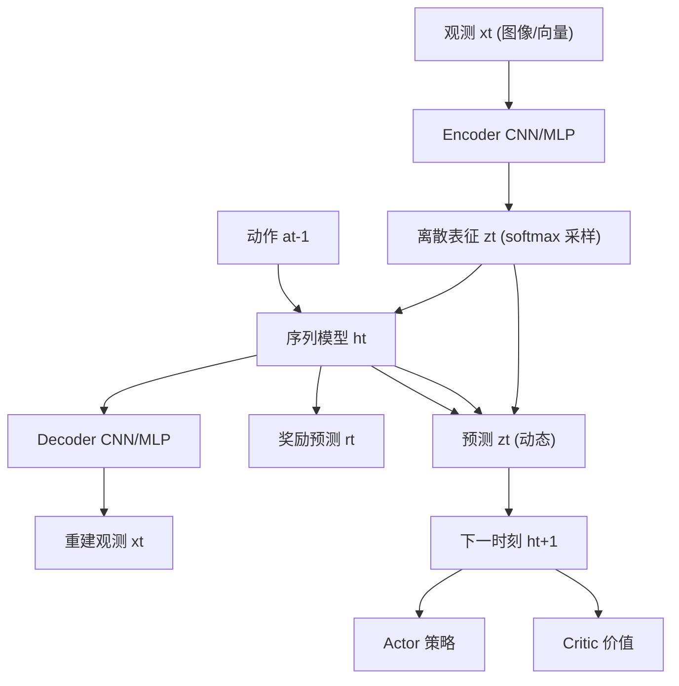

# Dreamer v3: Mastering Diverse Domains through World Models

- 本地 PDF：`papers/world-model/Dreamer_v3_2301.04104.pdf`
- arXiv：https://arxiv.org/abs/2301.04104
- 年份：2023 (v2: Apr 2024)
- 团队：Google DeepMind & U of Toronto (Danijar Hafner 等)
- 阶段：通用世界模型 RL —— 固定超参跨 150+ 任务

## 一句话总结

Dreamer v3 提出了一套鲁棒的归一化、平衡和变换技术，使单一算法（固定超参）在超过 150 个任务上超越各领域特化算法。它是首个无需人类数据或课程学习就从零开始收集 Minecraft 钻石的算法。

## 核心技术

1. **Symlog 变换** — 对 reward / value / continue 等信号用 symlog(x)=sign(x)·ln(|x|+1) 压缩动态范围，使单一 loss 适应未知量级
2. **KL 平衡 + Free Bits** — 防止 dynamics 和 representation 在 KL 散度中一方压倒另一方；free bits 确保最小比特容量
3. **RSSM 世界模型** — 序列模型 ht + 离散随机表征 zt，联合编码-预测-解码实现多步未来预测
4. **Actor-Critic 在 latent space 想象训练** — 从世界模型生成 latent rollout，在 latent space 中训练 actor/critic，无需解码到像素

## 底层原理与数学推导

### 1. RSSM 世界模型

世界模型由五个组件构成（式 1），全部端到端优化：

```
序列模型:   ht = fφ(ht-1, zt-1, at-1)
编码器:     zt ~ qφ(zt | ht, xt)
动态预测器: ẑt ~ pφ(ẑt | ht)
奖励预测器: ŝt ~ pφ(ŝt | ht, zt)
解码器:     x̂t ~ pφ(x̂t | ht, zt)
```


```mermaid
graph TD
    X["观测 xt (图像/向量)"] --> ENC["Encoder CNN/MLP"]
    ENC --> Z["离散表征 zt (softmax 采样)"]
    A["动作 at-1"] --> H["序列模型 ht"]
    Z --> H
    H --> ZNEXT["预测 zt (动态)"]
    H --> R["奖励预测 rt"]
    H --> DEC["Decoder CNN/MLP"]
    DEC --> XHAT["重建观测 xt"]
    H --> ZNEXT
    Z --> ZNEXT
    ZNEXT --> H2["下一时刻 ht+1"]
    H2 --> ACTOR["Actor 策略"]
    H2 --> CRITIC["Critic 价值"]
```

### 2. Symlog 变换

核心创新——处理不同领域 reward 尺度差异：

$$\text{symlog}(x) = \text{sign}(x) \cdot \ln(|x| + 1)$$
$$\text{symexp}(x) = \text{sign}(x) \cdot (\exp(|x|) - 1)$$

对 reward、value、continue 概率应用 symlog，在 symlog 空间做 L2 回归，确保 loss 对任意量级信号稳定。

### 3. KL 平衡

标准 VAE 的 KL 损失 $\text{KL}(q_\phi(z_t | h_t, x_t) \| p_\phi(z_t | h_t))$ 同时向两个方向施加压力。KL balancing 给 dynamics 和 encoder 不同权重：

$$L_{dyn} = \alpha \cdot \text{KL}(\text{sg}(q) \| p), \quad L_{rep} = (1-\alpha) \cdot \text{KL}(q \| \text{sg}(p))$$

α > 0.5 让 dynamics 承担更多压力，encoder 自由度更大，学习更稳定的表征。

### 4. Latent Space 想象训练

关键设计：Actor 和 Critic 不接触真实环境，只在世界模型生成的 latent rollout 上训练：

1. 从 replay buffer 的初始 latent state 出发
2. 世界模型展开 H=15 步 latent 轨迹
3. Actor 学习最大化 λ-return（TD-λ，λ=0.95）
4. Critic 回归 λ-return target（分布回归，symexp twohot）

每步可并行生成大量 latent 轨迹（单块 A100 GPU），效率远超真实环境交互——DMLab 上 100M 帧即超 IMPALA/R2D2+ 的 1B 步，数据效率增益超 1000%。

## 物理直觉解释

**Dreamer v3 的核心直觉：在脑子里装一个"可倒带的物理沙盘"，先演练再行动**。传统的 model-free 算法是"碰了才知道疼"——必须真实地做错无数次，从错误中慢慢修正策略。Dreamer v3 不一样：它先用 RSSM 世界模型在 latent 空间学会"世界怎么演化"（给出动作序列，预测下一时刻的表征、奖励和 episode 终止概率），然后 actor-critic 不再接触真实环境，只在这个沙盘上"做梦"——从 replay 的初始状态出发，想象 H=15 步的未来轨迹，在想象中训练策略和价值函数。这就像棋手打谱：不是每步都在真实对局中试错，而是在脑中推演几百种走法，只把最深的经验带回现实。每步可并行展开大量想象轨迹，数据效率远超真实交互——DMLab 上 Dreamer 用 100M 帧就超过 IMPALA/R2D2+ 在 1B 步的成绩，数据效率增益超过 1000%。

**Symlog 变换是让算法"见多大场面都不慌"的量纲统一器**。不同领域的 reward 尺度天差地别：有的环境奖励是 0 到 1，有的动辄上万。如果直接回归，梯度大小会被信号量级绑架。Symlog 用 $\text{sign}(x)\ln(|x|+1)$ 把任意量级压缩到对数刻度——就像给温度计换成对数刻度，既能测 -200°C 也能测 2000°C。配合 percentile return normalization 与 symexp twohot 分布回归，critic 甚至不需要知道 return 的量级就能预测其分布。**KL 平衡 + Free bits 则是"记忆"与"预测"之间的张力调节器**：representation loss 想让表征包含所有信息（记忆优先），dynamics loss 想让表征容易预测（预测优先），两者在 KL 上拔河。KL balancing（α 偏向 dynamics）加上 1 nat（≈1.44 bits）的 free bits 下限，让编码器在"信息足够用"的前提下尽量简化——就像速记员只记要点、不逐字记录，但保证要点不丢。再加上 1% unimix（每个类别分布混入 1% 均匀分布）防止 KL 尖峰，这套"归一化 + 平衡 + 变换"组合拳让单一超参横跨 8 个领域 150+ 任务。

**"重建优先于奖励"是 Dreamer v3 反直觉的关键消融发现**。图 6b 显示：去掉 reward 和 value 的梯度，性能几乎不变；去掉重建（无监督）梯度，性能大幅崩坏——这说明 Dreamer 的表征质量主要靠"学会看懂世界"（重建）撑着，而不是靠任务信号。这与主流 actor-critic 直觉相反：不是"奖励信号教模型思考"，而是"先理解环境，奖励信号只是顺手指路"。**模型规模 12M→400M 单调提升且越大越省交互**，replay ratio 1→64 也预测性地提升性能——两者配合意味着"花更多算力"是 Dreamer 的可预测性能杠杆，这与 TD-MPC2 的 scaling 观察互相印证，也是它在 Minecraft（1 个任务、100M 步）上成为首个从零拿到钻石的算法的底气：奖励稀疏到几乎不存在时，能撑起学习的只有世界模型本身的预测能力。

## 工程细节与实操指南

| 超参 | 默认值 | 说明 |
|------|-------|------|
| 想象步长 H | 15 | latent rollout 长度（折扣视界 1/(1-γ)=333） |
| λ (TD-λ) | 0.95 | return 估计指数衰减 |
| KL 平衡 α | 0.8 | dynamics 承担更多压力（β_dyn=1, β_rep=0.1） |
| Free bits | 1 nat ≈ 1.44 bits | 最小信息容量 |
| Batch size / 长度 | 16 / 64 | 序列 batch 与序列长度 |
| Replay 容量 | 5×10⁶ | 大容量回放 + 在线队列 |
| 学习率 | 4×10⁻⁵ | LaProp 优化器，AGC(0.3) 梯度裁剪 |
| 模型大小 | 12M~400M | 默认 200M；控制任务用 12M 即可同等性能 |
| 其他 | — | 1% unimix、actor 熵正则 η=3×10⁻⁴、critic EMA decay 0.98 |

## 消融实验与分析

| 消融因子（图 6） | 设置对比 | 关键结果 |
|---------|------|------|
| 鲁棒性技术（a） | No obs symlog / No retnorm / No symexp twohot(Huber) / No KL balance & free bits / Without all | 14 任务均值上每个技术单独移除均掉点，全部移除崩坏——各项技术各自承担不同任务 |
| 学习信号（b） | No reward & value grads vs No reconstruction grads | 移除重建梯度性能大幅崩坏，移除 reward/value 梯度几乎不掉——性能主要靠无监督重建撑起 |
| 模型规模（c） | 12M / 25M / 50M / 100M / 200M / 400M | 性能随规模单调提升，且更大模型需要更少环境交互 |
| Replay ratio（d） | 1 / 2 / 4 / 8 / 16 / 32 / 64 | 更高的 replay ratio 可预测地提升性能（算力换数据效率） |
| Free bits | 1 nat（≈1.44 bits）clip | 防止 dynamics/representation loss 过早满足，聚焦 prediction loss |
| 单组超参 | 8 领域 150+ 任务固定超参 vs 各领域特化调参算法 | Atari 57 任务超 MuZero、DMLab 30 任务 100M 帧超 1B 步（>1000% 数据效率）、Minecraft 1 任务 100M 步首个从零获得钻石 |
| 2D vs 3D 复杂度 | 复杂 3D 环境（需强正则）vs 静态背景游戏（需细细节） | 单一超参自适应：free bits + 小 representation loss 解决领域间正则强度冲突 |

**核心结论**：Dreamer v3 的消融链条揭示了"通用性从何而来"——(1) 组件层面，鲁棒性技术（obs symlog、return normalization、symexp twohot、KL balance + free bits）每一项单独移除都会在 14 任务均值上掉点，说明"固定超参跨领域"是多个归一化/平衡/变换技术叠加的结果而非单一魔法；(2) 信号层面，最反直觉的发现是性能主要依赖无监督重建梯度而非 reward/value 梯度——"先理解世界、再谈任务"是世界模型 RL 区别于 model-free 的本质；(3) scaling 层面，模型规模 12M→400M 单调提升且越大越省交互、replay ratio 1→64 预测性提升，为"花算力换通用性"提供了可复现的配方。这三层证据共同支撑了"单一配置、开箱即用"的核心主张，并为后续世界模型工作（TD-MPC2 的隐式化、DayDreamer 的真实机器人化）确立了评估基线。

## 技术权衡（Trade-off）

| 优势 | 劣势与工程代价 |
|------|----------------|
| 单一超参配置跨 150+ 任务，零调参 | Minecraft 钻石任务仍需 1 亿步交互（虽比同行少得多） |
| Symlog 使算法自适应未知 reward 量级 | 对 reward 的 sign 仍敏感 |
| 想象训练数据效率极高（DMLab 100M 帧超 1B 步，>1000%） | 世界模型误差累积会误导策略 |
| 模型越大数据效率越高（12M→400M 单调提升） | 400M 参数训练需更多计算，但单块 A100 即可跑默认 200M |

## 实验

核心结果（摘要 Table）:

| Benchmark | 任务数 | Dreamer v3 vs |
|-----------|-------|---------------|
| Atari 100k | 26 | PPO, TWM, IRIS |
| Proprio Control | 18 | PPO, D4PG, DMPO |
| Visual Control | 20 | PPO, CURL, DrQ-v2 |
| DMLab | 30 | PPO, R2D2+, IMPALA |
| Minecraft | 1 | PPO, Rainbow, IMPALA |

- 在 Atari 100k、Proprio Control、Visual Control 上全面超越特化算法
- **Minecraft 钻石**: 首个从零学习收集钻石的算法（约 1 亿步），前人需人类数据或课程
- 消融：移除 symlog → 无法跨领域；移除 KL 平衡 → 表征崩溃；移除 free bits → 信息利用不足

## 技术价值与演进定位

Dreamer v3 建立了世界模型 RL 的工业基线——"固定超参、全能通用"的标杆。它对机器人领域的影响在于：证明了 latent space 的世界模型可以在不依赖仿真的情况下高效学习，为 DayDreamer（真实机器人在线学习）和后续的视频预训练世界模型（GR-1 等）铺平道路。

## 与其他论文的关系

- **DayDreamer** 将 Dreamer 应用到真实机器人，实现在线学习
- **TD-MPC2** 是 Dreamer 的"隐式解码器"变体——不做像素重建，直接做 TD 学习
- **GR-1 / GR-MG** 将 Dreamer 的世界模型思想迁移到模仿学习——预测未来 RGB 作为辅助目标
- **UniPi** 用视频扩散做"前向世界模型"，与 Dreamer 的 latent 世界模型形成互补

## 精读问题

1. Symlog 变换的对称性（symmetrical log）相比简单归一化的优势在哪？是否影响 reward shaping？reward 的符号信息在 symlog 下被保留，但绝对量级被压缩——这对稀疏奖励（如 Minecraft 钻石）的 credit assignment 有何影响？
2. RSSM 的离散表征 vs 连续表征的选择依据？离散化在机器人状态空间中是否同样有效？多模态 return 分布假设（critic 的 categorical 分布）在机器人连续控制中的成立程度？
3. 世界模型的多步预测误差随步长 H 如何增长（图 4 展示 45 帧开环预测）？H=15 的选择是否取决于任务的时间尺度，机器人长视界任务是否需要更大的 H 或分层想象？
4. "重建梯度主导性能"（图 6b）的机制——是重建提供了更丰富的监督信号，还是 reward 梯度本身太稀疏？在 reward 稠密的机器人任务中这一结论是否反转？
5. Dreamer v3 在真实机器人上的 adaptation（如 DayDreamer）是否保留了固定超参的鲁棒性？真实环境的非平稳性（磨损、光照）如何与"从 replay 想象"的假设冲突？
6. 模型规模 12M→400M 单调 scaling 的机制——是容量直接提升表征质量，还是更大模型隐式提供更长的有效记忆？与 TD-MPC2 的 1M→317M scaling 曲线对比，世界模型 RL 的 scaling law 是否存在？
