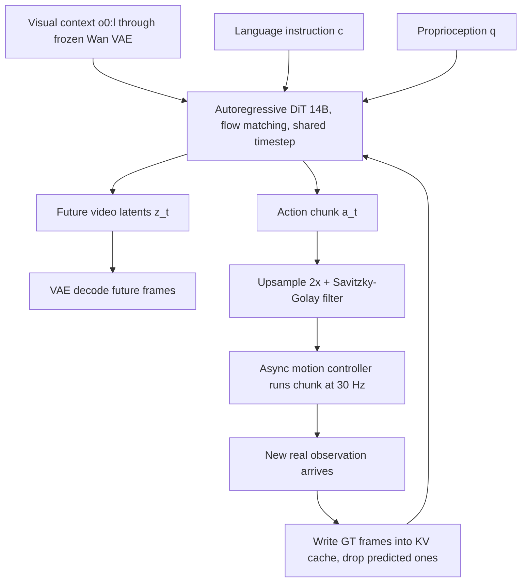

# DreamZero: World Action Models are Zero-shot Policies

- 本地 PDF：`papers/world-model/DreamZero_2602.15922.pdf`
- arXiv：https://arxiv.org/abs/2602.15922
- 代码：https://github.com/dreamzero0/dreamzero
- 年份：2026（2 月，preprint，2026-02-19）
- 团队：NVIDIA（37 位作者；Project Leads：Seonghyeon Ye / Yuke Zhu / Linxi "Jim" Fan / Joel Jang）
- 阶段：WAM 三立场辩论中"**预训练 backbone**"一极的代表 —— 把图像生视频扩散模型直接改造成零样本机器人策略

## 一句话总结

DreamZero 把一个 14B 的预训练 image-to-video 扩散模型（Wan2.1-I2V-14B-480P）直接改造成自回归 World Action Model：单一 DiT 通过 flow matching **同时去噪未来视频 latent 和动作**，训练目标是"联合去噪"而不是独立的视频预测器 + IDM 两段式流水线。核心主张是"策略能力的上限被视频生成质量决定"——数据上主张 500 小时**异构、非重复**遥操作数据优于等时长重复演示数据，泛化上未见任务平均进度比 SOTA VLA 高出 2 倍以上，工程上通过系统级优化 + DreamZero-Flash 解耦噪声调度拿到 38 倍推理加速实现约 7Hz 闭环控制。

## 核心技术

1. **联合视频-动作去噪（单模型端到端）** — 一个 DiT 同时输出未来帧与动作 chunk，显式建模 $\pi_0(o_{l:l+H}, a_{l:l+H})$ 而非"视频生成器 + 反求动力学"两个独立模块；论文认为分离式设计会导致视觉未来与运动指令错位。
2. **自回归 video（仅视频维度）+ teacher forcing 分块训练** — 每个 chunk 含固定 $K$ 个 latent 帧，训练时当前 noisy chunk 以历史 **clean** chunk 为条件；推理时闭环反馈把已执行后的**真实观测写回 KV cache** 替换掉预测帧，消除自回归视频生成的误差累积。
3. **DreamZero-Flash 解耦噪声调度** — 训练时给视频分支采样偏高噪声的时间步、动作分支保持均匀分布，使模型学会"从噪声视频上下文里读出干净动作"，从而支持 1 步去噪推理而不崩性能。
4. **三级实时化优化栈** — 算法层（解耦调度 + CFG 并行 + DiT caching）、系统层（torch.compile + CUDA Graphs + kernel/调度器迁移到 GPU）、量化层（NVFP4 权重激活量化），合计 38 倍加速至约 150 ms/chunk。
5. **异构非重复数据哲学** — 500 小时跨 22 个真实场景（家庭/餐厅/超市/咖啡店/办公室）遥操作数据，单条轨迹平均 4.4 分钟、42.4 个子任务，以覆盖广度取代每任务重复次数。
6. **免动作标签的跨具身迁移** — 只用其他机器人或人类的第一视角**视频**（无动作标签）作为额外观测经验做 co-train，让世界模型的动力学理解变强而动作头不动。

## 底层原理与数学推导

**问题分解视角**：论文把"联合预测"写成两个子目标的乘积（式 1）——先预测视觉未来，再从未来状态反求动作：

$$\pi_0(o_{l:l+H},\, a_{l:l+H} \mid o_{0:l}, c, q_l) \;=\; \underbrace{\pi_0(o_{l:l+H} \mid o_{0:l}, c, q_l)}_{\text{video prediction}}\;\cdot\;\underbrace{\pi_0(a_{l:l+H} \mid o_{0:l+H}, q_l)}_{\text{IDM}}$$

关键差异在于：先前工作用两个独立网络分别拟合这两项，DreamZero 用同一个网络端到端拟合整条链路，代价是引入视频-动作模态对齐问题，收益是动作天然继承视频先验。

**Flow matching 插值与目标**：对第 $k$ 个 chunk、时间步 $t_k \in [0,1]$，视频 latent $z^k$ 与归一化动作 $a^k$ 各自做线性插值加噪（式 2）：

$$z^k_{t_k} = t_k z^k_1 + (1-t_k) z^k_0, \qquad a^k_{t_k} = t_k a^k_1 + (1-t_k) a^k_0$$

其中 $z^k_0 \sim \mathcal{N}(0,I)$、$a^k_0 \sim \mathcal{N}(0,I)$ 是高斯噪声端点，$z^k_1/a^k_1$ 是干净数据端点。同一 chunk 内所有帧共享 $t_k$，不同 chunk 独立采时间步。历史干净上下文记作 $\mathcal{C}_k=\{(z^j_1,a^j_1)\}_{j<k}$，训练目标（式 3）是对**拼接向量** $[z,a]$ 回归联合速度场：

$$\mathcal{L}(\theta) = \mathbb{E}_{z,a,\{t_k\}}\left[\frac{1}{K}\sum_{k=1}^{K} w(t_k)\big\|\,u_\theta([z^k_{t_k}, a^k_{t_k}];\, \mathcal{C}_k, c, q_k, t_k) - v^k\big\|_2\right], \quad v^k = [z^k_1,a^k_1]-[z^k_0,a^k_0]$$

注意与多数 WAM 不同：**视频与动作共享同一个去噪时间步**（coupled schedule），作者的理由是训练初期收敛更快——但这也埋下了少步推理的训练-测试失配。

**Flash 的修复**：少步推理时视频 token 还很脏，所以训练时就该要求"从脏视频里预测干净动作"。做法是把视频时间步固定在重噪声区：令 $t^{video}_k = 1-\eta$、$\eta \sim \mathrm{Beta}(\alpha,\beta)$ 且 $\alpha > \beta$，实际配置 $\mathrm{Beta}(7,1)$ 给出 $E[t^{video}_k]=0.125$（几乎全是高噪声样本）；动作时间步仍均匀采样。这样训练分布直接匹配了"$<4$ 步推理"时的条件结构。

**注意力拓扑**：QKV 自注意力的掩码保证当前 noisy chunk 能看到全部历史 clean chunk（训练与推理一致），推理时把 KV cache 中已被执行的 chunk 键值替换为真实观测（附录 C 图 14）。

## 物理直觉解释

**为什么"边生成视频边出动作"比"直接从观测到动作"更稳？** 一条 VLA 学的是 $p(a \mid o, l)$ 这张映射表——在数据集没见过的运动形态上它只能瞎猜。DreamZero 把这个问题换成"想象下一秒画面长什么样，然后照着画面动"。因为画面来自一个在海量互联网视频上学过物理的扩散模型，物体怎么倒、手怎么绕过障碍、布料怎么折，这些**几何与动力学约束已经写在先验里**，动作只需要跟着画面走。这就像学开车：背操作手册（state-to-action 映射）遇到新路况就懵；但如果你能在脑中预演车辆接下来两秒的轨迹，方向盘怎么打就有据可依。

**为什么异构非重复数据反而更好学？** 若训练目标只是模仿 $p(a\mid o)$，那么模型本质是在记忆"每个状态下专家怎么做"——数据重复少意味着很多状态没有答案。但对 WAM 来说视频预测部分几乎是从预训练免费继承的，真正要学的只剩 IDM（从想象出的未来反推动作）。**IDM 要成为一个稳定映射，需要的是各种场景下"画面变化与关节指令"的大量配对样本**，而这恰恰只有场景多样的数据能提供——就像训练一个人"看懂烹饪过程"，看 500 小时不同厨师在不同厨房做不同菜，远比看同一位厨师重复煎同一道蛋有价值。

**为什么真实观测回写 KV cache 如此重要？** 自回归视频生成的通病是前面几帧的小偏差会像滚雪球一样污染后续所有预测。纯视频生成没法阻止这件事；但闭环机器人策略有外部传感器兜底——每执行完一个 chunk 就把真机拍到的画面写进缓存。**相当于下棋时有裁判每走一步就把棋盘摆成真实局面**，幻觉积累被周期性清零，这也是 WAM 区别于离线视频生成器的结构性优势。

## 工程细节与实操指南

- **骨干**：Wan2.1-I2V-14B-480P；新增参数极少（state encoder / action encoder / decoder），文本编码器、图像编码器、VAE 冻结，其余全部更新。多相机视图**拼成一帧**喂入，避免改动骨干。
- **消融性发现：LoRA 不行** — 作者试过 LoRA 微调得到次优结果，因此全参数更新 DiT block。
- **动作表示**：过滤 idle 动作后使用相对关节位置；任务表示为视频 latent 序列而非离散动作 token。
- **分辨率/频率设定**：AgiBot G1 视频 5 FPS、动作 30Hz、$H=48$ 步动作 horizon（每 chunk 1.6 秒）；DROID 视频 5 FPS、动作 15Hz、$H=24$（同为 1.6 秒/chunk）。最大视觉上下文 8 个 latent 帧 = 33 个原始帧 ≈ 6.6 秒。
- **分块参数**：$K=2$ latent 帧/chunk（经验上优于 $K=1$），默认 $M=4$ chunks；轨迹短于 4 chunk 时 $M$ 缩小。
- **预训练配方**：100K steps，全局 batch 128（AgiBot 与 DROID 同设置）。
- **异步部署**：控制器持续执行最近 chunk，推理与执行并行；动作 horizon 48 步 @30Hz 即 1.6 秒预算，故要求推理延迟低于约 200 ms 以保证重叠平滑。
- **系统优化明细**：CFG 双 GPU 并行（每步延迟降 47%）；DiT caching 利用 flow matching 速度方向一致性，当相邻速度余弦相似度超阈值即复用缓存，等效去噪步数 16 变 4；NVFP4 量化但 QKV/Softmax 保 FP8、非线性算子保 FP16；cuDNN attention；调度器操作迁到 GPU 消除 CPU-GPU 同步停顿。
- **数据规模参照**：AgiBot 语料 7193 条轨迹约 500 小时；评估每个 checkpoint 做 160 条真机 rollout（seen/unseen 各 10 任务 x 8 rollout x 4 台机器人）。
- **开源范围**：模型权重、推理代码、RoboArena/PolaRiS/Genie Sim 3.0 评测运行脚本。

## 消融实验与分析

以下数字取自论文正文 Table 4（模型/数据消融）、Table 3（Flash 少步消融）与 Table 2（跨具身迁移）。注意 Table 4 消融统一用 50K steps、batch 32、PnP Easy 任务评测（弱于主实验 100K steps/batch 128 配置），所以绝对值不能与主结果 62.2% 直接比较，只能比较行间相对关系。

| 变量维度 | 配置 | 数据 | 关键数值 | 来源表 |
|---------|------|------|---------|--------|
| 数据多样性 | DreamZero (AR), 14B | Repetitive（70 任务大量重复） | 33% ± 4.2% | Table 4 |
| 数据多样性 | DreamZero (AR), 14B | Diverse（500h 异构） | 50% ± 6.3% | Table 4 |
| 模型规模 | DreamZero (AR), 5B | Diverse | 21% ± 4.2% | Table 4 |
| 架构对照 | VLA baseline, 5B | Diverse | 0% ± 0.0% | Table 4 |
| 架构对照 | VLA baseline, 14B（从 8B/32B VLM 截断前半构建） | Diverse | 0% ± 0.0% | Table 4 |
| 架构对照 | DreamZero (BD 双向), 14B | Diverse | 50% ± 14.4%（方差极大） | Table 4 |
| 去噪步数 | DreamZero, 4 步（table bussing 后训） | — | 83% ± 6.1%，350 ms，1x | Table 3 |
| 去噪步数 | DreamZero, 1 步 | — | 52% ± 10.2%，150 ms，2.33x | Table 3 |
| 去噪步数 | DreamZero-Flash, 1 步 | — | 74% ± 10.1%，150 ms，2.33x | Table 3 |
| 跨具身 | 无外源视频基线 → 人类视频 12 min → YAM 机器人视频 20 min | 9 个未见任务 | 38.3% ± 7.6% → 54.3% ± 10.4% → 55.4% ± 9.5% | Table 2 |

**核心结论**：数据多样性带来 +17 pp（33% 到 50%）且机制独特——VLM 初始化并不能替代视频预测先验带来的多样性利用率，同样加到 14B 的 VLA 依旧 0%；5B 到 14B 对 WAM 有清晰的正向缩放（21% 到 50%），小模型会出现"视觉幻觉传导为错误动作"；双向与自回归在任务进度打平（各 50%）但 AR 运动显著更平滑且推理快 3-4 倍，同时标准差从 14.4% 收窄到 6.3%，稳定性本身就值回架构选择；Flash 证明解码噪声调度的耦合才是 1 步推理掉分（83% 到 52%）的真因，解耦后 74% 几乎追平 4 步基线。

另两条正文确认的主结果供参照：AgiBot 未见任务平均进度 DreamZero 39.5% vs 最强预训练 VLA 16.3%、从零训练 VLA 不到 1%，其中 "Remove Hat from Mannequin" 单项达 85.7%、"Shake Hands" 达 59.2%；DROID 上 DreamZero 任务进度 49%（成功率 22.5%）也高于 GR00T N1.6 的 31%/12.5% 与 pi0.5-DROID 的 33%/7.5%。系统加速链路（Table 1）：GB200 上基线 1.1x → CFG 并行 1.8x → DiT caching 5.4x → Torch Compile + CUDA Graphs 10.9x → kernel/调度器优化 14.8x → NVFP4 量化 16.6x → Flash 后达 38x。

## 技术权衡（Trade-off）

| 优势 | 付出的代价 |
|------|-----------|
| 零样本能力直接继承视频生成先验，新动词/新运动无需采集数据 | 需要 14B 视频扩散骨干 + 多卡 GB200 才能 7Hz，算力门槛远高于 VLA |
| 学习只需 IDM 映射，异构非重复数据即可奏效 | 数据收集成本高：专有 500 小时/7193 条轨迹暂未完全开放（承诺后续发布） |
| KV cache 回写真实观测彻底切断了误差累积 | 视觉上下文只有 6.6 秒，长程任务仍是 System 1，需要外部规划器 |
| 少步推理靠 Flash 解决，无需蒸馏另一套模型 | 训练必须分两阶段（先 coupled 主训，再 Flash 作为最后阶段），流程复杂化 |
| 跨具身迁移不需要动作标签 | 目前只验证 12-20 分钟数据的 +16~17 pp 提升，且 G1/YAM 形态相近（都是双臂平行夹爪），跨形态差距未测 |

## 技术价值与演进定位

在"WAM 到底该怎么用"的三种立场中，DreamZero 是**预训练 backbone 极端派**的最强表述：世界模型不是辅助损失也不是规划器，而是策略本体的初始化权重——V-JEPA 2 式 latent 世界模型与 3D 点云世界模型需要测试时搜索/MPC 才能产出轨迹（其附录 A 明确做出这个区分），DreamZero 则直接联合建模 $p(o_{t:t+H}, a_{t:t+H} \mid o_{0:t}, c)$ 免除推理期优化。这条路线的政策含义是把"机器人基础模型进步"重构为"视频生成质量进步"——正文明确观察到多数失败源自视频预测错误而非动作提取。它同时回答了此前 WAM 工作（Genie Envisioner/Pai/UVA 一系）遗留的两个问题：能否用非重复数据、以及 14B 扩散模型能否实时闭环——分别给出肯定答案与非平凡的系统工程贡献（38 倍加速、Flash 调度是该文最可复用的工程资产）。

## 与其他论文的关系

- **WorldVLA (阿里)** — 同样是"视频/图像生成 + 动作生成"统一模型，但立场完全相反：WorldVLA 在 Chameleon 这个 MLLM 上把世界模型当**辅助训练目标**（$\alpha=0.04$ 的加权 loss），动作仍是第一公民；DreamZero 则以视频生成为主干、动作是附带输出，初始权重来自视频扩散模型而非 VLM，也不依赖离散 action tokenizer。
- **V-JEPA 2 (Meta)** — WAM 辩论的第三个立场（世界模型作为独立规划器跑 MPC/CEM）。DreamZero 附录 A 直接点名对比：latent 类方法（V-JEPA 2、Dreamer 系）建模的是 $p(s_{t+1}\mid s_t,a_t)$，测试时要做目标条件规划或搜索；DreamZero 不需要测试时优化，换来的是 7Hz 闭环——但放弃了 JEPA 的计算效率优势与"丢弃不可预测细节"的能力。
- **UVA / Unified Video Action Model** — 用两个独立 diffusion 头分别出图像与动作，恰是 DreamZero 式 (1) 分解所反对的实现方式；DreamZero 主张共享去噪目标才能深耦合两模态。
- **GR00T N1.6 / pi0.5** — 直接对比基线。在同样 500 小时专有数据上从头训练接近全灭（PnP Easy 分别约 0.6%/17.6% 级别的任务进度），继续训练官方预训练权重也只有 27.4% 平均进度，而 DreamZero 从零达到 62.2%；说明差距主要来自训练目标而不是数据配比或算力（batch/steps 均对齐）。
- **Genie Envisioner / Pai / Hu et al. 2024 一系视频扩散 WAM** — 都利用预训练视频扩散继承动态先验，但仍然依赖每任务重复演示，且未处理实时推理；DreamZero 补上了数据多样性与 7Hz 实时两块短板。
- **TacWAM (清华 + Manifold AI)** — 呼应 DreamZero 引言中"future WAMs may align actions with other predictive modalities such as tactile sensing, force feedback"这句预言：视觉之外再加触觉未来作为监督信号，把 WAM 的"world"含义从像素扩展到力学。
- **SuSIE / UniPi / Genie 等视频策略系** — 属于"先生成视频再单独提动作"的旧范式（inverse dynamics/optical flow 外挂），与 DreamZero 的端到端联合生成形成代际对照。

## 精读问题

1. Beta(7,1) 给出的 $E[t^{video}_k]=0.125$ 只是一个示例配置——若推到 Beta(15,1) 让训练几乎只见纯噪声视频上下文，1 步推理的动作质量还能守住 74% 吗？还是会在 4 步模式下反而退化（因为训练分布太偏噪声端）？
2. 真实观测回写 KV cache 只发生在 chunk 边界（每 1.6 秒一次），chunk 内部 48 个 30Hz 控制步之间没有任何观测校正——这 1.6 秒窗口内的误差累积到底贡献了多少失败案例？将 $K$ 从 2 降到 1（缩短 chunk）为什么经验上更差？
3. DiT caching 用相邻速度预测的 cosine 相似度阈值决定是否复用缓存，把有效步数从 16 压到 4——这个阈值具体取多少？在快速接触/抛掷类任务上速度方向本来就会剧变，该优化是否系统性偏向慢速任务？
4. 跨具身迁移只加了视频目标而没有动作标签，Table 2 从 38.3% 提升到 55.4%——提升中有多少来自对任务动力学的理解增强，又有多少来自 YAM 与 G1 的本体外观相似（同为双臂平行夹爪）让视频分支更容易对齐？换成形态差异大的具身还成立吗？
5. 论文断言"大多数失败源于视频生成错误而非动作提取"，这是定性观察还是有定量支撑——若把预测视频交给人工/VLM 打分再与该 rollout 成败做相关分析，这个"改进视频骨干就等于改进策略"论断的相关系数会落在多少？
