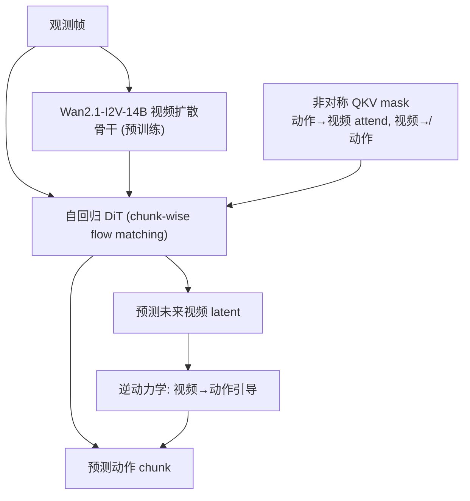

# DreamZero: World Action Models are Zero-shot Policies

- 本地 PDF：`papers/world-model/DreamZero_2602.15922.pdf`
- arXiv：https://arxiv.org/abs/2602.15922
- 代码：https://github.com/dreamzero0/dreamzero
- 年份：2026（2 月）
- 团队：NVIDIA GEAR（Jim Fan, Yuke Zhu, Joel Jang 指导）
- 阶段：WAM 预训练立场 — 14B 视频扩散基座的 World Action Model，零样本策略

## 一句话总结

DreamZero 是 14B 参数的 World Action Model (WAM)，基于预训练视频扩散骨干（Wan2.1-I2V-14B）构建：联合预测未来视频帧和机器人动作，视频预测作为隐式视觉规划器引导动作生成（逆动力学）。关键成果：未见任务/动词/运动的泛化比 SOTA VLA 提升 2× 以上；推理延迟从 5.7s 优化到 150ms（38×，~7Hz 实时闭环）；跨具身迁移（人类视频/其他机器人视频 → >42% 相对提升，30 分钟 play data 适配全新机器人）；~500 小时异构真实数据训练。

## 核心技术

1. **视频-动作联合预测** — 自回归 DiT，teacher-forcing + chunk-wise flow-matching 去噪，联合去噪视频和动作 latent
2. **非对称 QKV attention mask** — 动作 attend 视频 token，但视频 token 不能 attend 动作——强制物理因果性（动作由未来视频引导，视频不能"偷看"动作）
3. **闭环 KV cache 修正** — 每个动作 chunk 执行后，真实观测替换预测帧——防止长程误差累积
4. **DreamZero-Flash** — 解耦视频/动作噪声调度（视频偏向高噪声 Beta(7,1)，动作均匀），1-step 推理几乎无损
5. **推理优化栈** — CFG 并行（2 GPU）、DiT caching（16→4 去噪步）、NVFP4 量化、cuDNN kernels、异步执行

## 底层原理与数学推导

**联合去噪目标**：视频和动作 latent 在同一个 flow-matching 去噪过程中，动作由"预测的视频未来"隐式引导——**对齐动作与预测的视觉未来**，而非纯状态-动作模仿。

**DreamZero-Flash 的解耦噪声调度**：视频 timestep 从 Beta(7,1) 采样（偏向高噪声），动作 timestep 均匀——视频高噪声使 1-step 去噪即可生成合理视频，动作保持均匀保证精度。

**数据**：~500 小时 AgiBot G1 异构真实数据（7.2K episodes, 22 环境, 平均 4.4 分钟/episode, ~42 子任务/episode）+ DROID (~75K episodes)。

## 物理直觉解释

**WAM 的核心主张**：VLA 学的是"静态图像-文本→动作"的映射，缺乏物理直觉。WAM 通过"预测未来视频"学到物理动态——视频是"世界如何演化"的密集表征。DreamZero 让动作生成与预测的视觉未来对齐：**"先想象这么做会发生什么，再决定做什么"**。

**非对称 mask 的直觉**：动作可以"看"视频（我的动作应该符合预测的未来），但视频不能"看"动作（视频预测必须是纯粹的物理推演，不能作弊直接知道动作）——就像考官不能看考生的答案。

**闭环 KV cache 修正**：WAM 的"预测视频"不总是对的——所以每步执行后用真实观测替换预测帧，像"边开车边看后视镜校正"。

**零样本泛化 2× 的原因**：视频预训练（Wan2.1）从互联网视频学到了丰富的物理先验（物体动力学、交互模式），机器人数据只需对齐"这个本体的动作怎么映射"——而不是从零学物理。

## 工程细节与实操指南

- **基座**：Wan2.1-I2V-14B-480P 预训练视频扩散模型
- **架构**：自回归 DiT + flow matching + 非对称 QKV mask
- **推理优化**：CFG 并行（2 GPU）、DiT caching（16→4 步）、NVFP4、异步执行 → 5.7s→150ms（38×，~7Hz）
- **训练数据**：~500h AgiBot G1 + DROID ~75K episodes
- **跨具身**：AgiBot G1 预训练 → 30 分钟 play data 适配 YAM 全新机器人
- **benchmark**：真机 RoboArena + 仿真 PolaRiS + Genie Sim 3.0（100 任务，未训练却非平凡表现）
- **开源**：权重 + 推理代码 + benchmark 代码全开源（DreamZero-DROID 权重 CC BY-NC）

## 消融实验与分析

| 消融/对比 | 结论 |
|---------|------|
| vs SOTA VLA (GR00T N1.6, π0.5) | 未见任务/动词/运动泛化 2× 以上 |
| 任务后训练后环境泛化 | 仍超 SOTA VLA ~10% 平均任务进度 |
| 视频/人类演示跨具身 | >42% 相对提升（10-20 分钟数据） |
| 30 分钟 play data 适配新机器人 | 保留零样本泛化 |
| 数据多样性 vs 重复 | 同等小时数：多样数据 ~50% vs 重复 ~33% 未见任务成功率 |
| DreamZero-Flash vs 完整版 | 1-step 推理几乎无损 |

## 技术权衡（Trade-off）

| 优势 | 劣势与工程代价 |
|------|----------------|
| 视频预训练注入物理先验，零样本泛化 2× | 14B 推理开销大——38× 优化才到 7Hz |
| 跨具身适应数据效率极高（30 分钟） | 长程任务的弱语言推理（视频主导） |
| 闭环 KV 修正防误差累积 | 训练需要视频-动作联合数据 |
| 全开源（权重+代码+benchmark） | DreamZero-DROID 权重 CC BY-NC 非商业 |

## 技术价值与演进定位

DreamZero 是 WAM 辩论中"预训练 backbone 立场"的代表——它和 WorldVLA（辅助目标立场）、V-JEPA 2（独立规划器立场）构成 2026 年 WAM 三条技术路线的对照。它证明了：**从预训练视频模型出发构建 WAM，可以让机器人获得 VLA 难以企及的零样本泛化**，且推理优化可以把 WAM 推到实时控制（7Hz）。

## 与其他论文的关系

- **WorldVLA** — 辅助目标立场（世界模型 loss 加在 VLA 上）；DreamZero 是预训练 backbone 立场
- **V-JEPA 2** — 独立规划器立场（世界模型只做 MPC）；DreamZero 是世界模型即策略
- **LingBot-VA** — 同为 WAM，但 MoT 双专家 + 无预训练视频骨干
- **π0.5 / GR00T N1.6** — 被超越的 SOTA VLA baseline
- **Wan2.1** — 视频生成基座模型，DreamZero 在其上构建

## 精读问题

1. 非对称 QKV mask 是否限制了视频预测的"动作意识"——某些任务视频预测需要知道动作才能准确？
2. 38× 推理优化的瓶颈在哪一步——还能继续压到 50Hz 吗？
3. 500 小时异构数据 vs π0 的数万小时——WAM 的数据效率是本质优势还是"视频预训练借来的"？
4. 视频主导的 WAM 在需要密集推理的长程任务（如 PALM 的多阶段规划）上如何补充语言能力？
5. DreamZero-Flash 的 1-step 视频去噪精度——在接触丰富场景的退化程度？
