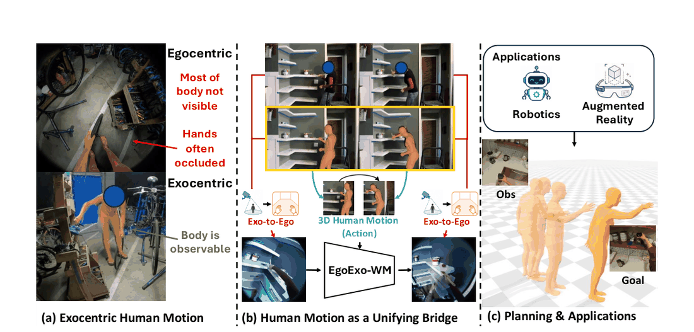
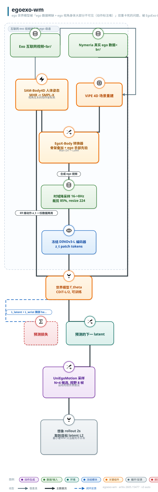
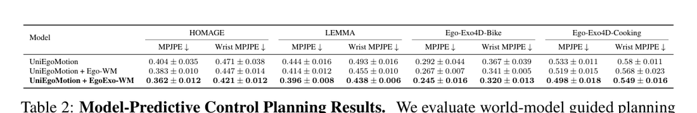

# EgoExo-WM: Unlocking Exo Video for Ego World Models

- arXiv: https://arxiv.org/abs/2605.15477
- Source: https://arxiv.org/abs/2605.15477
- Project: https://vision.cs.utexas.edu/projects/EgoExo-WM
- Local PDF: `/Users/luogu/physical_intelligence/papers/world-model/EgoExo-WM_2605.15477.pdf`
- Year: 2026
- Category: ego world model / exo-to-ego transfer
- Priority: high

## 一句话总结

ego 世界模型被「ego 数据稀缺 + ego 视角身体大部分不可见（动作标注难）」双重卡死的问题，被 EgoExo-WM 用「3D 人体姿态当桥」解决：从海量第三方视角视频中恢复 3D 人体运动作为动作空间，再用带人体运动学先验的 exo-to-ego 视频转换（EgoX-Body，4×GH200）把 exo 视频转成动作对齐的 ego 视频，注入 CDiT-L latent 世界模型训练（DINOv3-L 特征 + 69 维 SMPL 动作 + 腕部一致性损失，8×A40 100k 步），仅用约 10 小时转换数据即将 HOMAGE 平均 L2 从 0.058（ego-only）降到 0.047、相对最强 PEVA 基线（0.103）降一半以上，腕部 PCK@20 从 0.396 升到 0.531，并在四个数据集的 MPC 规划评测（MPJPE）上全面领先。

## 九问速览

1. **Problem**：ego 世界模型受限于 ego 数据规模小且 ego 视角身体不可见、动作难标注
2. **Bottleneck**：internet 级视频几乎全是 exo，与 agent 动作空间无对齐、也非 ego
3. **Insight**：3D 人体姿态可统一 exo 观察、WM 动作空间与 ego 视频合成三个环节
4. **Method**：exo 视频恢复 3D 姿态作动作 + EgoX-Body（骨架叠加条件）转 ego 视频作观测
5. **Evidence**：HOMAGE 平均 L2 0.047 vs ego-only 0.058、最强 PEVA 0.103；腕 PCK@20 0.531 vs 0.396
6. **Ablation**：Naive（190h ego+10h 原始 exo）0.053 vs 转换后 0.047——增益来自对齐而非数据量
7. **Assumption**：SMPL 22 关节姿态足以定义动作；转换视频质量足以当训练监督
8. **Failure**：转换在遮挡/精细接触/小物体操作上失真甚至输出全黑全白帧；仅 49 帧短片段、2s 规划视野
9. **Opportunity**：更多源 exo 转换、更长视野规划、显式手部关节、换更强转换器即插即用

| 维度 | 论文答案 |
|---|---|
| Perception | ego 帧 resized 224×224，冻结 DINOv3-L/16 编码为 14×14×1024 patch latent，条件窗口 H 帧历史（附录 A.1.1 称 condition on 3） |
| Closed-loop | 预测可闭环：MPC 式对 UniEgoMotion 采样 N=4 候选序列各 rollout 8 步，选末态 latent 最近目标者；无执行反馈的重规划 |
| Correction | 训练含 teacher forcing 自回归；规划为一次性选序列，未见 receding-horizon 执行-再规划，长时程误差累积留作未来工作 |
| Deployment | 训练 = Nymeria 真实 ego（家庭/户外，Xsens 动捕）+ 转换的互联网 exo；评测跨 HOMAGE/LEMMA/Ego-Exo4D 四个分布外数据集成立；无真机部署 |

## 核心技术

**信息流拆法（Figure 2 + Figure 4）。** 整个框架分三段：(1) **动作提取**——SAM-Body4D 从 exo 视频恢复全身姿态（MHR 转 SMPL-X），同时 ViPE 做 4D 场景重建提供几何；(2) **exo-to-ego 转换（EgoX-Body）**——在 EgoX 基础上加两层人体先验：exo 侧把人体骨架叠加到条件帧上（SAM 3D Body 表示），ego 侧用头锚定虚拟相机（SMPL-X 双眼中点前推 0.1m，眼-眼向量为 x 轴、相机中心-颈部为 y 轴、z=x×y）渲染 ego 先验并叠加手部骨架（每手 16 关节 15 骨，左手红右手蓝）；两路 latent（干净 exo latent+噪声、骨架叠加 exo latent+ego 手部先验）通道/宽度维拼接进 Wan 视频扩散 DiT（LoRA 微调）生成 ego 视频；(3) **世界模型训练**——冻结 DINOv3-L 编码 ego 帧为 $z_t$，CDiT-L/2（24 层、hidden 1024、16 头）以 H 帧历史 latent + 69 维动作预测下一步 latent，轻量腕部 heatmap 头从预测 latent 解码腕部位置做一致性监督。

*论文 Figure 1（p2）：Figure 1: Overview. Egocentric video provides an embodied view but often hides the body and*

**什么预训练、什么冻结、什么训练。** DINOv3-L 编码器冻结（目标与输入共享同一编码器，回归其 latent）；腕部 heatmap 解码头（6 层 Transformer，256 维）在 EgoExo4D+Nymeria 上预训练后冻结；世界模型 CDiT-L/2 从头训练；EgoX-Body 扩散模型基于 EgoX（Wan + 4D 重建 + VLM 条件）改进并用 LoRA 训练。转换与 WM 训练解耦——作者明言转换器可替换。

**损失。** 主损失是 latent L2 回归（非 JEPA 的 EMA-mask 目标，直接回归冻结编码器的特征）：$\mathcal{L}_{\text{latent}} = \|\hat z_{t+1} - z_{t+1}\|_2^2$；辅助腕部一致性损失（MSE on 224×224 单通道高斯 heatmap，σ=3.0px，双腕 element-wise max 合成，仅在至少一腕可见的帧上计算）$\lambda \|\hat V_{t+1} - V_{t+1}\|_2^2$，λ=1。

**规划。** UniEgoMotion 给定当前观测采样 N=4 条 horizon=8 的 3D 人体运动候选；WM 对每条候选自回归 rollout 到 $z_{t+H}$；与目标图像 latent $z_g$ 的 L2 距离作 cost，argmin 选择——标准的「WM 当 eval器」MPC。

## 底层原理与数学推导

**动作空间定义（22 关节 SMPL）。** 动作向量由全局平移变化 + 22 个身体关节的相对旋转（欧拉角）组成：

$$
a_t \in \mathbb{R}^{N},\qquad N = 3 + 22 \times 3 = 69
$$

选姿态而非 latent action 的理由（第 2 节）：latent 动作难解释、文本动作太粗，都无法承载精细运动学——而姿态是「物理上接地、可解释、可被运动生成模型采样」的动作表示。注意 Xsens（23 关节、4 脊柱关节）与 SMPL（22 关节、3 脊柱关节）的骨架互转：丢 L3 或复制腰关节即可，参数化不变（附录 A.1.2）。

**latent 空间一步预测。** 冻结编码器 $E$、上下文窗口 $H$、预测器 $f_\theta$：

$$
z_t = E(x_t),\qquad \hat z_{t+1} = f_\theta(z_{t-H+1:t},\ a_t),\qquad \mathcal{L}_{\text{latent}} = \|\hat z_{t+1} - z_{t+1}\|_2^2
$$

用 latent 而非像素的理由：像素预测昂贵且过度强调低层外观，latent 目标更紧凑且保留语义/几何信息。这本质上是「回归冻结自监督特征」的 DINO-WM 式目标，而非 V-JEPA 的 EMA 预测目标——没有坍塌风险（目标由冻结网络给出），代价是表征上限被 DINOv3 锁死。

**总目标（含腕部一致性）。** 轻量头 $h_\phi$ 从预测 latent 解码腕部 heatmap：

$$
\mathcal{L} = \underbrace{\|\hat z_{t+1} - z_{t+1}\|_2^2}_{\mathcal{L}_{\text{latent}}} + \lambda\,\underbrace{\|\hat V_{t+1} - V_{t+1}\|_2^2}_{\mathcal{L}_{\text{wrist}}},\qquad \hat V_{t+1} = h_\phi(\hat z_{t+1}),\ \lambda = 1
$$

腕部伪标签 $V$ 由 ViTPose 检测（置信度 >0.3、5px 内去重）、各向同性 2D 高斯 splat（σ=3.0px）双腕取 max 合成。设计意图：人体姿态是 ego 动力学的接地锚，若只在特征空间回归，预测可能「外观对、姿态错」；腕部监督把学习信号往 agent 自身运动上拉——Table 1 中 PCK@20 的提升（如 Cooking 0.459→0.515）是该项的直接证据。

**MPC 式目标条件规划。** 候选序列集合 $\{a^{(i)}_{t:t+H}\}_{i=1}^{N}$、目标图像 latent $z_g$：

$$
z^{(i)}_{t+1:t+H} = f_\theta(z_t, a^{(i)}_{t:t+H}),\qquad C^{(i)} = \|z^{(i)}_{t+H} - z_g\|_2^2,\qquad \hat i = \arg\min_i C^{(i)},\quad a^*_{t:t+H} = a^{(\hat i)}_{t:t+H}
$$

评的是「预测的 rollout 末态与目标的接近度」——论文特别提醒：规划成败最终取决于 WM rollout 的准确度，这正是 Table 1（预测质量）与 Table 2（规划质量）同向改善的因果链。

*架构速览：ego 世界模型被「ego 数据稀缺 + ego 视角身体大部分不可见（动作标注难）」双重卡死的问题，被 EgoExo-WM 用「3D 人体姿态当桥」解决：从海量第三方视角视频中恢复 3D 人体运动作为动作空间，再用带人*

## 物理直觉解释

**「偷师」的机器版本：看别人干活，想象自己动手。** 人类学揉面不必先在自己视角录一遍——看师傅做（exo），脑内把动作换算成「我的手会怎么动、案板会怎么变」（ego）。EgoExo-WM 把这个认知过程拆成两步工程：3D 姿态是**换算器**（视角无关的动作坐标系，第三人称与第一人称共用同一副骨架），exo-to-ego 转换是**脑内取景器**（把第三人称画面重摄成第一人称）。关键洞察在于姿态同时是「动作标签」（给 WM 当条件）和「转换的几何引导」（骨架叠加进扩散条件）——一份数据两用，这就是「3D 人体运动统一 exo 观察、WM 学习与 ego 合成」的含义。消融里最锋利的一条证据：Naive 版直接拿 10 小时原始 exo 视频训练（配姿态动作），HOMAGE L2 只到 0.053，转换成 ego 对齐格式后到 0.047——**数据必须先翻译成 agent 的母语才有营养价值**。

**「腕部 heatmap 是拴住预测的缰绳」。** 纯特征回归有个隐患：DINOv3 latent 里「桌子上的杯子」和「手里的杯子」可能距离不远，模型可以学会外观上过得去的预测却把手放错位置。腕部一致性损失的作用像**风筝线**——预测可以在特征空间里飞，但每一步都被拽回「手此刻应该在哪」这个物理锚点上。工程实现很省：不需要可学习的头参与训练（解码器冻结、预训练好后拆下来就能用），只在腕部可见帧上算 MSE，却让四个数据集的 PCK@20 全线上升（HOMAGE 0.404→0.531）。这也解释了为何选 DINOv3 而非生成式像素空间：**语义几何留给自己学，精细本体感觉用辅助损失显式喂**。

**「MPC 不开车，只当裁判」。** 这套规划的奇特之处在于世界模型不产生动作、只给动作打分：UniEgoMotion 负责提议像人的运动序列（把采样空间圈定在人体动力学可行域内），WM 负责在想象里推演每条序列 2 秒后的画面并与目标图比对。像**围棋 AI 的盘面评估器**——不负责落子生成，只负责说哪步棋之后局面更像赢棋的样子。好处是分工干净：动作合理性外包给运动先验，因果预测集中在 WM；坏处是裁判的眼界只有 2 秒（8 帧）——论文自己承认 EgoX-Body 只支持 49 帧片段、转换数据全是短交互，更长视野下 compounding error 未解决。从 HOMAGE 规划 MPJPE 0.404（无采样基线）→0.383（Ego-WM 裁判）→0.362（EgoExo-WM 裁判）的单调下降可见：**裁判的眼光（预测精度）直接决定选动作的水平**。

## 工程细节与实操指南

- **WM 训练配方（附录 A.1.1）**：CDiT-L/2，24 层 / hidden 1024 / 16 头 / MLP ratio 4；输入 DINOv3 ViT-L/16 patch token（224×224 → 14×14×196×1024）；AdamW 恒定 lr $8\times10^{-5}$，β=(0.9, 0.95)，零 weight decay，梯度裁剪 10.0，bfloat16；per-GPU batch 64 × 8 A40 = 全局 512；100,000 iterations；评测用 EMA 权重 + torch.compile。
- **EgoX-Body 转换配方（附录 A.2）**：训练 4×GH200、20,000 iterations；推理每 49 帧样本 3.5 分钟。实用化改造：去掉 Geometry Guided Attention、分辨率 448→384、另加 250 条 H2O 面向相机的样本——GH200 上单视频推理 17.5→3.25 分钟（约 5.4×提速）。ego 虚拟相机 = SMPL-X 双眼中点前推 0.1m，剔除过近点防渲染伪影。
- **exo 数据筛选流水线（附录 A.3）**：自适应场景切分 → 3 帧采样要求 ViTPose 检出单人可靠头/上半身 → ORB 对应 + 仿射运动估计剔除有明显变焦/平移/旋转的片段 → GPT-4o-mini 视觉把关（人类动作可见、overlay 覆盖 <20%、无画中画）。
- **转换视频后处理（A.3.1 + A.3.3）**：49 帧@16Hz → 中心裁 85% → 224×224 → 降到 8Hz 得 25 帧，与 3D 运动轨迹同步采样。质量过滤四指标：black_fraction_mean<0.30、white_fraction_mean<0.20、blur_median>50（Laplacian 方差）、motion_median<32.5（相邻帧灰度 MAD），阈值经人工抽查标定，**保留约 80% 候选片段**。
- **数据体量的诚实披露**：~10 小时转换数据是「算力能消化的量」（视频生成推理耗时是瓶颈），框架声称可随算力线性加数据；ego 侧 200 小时 Nymeria（PEVA 预处理），full model 用 190h + 10h 转换以匹配 Ego-WM 的 200h 总量。
- **评测协议细节**：rollout 2 秒 = 8 帧@4Hz；EgoControl 是像素生成法（16Hz 一次出 2 秒再降采样到 4Hz），PEVA 与本文自回归逐步回灌；像素方法先用 DINOv3-L 编码再算 L2，latent 方法直接算；腕 PCK@20 对像素法用 ViTPose、对 latent 法用本文腕部头。规划 5 次重复报 mean±std。

## 实验协议清单

| 项目 | 论文设置 | 来源与备注 |
|---|---|---|
| 观测 | ego 帧 224×224，冻结 DINOv3-L/16 → 14×14 patch latent；条件窗口 H 帧（附录 A.1.1 称 condition on 3；主文未给 H 数值，待确认） | 第 3.1 节 / 附录 A.1.1 |
| 动作空间 | 69 维 SMPL：root 平移变化 3 + 22 关节欧拉角旋转 22×3；不含手指关节 | 第 3.1 节 / 附录 A.1.2 |
| 控制频率 | 4 Hz（2 秒 rollout = 8 帧）；转换视频原生 16 Hz 降采样到 8 Hz 后再采样（训练侧），评测统一 4 Hz | 第 4.1 节 / 附录 A.3.1 |
| 重规划频率 | 未报告 receding-horizon 细节；规划为一次性对 N=4 候选评分选序列（horizon 8） | 第 3.3 节 |
| 动作 horizon | 预测/规划 horizon H=8（2 秒）；EgoX-Body 转换片段 49 帧 | 第 4.1 节 / 附录 A.3.1 |
| 数据 | 训练：Nymeria ~200h（full model 190h）+ 转换 exo ~10h（HowTo100M ~5h Food+Entertainment、100 Days of Hands ~4h、CrossTask ~1h）；评测：HOMAGE 150 clips、LEMMA 150（单人）、Ego-Exo4D Bike 125 + Cooking 125 | 第 4.1 节 |
| 奖励 | 无奖励；规划 cost = 末态 latent 与目标 latent 的 L2 距离 | 第 3.3 节 |
| Reset | 不适用（视频预测与离线规划评测，无环境 reset） | 第 4 节 |
| 成功定义 | 预测：DINOv3-L latent L2（2s 末帧 + rollout 平均）、腕 PCK@20；规划：whole-body MPJPE、Wrist MPJPE（对 GT 运动） | 第 4.1 节 |
| 评估次数 | 规划 5 runs 报 mean±std；rollout 评测每个数据集 125–150 clips 一次 | Table 1/2 及正文 |
| 随机种子 | 未报告训练种子；Table 1 注：PEVA/EgoControl 的 std <0.005、PCK <0.03 | Table 1 注 |
| 扰动测试 | 无显式扰动；分布外压力来自评测集（HOMAGE/LEMMA/Ego-Exo4D 均非训练域）与 Naive 对照 | 第 4 节 |
| 真机 | 无真机实验；机器人与 AR 为应用愿景（目标图由用户拍/演示选/指令生成） | 第 1/3.3 节 |
| 算力 | WM：8×A40，batch 512，100k iters；EgoX-Body：4×GH200 训练 20k iters，推理 3.5 min/49 帧样本 | 附录 A.1.1 / A.2.2 |
| 特权信息 | 训练期：ViTPose 腕部伪标签（辅助监督）、Nymeria Xsens 动捕动作、SAM-Body4D 估计姿态；规划期：目标图像（假设可获得）；评测用 GT 姿态与 GT 帧 | 第 3.1/3.2/4.1 节 |

**附录陷阱自查**：
- privileged 信息：转换数据的「GT」来自 SAM-Body4D/ViPE 估计（误差进训练）；评测姿态 HOMAGE/LEMMA 用 SAM-Body4D 提取、Ego-Exo4D 用提供的 UniEgoMotion 姿态——非人工精标
- reward shaping：无 reward；latent L2 作规划目标存在「特征距离 ≠ 任务完成」的代理风险（论文未做任务级成功评测）
- reset 难度：不适用
- eval budget：每集 125–150 clips、规划 5 runs；规模中等，且作者强调此前方法多在训练域评测、本文跨域评测是更严设定
- 底层控制栈：无真机控制栈；动作采样外包 UniEgoMotion（其 Egocentric Motion Generation 模块）
- 数据优势：10h 转换数据相对 200h ego 是零头，但 Naive 对照证明增益不在量在对齐；同时 PEVA/EgoControl 基线吃满 200h Nymeria 且 PEVA-XXL 参数更大，比较尚属公平

## 消融实验与分析

*论文 Table 1（p7）：Table 1: Open-loop world model evaluation across four datasets. We report final 2s error and average*

### A. 开环 rollout 主结果（Table 1，L2↓ / PCK@20↑，Avg 列）

| 模型 | HOMAGE L2 | HOMAGE PCK | LEMMA L2 | LEMMA PCK | Bike L2 | Bike PCK | Cooking L2 | Cooking PCK |
|---|---|---|---|---|---|---|---|---|
| PEVA-XXL | 0.103 | 0.365 | 0.101 | 0.420 | 0.093 | 0.420 | 0.095 | 0.303 |
| EgoControl* | 0.087 | 0.458 | 0.077 | 0.470 | 0.073 | 0.537 | 0.078 | 0.378 |
| Ego-WM（ego-only） | 0.058 | 0.396 | 0.055 | 0.527 | 0.042 | 0.561 | 0.053 | 0.459 |
| Naive EgoExo-WM | 0.053 | 0.447 | 0.049 | 0.561 | 0.040 | 0.525 | 0.052 | 0.443 |
| EgoExo-WM（full） | 0.047 | 0.531 | 0.045 | 0.618 | 0.040 | 0.603 | 0.052 | 0.515 |

**核心结论**：相对最强 PEVA 基线 HOMAGE 平均 L2 减半以上（0.103→0.047）；相对 ego-only，转换数据在家务/物体中心活动（HOMAGE/LEMMA）增益最大、在 Nymeria 已覆盖的 Cooking 与未转换覆盖的 Bike 上增益趋零但 PCK@20 仍全线提升——增益来源是「转换带来的动作/交互覆盖扩展」而非数据量。

### B. MPC 规划（Table 2，whole-body MPJPE↓，mean±std，5 runs）

| 评分器 | HOMAGE | LEMMA | Bike | Cooking |
|---|---|---|---|---|
| UniEgoMotion（无采样基线） | 0.404±0.035 | 0.444±0.016 | 0.292±0.044 | 0.533±0.011 |
| + Ego-WM 排序 | 0.383±0.010 | 0.414±0.012 | 0.267±0.007 | 0.519±0.015 |
| + EgoExo-WM 排序 | 0.362±0.012 | 0.396±0.008 | 0.245±0.016 | 0.498±0.018 |

**核心结论**：世界模型排序本身就能降 MPJPE（裁判有价值），且更准的裁判（EgoExo-WM）在全部四集一致最优；Wrist MPJPE 同步下降（HOMAGE 0.471→0.421），精细腕部动作也从更广的动作覆盖中受益。

### C. 消融链条汇总（HOMAGE 平均 L2）

| 变体 | HOMAGE Avg L2↓ | 相对上一行变化 |
|---|---|---|
| 最强 PEVA 基线（PEVA-XXL，200h Nymeria） | 0.103 | — |
| Ego-WM（同架构同预算，仅 ego 数据） | 0.058 | 架构/目标换成 CDiT+latent L2 后 −0.045 |
| Naive（190h ego + 10h 原始 exo） | 0.053 | 加未对齐 exo 数据 −0.005 |
| EgoExo-WM（190h ego + 10h 转换 exo） | 0.047 | exo 转成 ego 对齐格式再 −0.006 |

**核心结论**：四行阶梯把增益拆干净——架构与训练目标贡献最大的一跳，原始 exo 数据有微弱正贡献（可能来自多样性正则），而「转换对齐」在 Naive 之上再拿一截：证明框架价值在 exo→ego 的动作对齐翻译，而非单纯的额外视频。

### D. 定性消融（Figure 3）

EgoX vs EgoX-Body 对比：无人体先验的 EgoX 出现手-物交互错配、左右手互换、幻觉手臂动作；骨架叠加 + ego 手部先验条件显著改善动作一致性——这是 WM 训练数据质量的直接上游保障。

## 技术权衡（Trade-off）

| 优势 | 劣势与工程代价 |
|------|---------------|
| 解锁 internet 级 exo 视频为 ego WM 训练数据，动作监督免动捕 | 转换管线昂贵：3.5 min/49 帧样本（GH200），10h 数据已是算力上限，扩数据先扩算力 |
| 3D 姿态动作空间：可解释、可采样（UniEgoMotion）、视角无关 | SMPL 22 关节不含手指——精细操作的核心自由度缺席，DWM 类手部 mesh 条件做不到的它也做不到 |
| latent 预测 + 冻结 DINOv3：训练稳、无坍塌、推理便宜 | 表征上限被锁死在 DINOv3；像素级细节（物体精确形变）不可恢复，规划只能到 latent 分辨率 |
| 腕部一致性损失：轻量、免标签成本、PCK 全线提升 | 伪标签依赖 ViTPose 在 ego 视角的检出率，遮挡/出画帧被 mask 掉，监督有盲区 |
| MPC 式规划零策略训练，即插即用换动作生成器 | 2 秒视野 + 自回归误差累积；一次性选序列无闭环重规划；N=4 候选的采样覆盖存疑 |
| 跨数据集（非训练域）评测，声明更可信 | 转换失败的退化样本（全黑/全白）靠阈值过滤兜底（保留 ~80%），分布尾部的交互（小物体、遮挡接触）系统性缺失 |

## 技术价值与演进定位

这篇论文回答的问题是「ego 世界模型怎么 scale」——在 V-JEPA 2 用 100 万小时通用视频 + 62h 机器人数据证明「大域预训练可行」之后，EgoExo-WM 给出另一条更省的路：不追求通用视频全量吸收，而是用 3D 人体姿态做**语义翻译层**，把免费的海量 exo 人类活动视频翻译成 ego 观测-动作对。它的方法论遗产有二：(1) 「动作表示选姿态而非 latent/文本」的论证（可解释 + 可被运动先验采样）会持续影响后续 ego/humanoid 世界模型的动作空间设计；(2) Naive 对照实验设计——同数据量下比较「对齐 vs 未对齐」——为「数据格式比数据量重要」提供了一个干净证据。在演进线上，它处在 PEVA/EgoControl（ego 域内扩规模）与 DWM（像素扩散 + 手部 mesh 条件）之间：预测空间选了和 V-JEPA 2/DINO-WM 一致的 latent 回归阵营，数据策略则比两者都激进。其最明显的短板——49 帧片段、2s 视野、无手指——恰是后续把长视频转换与手部动作模型（如 MANO 生成先验）接入的现成接口。

## 与其他论文的关系

- **V-JEPA 2（v-jepa2.md）** — 最近的表亲：同为「冻结自监督编码器 + latent 一步预测 + 目标条件 MPC/CEM 选择动作」范式（V-JEPA 2-AC 用自家 JEPA 特征 + CEM，本文用 DINOv3 + 穷举 4 候选）。V-JEPA 2 靠 1M 小时通用视频预训练，本文靠 10h 精准转换的人类活动数据——「泛化买量」与「翻译买质」两条路线的直接对照。V-JEPA 2 团队的后续工作（引用 [27] Goswami et al.）正是用人类视频学灵巧操作世界模型，同一思潮。
- **DWM（dexterous-world-models.md）** — 互补的 ego 操作世界模型：DWM 像素扩散出视频、手部 mesh 像素对齐条件、场景残差学习；本文 latent 回归、69 维姿态条件、exo 数据转换。DWM 的场景条件化思想与本文的数据扩展思想正交，合并（转换数据 + 场景条件）是显然的后续。
- **EgoGenesis（egogenesis.md）** — 同赛道（ego 世界-动作模型），走「在线锚定投影记忆 + Action-3D RoPE」的架构显式 3D 路线；本文的 3D 只用在数据转换层（ViPE/SAM-Body4D），模型本身无几何归纳偏置——两种「3D 进 ego WM」的深度选择。
- **UniPi / SuSIE** — 反衬的像素生成阵营：视频扩散当策略/子目标生成器，动作语义藏在文本或子目标图里；本文用结构化姿态动作 + 廉价 latent 预测，把「生成精细度」换成「规划吞吐」，与 V-JEPA 2 批评 Cosmos 的逻辑同构。
- **Dreamer-v3 / TD-MPC2** — latent MPC 的 RL 经典：需要 reward/value 闭环与在线交互；本文 reward-free、离线数据、规划只做排序，代表「世界模型不学控制只学预测」的去 RL 化分支。
- **SimDist（simdist.md）** — 数据策略呼应：SimDist 用仿真预训练蒸馏到真实，本文用合成转换（exo→ego）扩充真实——都是「造中间域 bridging」的工程哲学，且都把 domain gap 的处理放在数据层而非模型层。
- **WoW / DreamZero（WAM 谱系）** — 世界-动作模型之争的另一端：直接把世界模型当策略用；本文保持 WM 纯预测器身份 + 外挂动作生成器做规划，可作为「分离 vs 端到端」辩论中分离方的 ego 侧证据。

## 精读问题

1. H 帧上下文窗口的具体数值在 PDF 中被截断（附录 A.1.1 仅见「We condition on 3」）；上下文长度对自回归误差累积的敏感度如何？把 H 从 3 拉到 8/16，HOMAGE 的 2s 平均误差会单调改善还是先升后降？
2. 腕部一致性损失的 heatmap 监督只在腕可见帧生效；若换成全身关节 heatmap（多通道）或直接对齐预测 latent 与姿态编码器的表征（pose-anchored contrastive），能否把 PCK 增益再放大而不引入可训练辅助头的过拟合？
3. 转换数据只有 ~10h 却拿下一半的误差降幅（0.058→0.047）；按此斜率外推，100h 转换数据的边际收益何时饱和？是否存在「转换分布 ≠ 真实 ego 分布」的系统性偏移上限（转换器风格伪影被 WM 学走）？
4. 69 维 SMPL 动作不含手指，但腕 PCK 提升显著——这是否说明 ego 视频中「腕部全局运动」承载了多数可预测方差？若接入 MANO 手部动作（如 DWM 的 mesh 条件），预测增益集中在哪些交互类别？
5. 规划只评 N=4 候选的末态 latent 距离；换成 CEM 在动作空间迭代优化（如 V-JEPA 2）能否进一步降 MPJPE？瓶颈会在 WM 的 rollout 精度还是 UniEgoMotion 采样器的覆盖？
6. 质量过滤阈值（black<0.30 / white<0.20 / blur>50 / motion<32.5，保留 ~80%）是人工抽查标定的；这层启发式会不会系统性剔除「高风险但信息量大」的片段（剧烈运动、强遮挡交互），从而把 WM 训练成只在干净数据上有效的模型？可用过滤前后数据训练的 WM 在 occlusion 分桶上对比验证。
7. EgoX-Body 转换误差与 WM 预测误差在评测指标里无法区分（监督信号本身带噪）；能否在转换视频上用真实 ego 对照（Ego-Exo4D 有同步双视角）量化转换保真度，并建立「转换误差 → WM 误差」的传递函数？
