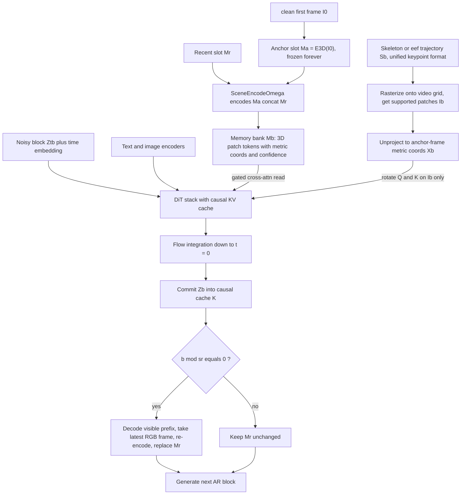

# EgoGenesis: Egocentric World-Action Modeling with Online Anchored Projective Memory and Action-3D RoPE

- 本地 PDF：`papers/world-model/EgoGenesis_2607.28243.pdf`
- arXiv：https://arxiv.org/abs/2607.28243
- 项目页：https://egogenesis.github.io/
- 年份：2026（arXiv preprint，v1 于 2026-07-30，暂无会议标注）
- 团队：上海交通大学 + 阿里巴巴 + Tianji KernalMind + HKUST + 东南大学 + 中国人民大学 + 东京大学（通讯作者 Linfeng Zhang）
- 阶段：egocentric 世界动作仿真器 / 数据引擎 —— 用几何可控的合成第一人称视频增广稀缺真机数据，而非直接产出部署策略

## 一句话总结

EgoGenesis 把 Wan2.2-5B-Control 改造成块级自回归的第一人称操控视频生成器：OAPM（Online Anchored Projective Memory）用一个冻结的首帧 3D 场景锚槽 + 一个只被整体替换的最近状态槽对抗长程漂移；A3D-RoPE 把 skeleton/end-effector 关键点的锚帧米制坐标转成旋转相位注入 skeleton-to-video gated cross-attention 实现动作对齐。用它生成的 400 条轨迹去增广 400 条真实轨迹后，下游 LingBot-VA 在四个单臂任务上的 OOD 成功率从 77% 升到 84%，四个双臂任务从 53% 升到 70%（每任务 25 次试验）。

## 核心技术

论文的诊断出发点是两类互补失败模式（Figure 2）：通用视频先验 Wan2.1-14B 不给相机与夹爪轨迹任何显式几何条件，相机运动和 gripper 轨迹不受控；action-conditioned 的 RynnWorld-TeleOp 虽然条件化了动作，但场景和被操作物体随时间漂移——作者归因于首帧锚定不足以及 end-effector 形态在训练分布上过拟合（把人手生成成 gripper 形态）。EgoGenesis 的回答是把两条条件通路分别做"几何化"：

1. **三路条件流输入块级 DiT**：(i) 噪声视频 latent 块 $Z_{t,b}$（首帧在生成中被 pinned）；(ii) 场景记忆——带米制坐标和置信度的紧凑 3D patch tokens；(iii) 动作控制 $S_b$——统一 keypoint 格式的 dense skeleton/EEF latent，兼容 MANO 人手骨架、灵巧手骨架和平行夹爪/机械臂末端轨迹。
2. **OAPM 双槽记忆**：不可变锚槽 $\mathcal{M}_a$ 来自干净首帧（"初始帧提供最清晰最稳定的条件"），replace-only 的最近槽 $\mathcal{M}_r$ 来自已生成的历史。两者拼接后由预训练 VGGT-Omega 编码为记忆库，只在选定 DiT 层经 gated cross-attention 读入；每 $s_r$ 个块刷新一次 $\mathcal{M}_r$，锚槽永不被覆盖。
3. **A3D-RoPE 度量旋转编码**：保持预训练 WAN 自注意力的位置路径不动，仅在 frame-local 的 skeleton-to-video cross-attention adapter 上加入；渲染 skeleton 覆盖到的补丁集合 $I_b$ 才参与度量旋转，背景 token 完全不受影响。通道按 x/y/z 三轴分组，每组内相邻通道组成标准 2D RoPE 对，角度由米制坐标直接给出。
4. **两阶段训练**：Stage 1 用预处理好的记忆槽做 6k 步 SFT；Stage 2 做自回归训练（用已生成帧充当 $\mathcal{M}_r$），也是 6k 步。骨干 Wan2.2-5B-Control，块因果注意力 + causal KV cache。
5. **source-balanced 训练语料**：210K clips（EgoDex 100K + AgiBot 100K + RoboTwin 4K + Real-world Ego 5K + DexJoCo 1K），覆盖人手、灵巧手、平行夹爪、机械臂四类执行体，所有源统一到 camera-and-pose 条件接口，统一为 81 帧 @16FPS、832x480。
6. **数据增广闭环**：把每条真实轨迹拆成首帧场景锚 + 相机轨迹 + 动作 track + 语言 prompt，让 EgoGenesis 在改动外观或场景条件下重新仿真同一动作标签空间，产出可替换监督数据的 video-action 对；下游 WAM（LingBot-VA）从官方 checkpoint 独立初始化微调，不继承生成器权重。

## 底层原理与数学推导

### 块级 flow matching 主干

目标视频 $V$ 经冻结 VAE 得到 latent $Z=[Z_1,\dots,Z_B]$，逐块去噪；给定当前可见历史 $K_{<b}$ 和该块条件 $c_b$：

$$
\begin{aligned}
Z_b^t &= (1-\sigma_t)Z_b + \sigma_t\,\varepsilon_b,\qquad \sigma_t=t \\\\
\hat{v}_b^t &= F_\theta(Z_b^t,t;c_b,K_{<b}) \\\\
\mathcal{L}_{FM} &= \mathbb{E}\left[\lVert\hat{v}_b^t-(\varepsilon_b-Z_b)\rVert_2^2\right] \\\\
Z_b^{t-\Delta t} &= Z_b^t-\Delta t\,\hat{v}_b^t
\end{aligned}
$$

即线性时间表的标准 flow matching + Euler 积分；一块积分到 $t=0$ 后被 committed 进 $K_{<b+1}$，下一块从这份历史继续生成。

### OAPM：锚定读写机制

写侧只有一个分支会更新（refresh），读侧全部走 gated 门控：

$$
\begin{aligned}
\mathcal{M}_b &= \mathrm{SceneEncode}_\Omega(\mathcal{M}_a\oplus\mathcal{M}_r^b) \\\\
Q&=W_QH,\quad K=W_K\mathcal{M}_b,\quad V=W_V\mathcal{M}_b \\\\
H&\leftarrow H+\mathrm{GatedCrossAttn}(Q,K,V)
\end{aligned}
$$

其中 $\oplus$ 是两槽 token 级拼接，$\mathrm{SceneEncode}_\Omega$ 直接取预训练 VGGT-Omega 的 3D 重构特征，因此记忆 token 自带参考帧 3D 坐标和置信度。在线刷新规则是唯一的写路径：

$$
\mathcal{M}_r^{b+1}=
\begin{cases}
E_{3D}\big(\mathrm{RecentFrame}(D_{vae}(Z_{\le b}))\big), & \text{if } b\bmod s_r=0\\\\
\mathcal{M}_r^b, & \text{otherwise}
\end{cases}
$$

解码 causally visible 前缀 $Z_{\le b}$、取最新 RGB 帧重编码、整体替换 $\mathcal{M}_r$；论文明确说明新帧只是通过学习到的门控参数去更新场景记忆中"已确立的部分"，锚槽在任何时刻都不会被改写。待确认：refresh stride $s_r$ 的具体数值正文与附录均未披露；含 OAPM/A3D adapter 的 DiT 层数与插入选择规则也未公开。

### A3D-RoPE：把米制坐标变成相位角

设 $I_b$ 为第 $b$ 块中被渲染 skeleton 覆盖的补丁，其锚帧米制坐标记为 $(X_x,X_y,X_z)$。通道按轴分三组 $[Q_x\|Q_y\|Q_z]$、$[K_x\|K_y\|K_z]$，若第 $m$ 对频率配给轴 $a$：

$$
\begin{aligned}
\theta_{a,m}(X_a)&=s\cdot X_a\cdot\kappa^{-m/M_a} \\\\
\begin{bmatrix}u'\\v'\end{bmatrix}&=
\begin{bmatrix}
\cos\theta_{a,m}(X_a)&-\sin\theta_{a,m}(X_a)\\\\
\sin\theta_{a,m}(X_a)&\cos\theta_{a,m}(X_a)
\end{bmatrix}
\begin{bmatrix}u\\v\end{bmatrix},\qquad s=4,\ \kappa=10^{4}
\end{aligned}
$$

对每个受支持补丁沿三个轴施加旋转得到 $R_{X_b}$，再作用到选中的 Q/K 上：$\hat{Q}=R_{X_b}(Q)$、$\hat{K}=R_{X_b}(K)$，且写回只发生在 $I_b$ 处。因为旋转矩阵正交，由标准 RoPE 相对性可得（本文式 (8) 在三维度量坐标上的直接推论）：cross-attention 里视频 query 与 action key 的内积 $\hat{q}^{\top}\hat{k}=q^{\top}R(X_q-X_k)\,k$ 只依赖两个 token 的**米制坐标差**，于是注意力权重由"第几个 token"变成了"在手部坐标系里差多少米、朝哪个方向偏"。普通 1D RoPE 没有度量几何，PRoPE 有相机感知但不把 skeleton 轨迹编进 action cross-attention，这正是消融对照的三档设置。

### 动作坐标如何构造（透视正确插值）

skeleton 关键点稀疏而视频补丁密集，需要把关键点深度铺到 $I_b$。对骨架边 $e=(j,k)$，先把补丁中心 $u_p$ 投影到边的参数 $\alpha_{pe}=\mathrm{clip}_{[0,1]}\big((u_p-u_j)^{\top}(u_k-u_j)/\lVert u_k-u_j\rVert_2^2\big)$，再做透视校正深度与高斯支撑加权：

$$
\begin{aligned}
d_{pe}&=\frac{d_jd_k}{(1-\alpha_{pe})d_k+\alpha_{pe}d_j},\qquad
w_{pe}=\mathbb{1}_e\exp\Big(-\frac{\lVert u_p-u_e\rVert_2^2}{2r_{te}^2}\Big) \\\\
d_p&=\frac{\sum_e w_{pe}d_{pe}}{\sum_e w_{pe}},\qquad
r_{te}=r_0+0.2\lVert u_k-u_j\rVert_2,\ r_0=0.10
\end{aligned}
$$

最后连同补丁射线反投影到参考相机系：$X_{tp}=\big[V_{ref}V_t^{-1}\,(d_{tp}K_t^{-1}\tilde{u}_p,1)\big]_{1:3}$。没有有效骨架支撑的补丁被排除出 A3D-RoPE 注意力——这是"只在接触区域附近注入几何约束"的实现基础。

## 物理直觉解释

**像画家钉在画板右上角的"定妆照"加一张便利贴。** 首帧锚槽就是那张不动的定妆照：桌面在哪、绿桌布什么颜色、乐高摆成什么样，都以 VGGT 提取的 3D 特征形式永久固定下来；最近槽则是随手贴上去又随时撕掉的便利贴，只记录"这一刻东西被拿到哪了"。生成过程中每次抽看场景都同时参照两张纸——所以物体不会被裁掉，也不会僵死在第 0 帧。OAPM 的定性消融（Figure 7）恰好对应三种坏习惯：只用便利贴（去掉锚）会越走越歪甚至物体消失；只留着定妆照不肯更新（anchor-only）则手里的物体会一直停留在过时的开合状态；两张都不用，漂移自由生长。真正的工程难点在于"什么可以变、什么不可以变"，EgoGenesis 把答案硬编码成了数据结构本身。

**把 1D 时间索引换成"经纬度海拔"。** 普通 RoPE 给每个 token 一个序号，就像电梯按钮上的楼层号——你知道自己在第几层，却不知道这层房间里东南西北各有什么。A3D-RoPE 把手部关键点相对相机的米制坐标 $(X_x,X_y,X_z)$ 直接变成三个独立轴上的旋转相位，注意力打分的依据不再是"你是第 37 个 patch 我是第 52 个",而是"你的手在我左下方 12 cm 处"。这样即使相机大幅移动、画面里手的位置像素坐标变了，相位差所描述的空间关系仍然稳定，模型就没有动机把手画飞或者让相机自行漂移。Figure 5 中 Cam-ERR 按 Plücker 射线度量、Depth-ERR 按 keypoint 区域 AbsRel 度量，测的都是这种空间关系是否守恒。

**沿骨架刷一条自适应宽度的"深度管"。** 关键点是稀疏的几何种子，但注意力发生在密集的视频补丁上。做法等价于给每条骨架边套一根半径随长度伸缩的软管——短边细、长边粗（$r_{te}=r_0+0.2\lVert u_k-u_j\rVert_2$）——然后按透视正确的比例把两端深度内插出来，离边越近权重大、越远权重指数衰减。直觉上就像沿着眉毛描一条粗细贴合的线，而不是用一个大圆盘把整张脸糊住；这个设计让深度信息贴着动作结构分布，正是 Figure 6 显示的"注意力集中在 end-effector 与接触区、不外溢到背景"的直接原因。

**同一个动作换布景再拍一遍。** 增广闭环的直觉是教练示范"把蓝方块放进箱子"这个动作时不换动作、只换场地：每条真实轨迹被拆解为首帧锚、相机轨迹、动作轨道和指令文本，然后让生成器在改过的外观或布局下重新演一遍，动作标签原封不动地保留。对下游策略而言，这意味着同样的监督信号附带了更多样的视觉上下文，OOD 时不再只认得训练时的那几个方块。

## 工程细节与实操指南

- **视频规格与算力**：81 帧 @16FPS、832x480；生成器在 8x A100 上训练（Stage 1 SFT 6k 步 + Stage 2 AR 6k 步）；下游 LingBot-VA 训练与真机推理用 8x H100（约 96 小时一轮，20000 steps）。
- **AR 训练细节**：两个 context 块 teacher-forced、一个目标块去噪，随机目标窗口 + 在线 OAPM 刷新（$\mathcal{L}_{AR}$ 与主 loss 同形）。推理每块从纯噪声采样、committed 进 cache 再条件下一块。
- **A3D-RoPE 接入位置**：只挂载在 frame-local skeleton-to-video cross-attention adapter；预训练 WAN 自注意力位置路径保持不变。仿照此设计的实践要点：动作坐标必须是**锚帧（参考帧）系的米制量**，$s=4$、$\kappa=10^{4}$ 是这套频率设置的基准值。
- **真实机器人评测协议**：天机 M6 双臂平台 + 头戴 egocentric 相机；单臂 4 任务（Cube Stacking / Pick and Place / Pointing and Select / Cube Pushing）、双臂 4 任务（Towel Folding / 双物 Pick and Place / Bottle Handoff / Place and Push）；每任务 25 次试验（成功率按 4 点步长变化），聚合值为 4 任务均值（等价 100 次试验）；ID 保留训练期外观布局，OOD 扣留对象外观与初始/目标布局。
- **下游 WAM 配置**：输入头戴 + 左/右腕三路同步 RGB 缩放到 256x256，temporal attention window 30，video chunk size 2；canonical 30 维动作空间激活 16 维（左右臂 7 关节 + 各 1 夹爪），active channels 记作 `[14:20, 28, 21:27, 29]`，action-per-frame factor 16，按 1st/99th 分位归一化。AdamW lr 1e-5、$(\beta_1,\beta_2)=(0.9,0.95)$、weight decay 0.1、warmup 200、per-GPU bs 1 + grad accum 4 = 全局 batch 32；text dropout 0.1 训练 CFG。推理 video CFG 5 / action CFG 1，去噪步数 video 5 / action 10，SNR shift 分别 5.0 / 1.0。
- **指标口径**：Kpt.Err 只在 EgoDex 的 50 clips 子集计算（归一化图像对角线的 2D 端点误差，优先 GT 关键点否则两侧同用 MediaPipe 21 点检测）；Phys.Faith 由 Kimi K2.7 打 0-5 分后除以 5 归一化；Subj.Cons 用 DINO ViT-S/16 特征、Bg.Cons 用 CLIP ViT-B/32 的 VBench 式首帧 + 相邻帧余弦相似度。
- **跨执行体仿真**：给定同一未见场景与指令，可用完整手骨架生成人手版、再从食指+拇指轨迹抽取紧凑 gripper 骨架生成机器人夹爪版（Figure 14）——增广时的 embodiment 切换能力来源。
- **待确认项**：$s_r$ 数值未公开；adapter 层选择规则未公开；式 (21) 的切片记号 `[14:20, 28, 21:27, 29]` 若按 Python 半开区间只有 14 维，与正文"七关节 + 夹爪 x2 共 16 维"矛盾，疑为闭区间排版记法，以附录 Table 7 原文为准。

## 消融实验与分析

核心组件消融（附录 Table 4，固定 Wan2.2-5B-Control backbone 与互补组件，逐项切换）：

| 组件设定 | PSNR↑ | SSIM↑ | LPIPS↓ | Kpt.Err↓ | Phys.Faith↑ | Subj.Cons↑ | Bg.Cons↑ |
|---|---|---|---|---|---|---|---|
| Wan2.2-5B-Control-AR（两项皆无） | 19.9238 | 0.7812 | 0.3028 | 0.07723 | 0.7796 | 0.8337 | 0.9316 |
| 仅锚槽 Ma（A3D-RoPE 固定） | 20.4135 | 0.8385 | 0.2533 | 0.0532 | 0.8037 | 0.8847 | 0.9532 |
| + 最近刷新 Mr（完整 OAPM） | 21.8609 | 0.8509 | 0.2399 | 0.0501 | 0.8278 | 0.8923 | 0.9546 |
| 普通 RoPE（OAPM 固定） | 21.4250 | 0.8198 | 0.2838 | 0.07719 | 0.8182 | 0.8837 | 0.9353 |
| PRoPE（OAPM 固定） | 21.8421 | 0.8408 | 0.2481 | 0.06135 | 0.8255 | 0.8919 | 0.9481 |
| A3D-RoPE（完整模型） | 21.8609 | 0.8509 | 0.2399 | 0.0501 | 0.8278 | 0.8923 | 0.9546 |

**核心结论**：(1) 锚槽之上加最近刷新把 PSNR 从 20.4135 抬到 21.8609、LPIPS 从 0.2533 降到 0.2399，说明追踪演化中的场景状态（而不只是第一帧）是保真的主要来源；(2) 位置编码一路的对比里，SSIM 依此为 RoPE 0.8198 → PRoPE 0.8408 → A3D-RoPE 0.8509，且普通 RoPE 的 Kpt.Err 0.07719 几乎等于无组件基线的 0.07723——画质收益几乎全部来自 OAPM，而动作对齐收益必须靠"米制 3D"级别的编码才能拿到（Kpt.Err 0.06135 → 0.0501）；(3) 两项全拿之后连 Phys.Faith 也从 0.7796 到 0.8278，说明几何控制与物理可信度同向变化。

几何漂移对比（Figure 5，OAPM 与训练设置固定，80 帧 rollout；Depth-ERR 为 keypoint 区域 clip-scale-aligned AbsRel、Cam-ERR 为首相机 Plücker 射线逐像素 l2，均在每 clip 15 个非锚帧上用 VGGT-Omega 测量）：

- 对普通 RoPE：frame 80 时 Depth-ERR 降低 79.30%，Cam-ERR 降低 78.26%
- 对 PRoPE：frame 80 时 Depth-ERR 降低 66.46%，Cam-ERR 降低 49.04%

**核心结论**：A3D-RoPE 的优势随 rollout 变长持续存在而非仅改善单帧观感；PRoPE 能压一部分相机射线误差（约一半幅度）但对动作区域的深度漂移控制明显弱于把 skeleton 轨迹编成度量 3D 的方案。

下游真机成功率（主文 Table 3 + 附录 Table 6 分解，% 成功率）：

| 训练数据 | 单臂 ID | 单臂 OOD | 双臂 ID | 双臂 OOD |
|---|---|---|---|---|
| 400 real | 84.0 | 77.0 | 72.0 | 53.0 |
| 400 synth（纯合成） | 84.0 | 76.0 | 69.0 | 56.0 |
| 400 real + 400 synth | 88.0 | 84.0 | 76.0 | 70.0 |

**核心结论**：混合数据的增益集中在泛化维度——ID 只涨 4~5 点，双臂 OOD 涨 17 点、ID 到 OOD 掉分从 19 收窄到 6（单臂从 7 收窄到 4）；纯合成单独训练能与 real-only 几乎持平（76~56 vs 77~53），说明合成轨迹质量足以当"第二份真数据"，但替代不了真实数据。逐任务分解显示 Bottle Handoff 的 OOD 从 52 到 68、Pick and Place 从 56 到 80，是提升最大的两项；Figure 9 的阶段分析进一步显示失败发生的阶段整体右移（approach/grasp/transport 阶段的滞留减少），即使最终失败的任务也推进得更远。

主对比补充（held-out trajectories，相同场景与动作条件）：EGOSIM-14B 的 Kpt.Err 0.0811、PSNR 19.4114；RynnWorld-TeleOp 0.2107 / 18.8247 且 Subj.Cons 反超（0.9101 vs 本文 0.8923）——本文唯一没拿第一的指标，说明短期主体一致性并非其优化重点。

## 技术权衡（Trade-off）

| 设计选择 | 收益 | 代价与风险 |
|---|---|---|
| 冻结首帧锚 + replace-only 最近槽 | 结构上杜绝"覆盖式遗忘"，定性上消除物体消失/漂移 | 首帧误差也被永久锁定；若 VGGT-Omega 对首帧 3D 重构出错无纠错通道 |
| 每 $s_r$ 块解码前缀并重编码 $\mathcal{M}_r$ | 显式刷新交互状态，代价可控 | 需要 VAE 解码 + VGGT 编码一次额外开销；$s_r$ 取小会更贵更跟手，取大省算力但滞后 |
| gated cross-attention 读记忆 | 门控决定接受多少更新，保留预训练行为 | 增加 adapter 参数与调参面 |
| A3D-RoPE 只作用于 $I_b$ 补丁 | 计算便宜、背景零扰动、避免无关几何噪声 | 覆盖范围受限于渲染 skeleton 与有效深度；骨架外的物体交互得不到度量约束 |
| 米制 3D 相位编码 | 跨视角/跨尺度的动作对齐（Figure 5、6） | 依赖内参、外参与深度的质量；没有深度的序列完全退化为无条件 |
| 合成数据增广闭环 | 一条真轨迹换来多场景重演，OOD 泛化涨幅最大 | Phys.Faith 依赖 Kimi K2.7 LLM 评委；480p 低分辨率；当前验证规模仅 400 条轨迹 |

## 技术价值与演进定位

这篇工作把"世界模型"用在了一个正交的位置上：不是做规划的 latent world model，也不是部署侧策略，而是**数据引擎**——用一个可控视频生成器给下游 WAM 制造第二来源的监督。它在三条线的交汇处：通用视频先验（Wan/Cosmos）、交互条件化生成（EgoHOI/Mask2IV/CosHand）与 egocentric 仿真器（EGOSIM/RynnWorld-TeleOp）。其论点是这些方法要么不给几何条件、给了也守不住场景，根因被分别归因到"缺首帧锚定"（漂移）与"缺动作度量几何"（不受控），并用两个结构性组件正面回应；表 1 显示它在七个指标中六个第一、且基线多为专有或同期系统。对本库的意义：它是 memory 线（记忆如何被读写的数学形式）与 data 线（合成数据能否兑换真机成功率）之间一个难得的同时回答了两问的样本，而且给出了可复算的真机协议（25 trials/task、4 点步长的离散精度）作为增广研究里的参照标准。

## 与其他论文的关系

- **MemoryWAM — 记忆结构的两极对照。** MemoryWAM 论证三层混合记忆（滑动窗 + 起始锚帧 + 可学习 Gist token）压缩后反而超过全注意力，"锚帧"扮演的是事件边界语义角色；OAPM 的锚槽是几何/外观级的 3D 重构特征且绝对不可写，读写通道用的是裸 VGGT 特征而不是学出来的压缩 token。一个是"内容自适应的记忆调度"，另一个是"规则固定的双槽缓冲 + 门控读取"。
- **RoboTTT — 在线状态维护的两条路线。** RoboTTT 用 TTT fast weights 在参数空间做梯度写入，把 8K 步观测压进 16 个 TTT 层；OAPM 则维护显式的外部缓冲，用确定性规则替换最近槽。前者可携带"经历"做隐式适应但需内循环训练，后者零额外梯度、结构透明，代价是表达形式受限于一帧快照。
- **V-JEPA 2 — 表征预测路线与像素生成路线的分岔。** V-JEPA 2 在 100 万小时互联网视频上学 latent 预测并支持 MPC 规划，完全没有像素级输出；EgoGenesis 在 VAE pixel latent 里生成可直接当监督用的视频。两者共享"egocentric 操控经验最有价值"的前提但面向不同环节：V-JEPA 2 吃已有的 egocentric 数据学表征，EgoGenesis 负责**造**出更多 egocentric 数据。
- **Dreamer 系 — imagination 漂移问题的另一端。** Dreamer 系在隐空间 rollout 做 imagination 并用 RL 优化，同样承受长程 rollout 的漂移（模型误差累积）；它的对策是在 latent 空间做有限步长的想象。EgoGenesis 说明在像素域同样可以用不可变 3D 锚把漂移摁住——记忆结构与 rollout 域选择是解耦的两个自由度。
- **LingBot-VA — 下游消费者，权重严格隔离。** 下游 WAM 从官方 checkpoint 独立初始化、架构与超参固定，只改变微调数据构成，使 53→70 与 77→84 的提升能干净地归于数据而非优化路径。
- **PRoPE (Cameras as relative positional encoding) — 直接被超越的编码基线。** PRoPE 把相机信息编入视频自注意力但不触碰动作通路；附录 Table 4 显示它已经逼近完整模型的保真指标（SSIM 0.8408 vs 0.8509），但在动作对齐上缺口大（Kpt.Err 0.06135 vs 0.0501，frame 80 的 Cam-ERR 只减了不到 A3D-RoPE 的一半幅度增量），说明"相机感知"与"skeleton 度量几何"是两层不同的信息。
- **RynnWorld-TeleOp / Wan2.1-14B — 两种失败模式的活体标本。** 前者展示了 action 条件化 + 无锚定的后果（物体漂移 + 人手被画成 gripper），后者展示了强先验 + 无条件的失控，二者共同定义了本文的评价维度。

## 精读问题

1. refresh stride $s_r$ 论文未披露：如果把它设为 1（每块都刷新）或设为很大（几乎只用锚），MR 的滞后会在哪种任务形态下最先崩溃，估计的最优区间应由哪些误差曲线（Cam-ERR 还是 Subj.Cons）来定？
2. 锚槽来自单个首帧的 VGGT-Omega 重构：当首帧存在遮挡、镜面反射或深度缺失时，错误几何会被永久固化并持续加权读取——是否应该给锚槽引入低频置信度衰减或多帧投票的初始化？
3. 三个轴共用 $s=4,\kappa=10^{4}$ 但 x/y/z 的米制量纲范围差异并不对称（z 向深度跨度通常远大于 xy），不同轴的有效感知半径如何随频率数 $M_a$ 分布，实际实现里是否做了轴间缩放归一？
4. 相对相位差决定 attention 的论证成立依赖 query 与 key 取同一坐标系下的度量坐标——当相机剧烈移动、锚帧坐标长期失配时，这种"参考帧固定"的设计与按当前帧重投影相比会怎样劣化？
5. 下游评测每任务仅 25 次试验（成功率粒度 4 点），双臂 OOD 70.0 对 53.0 的差距在该精度下需要多大的最小可分辨效应，是否应报告 bootstrap 区间或跨 seed 方差？
6. 若把 OAPM 的读取通道从 VGGT 特征换成 MemoryWAM 式的可学习 Gist token、其余流程不变，"|场景一致性|动作对齐|"两组指标哪一组更可能受损，为什么？
