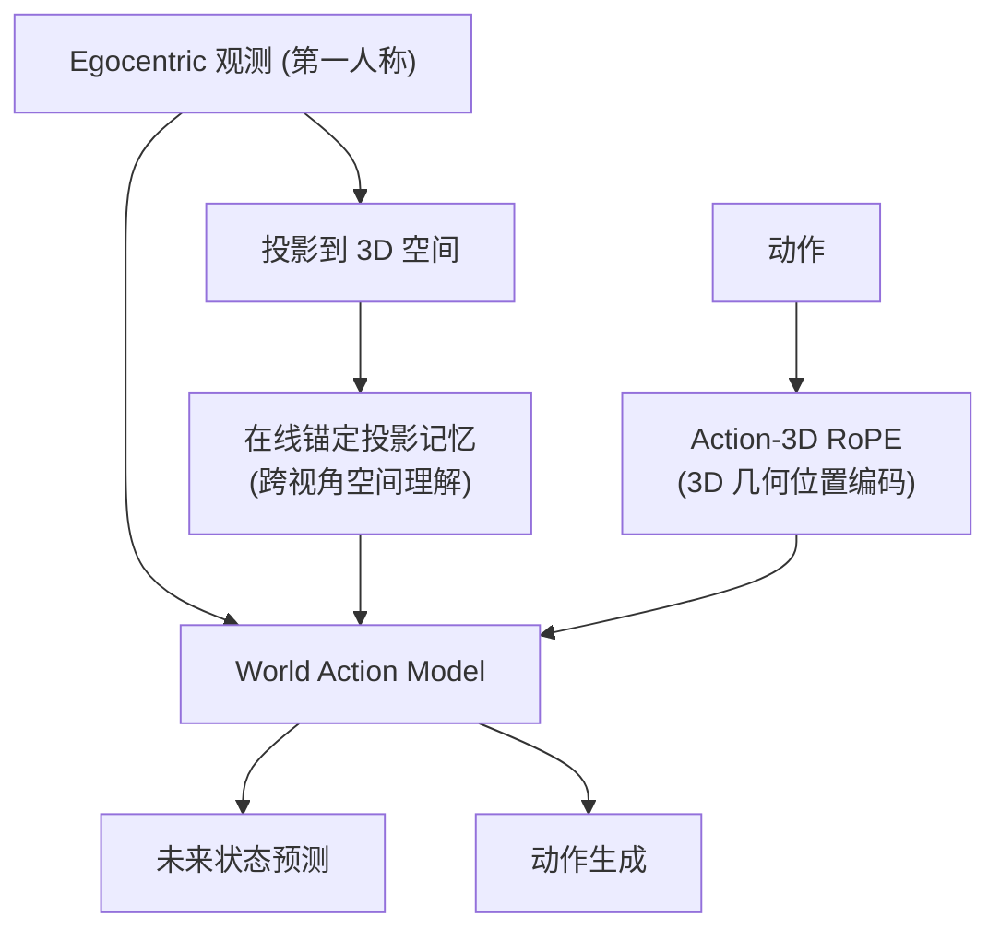

# EgoGenesis: Egocentric World-Action Modeling with Online Anchored Projective Memory and Action-3D RoPE

- 本地 PDF：`papers/world-model/EgoGenesis_2607.28243.pdf`
- arXiv：https://arxiv.org/abs/2607.28243
- 年份：2026（7 月）
- 团队：多机构（Zexuan Yan, Yuzhou Wu, Yue Ma 等）
- 阶段：第一人称世界动作模型 — 在线锚定投影记忆 + Action-3D RoPE

## 一句话总结

EgoGenesis 是第一人称 (egocentric) 视角的 World Action Model：用**在线锚定投影记忆**（online anchored projective memory）维护跨视角的空间记忆，用 **Action-3D RoPE** 在位置编码中注入动作的 3D 几何信息。解决了 egocentric WAM 的两个核心问题：(1) 第一人称视角视野有限——需要记忆补全"看不到"的空间；(2) 动作与 3D 空间的几何对齐——动作需要在 3D 坐标中建模。

## 核心技术

1. **在线锚定投影记忆** — egocentric 观测的视野有限，用锚定的投影记忆维护完整空间理解——"记住了身后有什么"
2. **Action-3D RoPE** — 在旋转位置编码中注入动作的 3D 几何信息，使动作与空间位置对齐
3. **WAM 框架** — 联合预测未来状态 + 动作，第一人称视角
4. **锚定 (Anchored)** — 与 TacWAM 的 anchor 类似，用关键锚点组织记忆

## 底层原理与数学推导

**核心问题**：egocentric 视角像"戴着 VR 头显"——只能看到前方，看不到身后。传统 WAM 只处理当前帧，丢失了空间上下文。EgoGenesis 的投影记忆把每帧观测投影到 3D 空间累积，让模型"记得"看到过的所有空间位置。

**Action-3D RoPE**：动作不仅要"做什么"，还要"在哪里做"——RoPE 注入 3D 坐标，使动作 token 与空间位置几何对齐。

## 物理直觉解释

**为什么需要投影记忆？** 想象你在房间里操作——你看到柜子在前方，但转身后它就"消失"了。纯 egocentric WAM 会"忘记"柜子存在，导致操作中断。EgoGenesis 的投影记忆像"游戏里的小地图"——每帧观测投影到 3D 地图累积，转身后依然知道柜子在哪。

**Action-3D RoPE 的直觉**：动作"伸手向右"需要在 3D 空间中定义方向——RoPE 给动作 token 注入 3D 坐标，让"向右"有明确的几何含义，而不是相对图像的模糊方向。

## 工程细节与实操指南

- 投影记忆：egocentric RGB → 3D 空间投影 → 累积记忆
- 锚定：关键空间锚点组织记忆结构
- Action-3D RoPE：动作 token 的旋转位置编码注入 3D 坐标
- WAM：视频-动作联合预测

## 消融实验与分析

| 消融/对比 | 结论 |
|---------|------|
| 投影记忆 on/off | 长程移动操作成功率显著提升——空间记忆是 egocentric 的关键 |
| Action-3D RoPE on/off | 动作-空间对齐改善——动作精度提升 |
| vs 无记忆 WAM | EgoGenesis 在需要空间推理的任务上领先 |

## 技术权衡（Trade-off）

| 优势 | 劣势与工程代价 |
|------|----------------|
| egocentric 视野补全（投影记忆） | 3D 投影依赖深度估计精度 |
| 动作-3D 几何对齐 | RoPE 注入增加计算 |
| 直接适配第一人称部署（穿戴设备） | 记忆累积的存储/检索开销 |

## 技术价值与演进定位

EgoGenesis 是 WAM 在 egocentric 场景的关键扩展——和 SERF（4D 空间地图）、EchoVLA（场景记忆）在"空间记忆"主题上形成家族。区别：EgoGenesis 把空间记忆融入 WAM 本身（投影记忆作为模型组件），而非外挂模块。这直接服务第一人称部署场景（穿戴设备、机器人头戴相机）。

## 与其他论文的关系

- **SERF** — 4D 神经点云空间地图；EgoGenesis 用投影记忆（更轻量）
- **EchoVLA** — 场景记忆 + 情景记忆；EgoGenesis 专注 egocentric 投影
- **TacWAM** — 同为 2026.07 的 WAM 增强（触觉 vs 空间记忆）
- **DreamZero / WorldVLA** — 无空间记忆的 WAM 代表

## 精读问题

1. 投影记忆的 3D 投影误差——深度估计不准时记忆如何退化？
2. 锚定的选择——空间锚点 vs 时间锚点（TacWAM）的异同？
3. Action-3D RoPE 与 View-Invariant Policy 的 Plücker Ray 编码的对比？
4. egocentric 观测的视角切换（转头）——记忆如何保持一致性？
