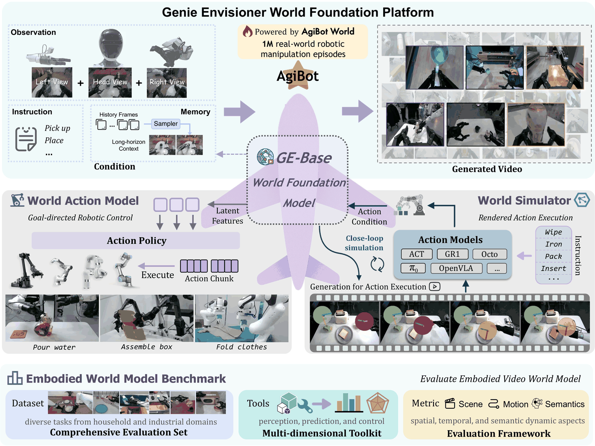
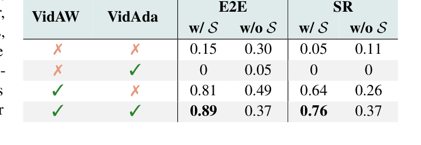
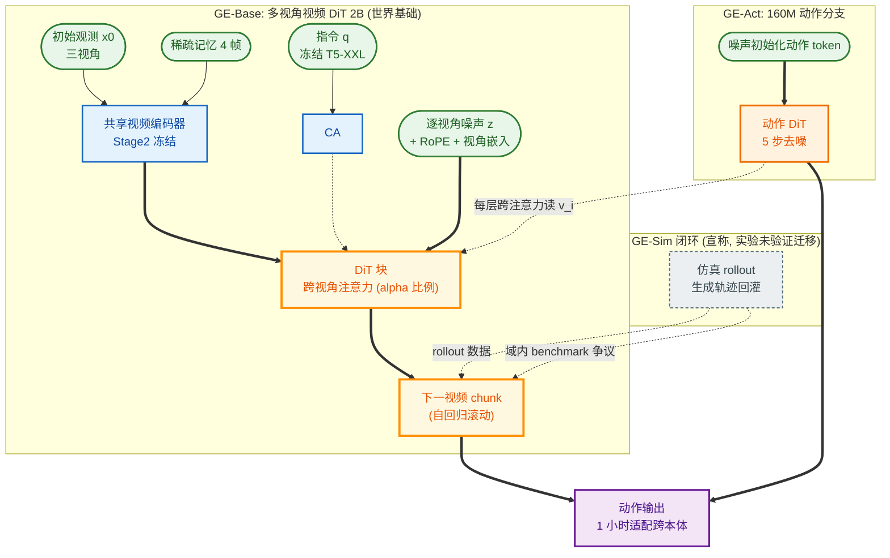

# Genie Envisioner: A Unified World Foundation Platform for Robotics

- arXiv: https://arxiv.org/abs/2508.05635
- Source: arXiv v3（2025-11-04 更新；会议归属未标注）
- Project: https://genie-envisioner.github.io
- Local PDF: `papers/world-model/GenieEnvisioner_2508.05635.pdf`
- Year: 2025
- Category: company world foundation model (AgiBot)
- Priority: high

## 一句话总结

机器人策略学习、评测、仿真被割裂在三套基建上（Problem），主流 VLA 走语言中心表征、丢失时空细节且真机评测慢贵（Bottleneck）；Genie Envisioner 主张「视频生成空间就是机器人的统一视觉空间」：GE-Base 多视角视频扩散世界模型在 AgiBot-World-Beta 约 1M 轨迹 / 2,967 小时上预训练，向下派生 GE-Act（160M 流匹配动作解码器，共享 DiT 骨干）与 GE-Sim（动作条件视频仿真器）+ EWMBench 基准（Insight/Mechanism）；证据：GE-Act 在 RTX 4090 上 200 ms 出 54 步 @30 Hz 动作，1 小时（250 条）遥操作数据迁移到未见过的 Agilex Cobot Magic / Dual Franka 平台并在叠衣叠盒上胜过 π0 / GR00T N1 / UniVLA，消融显示 GE-Base 预训练把 E2E 从 0.15-0.30（从头训）拉到 0.89（Evidence）。

## 九问速览

1. **Problem**：策略学习、评测、仿真各建各的基建，迭代慢、失败模式被掩盖、难复现。
2. **Bottleneck**：VLA 语言中心表征丢时空细节；物理仿真需手工建模；真机评测慢且贵。
3. **Insight**：一个视频生成世界模型可同时当「表征底座、动作教师、神经仿真器」三用。
4. **Method**：GE-Base（多视角视频 DiT）+ GE-Act（并行流匹配动作分支）+ GE-Sim（动作条件生成）+ EWMBench。
5. **Evidence**：1M 轨迹/2967h 预训练；200ms/54 步@4090；跨本体 1h 数据超 π0；预训练消融 E2E 0→0.89。
6. **Ablation**：无 GE-Base 初始化近乎 0 分；+任务视频适配 0.81→0.89；本体状态输入域内加分、通用模型上反降（捷径学习）。
7. **Assumption**：视频预测能力可迁移为控制表征；单平台（AgiBot）数据足以支撑跨本体迁移。
8. **Failure**：RoboTwin lift pot 落后于单任务基线（联合训练干扰）；评测仍靠代理指标（自认局限）。
9. **Opportunity**：GE-Sim 作数据引擎（同动作换背景出多样数据）；视频仿真替代物理引擎做闭环评测。

| 维度 | 论文答案 |
|---|---|
| Perception | 三视角同步 RGB（头 + 双腕）+ 稀疏记忆帧（4 帧历史）跨 chunk 提供长时程上下文（Sec 2.1） |
| Closed-loop | 视频分支 5 Hz、动作分支 30 Hz 异步闭环；视频 DiT 单步去噪缓存隐特征，动作 DiT 5 步去噪出 54 步 |
| Correction | 无显式纠错；记忆机制支撑「盒盖合上后凭内部记忆选章」类状态跟踪任务（Fig. 2） |
| Deployment | AgiBot G1 自家部署评测；跨本体（Cobot Magic/Dual Franka）需 250 条 ≈1h 遥操作微调；代码/模型/基准「将」开源（v3 仍为将来时态） |

## 核心技术

信息流：指令 q（冻结 T5-XXL 编码）+ 初始观测 x0 + 稀疏记忆 x̂（历史帧稀疏采样）→ 共享视频编码器 E 出三视角隐 token（+2D RoPE 位置 + 可学习视角嵌入）→ DiT 骨干自回归生成下一多视角视频 chunk → （GE-Act 路径）动作分支经 cross-attention 读视觉隐特征、流匹配去噪出动作 chunk；（GE-Sim 路径）动作条件反向注入生成视频。

*论文 Figure 1（p2）：Figure 1: Overview of the Genie Envisioner World Foundation Platform. Genie Envisioner is a unified*

- **GE-Base**：底座选 LTX-Video 2B（快，供 GE-Act）与 COSMOS2 2B（高保真，供 GE-Sim）。跨视角注意力把空间自注意扩到 (N,H,W)（N=视角数），**稀疏插入于部分 DiT 块（α 比例），其余块把 N 折进 batch**——视图一致性与算力的折中。
- **预训练两阶段**：Stage I GE-Base-MR（57 帧、3-30 Hz 随机帧率 + 4 记忆帧 → 8 帧隐空间去噪；32×A100×约 7 天）；Stage II GE-Base-LF（9 帧 @5 Hz + 4 记忆帧 → 2 帧隐空间；视频编码器冻结；32×A100×约 3 天）。**视频 VAE 编码器/解码器全程冻结**，训练中记忆帧随机采样当数据增强。
- **GE-Act**：160M 动作 DiT，与 GE-Base 同深度、降隐维；动作预训练时世界模型冻结（GE-Base-LF 初始化）、关闭视频生成、仅以 4 帧 @5Hz 记忆为条件，监督只有 GT 动作轨迹（54 步 @30 Hz）；16×A100×约 3 天。任务适配两步：视频适配（只更新视频生成组件；全量 AgiBot 语料 + 任务子集 ×10 上采样；8×A100×约 12h）→ 动作特化（全模型含骨干；8×A100×约 36h）。**部署时不生成视频，纯隐空间推理**。
- **GE-Sim**：从 GE-Base-MR 初始化，GT 动作作条件、flow-matching 损失训练，**训练语料混入失败案例**（错误执行/不完整/次优轨迹）；冻结 CLIP 图像编码器作风格锚。分层动作条件化：Pose2Image（末端位姿经相机内外参投影成与场景对齐的位姿图，与历史帧编码后逐元素相加融合）+ 运动增量（相邻位姿差经可学习编码器、与风格 token 拼接经 cross-attention 注入每个 DiT 块）。
- **EWMBench**：10 个任务（与 1M 预训练任务不相交）、每任务 4-10 个原子子动作 + 步骤级描述、每任务 100 条视频；轨迹去重用 3D IoU 贪心选择。

## 底层原理与数学推导

**(1) 自回归视频 chunk 生成（GE-Base 统一目标）**：

$$
x^{(t)}_{1:N} = W\!\left(\hat{x}_{0:t-1},\, x_0,\, q\right), \qquad \hat{x}_t = W\!\left(\left\{v^{(i)}_0,\, v^{(i)}_{\hat{t}},\, z^{(i)}\right\}_{i\in\{h,l,r\}},\, T(q)\right)
$$

$x_0$ 初始观测、$\hat{x}_{0:t-1}$ 稀疏记忆、$q$ 指令、$z^{(i)}$ 各视角噪声图。视频 DiT 以流匹配/扩散去噪实现该条件分布——**「预测下一 chunk」即世界模型的隐式定义**，记忆机制把长时程依赖塞进同一条件式。

**(2) GE-Act 双分支逐块耦合**：

$$
v_i = B^{\mathrm{vis}}_i\!\left(v_{\mathrm{in}},\, T(q)\right), \qquad a_i = B^{\mathrm{act}}_i\!\left(z_{\mathrm{act}},\, \mathrm{CrossAttn}\!\left(z_{\mathrm{act}},\, v_i\right)\right)
$$

动作 token 每层经 cross-attention 读视觉分支同层特征——动作分支是「搭在视频骨干上的轻量乘客」，160M 参数即可继承 2B 世界模型的时空先验。动作头为流匹配解码（论文称 flow-matching loss，未给显式公式；标准整流流形式如下，细节待确认）：

$$
\mathcal{L}_{\mathrm{act}} = \mathbb{E}_{t,\, a_1 \sim p_{\mathrm{data}},\, a_0 \sim \mathcal{N}(0,I)} \left\| v_\theta\!\left(a_t, t\right) - \left(a_1 - a_0\right) \right\|_2^2, \qquad a_t = (1-t)\, a_0 + t\, a_1
$$

**(3) GE-Sim 分层动作条件化**（论文编号式 (1)(2)）：

$$
v_i = E(I_i) + E(P_i), \qquad \Delta a_i = a_i - a_{i-1} = [\Delta p_i, \Delta r_i]
$$

$P_i$ 为位姿投影图（位置→像素坐标、姿态→旋转轴投影、夹爪开度→明暗圆盘、双臂颜色区分）；$\Delta a_i$ 经可学习编码器成运动 token。**绝对位姿走空间通道（与图像逐元素融合）、增量运动走时序通道（cross-attention）**——语义鸿沟（低层控制 vs 高层隐表征）被拆成两种互补注入方式。

**(4) EWMBench 动态一致性指标**（论文给出完整公式）：

$$
\mathrm{DYN}_{\mathrm{score}} = \alpha \cdot \frac{\min(\Delta v_{gt}, \Delta v_{pred}) + \epsilon}{\max(\Delta v_{gt}, \Delta v_{pred}) + \epsilon} \cdot \frac{1}{W(v)} + \beta \cdot \frac{\min(\Delta a_{gt}, \Delta a_{pred}) + \epsilon}{\max(\Delta a_{gt}, \Delta a_{pred}) + \epsilon} \cdot \frac{1}{W(a)}
$$

$\epsilon = 10^{-8}$，$\alpha = 0.007$，$\beta = 0.003$；$W(\cdot)$ 为速度/加速度分布的 Wasserstein 距离，幅值比项防止低动态情形发散。配合 $\mathrm{SA}_{\mathrm{score}} = 1/(d_{\mathrm{symH}}(G,P)+\epsilon)$ 与 $\mathrm{TA}_{\mathrm{score}} = 1/(d_{\mathrm{NDTW}}(G,P)+\epsilon)$（EEF 检测器重建轨迹后比对真值）。

## 物理直觉解释

**GE-Base 是「先在脑内放一遍电影」**。人在抓杯子之前，大脑已经预演了手伸过去、杯子被握住提起的整段画面——这就是世界模型。GE-Base 把这个预演机制做成了可训练的生成模型：给它当前画面和「把瓶子放进桶里」的指令，它在隐空间里自回归地「想象」出接下来三路相机各会看到什么。**记忆帧机制就像给导演一本前情提要**：只保留几个关键历史画面，既不会遗忘两分钟前盒子被合上了（状态跟踪），又不用拖着全部历史胶片（算力）。相机位姿和外观随机化的多视角训练，则像让摄影师从三个机位同时拍同一部片子——任何一个机位画错了（比如左手机不见了），跨视角注意力立刻穿帮。

**GE-Act 是「演员不看电影、只看导演笔记」**。部署时 GE-Act 完全不生成视频——动作分支每层通过 cross-attention 偷看视频分支同层的「思考过程」，把 2B 世界模型的时空直觉蒸馏进 160M 的小脑袋，再自己补出高频控制。**这是「慢思考读谱、快手指弹琴」的双系统结构**：视频 DiT 5 Hz 慢慢想（一步去噪出隐特征并缓存），动作 DiT 30 Hz 快速弹（五步去噪出 54 步动作），200 ms 内完成——两个频率解耦后，视频分支不必逐帧渲染，算力省在「只想象选定帧」。表 1 消融证实：没有这个世界模型底座，同样的动作头从头训练 E2E 只有 0.15-0.30，有底座直接 0.81——**想象能力确实迁移成了执行能力**。

**GE-Sim 是「用录像机当物理引擎」**。传统仿真器（MuJoCo/Isaac）要求先手工建模世界再模拟；GE-Sim 反过来：给一段真实动作序列，它「拍」出这个世界本会长成的样子。分层注入的物理直觉是：绝对位姿像**木偶戏的提线**——把末端位置直接画在画面对应像素上（Pose2Image），模型一眼看懂「手该在哪」；运动增量像**配乐的节拍**——只告诉模型每个时刻动了多少，让它自己脑补连贯动画。因为训练时混入了失败轨迹（错误执行、半途而废、次优动作），它模拟的不只是理想世界，还有「机器人搞砸了会怎样」——这正是评测策略鲁棒性所需的另一半现实。同一动作换不同初始背景即可量产变体数据，**把「造数据」从搭场景变成换背景**。

## 工程细节与实操指南

- **数据管线**：AgiBot-World-Beta（约 1M 轨迹 / 2,967h 真机遥操作双臂数据）→ 抽取三相机时间同步视频流 + 指令语义对齐 → 文本-视频对；Stage I 用 3-30 Hz 随机帧率（对传感器延迟/丢帧/异步的鲁棒性），Stage II 固定 5 Hz 对齐控制时间粒度。
- **算力账单**（全部 A100）：GE-Base-MR 32 卡×7 天；GE-Base-LF 32 卡×3 天；GE-Act 预训练 16 卡×3 天；任务适配 8 卡×12h（视频）+ 8 卡×36h（动作+骨干）。机载推理 RTX 4090。
- **跨本体适配配方**：①视频 DiT 用 ~250 条（1h）新平台指令-视频微调（CLIP/视频编码器冻结）；②动作 DiT 从零重训（本体动作空间语义不同，预训练动作头不复用）——**所以「1 小时迁移」的成本要加上 8 卡×数十小时的适配训练**。
- **部署硬件**：AgiBot G1（轮式双臂人形）；Agilex Cobot Magic（ALOHA 式遥操作采集）；Dual Franka（无专用遥操作接口，用 space-mouse）；RoboTwin 仿真。
- **EWMBench 工具链**：DINOv2 在机器人数据上微调做场景一致性；训练 EEF 检测器重建轨迹；Qwen2.5-VL-7B 做全局/关键步语义打分 + GPT 定义逻辑错误分类学；多样性 = 1 − CLIP 相似度。基准与人类偏好排序一致性优于 VBench（Fig. 18，4 个模型上验证）。
- **复现风险**：v3 全文对代码/模型/基准均为「upon publication 将开源」的将来时；GE-Base 底座（LTX-Video 2B / COSMOS2 2B）与 AgiBot 数据的可获得性决定可复现性。

## 实验协议清单

| 项目 | 论文设置 | 来源与备注 |
|---|---|---|
| 观测 | 三视角 RGB（头/左腕/右腕）+ 4 帧稀疏记忆；视觉 5 Hz | Sec 2.1/2.2 |
| 动作空间 | 双臂每步 7 维 [x,y,z,r,p,y,夹爪开度] 拼接 14 维（GE-Sim 条件定义）；G1 为 14-DoF 轮式人形 | Sec 5.1 / Fig.6 |
| 控制频率 | 动作输出 30 Hz（54 步 chunk / 200 ms） | Sec 3.3 |
| 重规划频率 | 视频 DiT 5 Hz / 动作 30 Hz 异步（1:6） | Sec 3.3 |
| 动作 horizon | 54 步动作 chunk；视频 chunk 9 帧@5Hz→2 隐帧 | Sec 3.2/3.3 |
| 数据 | AgiBot-World-Beta ≈1M 轨迹 / 2,967h（遥操作）；任务适配加入任务子集 ×10 上采样 | Sec 2.2 / 3.2 |
| 奖励 | 无（流匹配模仿学习）；GE-Sim 无奖励 | 全文 |
| Reset | 未报告 | — |
| 成功定义 | SR=子步骤成功数/总子步骤；E2E=最终任务结果（允许子步骤多次尝试） | Sec 3.4 |
| 评估次数 | 未报告（Fig. 8/11 为柱状图，正文无数值；消融任务 305 条示范、40k 步同协议训练） | Sec 3.4 / Table 1 |
| 随机种子 | 未报告 | — |
| 扰动测试 | 未系统报告；传送带动态物体抓取算动态性检验 | Sec 3.4 |
| 真机 | AgiBot G1（5 任务：三明治/倒茶/擦桌/微波炉加热/传送带装洗涤剂）；Agilex Cobot Magic（叠衣/叠盒）；Dual Franka（叠衣）；全部公司与合作者自评 | Sec 3.4 / Sec 4 |
| 算力 | 预训练 32×A100×(7+3)天；GE-Act 16×A100×3天；适配 8×A100×(12h+36h)；机载 RTX 4090 | Sec 2.2/3.2/3.3 |
| 特权信息 | GE-Sim 训练用 GT 动作与真值轨迹条件（数据特权）；闭环评测中策略无特权；机器人状态输入为消融变量（w/ S） | Sec 5.2 / Table 1 |

**附录陷阱自查**：
- privileged 信息：GE-Sim 以 GT 动作轨迹为条件生成视频（天然「动作→视频」对齐优势）；EWMBench 轨迹指标用人工标注参考轨迹 + EEF 检测器（检测器误差未量化）
- reward shaping：不适用（无 RL）；但 E2E 允许子步骤重试，比单次通过的成功定义宽松
- reset 难度：未报告评测是否每 trial 重置、允许几次重试
- eval budget：真机评测次数未报告（图无数值文本层），消融任务样本 305 条示范偏小
- 底层控制栈：G1 执行端（位置/阻抗、夹爪接口）未报告；GE-Sim 生成分辨率与延迟未给出实时性指标
- 数据优势：**核心陷阱**——GE-Act 在 AgiBot 数据上预训练、在 AgiBot 任务/平台上评测（π0/GR00T/UniVLA 未见得获得同等域内数据）；EWMBench 任务取自 AgiBot-World-Beta 测试集（与 GE-Base 训练同分布），对比 Kling/Hailuo 等通用视频模型是「域内考生 vs 域外考生」；「闭环仿真训练策略」的声明只有 rollout 评测证据、未展示在 GE-Sim 中训练再迁移真机的策略；「每小时数千 episode」吞吐无实测数字

（事实优先从 PDF 附录提取；查不到写「未报告」，严禁编造）

## 消融实验与分析

*论文 Table 1（p12）：Table 1: Analysis of Pre-training. ‘S’ denotes inclusion of*

| 消融 | 设置 | E2E (w/ S) | SR (w/ S) | 结论 |
|---|---|---|---|---|
| 预训练来源（Table 1，抓红圆柱入纸杯，305 示范，40k 步） | 从头训练（无 VidAW/VidAda） | 0.15 | 0.05 | 无世界模型底座几乎不可用 |
| 同上 | 仅任务级视频适配（通用 LTX 初始化） | 0 | 0 | 通用视频模型直接适配 ≈ 0 分（「near-zero」正文口径） |
| 同上 | 仅 GE-Base 初始化（VidAW，域内预训练） | 0.81 | 0.64 | 域内视频预训练是主要增益源 |
| 同上 | VidAW + VidAda（+任务视频适配） | **0.89** | **0.76** | 两级视频知识叠加最优 |
| 本体状态输入 | w/ S vs w/o S（域内预训练行） | 0.81 vs 0.49 | 0.64 vs 0.26 | 状态输入域内大加分 |
| 本体状态输入 | w/ S vs w/o S（通用视频模型行） | 0 vs 0.05 | 0 vs 0 | 通用模型上状态反而引发**捷径学习**降分 |
| GE-Sim 底座（Table 2） | LTX vs COSMOS2 | PSNR 19.9 vs 20.7；DYN 0.78 vs 0.85；SA 0.94 vs 0.87 | BLEU 0.33 vs 0.31 | COSMOS2 动态一致性/保真更高，LTX 空间对齐略优 |

核心结论：**增益几乎全部来自「域内视频世界模型预训练」而非动作头设计**；通用视频预训练必须先经域内适配才可用；状态输入是否加分取决于表征是否已对齐。

## 技术权衡（Trade-off）

| 优势 | 劣势与工程代价 |
|------|---------------|
| 单一视频骨干统一策略/评测/仿真，表征复用率高 | 「统一」= 共享底座 + 三个分别训练/微调的头，非端到端一个模型 |
| GE-Act 160M 头 + 隐空间推理，200ms/54 步可机载实时 | 视频分支训练昂贵（32×A100×10 天）；2B 底座机载显存/功耗未报告 |
| 1h 数据跨本体迁移（Cobot Magic/Dual Franka）胜 π0/GR00T/UniVLA | 跨本体动作头需从零重训 + 8 卡数十小时适配，「1 小时」只指数据量 |
| GE-Sim 免物理建模、混入失败轨迹、可作数据引擎 | 视频仿真无物理保证（穿透/力学错误不惩罚，仅靠逻辑错误检测代理指标） |
| EWMBench 首个具身世界模型多维基准，与人类偏好对齐优于 VBench | 基准由同团队自建、任务同源于训练数据分布；人类一致性验证只覆盖 4 个模型 |
| 多视角生成 + 稀疏记忆支撑长时程/记忆任务 | 仅上半身桌面 + 平行夹爪（自认局限）；灵巧手/全身运动未覆盖 |

## 技术价值与演进定位

Genie Envisioner 是「视频世界模型即平台」立场最完整的公司级实现：把 UniPi 以降「视频即策略」的思想推进为「视频即策略 + 视频即仿真 + 视频即评测」的三位一体。其真正的增量贡献排序：①GE-Act 的「动作分支搭视频骨干 + 频率解耦异步推理」工程设计（200ms/54 步是同类中明确的实时性数字）；②首次系统证明域内视频预训练对动作学习的迁移价值（0→0.89）；③EWMBench 把世界模型评测从 FVD 拉到「场景-运动-语义」任务相关维度。相对短板：GE-Sim 的闭环训练用途只有演示没有实验；所有评测自建自测。它是智元「数据（AgiBot World）→ 策略（GO-1）→ 世界模型（GE）」三步走的收官层，代表 2025 年公司系「生成式世界模型路线」对「VLA 语言中心路线」的正面对赌。

## 与其他论文的关系

| 库内笔记 | 关系 |
|---|---|
| `notes/world-model/unipi.md` | 思想源头：UniPi「视频即策略」（生成视频→逆动力学提动作）；GE-Act 把两步管线内化为一个隐空间端到端前向，省掉显式视频生成与逆动力学 |
| `notes/world-model/gr-mg.md` | 目标条件路线对照：GR-MG 生成「目标图」子目标 + GPT 式策略执行；GE 预测「未来视频过程」而非单帧目标——静态目标 vs 动态过程两种子目标表征 |
| `notes/world-model/worldvla.md` | 统一路线的两种做法：WorldVLA 把动作模型与世界模型塞进同一离散自回归骨干互为正则（动作 mask 防误差累积）；GE 让动作分支以乘客身份搭视频 DiT——对称共训 vs 主从分层 |
| `notes/world-model/leworldmodel.md` | 生成式 vs 非生成式世界模型之争的两岸：LeWorldModel 用 JEPA 隐空间预测（15M 参数、两项损失、免生成开销）；GE 用 2B 视频扩散（可渲染、可仿真、可评测但贵）——「抽象预测够不够用」的直接对照 |
| `notes/data/agibot-world-go1.md` | 数据与策略底座：GE 全家桶预训练于 AgiBot-World-Beta（同 1M 轨迹）；GO-1（VLM+隐动作+扩散专家）与 GE-Act（视频 DiT+流匹配动作头）是智元对同一数据的两套榨取方式，RoboTwin 上 GE-Act 与 GO-1 直接同场（GE-Act 4 任务 3 胜） |
| `notes/architecture/pi0.md` | 基线与结构近亲：GE-Act 的流匹配动作头同 π0 范式（flow matching + 骨干条件化），区别在 π0 条件于 VLM 语言表征、GE-Act 条件于视频生成表征；π0 亦是 G1/Cobot Magic/Franka 三处对照基线 |

## 精读问题

1. 开放产物缺什么：截至 v3（2025-11）代码/模型/EWMBench 仍全是「will be released」将来时——实际放出了什么？2B 底座与 2,967h 预训练数据第三方能否拿到？
2. GE-Sim 的核心卖点「闭环策略训练」为何只有 rollout 评测实验？在 GE-Sim 里训练的策略回到真机能保持几分？失败轨迹混入训练对仿真保真度的量化影响是多少？
3. Fig. 8 / Fig. 11 全部真机成功率只以柱状图呈现、正文无数值——π0/GR00T N1 的微调是否用了与 GE-Act 相同的 250 条数据与同等算力？UniVLA/GR00T「0%」是几个 trial 测出来的？
4. 「每小时数千 episode」的仿真吞吐没有实测数字；GE-Sim 单 episode 生成的 GPU 小时成本是多少？与 Isaac 级物理仿真（百万步/秒）对比的真实性价比？
5. 表 1 中通用视频模型 + 任务适配（VidAda only）为 0 分、从头训反而 0.15-0.30——「从头训 yield near-zero success」的正文表述与表格矛盾，如何解释？
6. 状态输入在通用视频表征上引发「捷径学习」——这是否意味着视频 DiT 与动作头之间缺一层本体对齐模块？跨本体时这层捷径风险如何规避？
7. EWMBench 上 Kling/Hailuo 是 API 黑盒还是开源权重？通用视频模型没有任何机器人微调就对比，是否只是验证了「域内微调有用」这一平凡结论？

