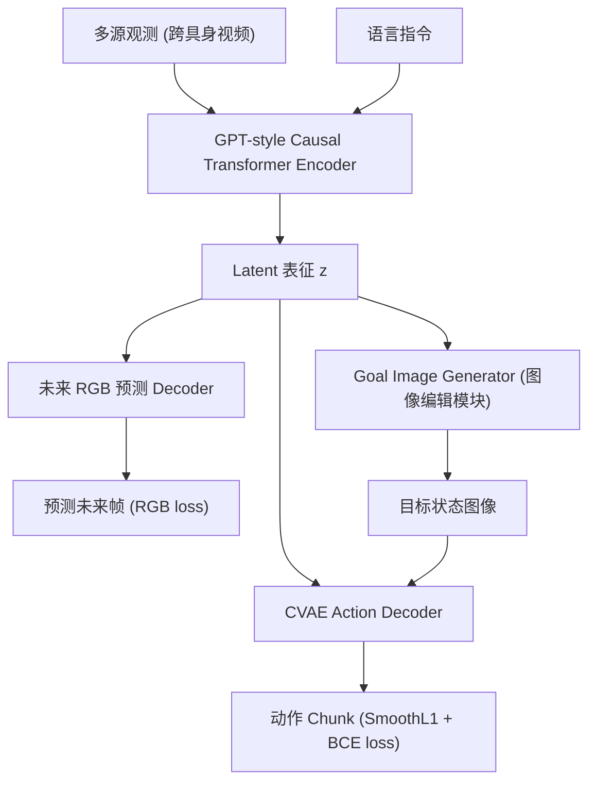

# GR-MG: Leveraging Partially-Annotated Data via Multi-Modal Goal Conditioned Policy

- 本地 PDF：`papers/world-model/GR-MG_2408.14368.pdf`
- arXiv：https://arxiv.org/abs/2408.14368
- 年份：2024
- 团队：HKU, Shanghai AI Lab (Peiyan Li, Hongtao Wu 等)
- 阶段：跨具身世界模型 —— 利用部分标注数据做多模态目标条件策略

## 一句话总结

GR-MG 是 GR-1 的增强版，通过未来 RGB 预测 + 目标图像生成 + 动作分块（action chunking），利用大规模部分标注的跨具身视频数据进行预训练，在 CALVIN 和 LIBERO 上达到 SOTA。

## 核心技术

1. **多模态目标条件策略** — 同时支持语言指令和目标图像作为条件
2. **未来 RGB 预测（世界模型）** — 预训练目标之一：从当前观测预测未来帧
3. **Goal Image Generation** — 基于图像编辑模块生成目标状态图像，引导策略执行
4. **CVAE 动作分块** — 继承 ACT 的 CVAE 编码器压缩真值动作，transformer decoder 输出动作 chunk

## 底层原理与数学推导

- **GPT-style causal transformer 骨干**，query-based 并行表征更新
- 在多源跨具身视频上预训练（类似 π0），利用未来 RGB 预测作为辅助自监督目标
- L = L_act (SmoothL1 + BCE) + L_future (RGB prediction) + L_goal (goal image)
- 是 3D Foresight 论文的基础架构（3D Foresight 在 GR-MG 上增加 3D 相关辅助任务）

## 物理直觉解释

GR-MG 的核心直觉：**看视频学操作，同时想象"做完是什么样"**。给模型看一大堆操作视频（不一定是同一个机器人、不一定有语言标注），模型同时学习三件事：(1) 从当前画面预测下一秒会怎样（世界模型），(2) 对于"把方块放到红色盘子里"这种目标，想象目标状态的画面（目标生成），(3) 从当前画面和目标画面之间，推断应该做什么动作（策略）。三者共享同一个视觉理解骨干，互相增强——会预测未来让模型更理解物体动力学，会想象目标让模型更有目的性。

## 工程细节与实操指南

- **GPT-style causal transformer** 骨干，query-based 并行表征更新
- **CVAE 动作分块**继承 ACT 设计：CVAE encoder 压缩真值动作到 latent，transformer decoder 从 latent + 条件输出动作 chunk
- **多源部分标注数据**：不同数据源有不同标注（有的有语言、有的有目标图像、有的只有视频），GR-MG 可以同时利用全部数据
- 推理延迟 **106ms**，可满足大多数操作场景实时性
- 预训练后 fine-tune 到特定任务/本体，类似 π0 的 co-training 策略

## 技术权衡（Trade-off）

| 优势 | 劣势与工程代价 |
|------|----------------|
| 三任务联合训练使视觉表征更通用 | 多 loss 平衡需精心调权，L_future 和 L_goal 可能与 L_act 冲突 |
| 可利用部分标注数据，数据利用率高 | CVAE encoder 压缩真值动作引入信息瓶颈 |
| 目标图像生成提供可解释的规划中间产物 | Goal image 质量波动直接影响下游动作精度 |
| 跨具身预训练带来数据规模优势 | 不同本体间的 visual distribution shift 影响特征对齐 |

## 实验

- CALVIN: D→D 3.84 Avg.Len., ABC→D 4.04 Avg.Len.
- LIBERO: 91.7% Average Success Rate
- 推理延迟：106ms

## 技术价值与演进定位

GR-MG 是连接"世界模型预训练"和"VLA 策略学习"的桥梁——用视频预测作为辅助目标增强策略的空间理解。它是 3D Foresight 的直接 baseline，代表了 2D 世界模型辅助策略的最高水平。

## 与其他论文的关系

- **GR-1** 是前身，仅做未来 RGB 预测
- **3D Foresight (聂强 lab)** 在 GR-MG 上添加 depth + 3D flow 辅助任务，是 GR-MG 的 3D 进化
- **π0 / π0.5** 用 flow matching 生成动作，GR-MG 用 CVAE + action chunking
- **Dreamer v3** 在 latent space 做想象，GR-MG 在图像 space 做未来预测

## 精读问题

1. 未来 RGB 预测作为辅助目标 vs 显式 3D 建模（3D Foresight）的准确 gap？
2. Goal image generation 的质量如何影响下游动作生成？
3. CVAE action chunking 与 flow matching 在连续动作精度上的比较？
