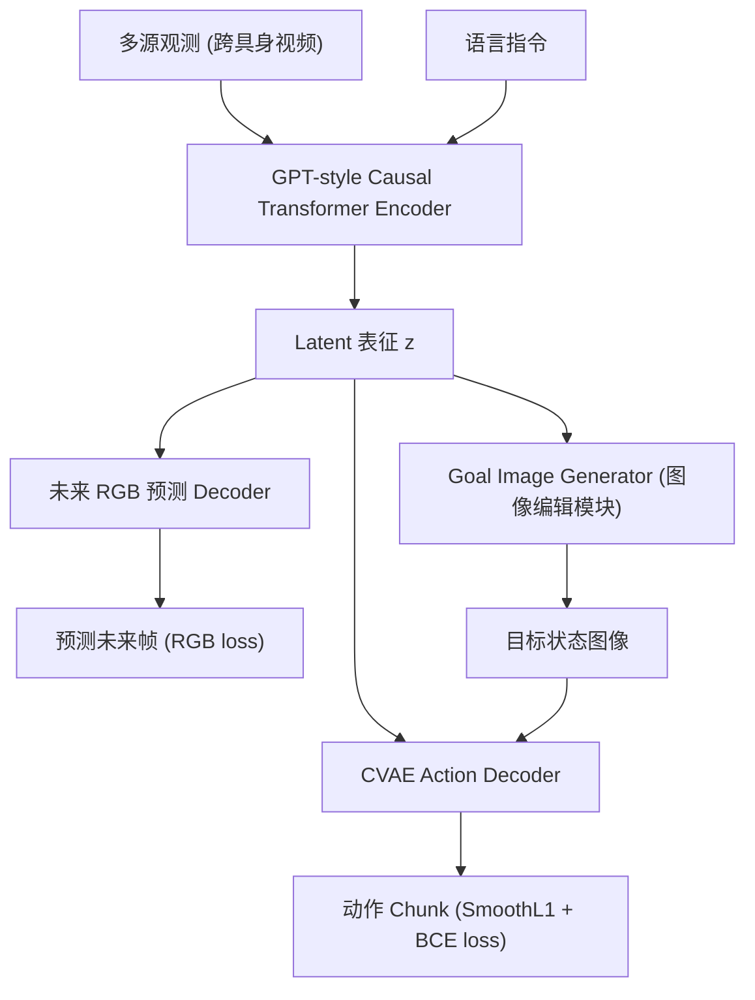

# GR-MG: Leveraging Partially-Annotated Data via Multi-Modal Goal Conditioned Policy

- 本地 PDF：`papers/world-model/GR-MG_2408.14368.pdf`
- arXiv：https://arxiv.org/abs/2408.14368
- 年份：2024
- 团队：HKU, Shanghai AI Lab (Peiyan Li, Hongtao Wu 等)
- 阶段：跨具身世界模型 —— 利用部分标注数据做多模态目标条件策略

## 一句话总结

GR-MG 是 GR-1 的增强版，通过未来 RGB 预测 + progress-guided 目标图像生成 + 动作分块（action chunking），利用大规模部分标注（无动作标签/无文本标签）的跨具身视频数据预训练。CALVIN 零样本 5 连任务成功率 41.2%→64.4%，仅用 10% 全标注数据即达平均长度 3.11（超越用全部数据的 GR-1）；真实机器人 58 个任务、简单设置成功率 68.7%→78.1%。

## 核心技术

1. **多模态目标条件策略** — 同时支持语言指令和目标图像作为条件
2. **未来 RGB 预测（世界模型）** — 预训练目标之一：从当前观测预测未来帧
3. **Goal Image Generation** — 基于图像编辑模块生成目标状态图像，引导策略执行
4. **CVAE 动作分块** — 继承 ACT 的 CVAE 编码器压缩真值动作，transformer decoder 输出动作 chunk

## 底层原理与数学推导

- **GPT-style causal transformer 骨干**，query-based 并行表征更新
- 在多源跨具身视频上预训练（类似 π0），利用未来 RGB 预测作为辅助自监督目标
- L = L_act (SmoothL1 + BCE) + L_future (RGB prediction) + L_goal (goal image)
- 是 3D Foresight 论文的基础架构（3D Foresight 在 GR-MG 上增加 3D 相关辅助任务）

```mermaid
graph TD
    OBS["多源观测 (跨具身视频)"] --> ENC["GPT-style Causal Transformer Encoder"]
    ENC --> Z["Latent 表征 z"]
    LANG["语言指令"] --> ENC
    Z --> ACTDEC["CVAE Action Decoder"]
    Z --> FUTUREDEC["未来 RGB 预测 Decoder"]
    Z --> GOALDEC["Goal Image Generator (图像编辑模块)"]
    ACTDEC --> ACTCHUNK["动作 Chunk (SmoothL1 + BCE loss)"]
    FUTUREDEC --> FUTURE["预测未来帧 (RGB loss)"]
    GOALDEC --> GOAL["目标状态图像"]
    GOAL --> ACTDEC
```

## 物理直觉解释

**GR-MG 的核心直觉：看视频学操作，同时想象"做完是什么样"**。给模型看一大堆操作视频（不一定是同一个机器人、不一定有语言标注），模型同时学习三件事：(1) 从当前画面预测下一秒会怎样（未来 RGB 预测，世界模型）；(2) 对于"把方块放到红色盘子里"这种目标，想象目标状态的画面（目标图像生成）；(3) 从当前画面和目标画面之间，推断应该做什么动作（策略）。三者共享同一个 GPT-style 视觉骨干，互相增强——会预测未来让模型更理解物体动力学，会想象目标让模型更有目的性，CALVIN 上 5 连任务成功率 41.2%→64.4% 的提升正是三任务联合的量化收益。

**"任务进度"是目标图像生成的点睛之笔**。盲目的目标生成模型可能画出"看起来合理但物理上不可行的目标"（比如直接画出手已经抓住物体的画面，却跳过了手臂移动的中间过程）。GR-MG 把策略预测的任务进度（0-100%，离散成 10 个 bin）注入扩散式图像编辑模型：进度 20% 时生成的目标是"手正在靠近"，进度 90% 时才是"手已就位"。这就像导航时告诉司机"还差两个路口"而不是只给终点照片——目标图像越贴近真实可达状态，下游策略的动作越准确，模型在目标图像生成不准时也依然能靠语言条件兜底。

**"部分标注数据"是 GR-MG 的数据杠杆**。机器人领域最贵的标签是动作标签，其次才是文本。GR-MG 的设计让每一类数据各得其所：无动作标签的人类活动视频（如 Ego4D）用来训练目标图像生成模型；无文本标签的机器人轨迹用 hindsight goal relabeling 自动产生目标图像来训练策略。于是数据规模从"全标注轨迹"扩展到"海量部分标注视频"——仅用 10% 的 CALVIN 全标注数据（3.11 平均长度）就能超过用 100% 数据的 GR-1，这就是"把数据稀缺问题变成标注工程问题"的典型示范。

## 工程细节与实操指南

- **GPT-style causal transformer** 骨干，query-based 并行表征更新
- **CVAE 动作分块**继承 ACT 设计：CVAE encoder 压缩真值动作到 latent，transformer decoder 从 latent + 条件输出动作 chunk
- **多源部分标注数据**：无动作标签的文本标注人类活动视频（Ego4D 等）训练目标图像生成模型；无文本标签的机器人轨迹经 hindsight goal relabeling 训练策略；全标注轨迹同时训练两模块
- **Progress-guided 目标生成**：策略预测的任务进度（0-100% 离散为 10 bin）注入 InstructPix2Pix 式图像编辑模型
- **推理流程**：任务进度初始化为 0 → 目标图像生成模型从当前观测 + 文本指令 + 进度生成目标图 → 多模态目标条件策略（文本 + 目标图 + 观测序列 + 机器人状态）预测动作
- **初始化**：策略权重继承 Ego4D 上生成式视频预训练的模型权重（与 GR-1 对齐）

## 消融实验与分析

| 消融/对比维度 | 设置对比 | 关键指标 |
|---------|---------|---------|
| CALVIN 零样本（无额外部分标注数据） | GR-MG vs 最强 baseline | 1 连任务成功率 93.8%→96.8%；5 连任务 41.2%→64.4% |
| 部分标注数据利用率 | 10% 全标注 + 无文本标注数据 vs GR-1 用 100% 数据 | 平均长度 3.11 vs 3.04（超越用全部数据的 GR-1） |
| 仿真（ABC→D 设置） | GR-MG vs 基线 | 5 连平均完成任务数 3.35→4.04 |
| 真实机器人（简单设置） | GR-MG vs 基线 | 成功率 68.7%→78.1%（58 个任务） |
| 真实机器人（泛化设置） | GR-MG vs 基线 | 成功率 44.4%→60.6% |
| 新技能少样本学习 | GR-MG vs 对比基线 | 少样本 novel skill 学习全面超越 |
| 目标生成模块 | progress-guided vs 无进度条件的生成 | 进度条件显著提升目标图像精度与下游动作预测 |

**核心结论**：GR-MG 的验证证据链围绕"多模态目标条件 + 部分标注数据利用"展开——CALVIN 上 93.8%→96.8%（1 连）与 41.2%→64.4%（5 连）证明多模态目标条件策略相对纯语言条件的增益随任务长度放大；10% 数据（3.11）超越 GR-1 全数据（3.04）证明部分标注数据的利用机制是数据效率的核心来源；真实机器人简单/泛化设置（68.7%→78.1% / 44.4%→60.6%）与少样本 novel skill 实验把增益从仿真延伸到真实世界。progress-guided 目标生成则在组件层面证明"任务进度"这一条件对目标图像精度与下游动作的双重价值。

## 技术权衡（Trade-off）

| 优势 | 劣势与工程代价 |
|------|----------------|
| 三任务联合训练使视觉表征更通用 | 多 loss 平衡需精心调权，L_future 和 L_goal 可能与 L_act 冲突 |
| 可利用部分标注数据，数据利用率高 | CVAE encoder 压缩真值动作引入信息瓶颈 |
| 目标图像生成提供可解释的规划中间产物 | Goal image 质量波动直接影响下游动作精度 |
| 跨具身预训练带来数据规模优势 | 不同本体间的 visual distribution shift 影响特征对齐 |

## 实验

- CALVIN 零样本: 1 连任务 96.8%，5 连任务 64.4%（baseline 93.8%/41.2%）
- CALVIN 部分标注数据: 10% 全标注 + 无文本数据 → 平均长度 3.11（GR-1 全数据 3.04）
- 真实机器人: 58 个任务，简单 78.1%（基线 68.7%），泛化 60.6%（基线 44.4%）

## 技术价值与演进定位

GR-MG 是连接"世界模型预训练"和"VLA 策略学习"的桥梁——用视频预测作为辅助目标增强策略的空间理解。它是 3D Foresight 的直接 baseline，代表了 2D 世界模型辅助策略的最高水平。

## 与其他论文的关系

- **GR-1** 是前身，仅做未来 RGB 预测
- **3D Foresight (聂强 lab)** 在 GR-MG 上添加 depth + 3D flow 辅助任务，是 GR-MG 的 3D 进化
- **π0 / π0.5** 用 flow matching 生成动作，GR-MG 用 CVAE + action chunking
- **Dreamer v3** 在 latent space 做想象，GR-MG 在图像 space 做未来预测

## 精读问题

1. 未来 RGB 预测作为辅助目标 vs 显式 3D 建模（3D Foresight）的准确 gap？2D 世界模型的上限在哪？
2. Goal image generation 的质量如何影响下游动作生成？任务进度离散成 10 bin 的粒度与最优 bin 数的关系？
3. CVAE action chunking 与 flow matching 在连续动作精度上的比较？CVAE 的信息瓶颈在高频精细动作上是否成为短板？
4. 目标图像生成与策略训练"两模块独立训练"（论文明言）——联合训练能否进一步收益？生成目标与真值目标（hindsight relabeling）的分布偏移如何影响策略？
5. 部分标注数据的比例上限——数据中无文本/无动作标签占比多高时增益饱和或反噬？
