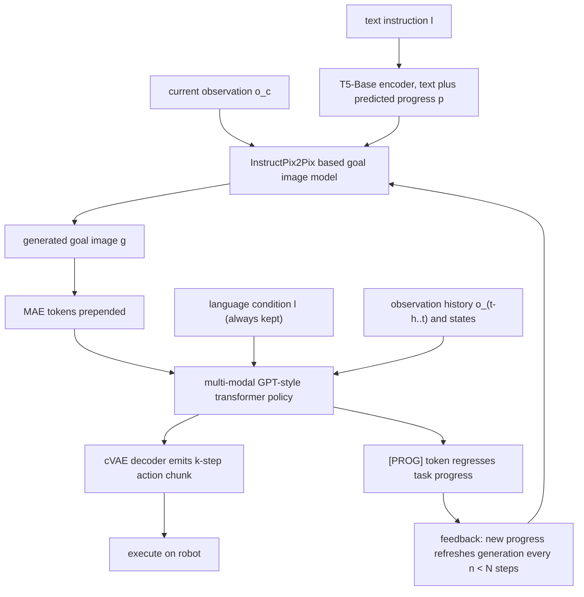

# GR-MG: Leveraging Partially-Annotated Data via Multi-Modal Goal-Conditioned Policy

- 本地 PDF：`papers/world-model/GR-MG_2408.14368.pdf`
- arXiv：https://arxiv.org/abs/2408.14368
- 项目主页：https://gr-mg.github.io/
- 年份：2024 (IEEE RA-L，2024 年 12 月接收)
- 团队：中科院自动化所 NLPR / MAIS 多模态人工智能系统全国重点实验室、中国科学院大学人工智能学院、ByteDance Research
- 阶段：「图像子目标生成」路线在 UniPi/SuSIE 之后的关键改进——语言 + 目标图双模态条件策略，并用任务进度条件校正子目标生成

## 一句话总结

GR-MG 由两个模块构成：一个把任务进度注入 InstructPix2Pix 式图像编辑的「progress-guided 目标图生成模型」，和一个同时条件于文本与目标图的 GPT-style transformer 策略（继承 GR-1 骨干，[PROG]/[OBS]/[ACT] 三类查询 token + ACT 式 cVAE 动作块解码）。这套设计让无动作标签的人类活动视频训练生成器、无文本标签的机器人轨迹经 hindsight relabeling 训练策略——两类便宜的部分标注数据全部吃下。CALVIN ABC→D 零样本：五连任务成功率 41.2%→64.4%、平均完成数 3.35→4.04；只用 10% 全标注数据仍达平均长度 3.11，超过用全量数据的 GR-1（3.06）；真机 58 个任务简单设置 68.7%→78.1%、四类泛化设置平均 44.4%→60.6%，少样本新技能 30-shot 37.5%。

## 核心技术

1. **多模态目标条件策略（核心创新点）** — 训练时从轨迹采帧当目标图，与文本一起做条件；推理时只有文本，就先用生成模型造一张子目标图再把两者都喂给策略。与 SuSIE 只依赖生成图的本质区别是：语言条件始终在线，生成的子图错了还有语义通道兜底。
2. **Progress-guided 目标图生成** — 把策略预测的任务进度（离散成 0-100% 共 10 个 bin）以句子后缀形式注入文本编码："pick up the red block. And {p}% of the instruction has been finished."；这解决了两个病：静态修图视角下观测歧义（来回移动的物体画面完全相同），以及生成模型不知道该画哪一步的状态。
3. **面向部分标注数据的分工设计** — 生成器只需要带文字的视频（人类活动视频可训），策略额外接受纯图像目标条件（无文字标签的机器人 play 数据可训）；[PROG] token 使推理时自产进度值形成闭环。
4. **GR-1 骨干的三个增量** — MAE tokenize 的目标图 token 前置到输入序列供全局 attend；新增 [PROG] 查询 token 回归进度；把单步动作输出升级为 cVAE 编码的动作轨迹块（k 步）。
5. **闭环低频刷新子图** — 训练时目标定义为当前帧往后 N 步的那一帧，推理时每执行 $n < N$ 步才重新生成一次子图，兼顾效率与跟踪。

## 底层原理与数学推导

### 问题形式化与两模块接口

策略输入文本指令 $\ell$、观测序列 $o_{t-h:t}$（静态相机 + 腕部相机）、机器人状态序列 $s_{t-h:t}$（6-DoF 末端位姿 + 二值夹爪），端到端输出动作轨迹：

$$
a_t = \pi\big(\ell,\ o_{t-h:t},\ s_{t-h:t}\big)
$$

目标图生成模型 $G_\theta$ 是一个以「当前观测 + 进度增强后的指令」为条件的扩散过程。训练时按 DDPM 噪声预测形式写成：

$$
\mathcal{L}_{gen}(\theta) = \mathbb{E}_{t,\ g_0,\ \epsilon}\Big[\big\|\epsilon - \epsilon_\theta\big(g_t,\ o_c,\ c(\ell, p),\ t\big)\big\|^2\Big],\qquad g_t = \sqrt{\bar{\alpha}_t}\,g_0 + \sqrt{1-\bar{\alpha}_t}\,\epsilon
$$

其中 $g_0$ 是从轨迹中采样、位于当前帧之后 $N$ 步的目标帧，$c(\ell,p)$ 表示经 T5-Base 编码的拼接句（指令原文加进度描述），$p$ 在送入前先量化为 10 个 bin。

### 策略侧：多模态条件的 GPT-style transformer

目标图经 MAE tokenizer 得到 token 序列并放在输入最前面，其后依次是指令、观测帧、状态序列；三组可学习查询 token 并入 Transformer 输出：

$$
\begin{aligned}
c_{goal} &= \mathrm{MAE}(g) \\\\
H_{ACT},\ H_{OBS},\ H_{PROG} &= \mathrm{Transformer}\big([\,c_{goal};\ \ell;\ o_{t-h:t};\ s_{t-h:t};\ q_{ACT};\ q_{OBS};\ q_{PROG}\,]\big)
\end{aligned}
$$

动作块用 cVAE 解码（ACT 同款思路）：真值动作轨迹先被编码成风格向量 $z$，再与 $[ACT]$ 嵌入及 $k$ 个可学习 token 联合解码出未来 $k$ 步动作；进度由 $[PROG]$ 嵌接过线性层回归出 $\hat{p}$：

$$
z = Enc_\psi\big(a^{gt}_{t:t+k}\big),\qquad \hat{a}_{t:t+k} = Dec_\psi\big(z,\ H_{ACT},\ e_1,\dots,e_k\big),\qquad \hat{p} = \mathrm{Linear}(H_{PROG})
$$

两模块的训练彼此独立（生成器用真值时间步算进度，策略用轨迹真值帧当目标图），论文明确将联合训练留作 future work。

```mermaid
graph TD
    TXT["text instruction l"] --> ENC["T5-Base encoder, text plus predicted progress p"]
    OBS["current observation o_c"] --> GEN["InstructPix2Pix based goal image model"]
    ENC --> GEN
    GEN --> GOAL["generated goal image g"]
    GOAL --> TOK["MAE tokens prepended"]
    TOK --> POL["multi-modal GPT-style transformer policy"]
    LANG["language condition l (always kept)"] --> POL
    OBSH["observation history o_(t-h..t) and states"] --> POL
    POL --> ACT["cVAE decoder emits k-step action chunk"]
    POL --> PROGT["[PROG] token regresses task progress"]
    PROGT --> LOOP["feedback: new progress refreshes generation every n < N steps"]
    LOOP --> GEN
    ACT --> ROBOT["execute on robot"]
```

## 物理直觉解释

**一份演示，两种消化方式**。机器人演示里最贵的标签是动作，其次是文字。GR-MG 的解法像食堂分餐：带文字的视频（哪怕是人的手，没有任何动作向量）交给生成器，让它学「这类指令执行到一半的世界长什么样」；不带文字的机器轨迹通过 hindsight 思路变成天然的目标图配对（任何后续帧都可作目标），交给策略学「从这个状态够到那个状态该怎么动」。全标注数据两边都吃。于是有效数据规模从「完整标注轨迹」扩大为「一切半成品」，仅 10% 标注数据就能超过 GR-1 吃满数据的成绩就是这套分工的直接回报。

**进度条件是给画师的分镜脚本**。没有进度的图像编辑器面对「pick up the red block」会自由发挥：这一秒画出物体已被举起，下一秒又画出手还悬在半空——因为静态编辑本身无法区分同一段指令的不同阶段（对来回搬运动作甚至像素级完全相同）。把「已完成了 60%」这句旁白写进 prompt 后，生成就有了分镜坐标系：早期子图显示靠近轨迹，后期才出现抓持状态。反过来的价值同样大：策略回归出的进度是它自己对世界状态的读数，把读数回灌给生成器，就构成了一个不需要外部状态估计的自我一致闭环。

**双模态条件等于给动作装了保险丝**。生成式子目标终究是采样产物，分布外场景下难免错得离谱。SuSIE 一旦子图错误便只能依赖低层策略的容错性兜底；GR-MG 让语言条件全程在场——两条信息通路里视觉负责精细的局部定位（Where），语言负责稳定的任务意图（What）。消融的两个单向变体 w/o text 与 w/o image 成绩几乎持平（3.46 vs 3.42 平均长度）而都比双条件差得多（4.04），定量地展示了单通道的脆弱与互补通道的增益。CALVIN 泛化实验中未见指令设置退化最小，同样归功于语言通路没有因为换成新说法就失效。

## 工程细节与实操指南

- **真机平台**：Kinova Gen-3 机械臂 + Robotiq 2F-85 平行夹爪，一路静态相机 + 一路末端相机；训练集 18k 条人示教覆盖 37 个任务（23 个抓放类 + 14 个倾倒/翻转/旋转等非抓放类），评测扩展到 58 个任务（37 见过 + 21 未见）。
- **五个评测梯度**：Simple（贴近训练场景）；Unseen Distractors（加未见过干扰物）；Unseen Instructions（GPT-4 生成同义动词替换，如 pick up→take、cap→cover、stack→pile）；Unseen Backgrounds（两张新桌布）；Unseen Objects（全新物体 + 相应全新指令）。
- **CALVIN 设置细节**：ABC→D 切分共约 18k 全标注轨迹用于主实验；基准论文指出整个 play 数据集中仅约 1% 轨迹带文字标注，其余正是可用的「无文字数据」；评测 1000 条五连序列，指令逐个下发；结果取 3 个随机种子各自最后 5 个 epoch 的均值方差。
- **数据稀缺协议**：10% 即约 1.8k 条轨迹（34 任务）；对应 0.1M 帧 vs 无文字数据的 1M 帧——先用后者预训练策略（文字条件填空串），再在全标注子集上微调。
- **生成器协同训练语料**：真机实验把 Something-Something-V2 与 RT-1 数据并入自家机器人数据共同训练目标图模型；原则上是「任何带文字的视频都可以进来」。
- **两模块独立训练的实现顺序**：策略若使用无文字数据则先在该数据上训练再微调；权重初始化继承 GR-1 在 Ego4d 上做生成式视频预训练得到的参数。
- **已知瓶颈（作者自述）**：few-shot 新技能设定中生成器已经能对没见过的技能产出正确子图，但策略跟不上——计划通过引入更多真实无文字数据扩训策略；另计划融合深度信息提高动作精度。

## 消融实验与分析

CALVIN ABC→D 主对比（Table I 上半段，1000 条链，值为各长度成功率 % 与平均完成数）：

| 方法 | 1 连 | 3 连 | 5 连 | Avg. Len |
|------|------|------|------|----------|
| HULC | 41.8 | 5.7 | 1.1 | 0.67 |
| MDT | 61.7 | 23.8 | 8.7 | 1.54 |
| SPIL | 74.2 | 27.6 | 8.0 | 1.71 |
| RoboFlamingo | 82.4 | 46.6 | 23.5 | 2.47 |
| SuSIE | 87.0 | 49.0 | 26.0 | 2.69 |
| GR-1 | 85.4 | 59.6 | 40.1 | 3.06 |
| 3D Diffusion Actor | 93.8 | 66.2 | 41.2 | 3.35 |
| **GR-MG** | **96.8** | **81.5** | **64.4** | **4.04** |

**核心结论**：相对此前最强基线 3D Diffusion Actor，1 连只涨 3 个百分点而 5 连暴涨 23.2 个百分点（41.2→64.4）、平均完成数 3.35→4.04——目标图条件的收益随任务链长度近指数放大，因为每个环节里「下一步往哪去」的中间视觉锚都在减少误差累积。SuSIE 虽同为子目标生成路线但单靠生成图,在 2.69 就被甩开，验证了双模态条件与进度校正两者的必要性均不可替代（见下表）。

消融变体与数据稀缺（Table I 下半段 + Table II + Table III）：

| 变体 | 设置 | 关键数值 |
|------|------|----------|
| GR-MG w/o image（策略只吃语言） | 100% 数据 | 五连 47.7，Avg 3.42 |
| GR-MG w/o text（策略只吃目标图） | 100% 数据 | 五连 48.1，Avg 3.46 |
| GR-MG w/o progress | 100% 数据 | 五连 56.3，Avg 3.76 |
| GR-MG w/o progress 生成质量 | Table II | MSE 965.347 / PSNR 18.821 / SSIM 0.721 |
| 完整版生成质量 | Table II | MSE 903.139 / PSNR 19.121 / SSIM 0.730 |
| GR-1 | 仅 10% 全标注 | 1 连 67.2%，Avg 1.41 |
| GR-MG（不用部分标注数据） | 仅 10% 全标注 | 1 连 82.4%，Avg 2.33 |
| **GR-MG** | 10% 全标注 + 全部无文字数据 | **1 连 90.3%，Avg 3.11** |

**核心结论**：w/o text 与 w/o image 两个单向变体成绩几乎打平（3.46/3.42）且都远低于双条件 4.04——不是某一模态更重要，而是缺任一条通路系统都会脆断；progress 条件在生成指标上看似微小（PSNR +0.300、SSIM +0.009），却带来五连 56.3→64.4 的下游跃迁，说明目标图精度的一个小提升被闭环策略放大了；数据稀缺实验是全文最强证据之一——无文字数据让 10% 标注配置下的 1 连成功率从 82.4 提到 90.3、平均长度从 2.33 提到 3.11，超过用满量数据的 GR-1；少样本新技能（Table III）：OpenVLA 2.5%、Octo 0.0%、GR-1 22.5%、无部分标注版 27.5%、GR-MG 37.5%（30-shot）。

## 技术权衡（Trade-off）

| 优势 | 代价与边界 |
|------|------------|
| 语言+目标图双通路互相冗余，子图出错有兜底 | 推理期需要跑一次扩散生成器，延迟高于纯 VLA 前向；刷新频率 $n$ 需要调参 |
| 两类部分标注数据都可直接入场，无需额外标注工程 | 生成器与策略分开训练，缺乏联合梯度，作者自己列为开放问题 |
| 进度反馈闭环提供了免费的自我监控信号 | 进度真值取自轨迹时间步，隐含「演示即为最优路径」假设，suboptimal 示教会污染 bins |
| 目标图是可解释的中间产物，失败可视化诊断方便 | 论文在定性分析中展示：缺少部分标注数据时，未见物体场景出现幻觉（训练集中的物体凭空出现在目标图里） |
| cVAE 动作块适配多峰行为 | 该机制继承自 ACT，高频精细控制的表现尚未与 flow matching 类解码直接对比 |

## 技术价值与演进定位

GR-MG 回答了子目标生成路线的两个结构性缺陷：其一是 SuSIE 式「只信生成图」的单通路脆弱性，其二是「子图应该表现任务进行到哪里」这个从未被显式建模的自由度。任务进度作为一个零成本的辅助监督头（时间步天然可得），既给生成器补了分镜语义，又给策略装了自我监测探针，是整篇工作性价比最高的一个组件。数据层面，它与 GR-1 构成了「视频预训练骨干 → 是否利用部分标注」的分叉对照。在其自身的引用网络里，它是 3D Foresight（在此架构上加深度与 3D 流辅助任务）的直接基线；更广地看，它是「子目标生成 + 多模态条件」谱系（UniPi → SuSIE → GR-MG）中最先在真实机器人上系统性验证泛化梯度的一环。

## 与其他论文的关系

- **SuSIE** — 同用 InstructPix2Pix 生成子目标帧；GR-MG 的差异点有三：给生成器加任务进度条件、让策略同时条件于语言与目标图、支持用无动作标签数据训练生成器。消融把这两处机制逐一拆开——单一条件变体平均长度只有 3.42-3.46，去掉进度 3.76，完整版 4.04。
- **GR-1** — 直系前身：GPT-style 结构、Ego4d 视频预训练全部保留；GR-1 只有语言条件、不能用无文字数据、也不出目标图。GR-MG 用三处改造把同一批骨干能力变成多模态目标条件体系，并在 CALVIN 上把平均完成数从 3.06 拉到 4.04。
- **UniPi / Video Language Planning** — 「先生成未来视觉、再还原动作」的同路线前辈；它们依赖逆动力学或价值引导处理整条视频，GR-MG 用「一帧 + 进度」压缩生成负担并用双条件降低对生成质量的敏感度。
- **ACT（cVAE 动作块）与 RoboFlamingo / Mutex（多模态任务指定）** — 动作块解码沿用 ACT 的风格向量方案；RoboFlamingo、Mutex 系列同样研究多模态条件，但在仅有语言给定时不生成目标图，属于「条件表达方式」上的不同分支而非数据利用层面的竞争。
- **Octo / OpenVLA** — 真机基线中的通用策略代表：OpenVLA 的离散动作 bin 造成抓取不准、且不支持观测历史与腕部相机；Octo 支持历史与本体感知却在 Unseen Backgrounds/Objects 上明显退化——两者分别代表「表达精度受限」与「外推泛化受限」的两类失败模式。
- **3D Foresight** — 直接站在 GR-MG 之上加入 depth/3D 相关辅助任务的后续，是衡量「2D 子目标条件是否吃满、3D 监督还有多少空间」的自然参照。
- **RT-1 数据集与 Something-Something-V2** — 作为生成器的协同训练语料被复用，验证了「任何带文字视频皆可入库」这一数据接入原则的可组合性。

## 精读问题

1. **联合训练的缺口**：两个模块现在互相不看对方的梯度，策略在生成器误判时只能硬扛；如果把策略的执行成败作为生成器的奖励信号做交替优化，会不会复现 adversarial drift 问题？
2. **进度回环的漂移风险**：推理时 $\hat{p}$ 来自策略自身回归，卡住的执行会导致进度停滞、子图不更新——是否需要一个基于视觉变化的进度修正器打破死锁？
3. **10-bin 的粒度依据**：进度量化到 10 档既影响生成条件分辨率又影响回归头输出空间；bin 数对短任务（2-3 秒）与长程任务的最优值可能不同，如何自适应？
4. **无文字数据量的饱和曲线**：数据稀缺实验固定在 1M 帧，继续扩大到 Open X 级无文字体量时策略增益何时封顶？生成器与策略各自的数据需求比例是多少？
5. **非抓放技能的表达力**：14 个倾倒/翻转类任务包含流体与大姿态变化，目标图只能描述终态姿态——中间的力学过程由谁负责？这是否解释了 few-shot 新技能中策略成为瓶颈的现象？
