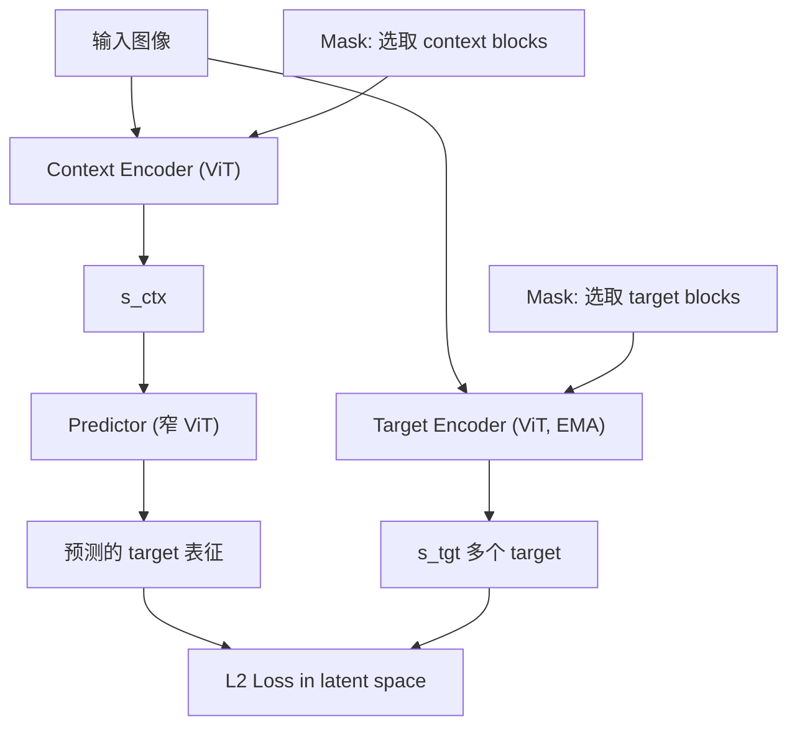

# I-JEPA: Self-Supervised Learning from Images with a Joint-Embedding Predictive Architecture

- 本地 PDF：`papers/world-model/I-JEPA_2301.08243.pdf`
- arXiv：https://arxiv.org/abs/2301.08243
- 年份：2023 (CVPR 2023)
- 团队：Meta AI (FAIR) — Mahmoud Assran, Yann LeCun 等
- 阶段：非生成式自监督学习 —— JEPA 架构首篇

## 一句话总结

I-JEPA 提出非生成式自监督学习范式：从单张图像的 context block 预测多个 target block 的 latent 表征，而非重建像素。核心设计在于 mask 策略——target block 必须足够大（语义级），context block 必须信息丰富（空间分布）。ViT-H/14 在 16 张 A100 上 72h 训完即达到强下游性能。

## 核心技术

1. **Joint-Embedding Predictive Architecture (JEPA)** — 不做像素重建，在 latent representation space 做预测，避免生成方法浪费容量在像素细节上
2. **多 block target 预测** — 一张图随机采样多个 target block（semantic-scale），从共享 context block 预测所有 target 的表示
3. **Mask 策略是关键** — (a) target block 尺度必须足够大（包含语义信息），(b) context block 需空间分散（提供足够上下文）
4. **无数据增强** — 不依赖 hand-crafted data augmentation（对比 invariance-based 方法），跨模态迁移时无 bias 遗留

## 底层原理与数学推导

### 核心架构

### 损失函数

$$L = \sum_{i \in \text{targets}} \| \text{Predictor}_\theta(s_{ctx})_i - s_{tgt,i} \|_2^2$$

- Target encoder 用 EMA (exponential moving average) 更新，防止表示崩溃
- 仅 context encoder + predictor 可训练

### 关键设计选择

1. **Semantic target blocks**: target 尺度越大 → 下游任务越语义化（分类 > counting > depth）；尺度太小 → 仅学习纹理
2. **Spatially distributed context**: context 如果太集中、太小 → predictor 学到的是短程纹理插值而非语义理解
3. **No pixel generation**: 不需要 decoder，不需要重建，仅 predict in latent space

## 工程细节与实操指南

- **ViT 架构**: ViT-H/14 或 ViT-L/16 作为 encoder，context encoder 可训练，target encoder 通过 EMA 更新
- **EMA 更新**: target encoder 参数 $\phi = \tau \phi + (1-\tau)\theta$，其中 $\tau = 0.99$（慢更新防止表示崩溃）
- **Predictor**: 窄 ViT（width 和 depth 均小于 encoder），处理 context 特征并预测多个 target 特征
- **Mask 生成**: (a) 先采样 target block(s)，面积占比约 15-20% image area（语义级尺度）；(b) 在剩余区域采样 context blocks，空间分散（4 个不同方位）
- **多 target 预测**: 一张图通常 4 个 target blocks，predictor 输出对应位置的 target 表征
- **训练**: 16×A100 72h for ViT-H/14，无数据增强，仅 ImageNet-1K（不依赖额外数据）
- **下游评估**: Linear probe（冻结 backbone + 线性分类头）或 Fine-tune（解冻 backbone）
- **计算效率**: 无 decoder 使训练比 MAE 更快（MAE 需重建 75% 被 mask 的 patch）

## 实验

| 任务 | 表现 |
|------|------|
| ImageNet-1K Linear Probe | ViT-H/14 82.0%+ Top-1 |
| Low-shot classification | 1% labeled = strong performance |
| Object counting | 显著优于 MAE, data2vec |
| Depth prediction | 竞争力强 |
| 计算效率 | ViT-H/14 16×A100 72h |

## 物理直觉解释

I-JEPA 就像看图猜局部——给你看一张图的大部分区域（context），让你猜被遮住的一大块（target）在 latent 空间的样子。猜的块越大、越语义化，你学到的东西就越"理解"图像的高层结构。但如果你猜的块太小（只有几个像素），你学到的只是纹理。关键不是猜什么（像素 vs 表示），而是猜多大。

## 消融实验与分析

| 消融因子 | 变化 | 结论 |
|---------|------|------|
| Target block 尺度 | semantic (15-20% area) vs small | 语义级 target 产生更语义化的表征 |
| Context block 分布 | 空间分散 vs 集中 | 分散 context 学到语义，集中 context 仅学到纹理 |
| Target block 数量 | 4 vs 1 vs 8 | 多 target 迫使 predictor 学习更通用的表征 |
| EMA 更新 tau | 0.99 vs 0.9 vs 0.999 | tau=0.99 在稳定性和更新速度间最优 |

**核心结论**：Target block 的尺度是最关键的消融发现——尺度决定了下游任务的语义层级。Mask 策略是 JEPA 的灵魂。

## 技术权衡（Trade-off）

| 优势 | 劣势与工程代价 |
|------|----------------|
| 无数据增强依赖，跨模态可迁移 | Mask 策略对性能影响极大，需精心设计 |
| 不做像素重建，计算效率高 | 对低层特征任务（如 edge detection）可能不如重建方法 |
| 天然适合视频/多模态扩展 | Context encoder 和 target encoder 的 EMA 设计增加显存 |

## 技术价值与演进定位

I-JEPA 开辟了自监督学习的第三条路——既不是 contrastive（不变性），也不是 generative（重建），而是 latent space prediction。它为 V-JEPA（视频）、MC-JEPA（运动+内容）、LeWorldModel 等后续工作奠定了架构基础。在机器人领域，JEPA 影响了世界模型中的 latent prediction 设计（如 TD-MPC2 的 decoder-free 设计）。

## 与其他论文的关系

- **MAE** — 像素级重建，I-JEPA 在 latent 空间预测（更高效）
- **DINO / iBOT** — 不变性方法，依赖数据增强，I-JEPA 不依赖
- **V-JEPA** — 将 I-JEPA 扩展到视频，预测未来帧的 latent 表征
- **Dreamer v3 / TD-MPC2** — 机器人世界模型中的 latent prediction 受 JEPA 启发

## 精读问题

1. Target block 的"最小语义尺度"如何定义？不同图像内容的最优尺度是否不同？
2. Context/target mask 策略是否可学习而非预定义？
3. 对机器人观测的 latent prediction 是否可直接用 I-JEPA 预训练初始化？
