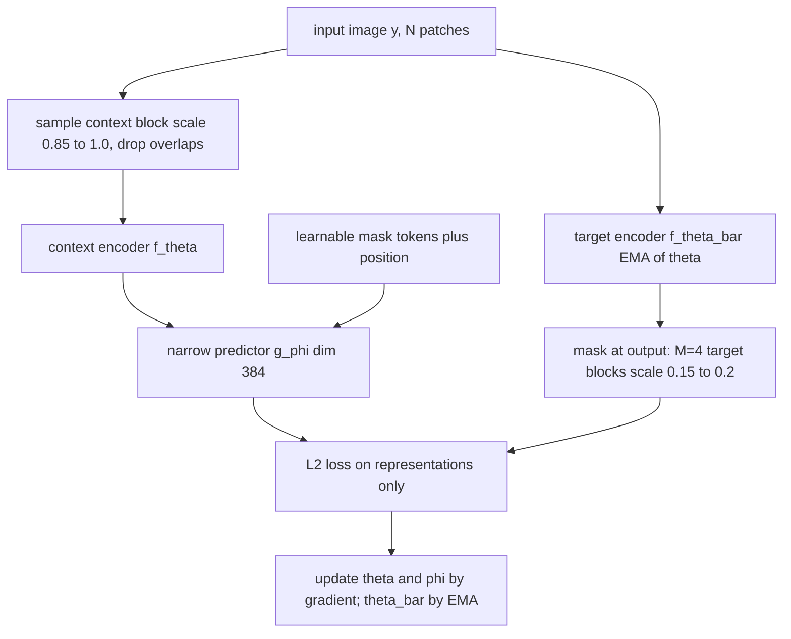

# I-JEPA: Self-Supervised Learning from Images with a Joint-Embedding Predictive Architecture

- 本地 PDF：`papers/world-model/I-JEPA_2301.08243.pdf`
- arXiv：https://arxiv.org/abs/2301.08243
- 年份：2023（CVPR 2023）
- 团队：Meta AI (FAIR) 与 McGill、Mila、NYU（Mahmoud Assran、Quentin Duval、Ishan Misra、Piotr Bojanowski、Pascal Vincent、Michael Rabbat、Yann LeCun、Nicolas Ballas）
- 阶段：LeCun JEPA 路线在图像上的首个完整实证——不用数据增强、不在像素空间预测，只用 latent 空间的 abstract prediction 学出高语义表征

## 一句话总结

I-JEPA 用一张图的少量上下文 patch 去预测同图中若干大块目标区域的 EMA target-encoder 表征（L2 损失只算在表征空间），配合"多块 + 大目标块 + 信息充分的上下文块"的掩码策略，在不使用任何手工视图增强的前提下把 ViT-H/14 的 ImageNet linear probe 推到 79.3%（448 分辨率 81.1%），且 ViT-H/14 预训练只需 16 张 A100 上不到 72 小时，比 iBOT 训练一个 ViT-S/16 还省 2.5 倍以上算力。

## 核心技术

1. **架构三件套**：context encoder $f_\theta$（看得到的上下文 patch）、target encoder $f_{\bar\theta}$（全图编码后按目标块取 patch 表征，权重是 context encoder 的指数滑动平均）、narrow predictor $g_\phi$（固定 embedding 维度 384 的浅层 ViT，输入上下文表征加可学习 mask token）。
2. **多块掩码策略（本质贡献）**：每图随机采 4 个可能重叠的目标块（scale 0.15 到 0.2，宽高比 0.75 到 1.5）+ 1 个接近全图的大上下文块（scale 0.85 到 1.0，单位宽高比），并把上下文与目标重叠的区域删掉；目标块的掩码作用在 **target-encoder 输出**上而不是输入上。
3. **纯表征空间预测**：损失为预测 patch 表征与 target 表征的平均 L2 距离；不重建像素、不做对比负样本、不做不变性约束。
4. **免增强训练**：预训练阶段不使用 random crop/scale/color jitter 等 hand-crafted view augmentation，因此学到的表征不带有特定不变性偏置——这正是它在深度估计、物体计数等低层任务上反超 invariance 方法的原因。
5. **无 [cls] token 设计**：预训练与评测都用 patch 表征的 average pooling（或末 4 层拼接），评测协议在 VISSL 配方上做最小改动。

## 底层原理与数学推导

### 1. JEPA 在能量模型框架下的位置

论文以 Energy-Based Model 语言统一三种自监督结构：Joint-Embedding Architecture 让兼容对 $(x,y)$ 的嵌入相似（靠增广定义兼容性，风险是表示坍塌）；Generative Architecture 从 $x$ 经 decoder 直接重建 $y$（无坍塌问题但必须付出容量去记忆像素细节）；JEPA 则是从 $x$ 出发、经 predictor 加条件变量 $z$ 预测 $y$ 的**表征**：

$$
\hat{s}_y(i) = g_\phi\bigl(s_x,\ \{m_j\}_{j\in B_i}\bigr),\qquad s_x=\{s_{x_j}\}_{j\in B_x},\quad s_{x_j}=f_\theta(x)_j
$$

损失只取平均 L2 距离（论文式 1）：

$$
\mathcal{L} = \frac{1}{M}\sum_{i=1}^{M}\sum_{j\in B_i}\bigl\|\hat{s}_{y_j}-s_{y_j}\bigr\|_2^2
$$

坍塌防护完全交给结构性非对称：target encoder $\bar\theta$ 是 $\theta$ 的 EMA。论文称该机制对 Vision Transformer 是必需的（BYOL/data2vec/DINO/iBOT 中已被反复验证）。

### 2. 目标语义级的关键细节：掩码作用位置

同一张图先整体过 target-encoder 得到 $s_y = f_{\bar\theta}(y) = \{s_{y_1},...,s_{y_N}\}$，再从其 patch 表征中切块得到目标；而不是先遮挡输入再编码。若反过来（在输入端遮挡后分别前向每个目标区域），patch 缺少全图上下文，其表征退化为低语义局部特征。消融见表 11：output masking 67.3 对 input masking 56.1（ViT-H/16，ImageNet-1%）。

```mermaid
flowchart TB
    IMG["input image y, N patches"] --> TENC["target encoder f_theta_bar EMA of theta"]
    IMG --> CSAMP["sample context block scale 0.85 to 1.0, drop overlaps"]
    TENC --> TP["mask at output: M=4 target blocks scale 0.15 to 0.2"]
    CSAMP --> CENC["context encoder f_theta"]
    CENC --> PRED["narrow predictor g_phi dim 384"]
    MT["learnable mask tokens plus position"] --> PRED
    PRED --> L["L2 loss on representations only"]
    TP --> L
    L --> UPD["update theta and phi by gradient; theta_bar by EMA"]
```

### 3. 为什么"L2 回归到好的目标"能消除平凡解

直觉上是 target encoder 提供了可自我更新、又能屏蔽无关细节的监督源。形式化证据可借 BYOL 式分析：当 predictor 收敛时，最优映射逼近条件期望 $\mathbb{E}[s_y\mid s_x]$，此时梯度更新约等于让 $s_x$ 尽量减小与目标的偏离项——只要 EMA 保证 target 比 online 编码器慢半拍，系统就无法通过双方同时输出常量来作弊。I-JEPA 自身没有给出这条证明（V-JEPA 后来补了一个基于 L1 损失的条件中位数版本），此处为跨文献推断。

### 4. 与 MAE 的计算结构对比

两者都只把可见 token 送进大 encoder、把重构工作留给小网络。差别是 MAE 的 decoder 要还原像素，信息量上限被分辨率钉死；I-JEPA 的 predictor 只需输出语义级摘要向量，token 数不变而每个 token 的信息熵大幅下降，且可以堆叠得更深（12 层 narrow ViT）。这就是效率优势的来源：预测同样大小的一块区域，特征空间的回归比像素重建便宜得多，收敛又快（论文报 ~5 倍更少迭代，单迭代仅慢约 7%）。

## 物理直觉解释

**I-JEPA 训练的是"看到一部分就脑补其余部分的语义轮廓"，而非"逐像素画出被遮住的东西"**。给模型一只鸟的上半身和背景，让它猜下半身在哪、翅膀什么姿态；在像素世界里这个任务有无穷多个合法答案（羽毛纹路、光影都可能不同），逼模型要么放弃要么乱猜；但在表征空间里，答案可以被压缩成"鸟的下半身在画面下方、姿态朝右"这样的抽象描述。**这就像让实习生补齐一份被咖啡泼了一角的会议纪要**——没人要求他复原被打湿的字迹，只要求续写的部分与上文逻辑一致。正因为允许丢弃不可预测的细节，学到的特征天然偏向物体类别与布局这类语义内容，线性探测才那么高。

**掩码策略的三个旋钮共同决定了任务难度落在哪一段**。目标块太小（如 random masking 的零散 patch）相当于填字游戏里猜单个字母，局部纹理就够用，模型不必理解场景；目标块太大且只有一块（block masking），则一旦它紧邻边界，上下文的信息就被掏空，任务趋于不可学。0.15 到 0.2 的块尺度加上 4 个目标的组合是精心卡出来的甜点区：每个目标大到需要全局理解才能预测，总数又足以覆盖足够多的空间模式。**上下文块的角色则像考试题干**——题目要难，但不能连题干都不完整；把 scale 卡在 0.85 到 1.0 并删去与目标重叠部分，保证提示充分却不泄题。

**EMA target encoder 是防止两个网络合谋作弊的裁判制度**。如果 target 和 context 共享同一组实时更新的参数，最省力的方案是两边一起输出常数向量，损失瞬间归零、什么都学不到。EMA 让"考官"比"考生"慢几步：考生每走一步，考官只是缓慢跟随，于是不断有新的预测误差可以学习，坍塌通道被封死。这与 BYOL、data2vec 同构，区别在于 I-JEPA 把它用于图像且把评测重心放在免微调的线性探测上——要求表示本身就好用，而非依赖下游大幅微调来"洗"特征。

## 工程细节与实操指南

| 项目 | 值 | 备注 |
|------|-----|------|
| 架构 | ViT-B/16、ViT-L/16、ViT-H/14、ViT-G/16；分辨率默认 224 | ViT-H/16@448 变体另测 |
| Predictor | embedding 固定 384（宽度瓶颈）；depth B:6 / L,H:12 / G:16；head 数与 backbone 相同 | 深 12 浅 6 的差距见消融表 |
| 掩码 | 目标 4 块，scale (0.15, 0.2)，AR (0.75, 1.5)；上下文 1 块 scale (0.85, 1.0)，删重叠 | 每 GPU 内所有 mask 形状需一致以便批处理 |
| 优化 | AdamW，batch 2048，lr 1e-4 线性升到 1e-3（前 15 epoch）再 cosine 到 1e-6 | weight decay 0.04 线性升到 0.4 |
| Target encoder EMA | momentum 0.996 起步线性升至 1.0 | 初始权重与 context encoder 相同 |
| 评测 | 无 [cls] token，用 average-pooled patch 表征或末 4 层拼接；IN1k linear probe 用 LARS batch 16384、50 epoch | 1% low-shot 用 AdamW 微调 50 epoch、layer decay 0.75 |

实操要点：(1) mask sampler 写在 data loader 的 collate 函数里，只传 patch index 给 GPU，实现轻；(2) 迁移到其他模态时不需要改损失，只需要重新设计掩码分布——这也是作者强调的"简单模型 + 弱归纳偏置"的卖点；(3) 若追求线性探测指标优先选 weight decay 渐增策略（77.8 对 76.4），若做低样本微调可选固定小 weight decay（70.7 对 69.4）；(4) 想 visual inspection 可以照搬 RCDM 扩散解码器做法，把 predictor/target 表征投回像素验证模型到底记住了什么。

## 消融实验与分析

| 实验（出处表号） | 对照设置 | 关键数字结果 |
|------|------|------|
| ImageNet-1K linear probe（表 1） | 免增强方法 vs 增强方法 | I-JEPA ViT-B/600ep **72.9**、ViT-L/600ep **77.5**、ViT-H/300ep **79.3**、ViT-H@448/300ep **81.1**；对照 MAE ViT-H/1600ep **77.2**、CAE ViT-L **78.1**、data2vec ViT-L **77.3**、iBOT ViT-L/250ep **81.0**、DINO ViT-B/8 **80.1** |
| ImageNet-1%（表 2） | 低样本 1% 标签 | I-JEPA ViT-H **73.3**（追平 data2vec ViT-L 的 **73.3**）、ViT-H@448 **77.3**（超过 MSN 的 **75.7**、BYOL 的 **71.2**）；MAE ViT-L 仅 **67.1** |
| 迁移与低层任务（表 3-4） | linear probe | CIFAR100：I-JEPA **87.5** vs MAE **77.3** vs DINO **84.9** vs iBOT **88.3**；iNat18：**47.6** vs MAE **32.9**、data2vec **28.1**、DINO **55.9**；Clevr/Dist 深度：**72.4** vs DINO **53.4**、iBOT **62.8**；Clevr/Count：**86.7** vs MAE **90.5** |
| 效率（正文第 7 节 / 图 5） | GPU hours | ViT-H/14 预训练 <**1200** GPU 时（16 张 A100 <**72** 小时），比 iBOT ViT-S/16 快 **2.5×** 以上，比 MAE ViT-H/14 省 **10×** 以上 |
| 预测目标（表 7） | 表征空间 vs 像素空间（ViT-L/500ep，1% IN） | target-encoder output **66.9** vs pixels **40.7** |
| 掩码策略（表 6，ViT-B/300ep） | multi-block vs rasterized vs block vs random | **54.2** / **15.5** / **20.2** / **17.6** |
| 目标块尺度（表 8） | (0.075,0.2) 至 (0.2,0.3) 七档 | **19.2**、**39.2**、**42.4**、**54.2**（(0.15,0.2) 最优）、**38.9**、**33.6** |
| 上下文尺度（表 9） | (0.40,1.0)/(0.65,1.0)/(0.75,1.0)/(0.85,1.0) | **31.2** / **47.1** / **49.3** / **54.2** |
| 目标块数量（表 10） | 1/2/3/4 块 | **9.0** / **22.0** / **48.5** / **54.2** |
| 掩码位置（表 11，ViT-H/16/300ep） | output vs input | **67.3** vs **56.1** |
| Predictor 结构（表 12、14，ViT-L） | depth 6 vs 12；width 384 vs 1024 | **64.0** vs **66.9**；**68.4**（宽 1024）vs **70.7**（384 瓶颈更好） |
| 数据与模型规模（表 5） | IN1k vs IN22k；ViT-H/14 vs ViT-G/16 | IN22k 使 CIFAR100 **87.5→89.5**、iNat18 **47.6→50.5**、Clevr/Dist **72.4→75.0**；换 ViT-G/16 后 iNat18 升至 **55.3** 但 Count/Dist 不再提升（更大 patch 伤害局部任务） |

**核心结论**：(1) 主要主张成立——同样不依赖手工增强，I-JEPA 全面压制 MAE/data2vec/CAE（linear probe 最高 79.3/81.1 对 77.2），并靠提高分辨率追平需要大量增广的 iBOT/DINO（81.1 对 81.0），代价为零增强先验。(2) 任务谱系分化明显：语义分类稳步领先的同时，Clevr 深度估计 72.4 大幅超越 image-model 一系的 53.4/62.8，说明它保留了多少被 invariance 方法抹掉的几何/位置信息；但 object counting 仍输 MAE（86.7 对 90.5），即"语义化"不是免费的。(3) 消融链条精确指出三个必要条件：loss 必须发生在表征空间（40.7 vs 66.9）、目标必须是大块语义区域（尺度消融峰值在 (0.15,0.2)，偏大或偏小都崩）、上下文必须空间广布（1 块目标 9.0 对 4 块 54.2）——三者缺一都会显著削弱。(4) 宽度瓶颈的 narrow predictor（384 维优于 1024 维）与够深的 predictor（12 层优于 6 层）是不可忽视的实现细节。

## 技术权衡（Trade-off）

| 优势 | 代价与边界 |
|------|-----------|
| 预训练免增强，跨模态迁移潜力大（视频/音频无需重造增广） | 表征的判别粒度由掩码分布隐式决定，调掩码相当于换了另一种超参搜索 |
| 特征空间预测便宜且收敛快（~5 倍少迭代） | 无法像扩散式生成模型那样产出可观赏的高保真图像；想做可视化需额外训 RCDM 解码器 |
| 线性探测/低样本设定强，下游适配成本低 | 全量微调仅"接近但不超越"像素法（87.1 对 MAE 87.8，epoch 数少 5.3 倍）；counting 类细粒度计数弱于 MAE |
| ViT 尺度友好（predictor 固定 384 维，成本近常数） | 增大主干（H 转 G）不再改善局部任务，patch 粒度成为新的天花板 |

## 技术价值与演进定位

I-JEPA 第一次把 LeCun 的 joint-embedding predictive architecture 主张变成可复现、计算高效的图像结果：它同时回答了两个问题——不用数据增强能否学到高语义表征（能，且更强），以及预测是否一定要发生在像素级（不能，表征空间显著更好）。它与同期 data2vec-v2、Context Autoencoder 的对比清晰地划定了技术光谱，此后 "feature prediction" 成为与 pixel reconstruction、view-invariance 三足鼎立的第三条自监督路线。在机器人与世界模型的语境中，它是 V-JEPA 及其后继的直接模板：latent 空间预测这一选择意味着模型可以自由决定记住什么、忽略什么，这是任何希望支撑规划的世界模型都必须具备的性质。后续 V-JEPA 2 直接沿用其损失形式与 EMA 方案并扩展到动作条件预测，形成一条清晰的传承链。

## 与其他论文的关系

- **V-JEPA — 直接继承者，把上下文从图像扩展到视频时空块**：损失形式同为 L1/L2 回归到 EMA target 表征；V-JEPA 将单张图的多块掩码升级为 short-range（8 块 ×15%）+ long-range（2 块 ×70%）混合、掩码沿时间轴整条延伸，并用 attentive probing 替代普通 linear probe，最终 SSv2 71.4%/K400 82.0%（ViT-H）。
- **V-JEPA 2 — 该路线的扩容与机器人落地版**：在 V-JEPA 基础上把数据推到 >1M 小时、模型推到 ViT-g 1B，然后冻结 encoder 用不到 62 小时机器人视频训练动作条件 predictor，实现 Franka 臂零样本抓放；证明了 I-JEPA 开创的 feature-prediction 范式可以一直延伸到控制。
- **MAE / CAE / data2vec — 三类"非增强"对照组**：MAE 在像素空间重建（低层信号丰富、语义欠佳）、CAE 在表征空间但对齐与重建混训、data2vec 是最接近的前作（多模态通用但图像结果逊色）；I-JEPA 以同样的"最少归纳偏置"立场拿到全面更好的数字，关键差异就是多块掩码设计与只作用于输出的 target 掩码。
- **DINO / iBOT / MSN — invariance-based 的上限参照**：这些方法靠精工增广学到强语义表征但在 Clevr/Dist 等需要位置信息的任务上大幅落后（53.4/62.8 对 72.4），恰好反向证明了 I-JEPA"不带不变性偏置"的价值。
- **Dreamer v3 / TD-MPC2 — 世界模型 RL 的另一支**：RL 一系也在为一个"预测哪些信息有用"的问题建模，Dreamer 用重建、TD-MPC2 用 JEP 加 TD；I-JEPA 可视作它们监督信号的纯表征版本，剥离了动作与奖励之后剩下的感知主干。
- **SD-JEPA / LeWorldModel — 库内 JEPA 向机器人的后继延伸**：这些笔记中的工作继承了 latent prediction 作为世界模型目标的核心思想，可与本文对照考察"预测目标抽象程度"在具体操控任务上的演化。
- **Rao & Ballard predictive coding / Friston — 思想源头**：论文开篇引用的生物合理机制假设（相邻刺激的表征应相互可预测）正是 JEPA 家族的认知科学动机。

## 精读问题

1. **为什么必须是 4 个中等尺度的目标块**：表 10 显示从 3 块（48.5）到 4 块（54.2）仍有可观增益，继续增加块数会怎样？是否存在一个由 patch 总数决定的最优覆盖率？
2. **梯度回传路径的作用**：L2 损失同时回传给 predictor 和 context encoder，但绝不回传给 target encoder；这种单向性加上 EMA 的缓慢追随，与对比学习中显式推开负例相比，哪种机制对表示的信息量（而非稳定性）更有保障？
3. **表层 vs 语义层的两难**：ViT-G/16 在 iNat18 上把 50.5 推到 55.3 却让 Clevr 局部任务退化——同一个 backbone 是否可能在预训练里同时保留两类信息？例如混合不同尺度的掩码分布是否能两头兼顾？
4. **免增强的另一面**：没有 invariant prior 意味着下游任务各自负责选择需要的性质；那么在做实例检索、图像配准这类非常需要 invariance 的应用时，I-JEPA 表征会不会反而吃亏？应如何在评测量表中补测？
5. **预测块之间的耦合**：4 个目标独立地共享同一个上下文编码，模型并未被要求"同时一致地"想象全图未来；这种 factorization 与 JEPa 理论所设想的"一次预测整个未观测状态的联合分布"之间差多少，对下游的一致性敏感任务有何影响？
