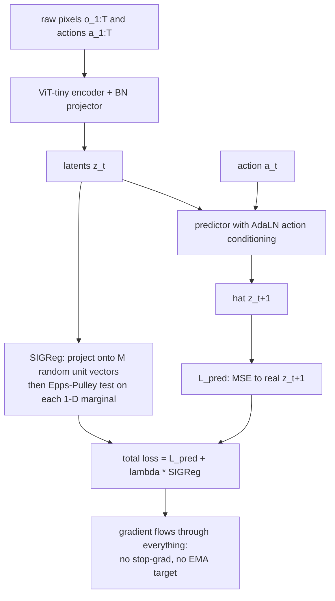

# LeWorldModel: Stable End-to-End Joint-Embedding Predictive Architecture from Pixels

- 本地 PDF：`papers/world-model/LeWorldModel_2603.19312.pdf`
- arXiv：https://arxiv.org/abs/2603.19312
- 年份：2026（preprint v3，2026-06-03）
- 团队：Mila & Université de Montréal + New York University + Samsung SAIL + Brown University（Lucas Maes、Quentin Le Lidec、Damien Scieur、Yann LeCun、Randall Balestriero）
- 阶段：JEPA 训练配方极简化的关键一步——首个从原始像素端到端稳定训练的 JEPA 世界模型，只用 2 项 loss、15M 参数、单 GPU 数小时可复现

## 一句话总结

把 JEPA 世界模型的防坍塌机制从"EMA target + stop-gradient"或"7-term VICReg"压缩为一项 SIGReg 正则（强制 latent 边缘分布为各向同性高斯），与 next-embedding MSE 组成两项式损失 $\mathcal L_{LeWM} = \mathcal L_{pred} + \lambda\,\mathrm{SIGReg}(Z)$，在 Push-T / OGBench-Cube 等连续控制环境上端到端训练出仅 15M 参数的世界模型——规划速度比 DINO-WM 快最多 48 倍，Push-T 成功率 96% 超过带 proprioception 的 DINO-WM (92)，且消融显示除 $\lambda$ 外的所有超参都不敏感。

## 核心技术

**架构（encoder-predictor 双件套，~5M + ~10M 参数）。**
- Encoder：ViT-tiny（patch size 14, 12 层, 3 heads, hidden 192），取末层 [CLS] token 过一层 MLP+BatchNorm 投影得 $z_t$。这里的 BN 投影是刻意为之的：ViT 最后一层的 LayerNorm 会把各维方差强制归一，从而破坏以方差作为信号的 SIGReg 目标，所以必须在其后接一个可学的线性重标定。
- Predictor：6 层 transformer、16 heads、10% dropout (~10M)。action 通过 AdaLN-zero 在每层注入（AdaLN 参数初始化为 0），初始时完全不改变主干输出，训练中渐进地让 action 影响表征。输入 $N$ 帧历史 latents，time-causal masking 下自回归预测下一帧表征。
- 所有模块 encoder/predictor/projector 联合优化，无 stop-gradient、无 EMA target、无 pretrained encoder。

**训练目标。**
$$
\mathcal L_{\text{pred}} \triangleq \|\hat z_{t+1} - z_{t+1}\|^2_2, \qquad
\hat z_{t+1} = \mathrm{pred}_\phi(z_t, a_t)
$$
配上一项 anti-collapse 正则：
$$
\mathcal L_{\text{LeWM}} \triangleq \mathcal L_{\text{pred}} + \lambda\, \mathrm{SIGReg}(Z),\quad M=1024,\ \lambda=0.1
$$
作者强调引入的有效超参只有 $\lambda$ 一个（投影数 $M$ 不敏感）；$\lambda$ 可用二分搜索以对数复杂度调优，对比 PLDM 需要 6 维网格搜索（多项式复杂度）。

**SIGReg 的实现思路。** 高维正态检验不可直接用——大多数经典 normality test 是一维的。SIGReg 把 $Z$ 投到 $M$ 个随机单位方向 $u^{(m)}$ 上变成一维样本 $h^{(m)} = Zu^{(m)}$，在每个方向上跑 Epps-Pulley 检验统计量 $T(\cdot)$，再平均。Cramér–Wold 定理保证所有一维边缘匹配等价于整体联合分布匹配，因此目标分布设定为标准正态 $\mathcal N(0,I)$ 时整体就是各向同性高斯。

**下游规划。** encoder 编码当前帧与目标图，predictor 自回归 rollout 到 horizon $H$，最小化 terminal cost $\mathcal C(\hat z_H)=\|\hat z_H - z_g\|_2^2$ 用 CEM 求解（每迭代 300 samples，30 elites，30 iterations）。只执行前 $K$ 个动作后再重规划（MPC）。

## 底层原理与数学推导

**预测项为什么会坍塌。** 若 $\mathrm{enc}_\theta(o) = c$（常数）且 $\mathrm{pred}_\phi(c,a) = c$，则 $\hat z_{t+1}=z_{t+1}=c$ 对任意动作序列都成立：
$$
\mathcal L_{\text{pred}} = \|c-c\|^2_2 = 0
$$
这是全局最优解但完全没用。所以任何端到端 JEPA 必须给 latent 空间加入额外约束。

**SIGReg 定义（论文 Eq. 2 与 App. A）。** 设 $Z\in\mathbb R^{N\times B\times d}$ 为历史长度 $N$、batch size $B$、维度 $d$ 的 tensor，每个方向投影后做 Epps-Pulley 检验：
$$
h^{(m)} \triangleq Zu^{(m)},\ u^{(m)}\in S^{D-1},\qquad
\mathrm{SIGReg}(Z) \triangleq \frac{1}{M}\sum_{m=1}^M T(h^{(m)})
$$
其中 $T(h^{(m)})$ 是经验特征函数到 $\mathcal N(0,1)$ 特征函数的加权 $L^2$ 距离：
$$
T^{(m)} = \int_{-\infty}^{\infty} w(t)\big|\varphi_N(t; h^{(m)}) - \varphi_0(t)\big|^2 dt,\qquad
\varphi_N(t; h) = \frac{1}{N}\sum_{n=1}^N e^{ithn}
$$
权重函数如 $w(t)=e^{-t^2/2\lambda^2}$；数值上用梯形积分，节点数 4/8/12/17/32 已被证明不敏感，均匀采样于 $[0.2, 4]$ 区间。

**Cramér–Wold 收敛保证。** 当 $M\to\infty$ 时有弱收敛意义下的等价性：
$$
\mathrm{SIGReg}(Z)\to 0 \iff p_Z \to \mathcal N(0, I)
$$
直觉：把高维正态检验降成一维检验，方法上不是把所有维展开拼接而是用随机方向抽样，本质上是 Monte Carlo 近似一个对所有方向的期望。

**为什么不能直接套 VICReg？** VICReg 那类 variance/covariance 正则只约束二阶统计量，无法约束更高阶矩；Epps-Pulley 统计量是基于特征函数的差异度量，它唯一为 0 当且仅当分布完全等于目标分布。这是作者把它称作"principled"而不是 heuristics 的关键论据。

**Latent 规划的最优控制形式。** 有限 horizon 目标：
$$
a^*_{1:H} = \arg\min_{a_{1:H}} \mathcal C(\hat z_H),\qquad \mathcal C(\hat z_H) = \|\hat z_H-z_g\|^2_2,\quad z_g=\mathrm{enc}_\theta(o_g)
$$

**Temporal Latent Path Straightening 作为涌现现象。** 定义相邻 latent 速度向量为 $v_t = z_{t+1}-z_t$，曲率指标用平均余弦相似度：
$$
S_{\text{straight}} = \frac{1}{B(T-2)}\sum_{i=1}^B\sum_{t=1}^{T-2}
\frac{\langle v_t^{(i)}, v_{t+1}^{(i)}\rangle}{\|v_t^{(i)}\|\cdot\|v_{t+1}^{(i)}\|}
$$
LeWM 在 Push-T 上 $S_{\text{straight}}$ 随训练上升——没有任何显式 straightening loss 的前提下接近 PLDM 配合专用 smoothness 项的水平。作者解释：SIGReg 只作用在单步边缘分布、不约束时间轴，时间维上的"松弛"留给了模型自发朝直线解收敛的空间。这是一个非常干净的解释性观察。

## 物理直觉解释

**为什么"想让所有点的投影都是钟形曲线"就够了。** 想象把整个潜空间想成一间装满气体的容器，崩溃对应所有气体分子缩到一个点上；各向同性高斯则像温度稳定时的理想气体状态——既不堆积也不过度稀疏，且各方向看起来一样。SIGReg 做的事是随机选几个方向拿一把"尺子"去量这团气体在该方向的密度轮廓，量到的高斯程度就是你该奖励或惩罚的程度。Cramér-Wold 保证只要每个方向都像一个标准正态，整团气体就必然像三维理想气体——不必真去做一个指数级昂贵的高维检验。

**AdaLN-zero 像"给司机的方向盘加一段虚位"。** 如果一开始就让 action 强烈影响 predictor 的输出，训练早期的随机动作信号会把还什么都不知道的 encoder 推向一个无意义的平衡点。AdaLN 参数初始化为零意味着 step 0 时 action 注入完全无效，好比新车前几公里方向盘虚位很大；随着主通路（$z_t \to z_{t+1}$ 预测）逐渐成形，虚位逐渐减小，action 才真正开始拉动内部状态。这个技巧源自 DiT 类生成模型，用在 action conditioning 上同样有效——原因都是希望模型先建立好"看见什么"，再去学"做了会怎样"。

**Reconstruction loss 反而拖累操控这件事值得专门读一遍。** 直觉上多一条重建分支应当帮助模型学到更多信息，Tab. 7 却显示加了 decoder 后 Push-T 成功率从 96% 降到 86%。作者的解读是 reconstruction objective 鼓励表征保留视觉细节（阴影、纹理、无关背景物体），这些细节占用有限表征容量但对"推这块积木到哪"毫无帮助；而 JEPA 目标本来就是为了丢掉它们才设计的。这是一条普适提醒：为世界模型加信息不同于为世界模型加有用的信息。

**最简任务里反而相对变弱这件事揭示了 Gaussian prior 的真实边界。** Two-Room 是四个评测里最简单的（一个 agent 穿门到另一房间），却在 LeWM 的结果里是它表现最吃力的一档——作者自己在正文与 Figure 6 说明中都明确指出：PLDM 和 DINO-WM 在此环境超过 LeWM，并推测原因是"SIGReg 在高维 latent 中鼓励各向同性高斯分布，而这个环境的内在维度远低于 latent 维度"。耐人寻味的是 probe 结果与这一短板不匹配：Table 3 显示在 agent position 上 LeWM 与 PLDM 打平（linear probe r=0.996 两者相同；MLP probe 双方 MSE 都为 0.000），甚至两者都大幅超过 DINO-WM (0.824)。表征里信息都在、规划却跟不上——说明问题不在编码而在 dynamics model 与规划环节的相互作用；prior 与数据内禀结构失配时，可能的做法是换 prior 或缩 latent 维度而非调权重，这正是后来 SD-JEPA 切分子空间的出发点。

## 工程细节与实操指南

- **超参数默认值**：SIGReg 方向数 $M=1024$，正则强度 $\lambda=0.1$，embedding dim 192，predictor dropout 0.1，AdaLN-zero 初始化，BatchNorm projector（encoder 和 predictor 之后各一个）。
- **必须用 BatchNorm projector 的原因**：ViT 的最后一层是 LayerNorm，输出方差恒定不变，SIGReg 的核心信号之一正是"per-dim variance 是否合理"；因此必须在 LN 之后接一个可学习的投影让方差重新自由伸缩。
- **训练预算极小**：15M 总参数、单 GPU 几小时即可收敛。这让 grid search 变得务实——而且由于只剩 $\lambda$ 一个实际有效的超参，可以用 bisection search 以 $O(\log n)$ 取代 PLDM 所需的 256 配置网格搜索。
- **离线数据要求**：纯 reward-free，无需 optimality 假设（pseudo-expert 或 exploratory 均可），只要求覆盖环境的 dynamics。轨迹按长度 T 组织 observation-action 对。
- **CEM 调参**：300 candidate sequences per iteration、30 elites、30 iterations，horizon H 权衡 lookahead 能力与误差累积；执行前 K 步就 replan。
- **可视化验证手段（推荐照抄的诊断套路）**：(a) t-SNE on latents 应看到邻域关系保留；(b) train-a-posteriori decoder（仅在诊断时训练）观察 latent 信息能否还原像素；(c) linear/MLP probe 到物理量（agent/block 位置角度），报告 MSE 与 Pearson r；(d) violation-of-expectation 测试——给轨迹插入颜色突变或物体 teleport，测 prediction MSE 的 spike；(e) temporal path straightening 曲线随 training steps 的变化。
- **VoE 实验具体设计（可直接借鉴）**：每 env 设计两类扰动——visual perturbation（物体颜色突变）与 physical perturbation（物体瞬移到随机位置）；paired t-test 显示 teleport 引起的 surprise 提升显著 ($p<0.01$) 而 color change 不显著，说明模型确实学到物理意义上的动力学而不只是视觉模式匹配。

## 消融实验与分析

### A. 三方法在 Push-T 的稳定性对照（Table 5，3 seeds，同 50 条目标轨迹）

| Model | Push-T Success Rate |
|---|---|
| DINO-WM | 92.0 ± 1.63 |
| PLDM | 78.0 ± 5.0 |
| LeWM (ours) | 96.0 ± 2.83 |

**核心结论**：LeWM 不仅均值最高，seed 方差也远小于 PLDM（±2.83 vs ±5.0）——"loss 少 → 噪声源少"这条因果链在实验上站得住。

### B. 各设计选择的独立影响

| 变体 | 设置 | Push-T (%) | 结论指向 |
|---|---|---|---|
| Predictor ViT-tiny | ~5M | 80.67 ± 6.54 | 容量不足伤害规划精度 |
| Predictor ViT-small | ~10M | 96.0 ± 2.83 | 最优 trade-off |
| Predictor ViT-base | ~25M | 86.7 ± 3.06 | 过大反而恶化优化 |
| w/o decoder loss | 无重建项 | 96.0 ± 2.83 | 默认配置更优 |
| With decoder loss | 加重建分支 | 86.0 ± 7.54 | 降低 10 点且噪声更大 |
| Encoder = ViT | 默认 | 96.0 ± 2.83 | 基准 |
| Encoder = ResNet-18 | CNN backbone | 94.0 ± 3.27 | 方法对 backbone 中性 |

**核心结论**：主要组件都不是越多越好——加大 predictor、加 decoder、换 fancy encoder 都不带来收益甚至倒退。说明两项目标本身的优化景观才是根本，架构只是搭台。

### C. Dropout 扫描（Table 9）

| Dropout $p$ | Push-T Success Rate |
|---|---|
| 0.0 | 78 ± 6.54 |
| 0.1 | 96.0 ± 2.83 |
| 0.2 | 85.33 ± 5.74 |
| 0.5 | 66.67 ± 4.11 |

**核心结论**：适度的 predictor dropout (p=0.1) 带来 18 点提升，过度 (0.5) 则灾难性倒退。由于没有 EMA-target，dropout 就是这里唯一的隐式正则化通道——它的最优点实际上决定了系统在"过拟合训练动力学"和"传播噪声进 rollout"之间的位置。

### D. 规划 solver 对照（Table 10）

| Solver | LeWM | PLDM |
|---|---|---|
| CEM | 96.0 ± 2.83 | 78.0 ± 5.0 |
| SGD | 26 ± 4.32 | 4.67 ± 0.06 |
| RMSProp | 67.33 ± 2.49 | 49.33 ± 8.26 |
| Adam | 84 ± 7.12 | 80 ± 3.27 |

**核心结论**：采样式 CEM 在两个模型上都碾压梯度法；LeWM 对梯度法的鲁棒性更好（SGD 还有 26 vs 4.67）。这提示在选择 latent 世界模型的 downstream 规划器时应默认用 CEM 而非反向传播能量到动作空间。

### E. 规划耗时与固定算力对照（Figure 3 数字）

| Metric | LeWM | DINO-WM |
|---|---|---|
| Full planning time（50 runs 平均） | 0.98 s | 47 s |
| Push-T success @ fixed FLOPs | 90 | 13 |
| OGBench-Cube success @ fixed FLOPs | 74 | 48 |

**核心结论**：LeWM 以约 200 倍更少的 token 数编码观测，规划快最多约 48 倍；同一算力预算下 Push-T 领先 77 点、OGBench-Cube 领先 26 点。值得对照的是默认预算下（Figure 6）的结论不同：DINO-WM 在 Push-T (74/75 一档) 与 OGBench-Cube 上仍占优，正文归因于 3D 高视觉复杂度让 encoder 训练更难——也就是说在 Cube 这个任务上，谁赢取决于允许多少算力；只有把 DINO-WM 拉到同 token/算力级别时 LeWM 的差距才彻底拉开。

### E2. 跨环境成功率（SD-JEPA Table 1 转引的 Maes et al. 2026 已发表数字，便于跨论文对照）

| Method | Two-Room | Reacher | Push-T | OGB-Cube |
|---|---|---|---|---|
| LEWM [Maes et al., 2026] | 87 | 86 | 96 | 74 |
| PLDM（Push-T 见 Table 5） | – | – | 78.0 ± 5.0 | – |

*注：LeWM 原文 Figure 6 为柱状图，其 baseline 具体数值在不同协议/种子组合下存在差异，这里只保留能从 PDF 表格或文本直接核实的条目；Figure 6 中 Two-Room 上 PLDM/DINO-WM 超 LeWM、OGBench-Cube 上 DINO-WM 占优这两条定性结论取自正文表述。*

**核心结论**：本表仅用于与其他论文的对照口径统一（后续 SD-JEPA 与 AC-MTM 两篇都以此为基准行），LeWM 自报的绝对成功率为 Push-T 96 / Cube 74 / Reacher 86 / Two-Room 87。

### F. 物理量 probing 结果摘录（Table 1, Push-T）

| Property | Model | Linear MSE↓ | Linear r↑ | MLP MSE↓ | MLP r↑ |
|---|---|---|---|---|---|
| Agent Location | DINO-WM | 1.888 | 0.977 | 0.003 | 0.999 |
| Agent Location | PLDM | 0.090 | 0.955 | 0.014 | 0.993 |
| Agent Location | LeWM | 0.052 | 0.974 | 0.004 | 0.998 |
| Block Angle | DINO-WM | 0.050 | 0.979 | 0.009 | 0.995 |
| Block Angle | PLDM | 0.446 | 0.745 | 0.056 | 0.972 |
| Block Angle | LeWM | 0.187 | 0.902 | 0.021 | 0.990 |

**核心结论**：LeWM 在所列三个属性上全面超过 PLDM（线性 probe 的 MSE 都更低），与靠 124M 张图像预训练出的 DINOv2 各有胜负——DINO-WM 在 block angle 线性项更好 (0.050 vs 0.187) 但 agent location 线性 MSE 反而最差 (1.888)。这说明 SIGReg 塑造的 latent 保留的物理结构不是从预训练先验"继承"来的，而是预测目标自己压出来的。

## 技术权衡（Trade-off）

- **端到端的表达自由 vs 分布先验的硬约束**：既然选择了用 $\mathcal N(0,I)$ 描述 latent 边缘，就意味着环境内禀维度低于 latent 维度时会"过度规整化"。Two-Room 的劣势不是 bug 而是 design choice 的直接后果——这正是 SD-JEPA 后来提出 subspace decomposition 的动因起点。
- **防坍塌可靠性与 Push-T 类任务的权衡**：Action-NCE 式的替代方案（见 NoGaussianRequired 2608.17542）改由 transition 数据自带 anti-collapse 信号，保留更多非受控变量却损失了保证坍塌不发的能力。LeWM 的立场是"宁可靠稳健的先验也不要可变的信号"。
- **少量超参的代价是选择性少**：若某任务本身需要不同形态的正则强度（例如高度非平稳动态），没有第二个调节维度可用；另一方面这也是其可复现性的来源。
- **小规模可扩展性尚未在真实机器人上证明**：本文环境全是 sim 或 OGBench 式合成，最大的也只有简单的 cube manipulation，面对真实机器人视频的多样性与长尾情况未经过测试。
- **Planning 仍限于短 horizon**：autoregressive rollout 的 error accumulation 是通用问题，作者提出 hierarchical world modeling 作为未来方向，本文并未给出方案。

## 技术价值与演进定位

I-JEPA (2301.08243) / V-JEPA (2404.08471) 奠定 latent prediction 任务与 masking 结构，V-JEPA 2 (2506.09985) 把规模推进到 22M clips / 1B 参数并证明冻结 encoder + 小型 predictor 可以零样本 plan，但这些方案都依赖 EMA target + stop-gradient，且 PLDM (Sobal et al.) 证明了端到端可以做到但用了 7 项 VICReg 风格的目标、超参数难以处理且训练不稳。LeWorldModel (2603.19312) 之所以在这条线上重要，是因为它回答了"最少需要什么才能稳？"这一问题——答案是恰好 2 项：一项前瞻预测 + 一项显式的各向同性高斯匹配。它在配方的"简约性"维度上走到了局部最优，也由此暴露了"prior 过强会损害低内在维度环境"的反面证据。SD-JEPA (2605.31111) 直接站在本文肩膀上，把 SIGReg 限制到 content 子空间、在新开的 progression 子空间加 triplet，把缺陷部分修正；NoGaussianRequired (2608.17542) 又进一步把 SIGReg 本身替换为 contrastive inverse dynamics，做成 distribution-free。可以说后续三篇都以本篇为基准 reset 点：它们都在问"如果去掉或改造这一项会怎样"。

## 与其他论文的关系

- **PLDM（Sobal et al., 2025）** — 同样端到端 from raw pixels，但使用 7 项 VICReg-derived 损失（含 variance/covariance/inv-dynamics/time-sim 等），作者实测需在 256 配置下搜索 loss coefficients（α=18, β=12, γ=0.2, ζ=0.7 等），且 Push-T 成功率 74 ± 5 远低于 LeWM 96 ± 2.83。LeWM 将此挑战描述为"known training instabilities and scalability limitations"。
- **DINO-WM（Zhou et al., 2024/2025）** — 通过冻结 DINOv2 features 规避坍塌问题，但不做端到端学习因而受限；同时在 LeWM 对比中去掉了其原版的 proprioception branch，导致公平比较下纯视觉版本在 Push-T 掉到 75%。
- **V-JEPA 2 / V-JEPA / I-JEPA（Assran & Bardes et al.）** — 这些方案依赖 EMA target 和 stop-gradient，其理论分析一直缺位（App.C 引述指出其"does not in general correspond to the minimization of a well-defined objective"），LeWM 用显式目标取代这套启发式，代价是要自己提供 anti-collapse 的数学论证。
- **Dreamer 系列 / TD-MPC 系** — 这两类属于 task-specific 分支（需要 reward signal 或 privileged state access），并且带 image reconstruction 或 reward reconstruction；LeWM 属 reward-free 且 reconstruction-free 谱系，图 2 有一个直观对比矩阵。
- **SD-JEPA（Thil et al., 2605.31111）** — 直接建立在 LeWM 之上，继承 encoder-predictor stack 与 SIGReg 正则，将作用域限制到 content 子空间并在新的 progression 子空间上加 cosine-margin triplet loss，使两个 anti-collapse 力作用于不相交的坐标集，规避本文在 Two-Room 上暴露的 Gaussian prior 过强问题；参数量保持一致（18.04M）。
- **NoGaussianRequired / AC-MTM（Boylan & Hokamp, Quantexa, 2608.17542）** — 走另一条批判路线：完全去掉 SIGReg，改为 contrastive inverse dynamics head，仅用于训练，推理时丢弃。在 OGBench Visual Scene 上 AC-MTM 达 80.0% vs SIGReg 版本的 58.0%，形成对本文配方最有力的 stress-test；其对 SIGReg baseline 的 matched rerun 在 Push-T 给出 93.2±0.2（与本文 96.0±2.83 同量级，评测集规模不同：200 episodes vs 本文 Table 5 的同一组 50 条目标轨迹）。
- **VICReg（Bardes et al., 2022）** — SIGReg 所取代的理论基础。SIGReg 从 LeJEPA（Balestriero & LeCun, 2025）发展而来，可视为对 VICReg 的简化版——同样是防坍塌思想，但从多个二阶统计项合并为一项基于特征函数差异的统一损失。

## 精读问题

1. Cramér–Wold 定理给出的理论收敛是 $M\to\infty$ 情形，实验只用 $M=1024$ 且作者报告结果对此参数不敏感；试问什么样的 latent 分布会让 1024 个随机方向仍未覆盖到某个关键的偏态维度？
2. BatchNorm projector 是 SIGReg 可行的前提条件（否则 LayerNorm 锁死方差）：如果在 projector 用 GroupNorm/LayerNorm 替代并允许最小方差 floor，效果会退化多少？能否用第一层权重谱分析定位退化根源？
3. AdaLN-zero 的 action 注入初始化为全 0 导致早期 predictor 对 action 完全盲视；这意味着动力学早期实际上是 action-free JEPA。这与传统 V-JEPA 的 frame-only pretraining 有何实质区别？会不会促使 encoder 主要学 appearance 而后期很难补足 dynamics-sensitive 特征？
4. Tab. 7 显示 adding a decoder 掉了 10 点：能否通过 shared-encoder multi-task with gradient surgery（PCGrad 类型）让两个任务协同而非竞争？如果还是失败，是否说明 reconstruction 在低维压制层面本身就有害？
5. Temporal straightening (Fig. 17) 作为涌现性质非常有意思：SIGReg 在每个 time step 独立作用，那么时间维度的 slack 为何不被用来存储反而被消耗？为什么收敛结果是直线路径而非其他稳定形态（如环形）？
6. 作者提到将 SIGReg 推广到不同 modalities，但如果数据是 mixture of Gaussians（比如机器人遇到两种截然不同的 scene layouts），强迫单峰分布是否会引发 mode averaging？有哪些修改方案能保留 simplicity 的同时又允许多模态 latent？
