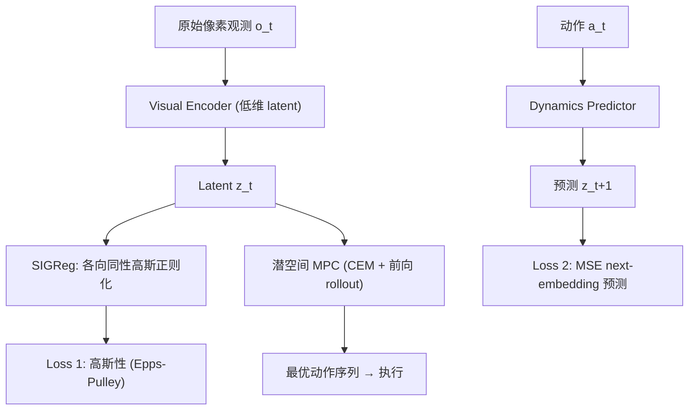

# LeWorldModel: Stable End-to-End Joint-Embedding Predictive Architecture from Pixels

- 本地 PDF：`papers/world-model/LeWorldModel_2603.19312.pdf`
- arXiv：https://arxiv.org/abs/2603.19312
- 代码：https://github.com/flyingGH/le-wm
- 年份：2026（3 月）
- 团队：LeCun 团队（Lucas Maes, Quentin Le Lidec, Damien Scieur, Yann LeCun, Randall Balestriero）
- 阶段：JEPA 世界模型的"理论-训练清理层" — 端到端稳定训练，仅 2 个 loss

## 一句话总结

LeWorldModel (LeWM) 是**首个能从原始像素端到端稳定训练的 JEPA 世界模型**，仅用 2 个 loss：next-embedding 预测 (MSE) + SIGReg（Sketched-Isotropic-Gaussian Regularizer，强制 latent 分布为各向同性高斯）。不需要 stop-gradient、EMA、预训练编码器或辅助监督——移除了先前 JEPA 防止表示坍塌的所有脆弱技巧。~15M 参数单 GPU 数小时可训，规划速度比基于基础模型的世界模型快 48×，2D/3D 控制任务上保持竞争力，latent 空间编码有意义的物理结构，能可靠检测物理上不可能的事件。

## 核心技术

1. **仅 2 个 loss 的端到端训练** — next-embedding 预测 MSE + SIGReg 高斯正则化。无 stop-gradient / EMA / 预训练编码器 / 辅助监督
2. **SIGReg 防坍塌机制** — 将 embedding 投影到随机单位范数方向，对每个投影做单变量正态性检验（Epps-Pulley 统计量），推动整个 embedding 分布匹配各向同性高斯
3. **物理结构编码** — latent 空间通过 probing 验证编码了物理量（位置、速度等）
4. **惊喜评估 (Surprise Evaluation)** — 模型能可靠检测物理上不可能的事件（违背动力学的事件）
5. **潜空间 MPC 规划** — cross-entropy method + MPC，闭环从像素到动作

## 底层原理与数学推导

**两个 loss**：

$$\mathcal{L} = \underbrace{\mathbb{E}[\|z_{t+1} - \hat{z}_{t+1}\|^2]}_{\text{next-embedding 预测}} + \lambda \cdot \underbrace{\text{SIGReg}(z)}_{\text{各向同性高斯正则化}}$$

**SIGReg 机制**：将 embedding $z$ 投影到随机单位范数方向 $u$（sketching），对每个投影 $u^T z$ 做正态性检验——用 Epps-Pulley 统计量衡量"投影分布偏离高斯的程度"，推动完整 embedding 分布匹配 $N(0, I)$。这个机制替代了所有先前的防坍塌技巧（stop-gradient、EMA、负样本）。

**可调超参从 6 降到 1**（λ）——相比先前唯一的端到端 JEPA 替代方案。

## 物理直觉解释

**为什么 JEPA 需要防坍塌？** 如果模型可以"偷懒"——把所有输入都映射到同一个 latent 向量，那 next-embedding 预测就永远完美（预测自己），但 latent 没有任何信息。传统解决：stop-gradient（预测器不能反向影响编码器）、EMA（目标编码器慢更新）、负样本（对比学习）。LeWM 换了个思路：**直接约束 latent 的分布形状**——要求它是各向同性高斯。一个"塌缩"的 latent 分布（所有点挤在一起）显然不是高斯，正则化会惩罚它，把它"撑开"成有意义的分布。

**为什么 SIGReg 有效？** 各向同性高斯是信息论上的"最大熵分布"（给定方差约束下）——强制 latent 为高斯 = 强制 latent 携带最大可能的信息。而且这个约束不需要配对样本、不需要 EMA，只是一个简单的分布形状约束，天然稳定。

**规划的 48× 加速**：因为 latent 只有 ~15M 参数、低维表示——在 latent space 做 MPC rollout 比在像素空间生成未来帧便宜几个数量级。

## 工程细节与实操指南

- **参数量**：~15M（视觉编码器 + 动力学预测器）
- **训练**：单 GPU 数小时；离线、无奖励，只用观测序列 + 动作
- **SIGReg**：random unit-norm projections + Epps-Pulley 正态性检验
- **规划**：潜空间前向 rollout + CEM 优化候选动作序列 + MPC 闭环
- **可调超参**：仅 λ（SIGReg 权重），从先前的 6 个降到 1 个
- **评估**：2D/3D 控制任务 + physical probing + surprise evaluation

## 消融实验与分析

| 消融/对比 | 结论 |
|---------|------|
| SIGReg vs stop-gradient/EMA/对比学习 | SIGReg 是唯一的稳定防坍塌机制，且无需启发式技巧 |
| 无 SIGReg | 表示坍塌，训练失败 |
| vs 基于基础模型的世界模型 | 规划速度快 48×，控制任务竞争力 |
| 超参数敏感性 | 6 个可调 loss 超参 → 1 个（λ） |
| Physical probing | latent 编码位置、速度等物理量 |
| Surprise evaluation | 可靠检测物理不可能事件 |

## 技术权衡（Trade-off）

| 优势 | 劣势与工程代价 |
|------|----------------|
| 端到端稳定训练，无脆弱启发式 | 15M 参数 vs 基础模型级世界模型——scaling 潜力待验证 |
| 超参从 6 降到 1，极简 | 高斯先验假设可能限制表征的丰富性 |
| 规划快 48×，适合实时控制 | 2D/3D 控制任务为主，复杂操作任务验证有限 |
| 物理结构可探测、惊喜检测可靠 | 无奖励训练依赖环境的探索覆盖 |

## 技术价值与演进定位

LeWM 是 JEPA 路线的"清理层"——把 JEPA 从"复杂训练配方 + 各种启发式技巧"变成"2 个 loss 的干净架构"。在 LeCun 的 H-JEPA 愿景中，这是从 I-JEPA/V-JEPA 走向"能规划的世界模型"的关键一步。它证明：**表示坍塌的解决不需要技巧堆叠，一个分布形状约束就够了**。这为 JEPA 世界模型在机器人控制中的实用化扫清了训练稳定性的障碍。

## 与其他论文的关系

- **I-JEPA / V-JEPA** — JEPA 系列的图像/视频版本，LeWM 将它们统一为端到端可规划的世界模型
- **No Gaussian Required (2608.17542)** — LeWM 的后续：用对比逆动力学信号替代 SIGReg 的预定义高斯几何
- **TD-MPC2** — 也是 latent 世界模型 + MPC，但用 TD-learning 而非预测目标；LeWM 更接近纯 JEPA 路线
- **Dreamer v3** — RSSM 像素重建世界模型，LeWM 做 latent 预测不做重建
- **LingBot-VA** — 视频-动作因果世界模型（WAM 路线），LeWM 是 latent JEPA 路线，两大范式对比

## 精读问题

1. 高斯先验对多模态动态（如双峰状态分布）的建模限制？SIGReg 在何种分布假设下失效？
2. Epps-Pulley 检验的计算开销 vs embedding 维度的 scaling？
3. 15M 参数的容量上限——能否通过扩大模型保持端到端稳定性？
4. latent 空间编码的物理量是"被动涌现"还是"被 SIGReg 的形状约束诱导"？与辅助任务（如显式速度预测）的对比？
5. 在真实机器人（非仿真）上的规划延迟？48× 加速在闭环控制中能否兑现？
