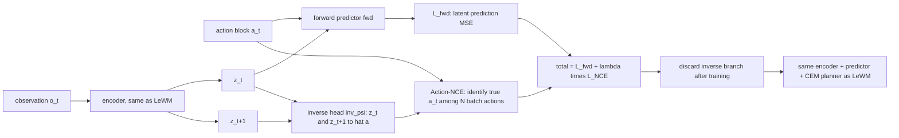

# No Gaussian Required: Contrastive Inverse Dynamics for JEPA World Models

- 本地 PDF：`papers/world-model/NoGaussianRequired_2608.17542.pdf`
- arXiv：https://arxiv.org/abs/2608.17542
- 年份：2026（preprint v1，2026-08-18）
- 团队：Quantexa（Jack Boylan、Chris Hokamp）
- 阶段：JEPA 防坍塌机制的去先验化终点——把 LeWM 的 SIGReg 高斯匹配整块替换为对比式逆动力学 Action-NCE，训练后丢弃逆头，测试时与 LeWM 完全等价

## 一句话总结

保留 LeWM 的前向 latent 预测目标 $\mathcal L_{fwd}=\|\hat z_{t+1}-z_{t+1}\|^2_2$，在训练期额外挂一个 MLP 逆动力学头，用 InfoNCE 式的 Action-NCE 让每条 latent 转移在 batch 内其他动作中辨认出真正驱动它的那个动作；由于常数 encoder 下所有 query 相同、分类只能停在 chance level（损失下界 $\log N$），坍塌从"最优解"变成"必然失败的判别题"。AC-MTM 在 5 个像素控制任务上三 seed 对照匹配 SIGReg 平均水平，而在最难的多物体 OGBench Visual Scene 上以 80.0±2.0% 大幅超过 SIGReg 的 58.0±2.0%（三个训练 seed 分别 +24/+20/+22 点），且无需 target network、stop-gradient、预训练 encoder 或重建分支。

## 核心技术

**与 LeWM 的对照结构。** 前向任务照旧：
$$
\hat z_{t+1} = \mathrm{fwd}_\phi(z_t, a_t),\qquad
\mathcal L_{\text{fwd}} = \|\hat z_{t+1}-z_{t+1}\|^2_2
$$
新增的训练-only 分支是逆动力学查询：
$$
\hat a_i = \mathrm{inv}_\psi(z_i, z_{i+1})
$$
它是从相邻 latent 对回归出完整 coarse action block（如 TwoRoom 上 $K=10$ 维的一次性输出），而不是逐动作解码。

**Action-NCE 损失（式 3）。** 用负平方距离作为 logit，候选集合是 batch 内 $N=B(T-1)$ 条真实 action block：
$$
s_{ij} = -\frac{\|\hat a_i-a_j\|^2_2}{\tau d_a},\qquad
\mathcal L_{NCE} = -\frac{1}{N}\sum_{i=1}^N \log \frac{\exp(s_{ii})}{\sum_{j=1}^{N}\exp(s_{ij})}
$$
总目标为 $\mathcal L_{AC-MTM} = \mathcal L_{fwd} + \lambda\mathcal L_{NCE}$，固定 $\lambda=0.30$、$\tau=0.10$。系数由 Reacher 上的 bounded stability sweep 选定，之后跨任务不变——这是对 PLDM 需要逐环境调 loss 权重这种做法的直接拒绝。

**"Masked" 的含义澄清。** 与图像 patch masking 无关，指的是 transition tuple 内部的 factor prediction：前向任务遮住 $z_{t+1}$ 由 $(z_t,a_t)$ 预测，反向任务遮住 $a_t$ 由 $(z_t,z_{t+1})$ 预测。每个 batch 同时优化两个方向的任务而非逐 mask 采样。

**部署时的完全等价性。** 训练结束后 inv head 从未被 rollout 或 cost evaluation 调用，可整体删除而不改变任何预测或 CEM 选择。所以 AC-MTM 与 LeWM 拥有相同的 test-time 计算量、相同的 planner、相同的 encoder/predictor 架构——所有实验差异都来自 training-time representation learning 这一条通路，这是一份非常干净的控制变量设计。

## 底层原理与数学推导

**坍塌下界是整个方法的灵魂（式 5）。** 若 $\mathrm{enc}_\theta(o)=c$ 对任意观测成立且 $\mathrm{fwd}_\phi(c,a)=c$，则前向损失退化为平凡零点：
$$
\hat z_{t+1}=z_{t+1}=c \quad\Longrightarrow\quad \mathcal L_{fwd}=\|\hat z_{t+1}-z_{t+1}\|^2_2=0
$$
此时 Action-NCE 会怎样？每个 transition 给逆头的输入都是 $(c,c)$，分类器的每一行相同，模型被迫对所有 $N$ 个 positive 用同一个概率向量 $p$。由于每个 candidate action 恰好是一次正确标签，平均损失满足：
$$
-\frac{1}{N}\sum_{i=1}^N \log p_i \;\ge\; \log N,
\qquad \text{等号当且仅当 } p_i = \tfrac{1}{N}\ \forall i
$$
也就是说 forward MSE 可以被坍塌压到 0 而 contrastive inverse loss 有一个 hard floor at chance——这是把"识别产生该转移的动作"当作监督信号的数学价值所在。

**为什么不用非对比式的 inverse regression？** MTM-MSE 把式 (3) 替换成普通平方回归：
$$
\mathcal L_{inv} = \|\hat a_t - a_t\|^2_2,\qquad \hat a_t=\mathrm{inv}_\psi(z_t, z_{t+1})
$$
它只提供一个 variance-scale floor：在完全坍塌时最好预测是均值动作 $\bar a$，此时的 loss 恰好等于动作方差本身：
$$
\min_{\hat a}\ \frac{1}{N}\sum_i \|\hat a - a_i\|^2_2 = \mathrm{Var}(a),
\qquad \hat a^\star = \bar a
$$
当多条 action block 能产生相似视觉终态时 margin 很弱，而 forward MSE 又持续奖励压缩 latent 尺度，两者合谋把表示推向退化。Reacher 上 Table 5 显示 MTM-MSE 三个 seed 中两个掉进常数解（11.5% 和 13.5%）就是这个机制的具体体现。Action-NCE 把失败几何改成 chance-level identification——即便绝对动作不可辨识，identical transition queries 也不可能给不同行分派不同的 positive 还停留在 chance。

**与 LeWM 总目标的形式对照。** 同一份 encoder/predictor 上，两种 anti-collapse 机制的差别可以并排写成：
$$
\text{LeWM:}\quad \mathcal L = \|\hat z_{t+1}-z_{t+1}\|^2_2 + \lambda_S\,\mathrm{SIGReg}(Z)
\qquad vs.\qquad
\text{AC-MTM:}\quad \mathcal L = \|\hat z_{t+1}-z_{t+1}\|^2_2 + \lambda\,\mathcal L_{NCE}
$$
唯一的差异项把"要求 latent 长成特定形状"换成了"要求 latent 能支持一个判别任务"；这也是为什么逆头可以在部署期整体删除而不影响前向通路——它不参与定义测试时的表征形式，只在训练期塑形参数。

**为什么 in-batch negatives 就够。** 三条理由：(a) 候选 block 已驻留 GPU，仅增加一次 $N\times N$ 距离矩阵；(b) $a_j$ 是原始 action 不是 encoder 输出，因此不携带对 encθ 的梯度，扩大 pool 只改变判别难度；(c) anti-collapse 性质已通过式 (5) 的 $\log N$ floor 实现，全局采样大多是 easy negatives（远离预测的 block 提供近零梯度），还因 control actions 反复出现（near-zero 或 saturated blocks）而提升 false negative 率——重复的"负样本"会惩罚正确的预测。

**为什么不能指望 Action-NCE 无条件保留一切状态信息。** 它强调的是能区分不同动作的状态分量。那些"同一个命令执行前后画面几乎没有变化"的变量（未接触前的物体姿态）会被相对欠编码——Push-T 的 probe 分析就是这条局限的直接证据。

## 物理直觉解释

**SIGReg 是"规定你必须是正态分布"，Action-NCE 是"你必须能说清是谁干的"。** 前者像军队要求每个人都穿同一型号制服来防止有人混进来搞破坏——问题在于制服并不总是合身。后者更像警局做笔录：任何人描述自己看到的过程都必须讲出独特细节才能与其他人笔录区分开。想要在一场大型审讯里蒙混过关的唯一办法就是把自己的回答做得跟所有人一样——而这恰恰会被识破。这就是 collapse 下界的本质：如果所有答案都一样，错误率就是随机猜测的水平，没有任何优化技巧能突破这道底。

**把逆头想成"留在墙上的手印鉴定箱"，而不是监控系统的一部分。** 它的存在是为了逼训练者练出一双"见多识广"的眼：看见前后两帧就能猜出中间发生了哪个操作。一旦练成了，箱子就搬走了——监控网络本身看不出差别。这正是"training-only auxiliary signal"设计的物理意义：表征质量是被塑形的对象，塑形工具在工程中完全可以丢弃。

**Scene 任务上 SIGReg 掉到 58%，这不是坍塌而是几何瓶颈。** 这个环境一个机械臂同时管抽屉、窗户、按钮和可移动方块——多个慢变化的 task variables 必须共存于一个 latent 里。SIGReg 要求整团 embedding 都长成各向同性高斯，相当于在一个已经拥挤的多维空间里规定大家必须以某种特定密度分布坐着，挤压了真实 state 几何的表达空间。AC-MTM 没有这条 prescription，让哪些维度存在完全取决于"是否能区分不同的动作效果"这一自然需求。文章诚实指出 SIGReg 在 Scene 上并未坍塌（final latent scale 健康），差距确实是 prescribed geometry 变成 bottleneck 而非防坍塌失败。

**Push-T 的劣势揭示了把动作当监督源的天然盲区。** 在 T-block 尚未被接触的阶段，机器人给出相同的推进指令、画面几乎不动，但物体的位置和朝向对后续接触至关重要。动作识别梯度这时会告诉 encoder "这些帧看起来差不多就行"，于是朝向信息被慢慢稀释。这是一个非常具体的设计权衡实例：想要 dynamics-derived 信号，就得接受它的 biases 来自动作分布本身。

## 工程细节与实操指南

- **继承自 LeWM 的全部组件**：vision encoder、latent projector、causal forward predictor、action conditioning、offline datasets、CEM/MPC planner 全部保持一致。CEM 设定为 300 candidates / 30 elites / 30 iterations。
- **唯一新组件是一个小 MLP 逆头**，输入相邻 latent pair $(z_i, z_{i+1})$，一次性回归完整 coarse action block。评测协议为三种训练 seed {3072, 1, 2} × 200 evaluation episodes / evaluation seed 42 / goal offset 25 / interaction budget 50；OGBench-Scene 是 50 episodes per training seed。
- **总 loss 权重只有 λ=0.30 一个新增超参**，temperature τ=0.10 也固定。文章强调 single coefficient held fixed across tasks。
- **对照 baseline 家族**（Table 1）：PLDM（VICReg 多项方差/协方差，prescribed variance floor）、LeWM/SIGReg（全局高斯）、MTM-MSE（非对比逆回归）、AC-MTM（contrastive inverse-action identification）、AC-CPC（contrastive future identification, unit-sphere implicit prior）。
- **negatives 不必外采**：in-batch $N\times N$ 距离矩阵就够，而且成本增加可忽略。如果想进一步扩充 pool，需要警惕控制动作重复带来的 false negatives——重复的"负样本"实际上是在惩罚正确预测。
- **诊断套件可直接借用**：(i) frozen-latent linear probes 对 privileged simulator-state 坐标做 ridge regression ($n=4000$, α=1)，用来判断哪个物理量被丢掉了；(ii) latent surprise ratio——corrupted（物理无效）transition 上的一步预测误差除以正常误差，1× 表示模型对无效转移不惊讶，越高越好；本论文实测 40–1246×；(iii) paired wins/losses 与 episode-level McNemar descriptive tests 处理统计显著性。
- **诚实的 scope 说明（Appendix B audit）**：OGBench Visual Scene 论文数字使用的是 trajectory-goal MPC 协议而非 OGBench 官方 750-step fixed-goal protocol；在官方 protocol 下两种方法在这个 model scale 都解不了任务。所以 80.0% 应当读作 matched stress test 数字，不是公开 leaderboard 成绩。

## 消融实验与分析

### A. TwoRoom 抗坍塌 sanity check（Table 2，200 eval episodes per seed，3 seeds）

| Model | TwoRoom Success (%) |
|---|---|
| NoReg（无抗坍塌项） | 28.0 ± 2.0 |
| LeWM with SIGReg | 85.5 ± 0.4 |
| MTM-MSE | 90.2 ± 0.5 |
| AC-MTM | 90.7 ± 0.6 |

**核心结论**：直接去掉 SIGReg（NoReg）确实导致 trivial constant-latent 解，forward loss 压到 ≈0 但规划崩盘；这说明 transition supervision 本身而非"去掉一个 regularizer"提供了真正的 anti-collapse 力。

### B. 主结果：五任务 controlled 比较（Table 3，200 eval eps standard tasks，50 for Scene，3 seeds）

| Task | SIGReg (LeWM) | AC-MTM | Δ |
|---|---|---|---|
| TwoRoom | 85.5 ± 0.4 | 90.7 ± 0.6 | +5.2 |
| Reacher | 68.8 ± 0.2 | 68.3 ± 3.1 | −0.5 |
| PushT | 93.2 ± 0.2 | 86.7 ± 1.5 | −6.5 |
| OGB-Cube | 66.2 ± 0.2 | 78.8 ± 1.7 | +12.6 |
| OGB-Scene | 58.0 ± 2.0 | 80.0 ± 2.0 | +22.0 |

**核心结论**：AC-MTM 赢两个任务、平一个、输 Push-T；任务越复杂多因子耦合越强（Scene > Cube > TwoRoom），dynamics-native 信号的优势越大，清晰支持"prescribed geometry becomes bottleneck when several controllable factors coexist"的假设。

### C. Scene 任务的三方分解（Table 4，50 eval episodes per seed，paired comparison pooled over 150 outcomes）

| Method | Seed 3072 | Seed 1 | Seed 2 | Mean | vs SIGReg |
|---|---|---|---|---|---|
| Random policy | – | – | – | 52.0 | – |
| SIGReg | 56.0 | 58.0 | 60.0 | 58.0 ± 2.0 | – |
| MTM-MSE | 78.0 | 74.0 | 74.0 | 75.3 ± 2.3 | 39/13 wins/losses (p≈4×10⁻⁴) |
| AC-MTM | 80.0 | 78.0 | 82.0 | 80.0 ± 2.0 | 40/7 wins/losses (p≈1.1×10⁻⁶) |

**核心结论**：random policy 已有 52%（25-step trajectory-goal protocol 导致大量 episode 初始即接近完成），所以绝对值要打折看；但 20+ 点的 seed-level gain（24/20/22 across seeds）依然远超基线效应。关键的是 MTM-MSE 75.3% 也大幅赢 SIGReg，说明优势来自"dynamics-derived signal"这一整个家族，contrastive 形式再额外贡献 4.7 点 (16/9, p≈0.23) 买到了后面说的可靠性。

### D. Reacher 的 seed-by-seed 分解：稳定性差异在哪（Table 5，200 eval episodes per checkpoint）

| Method | Seed 3072 | Seed 1 | Seed 2 | Mean |
|---|---|---|---|---|
| SIGReg | 69.0 | 69.0 | 68.5 | 68.8 |
| MTM-MSE | 68.0 | **11.5** | **13.5** | 31.0 |
| AC-MTM | 70.5 | 70.5 | 64.0 | 68.3 |

**核心结论**：这是全文最有力的一张表——MTM-MSE 有两个 seed 直接掉进常数 latent 状态（11.5%, 13.5%），AC-MTM 三个 seed 都保持在 64% 以上。也就是 contrastive 化换来的不是均值上升而是 bimodal failure mode 被消除，这对应了 §3 中关于 inverse-MSE 只有 weak margin 可用的理论分析。

### E. 长 horizon 压力测试的 trade-off（Table 6，TwoRoom-long 100/150，200 eval eps，3 seeds）

| Method | Success (%) |
|---|---|
| SIGReg | 17.0 ± 0.4 |
| MTM-MSE | 28.0 ± 0.8 |
| AC-MTM | 24.2 ± 0.6 |

**核心结论**：inverse-dynamics 家族都比 SIGReg 好，但 Action-NCE 比 pure MSE 少 3.8 点。作者明确定位这笔交易："Action-NCE trades 3.8 points of the pure-MSE long-horizon gain for much better Reacher reliability"，强调方法选择本质上是在哪类故障模式之间取舍。

### F. Push-T probe 揭示 family-level failure mechanism（Table 7，frozen-latent ridge probes n=4000, α=1；orientation=state[4]）

| Mechanism | Planner | Orientation R² | Mean R² | Success (%) |
|---|---|---|---|---|
| SIGReg (LeWM) | AR | 0.791 | 0.701 | 93.2 |
| MTM-MSE | AR | 0.508 | 0.674 | 85.5 |
| AC-MTM | AR | 0.514 | 0.675 | 86.7 |
| AC-CPC | AR | 0.655 | 0.564 | 62.5 |

**核心结论**：两个 inverse variants 的 orientation R² 都明显低于 SIGReg，且同属一族 failure mode——保留 agent position、大部分 block position 但欠编码 T-block orientation。注意 AC-CPC orientation R² 更高 (0.655) 却规划最差 (62.5%)，probes 并非决定性的 —— 代表 representation audits 与 closed-loop planning 必须一起报告。

### G. 新任务族的 exploratory single-seed 扫描（Table 12，50 eps each）

| Task | SIGReg | AC-MTM | Δ |
|---|---|---|---|
| Visual Puzzle 4x4 (play) | 50.0 | 34.0 | −16 |
| Visual Puzzle 4x5 (play) | 52.0 | 26.0 | −26 |
| Visual AntMaze teleport (navigate) | 40.0 | 46.0 | +6 |
| Powderworld medium (play) | 6.0 | 16.0 | +10 |
| Visual AntMaze large (stitch) | 30.0 | 30.0 | 0 |
| AntSoccer medium (stitch) | 88.0 | 88.0 | 0 |

**核心结论**：组合型 button-puzzle 任务上 SIGReg 明显占优——按钮切换视觉变化离散且与触发动作近独立，action identification 无法推动表征去保留完整按钮构型；probe 证实 Puzzle 4x4 上 SIGReg 解码 variable button bits R²≈0.98 而 AC-MTM R²≤0，同时两者解码连续 arm pose 都达 R²≈0.99。反之 stochastic/diffuse 动力环境（teleporting maze、Powderworld）里 dynamics-native 至少持平。这是极其 honest 的 scope demarcation。

### H. Surprise ratio 佐证两种模型都学到了动作条件动力学（Table 8，4096 clips per seed）

| Task | Model | Action counterfactual↑ | State discontinuity↑ |
|---|---|---|---|
| PushT | SIGReg | 151.7 ± 4.7× | 1246.0 ± 34.1× |
| PushT | AC-MTM | 9.6 ± 0.3× | 40.0 ± 1.4× |
| OGB-Cube | SIGReg | 274.2 ± 12.6× | 835.4 ± 35.2× |
| OGB-Cube | AC-MTM | 82.3 ± 1.6× | 434.4 ± 5.6× |

**核心结论**：corrupted transitions 的预测误差均高出正常误差 1–3 个数量级、>99.95% clips 有效，说明两种模型的 latent dynamics 都具备物理 violation 敏感性。但文章明确警示跨模型比较 absolute magnitudes 不公平（各自用自己的 normal-transition error 归一化），有效陈述只在 within-model 层面；AC-MTM 的较小 margins 与其较弱的 block-state probe 及较低 Push-T 成功率一致，是 diagnostic tracking planning evidence 的例子。

## 技术权衡（Trade-off）

- **distribution-free 换来 dependence on data distribution**：没有先验意味着没有 unconditional geometric guarantee。只有当 action candidates 真有 variation、且视觉证据可以说明动作效果时 contrastive task 才有意义——unobserved actuators、stochastic dynamics、no-op-heavy datasets 或重复动作都会削弱信号。这是本文列出的 explicit 适用条件。
- **continuous normalized controls 是验证边界**：discrete、hybrid、structured、超高维 action space 可能需要 different scores、learned action embeddings 或 hard-negative sampling。当前结果仅覆盖 normalized continuous controls。
- **两个准确性 vs 可靠性的交叉点**：(a) MTM-MSE 更强 on long-horizon (+3.8 pts on TwoRoom-long)，但在 Reacher 上两个 seed 崩溃；(b) AC-MTM 可靠却在 Scene 上只比 MTM-MSE 多 4.7 点 (p≈0.23 未达显著)。选哪个是在挑 fail-mode，不是选 winner。
- **task-relevant but weakly-controlled 变量是结构性盲点**：Push-T orientation R² 差距 0.28 已经解释成功率差 6.5 pp；button puzzle 进一步把这变成 −16 到 −26 的大坑。加 auxiliary coverage loss 或 hybrid with mild SIGReg 都是有可能的补救方向但未在本文探索。
- **test-time equivalence 是优点也是上限**：因为逆头只在训练期出现，这个改动不会带来 runtime 改善或额外推理能力；要再快必须另改 planner。这一点在快节奏 baseline 比较时应避免混淆（AC-MTM 不是更快的 LeWM，是不同方式训出来的同一个 LeWM）。

## 技术价值与演进定位

沿 I-JEPA (2301) → V-JEPA (2404) → V-JEPA 2 (2506) → LeWorldModel (2603.19312) → SD-JEPA (2605.31111) → NoGaussianRequired (2608.17542) 的主线看，这篇是把"JEPA 训练配方极简化与稳定化"推到一个明确的边界并回头审视配方本身的批判之作。V-JEPA 2 用 EMA-target + stop-gradient 稳定了一个 22M clip 的大型视频预训练，但它稳定的理由一直是启发式；LeWM 把它换成 principled 的各向同性高斯匹配以换取端到端训练，代价是把一个完整的 distributional prior 写进了配方。SD-JEPA 在此前提下切分子空间以求减小 prior 过强造成的结构失配；NoGaussianRequired 则质疑那个前提本身——高斯匹配是不是根本就不必要？它的答案是至少在 multi-controllable-factor 场景里"不仅不必要还是个 bottleneck"：给 Action-NCE 提供的 chance-level barrier 同样阻断坍塌但不强迫任何特定 marginal 形状。至此这条主线的辩证结构完整浮现：EMA heuristic（无原则、稳）→ distributional prior（有原则、有时失配）→ dynamics-native signal（无先验、依赖数据性质），LeWM 与本文正是后两者的代表，SD-JEPA 居间调和。值得注意的是这篇文章来自工业界 Quantexa 的 research lab 而非 Meta/Mila 核心圈层，却能对 Balestriero & LeCun 的 LeJEPA 配方做出如此干净的替代实验，侧面说明这一研究方向的可证伪性和工程可参与度都比较高。

## 与其他论文的关系

- **LeWM / LeWorldModel (2603.19312)** — 直接对照对象。AC-MTM 继承其所有 forward-side 机构（encoder、projector、predictor、AdaLN conditioning、CEM planner），只是把 SIGReg 一项整体替换为 contrastive inverse dynamics，并把 LeWM 自己提到的"低内在维环境中 Gaussian prior 可能是弱点"这一猜想变成了可控实验（OGBench-Scene 58 → 80）。文中对 LeWM 的 matched rerun 在 Push-T 上给出 93.2±0.2（Table 3 的 SIGReg 列），与 LeWM 论文 Table 5 自报的 96.0±2.83 同一量级但偏低——两边的评测集规模不同（前者 200 条评测 episode、后者同一组 50 条目标轨迹），因此这两个数字不能直接互换使用。
- **SD-JEPA (2605.31111)** — 共享同一批判动机的另一条分支：通过 subspace decomposition 减少 SIGReg 的影响范围，而不是像本文那样彻底移除。二者都汇报了 Push-T 类"weakly-controlled variable"作为 obstacle，解决策略一个是划分作用域、一个是换成数据驱动的信号源。参数规模也相近（~18M）。
- **SMWM / Sensorimotor World Models（Ivashkov, Balestriero & Schölkopf, arXiv:2606.20104）** — 首次提出 standalone inverse-action MSE 作为 anti-collapse 信号的工作，即本文的 MTM-MSE 来源。他们的方案需要 per-environment tuning，AC-MTM 强调 one coefficient across all tasks 并且证明 contrastive 版本的 reliability 优势（Reacher 上两个 seed 免于坍塌）。
- **PLDM（Sobal et al., VICReg-based）** — 多项 VICReg recipe 属于 prescribed-variance-floor 这一族 anti-collapse 机制的极端版本（7 个 loss terms）；本文把它和 SIGReg 放在同一类比较视角下（Table 1）作为两类 prescribed geometry 的参照物，间接强化"distribution-free"路线的独特性。
- **DINO-WM（Zhou et al.）** — 本文把它归为"frozen-pretrained-encoder 防坍塌"类型，属于另一种绕开端到端困境的做法。DINO-WM 用大规模预训练先验换来了 latent 表征质量但放弃了端到端调整空间，与 AC-MTM 的做法几乎相反（后者从零训练全部 encoder）。
- **Dreamer / TD-MPC2（Hafner et al., Hansen et al., 2024）** — 用 reconstruction 或 value/reward 信号塑形表征的经典 latent world model 分支，representational problem 因为有 reward gradient 的辅助而形式不同。本文 setting 特意去掉 reward 只留 reward-free + goal-conditioned 以使 anti-collapse 成为唯一的 representational 问题——这是一种 isolating-the-phenomenon 的方法论选择，使得与 Dreamer/TD-MPC2 的数字对比不具备同等可比性，更适合从原理层面参考。
- **InfoNCE/CPC 文献（Gutmann & Hyvärinen 2010; van den Oord et al. 2018）** — Action-NCE 直接采用 InfoNCE 目标形式，区别在于负样本集是 batch 内 observed action blocks 且 query 由 latent-pair 回归产生而非 future observation 相似度，主要用于 identification 而不是 representation alignment。

## 精读问题

1. Chance-level 下界 $\log N$ 的推导假设每个 candidate action 恰好作为正确标签出现一次；实际 batch 中 near-zero 或 saturated action blocks 经常重复，此时 false negatives 是否会让乐观的真实下界高于 $\log N$，从而给 Anti-collapse 带来比理论更强的压力？
2. $\tau=0.10$ 和 $d_a$ 出现在 logits 的归一化处，意味着温度的有效尺度随动作维度伸缩；对不同 dimensionality 的 action space（如 Cube 的 $d_a\gg$ TwoRoom），这一经验法则还能维持恒定的 contrastive stiffness 吗？
3. Push-T 上 Orientation R² 掉到 0.514 的根因是动作无法移动 T-block 直到接触发生；能否通过 downweighting contact-free frames 或者把 contrastive target 从 raw action block 换成 post-contact segment 来补偿？
4. Appendix B 提到在官方 750-step fixed-goal OGBench protocol 下两种方法在该 model scale 都无法求解；是否说明当前的 trajectory-goal success metric 实际考核的是短程 control competence 而不是 long-horizon planning，从而限制了该 bench 系列的外推效度？
5. 作者主张 contrastive inverse signal 保留的"恰好是能区分动作效果的那部分信息"；那么对于随机环境（同一动作可能产生多个视觉上不同的结果），Action-NCE 的梯度方向是什么？会不会把 encoder 推向 outcome-averaged 表征，从而损害 Powderworld 类任务的长程预测？
6. 如果给 SIGReg 一侧保留一个很小的权重形成 hybrid loss $\mathcal L_{fwd}+\lambda_1 \mathrm{SIGReg}(z)+\lambda_2 \mathcal L_{NCE}$，能否在 Puzzle 类任务上恢复 button-bit decoding 同时保留 Scene 的 80%？这会破坏本文"single clear baseline substitution"的 clean experimental design 吗？
